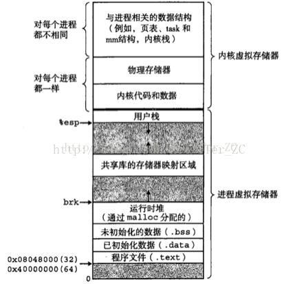
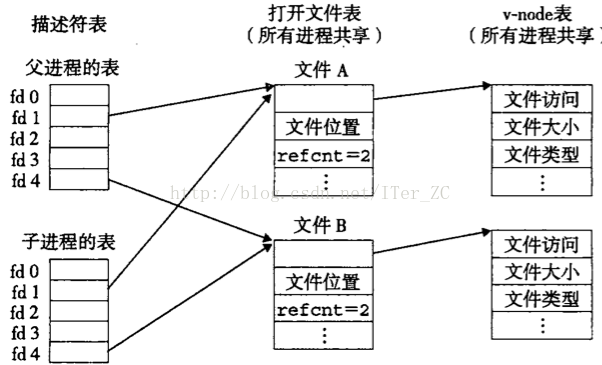
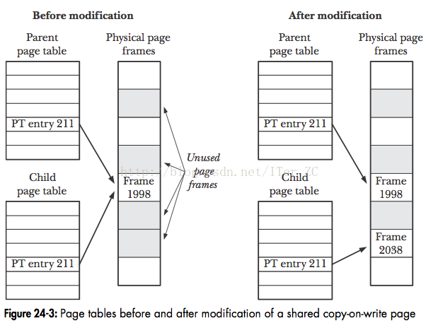

# 深入理解进程和线程

---

**进程是操作系统分配资源的最小单元, 线程是操作系统调度的最小单元**.

## 什么是计算机资源

经典的冯诺依曼结构把计算机系统抽象成`CPU + 存储器 + IO`, 那么计算机资源无非就两种:

1. 计算资源.
2. 存储资源.

### 计算资源

CPU是计算单元, 单纯从CPU的角度来说它是一个黑盒, 它只对输入的指令和数据进行计算, 然后输出结果, 它**不负责管理计算哪些"指令和数据"**. 也就是说**CPU只提供了计算能力, 但是不负责分配计算资源**.

计算资源是操作系统来分配的, 也就是常说的操作系统的**调度模块**, **操作系统按照一定的规则来分配什么时候由谁来获得CPU的计算资源, 比如分时间片**.

### 存储资源

存储资源就是内存, 磁盘这些存储设备的资源. 从缓存原理的角度来说, 把内存作为磁盘的缓存. 

#### 进程是面向磁盘的

进程表示一个运行的程序, 程序的代码段, 数据段这些都是存放在磁盘中的, **在运行时加载到内存中**. 所以**虚拟内存面向的是磁盘**, **虚拟页是对磁盘文件的分配**, **然后被缓存到物理内存的物理页中**.

### 总结

所以**存储资源是操作系统由虚拟内存机制来管理和分配的**. 

**进程应该是操作系统分配存储资源的最小单元**.

### 线程

理论上说Linux内核是没有线程这个概念的, 只有内核调度实体(Kernal Scheduling Entry， KSE)这个概念. Linux的**线程本质上是一种轻量级的进程**, 是通过`clone`系统调用来创建的. 进程是一种KSE, 线程也是一种KSE. 所以"线程是操作系统调度的最小单元"这句话没问题.

## 什么是进程

进程是对计算机的一种抽象:

1. 进程表示一个逻辑控制流, 就是一种计算过程, 它造成一个假象, 好像这个进程一直在独占CPU资源.
2. 进程拥有一个独立的虚拟内存地址空间, 它造成一个假象, 好像这个进程一致在独占存储器资源.

这张图是进程的虚拟内存地址空间的分配模型图, 可以看到进程的虚拟内存地址空间分为用户空间和内核空间. 

用户空间从低端地址往高端地址发展, 内核空间从高端地址往低端地址发展. 用户空间存放着这个进程的代码段和数据段, 以及运行时的堆和用户栈. 堆是从低端地址往高端地址发展, 栈是从高端地址往低端地址发展.

内核空间存放着内核的代码和数据, 以及内核为这个进程创建的相关数据结构, 比如页表数据结构, `task`数据结构, `area`区域数据结构等等.

从文件IO的角度来说, **Linux把一切IO都抽象成了文件**, 比如普通文件IO, 网络IO, 统统都是文件, 利用open系统调用返回一个整数作为文件描述符file descriptor, 进程可以利用file descriptor作为参数在任何系统调用中表示那个打开的文件.  内核为进程维护了一个文件描述符表来保持进程所有获得的file descriptor.

每调用一次open系统调用内核会创建一个打开文件open file的数据结构来表示这个打开的文件, 记录了该文件目前读取的位置等信息. 打开文件又唯一了一个指针指向文件系统中该文件的inode结构. inode记录了该文件的文件名, 路径, 访问权限等元数据.

操作操作系统用了3个数据结构来为每个进程管理它打开的文件资源:

**关于 vnode 和 inode 可以看我apue笔记的第三章文件 i/o**

### fork系统调用

操作系统利用fork系统调用来创建一个子进程. fork所创建的子进程会复制父进程的虚拟地址空间. 要理解"复制"和"共享"的区别:

* 复制的意思是会**真正**在物理内存复制一份内容, 会真正消耗新的物理内存.
* 共享的意思是使用指针指向同一个地址, 不会真正的消耗物理内存.

这两个概念是**进程和线程的根本区别之一**.

如果我父进程占了1G的物理内存，那么fork会再使用1G的物理内存来复制吗，相当于一下用了2G的物理内存?

早期的操作系统的确是这么干的，但是这样性能也太差了, 所以现代操作系统使用了写时复制Copy on write的方式来优化fork的性能, fork刚创建的子进程采用了共享的方式, 只用指针指向了父进程的物理资源. 当子进程真正要对某些物理资源写操作时, 才会真正的复制一块物理资源来供子进程使用. 这样就极大的优化了fork的性能, 并且从逻辑来说子进程的确是拥有了独立的虚拟内存空间.

fork不只是复制了页表结构, 还复制了父进程的文件描述符表, 信号控制表, 进程信息, 寄存器资源等等. **是一个较为深入的复制**.

从逻辑控制流的角度来说, **fork创建的子进程开始执行的位置是fork函数返回的位置**. 这点和线程是不一样的.

内核为进程维护了这么多资源, 那么当内存进行进程调度时进行的进程上下文切换就容易理解了, 一个进程运行要依赖这么些资源, 那么**进程上下文切换就要把这些资源都保存起来写回到内存中**, **等下次这个进程被调度时再把这些资源再加载到寄存器和高速缓存硬件**.

进程上下文切换保存的内容有:

1. 页表: 对应虚拟内存资源.
2. 文件描述符表/打开文件表: 对应打开的文件资源.
3. 寄存器: 对应运行时数据.
4. 信号控制信息/进程运行信息.

### 进程间通信

虚拟内存机制为进程管理存储资源带来了种种好处, 但是它也给进程带来了一些小麻烦, 我们知道每个进程拥有独立的虚拟内存地址空间, 看到一样的虚拟内地址空间视图, 所以**对不同的进程来说, 一个相同的虚拟地址意味着不同的物理地址**. 我们知道CPU执行指令时采用了虚拟地址, 对应一个特定的变量来说, 它对应着一个特定的虚拟地址. 这样带来的问题就是**两个进程不能通过简单的共享变量的方式来进行进程间通信**, 也就是说进程不能通过直接共享内存的方式来进行进程间通信, 只能采用信号, 管道等方式来进行进程间通信. 这样的效率肯定比直接共享内存的方式差.

## 什么是线程

上面说了一堆内核为进程分配了哪些资源, 我们知道进程管理了一堆资源, 并且每个进程还拥有独立的虚拟内存地址空间, 会真正地拥有独立与父进程之外的物理内存. 并且由于进程拥有独立的内存地址空间, 导致了进程之间无法利用直接的内存映射进行进程间通信.

**并发的本质是在时间上重叠的多个逻辑流**, 也就是说同时运行的多个逻辑流. 并发编程要解决的一个很重要的问题就是对资源的并发访问的问题, 也就是共享资源的问题. 而两个进程恰恰很难在逻辑上表示共享资源.

**线程解决的最大问题就是它可以很简单地表示共享资源的问题, 这里说的资源指的是存储器资源, 资源最后都会加载到物理内存, 一个进程的所有线程都是共享这个进程的同一个虚拟地址空间的, 也就是说从线程的角度来说, 它们看到的物理资源都是一样的, 这样就可以通过共享变量的方式来表示共享资源, 也就是直接共享内存的方式解决了线程通信的问题. 而线程也表示一个独立的逻辑流, 这样就完美解决了进程的一个大难题**.

从计算资源的角度来说, 对内核而言, 进程和线程没有什么区别, 所以内核用内核调度实体(KSE)来表示一个调度的单元.

### clone系统调用

在Linux系统中, 线程是使用clone系统调用, **clone是一个轻量级的fork**, 它提供了一系列的参数来表示线程可以共享父类的哪些资源, 比如页表, 打开文件表等等. 我们上面说过了共享和复制的区别, 共享只是简单地用指针指向同一个物理地址, 不会在父进程之外开辟新的物理内存.
clone系统调用可以指定创建的线程开始执行代码位置. 类似`Java`中的`Thread`类的`run`方法.

Linux内核只提供了clone这个系统调用来创建类似线程的轻量级进程的概念. C语言利用了Pthreads库来真正创建了线程这个数据结构. Linux采用了1:1的模型, 即C语言的Pthreads库创建的线程实体1:1对应着内核创建的一个KSE. **Pthreads运行在用户空间, KES运行在内核空间**.

既然线程共享了进程的资源, 那么线程的上下文切换就好理解了. 对操作系统来说, 它看到要被调度进来的线程和刚运行的线程是同一个进程的, 那么线程的上下文切换只需要保存线程的一些运行时的数据, 比如:

1. 线程的id
2. 寄存器中的值
3. 栈数据

而不需要像进程上下文切换那样要保存页表, 文件描述符表, 信号控制数据和进程信息等数据. 页表是一个很重的资源, 我们之前说过, 如果采用一级页表的结构, 那么32位机器的页表要达到4MB的物理空间. 所以**线程上下文切换是很轻量级的**.

### 进程是如何共享内核的代码和数据的

进程采用**父子结构, `init`进程是最顶端的父进程, 其他进程都是从init进程派生出来的**.

线程采用对等结构, 即线程**没有父子的概念**, 所有线程都属于同一个线程组, **线程组的组号等于第一个线程的线程号**.

## 总结

1. **创建方式**: 进程采用`fork`创建, 线程采用`clone`创建.
2. **创建位置**: 进程fork创建的子进程的逻辑流位置在fork返回的位置, 线程clone创建的KSE的逻辑流位置在clone调用传入的方法位置.
3. **虚拟地址空间**: 进程拥有独立的虚拟内存地址空间和内核数据结构(页表，打开文件表等), 当子进程修改了虚拟页之后, 会通过写时拷贝创建真正的物理页. 线程共享进程的虚拟地址空间和内核数据结构, 共享同样的物理页.
4. **通信方式**: 多个进程通信只能采用进程间通信的方式, 比如信号, 管道, 而不能直接采用简单的共享内存方式, 原因是每个进程维护独立的虚拟内存空间, 所以每个进程的变量采用的虚拟地址是不同的. 多个线程通信就很简单, 直接采用共享内存的方式, 因为不同线程共享一个虚拟内存地址空间, 变量寻址采用同一个虚拟内存.
5. **上下文切换**: 进程上下文切换需要切换页表等重量级资源, 线程上下文切换只需要切换寄存器等轻量级数据.
6. **栈空间**: 进程的用户栈独享栈空间, 线程的用户栈共享虚拟内存中的栈空间, 没有进程高效.
7. 一个应用程序可以有多个进程, 执行多个程序代码, 多个线程只能执行一个程序代码, 共享进程的代码段.
8. 进程采用**父子结构**, 线程采用对**等结构**.