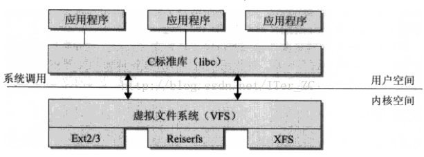
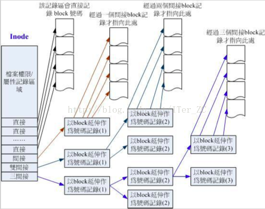
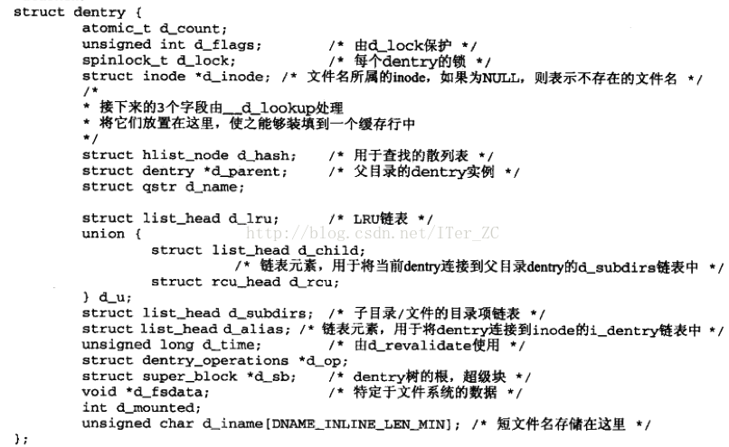
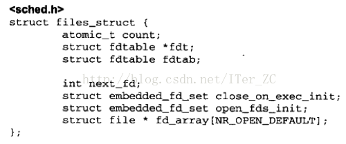
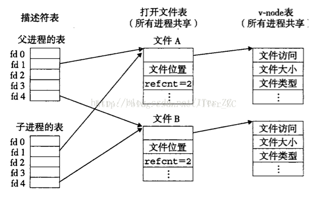

# 理解文件系统

---

文件系统主要有三类:

1. 位于磁盘的文件系统, 在物理磁盘上存储文件, 比如NTFS, FAT, ext3, ext4.
2. 虚拟文件系统, 在内核中生成, 没有物理的存储介质.
3. 网络文件系统, 位于远程主机上的文件系统, 通过网络访问.

一个操作系统可以支持多种底层不同的文件系统, 为了给内核和用户进程提供统一的文件视图, Linux在用户进程和底层文件系统之间加入了一个抽象层, 即虚拟文件系统(Virtual File System, VFS), 进程所有的文件操作都通过VFS, 有VFS来适配各种底层不同的文件系统, 完成实际的文件操作.

通俗的说, VFS就是定义了一个通用文件系统的接口层和适配层, 一方面为用户进程提供了一组统一的访问文件, 目录和其他对象的统一方法, 另一方面又要和不同的底层文件系统进行适配.



VFS采用了面向对象的思路来设计它的核心组件, 只是VFS是用C写的, 没有对象的语法, 只能用struct来表示. 我们按照面向对象的思路来理解VFS. 它有4个主要的对象类型:

1. **超级块对象**: 代表一个具体的**已安装(mount)**的文件系统.
2. **inode对象**: 表示一个具体的**文件**.
3. **目录项对象**: 代表一个目录项, 存放目录项与对应文件进行链接的信息, 是路径的一部分, 比如一个路径`/home/foo/hello.txt`, 那么目录项有`home`,`foo`,`hello.txt`.`VFS`把每个目录看作一个由若干子目录和文件组成的常规文件.
4. **打开文件对象**: 表示一个打开的文件, 有读写的pos位置, 也叫**文件句柄**, 就是open系统调用在内核创建的一个数据结构.

`VFS`给每个对象都定义了一组操作对象(函数指针), 给出了这些操作的的默认实现, **底层不同的文件系统可以重写(override)VFS的操作函数来给出自己的具体操作实现, 也可以复用`VFS`的默认实现. 实际情况是底层文件系统部分操作由自己单独实现, 部分复用了`VFS`的默认实现.

操作对象有:

1. `super_operations`对象, 针对超级块对象, 包含了**内核对特定文件系统所能调用的方法**, 比如`wirte_inode()`, `sync_fs()`等.
2. `inode_operations`对象, 针对`inode`对象, 包含了内核对特定文件所能调用的方法, 比如`create()`,`link()`等.
3. `dentry_operations`对象(directory entry), 针对目录项对象, 包含了内核对特定目录所能调用的方法, 比如`d_compare()`和`d_delete()`方法等.
4. `file_operations`对象, 针对打开文件对象, 包含了进程对打开文件对象所能调用的方法, 比如`read()`和`write()`等.

文件系统说白了就是**文件内容和存储系统对应的块的映射关系**, 是来管理文件的存储. `inode-block`结构把文件分为了两部分, `inode`表示元数据, `block`表示存储文件内容的具体逻辑块. `VFS`没有用单独的对象来表示`block`, `block`的属性在`超级`块和`inode`块中包含了.


1. 对象都维护了一个`{?}_op`指针**指向它所对应的操作对象**.
2. 超级块维护了一个`s_files`指针指向了内核所有的打开文件对象的链表, 这个信息是**所有进程共享的**.
3. 目录项对象和`inode`对象都维护了一个`{?}_sb`指针指向超级块对象, 从而可以获得整个文件系统的元数据信息.
4. 目录项对象和`inode`对象都各自维护了指向对方的指针, 可以找到对方的数据.
5. 打开文件对象维护了一个`f_dentry`对象, 指向了它对应的目录项对象, 从而可以根据目录项对象找到它对应的inode信息.
6. `task_struct`表示进程对象, 维护了一个`files`指针, 指向了进程打开的文件链表, 这个是进程单独的视图.进程还维护了文件描述符表`(file descriptor, fd)`, 所谓的文件描述符就是一个整数, 这个数字就是文件描述符表的索引, 表项里面存着对应的打开文件对象的指针, 所以进程操作打开文件的系统调用只需要传递一个文件描述符即可. **由内核来维护打开文件对象,进程只能看到文件描述符这个整数**.
7. `address_space`, 表示一个文件在页缓存中已经缓存了的物理页, 内部维护了一个树结构来指向所有的物理页结构page, 同时维护了一个`host`指针指向`inode`对象来获得文件的元数据. 

## 超级块

超级块包含了一个文件系统的元数据. 超级块是如何存储在磁盘上的呢? 磁盘的最小物理单元是扇区, 一个扇区512个字节. 块就是`block`, 是表示**磁盘数据的最小逻辑单元**, 1个块一般有1kb, 2kb, 4kb, 8kb等. 所以**1个逻辑块`block`对应多个物理扇区**. 整个磁盘的**第一个扇区**存放着计算机的引导(boot)信息MBR(Master Boot Record), MBR存放着磁盘的逻辑分区表, 如果磁盘的第一个扇区坏了导致分区表丢失, 那么整个计算机就启动不了了. 操作系统把逻辑分区也认为是单独的逻辑磁盘, 所以实际上每个逻辑分区的第一个扇区也可以存放MBR, 这也是**为什么一台计算机可以安装多个操作系统的原因**.

**除了第一个启动扇区**, 其他的扇区都被逻辑上划分到不同的块组`Block Group`了:


而每个块组则包括了超级块和这个块组内的`inode`,`block`数据. **一个块组的数据在物理上也是连续的, 所以实际给文件分配block时会优先在同一个块组分配**.

一个文件系统只有一个超级块, 所以**只有第一个块组的第一个块是超级块**, **其他块组都是超级块的备份**, 防止超级块损坏导致整个文件系统损坏.

块组的结构如下:

1. 超级块, 存放着整个文件系统的元数据.
2. 块组描述信息, 存放着该块组的元数据.
3. `block`位图, 磁盘采用了位图的方式来记录哪些块被使用了, 哪些块未被使用, 位图中的1位表示一个块的块号.
4. `inode`位图, 同样`inode`位图表示了哪些`inode`被使用了, 哪些未被使用, 位图中的1位表示一个`inode`的号.
5. `inode`表, 是该块组所有的`inode`实际的存储块.
6. `block`块, 是该块组所有的`block`块.


可以用`dumpe2fs`命令来查看超级块的信息和所有的块组信息.

用`df`命令来看文件系统是如何挂载的, `/dev/xvda1`挂载了在`/`根目录.

```
[ansible@demo ~]$ df
Filesystem            1K-blocks    Used Available Use% Mounted on
/dev/xvda1             41152832 1882952  37156396   5% /
devtmpfs                 498116       0    498116   0% /dev
tmpfs                    507484       0    507484   0% /dev/shm
tmpfs                    507484     344    507140   1% /run
tmpfs                    507484       0    507484   0% /sys/fs/cgroup
/dev/mapper/data-data  61792044 2313564  56316576   4% /data
tmpfs                    101500       0    101500   0% /run/user/1000

[ansible@demo ~]$ sudo dumpe2fs /dev/xvda1
Filesystem volume name:   <none>
Last mounted on:          /
Filesystem UUID:          b7792c31-ad03-4f04-a650-a72e861c892d
Filesystem magic number:  0xEF53
Filesystem revision #:    1 (dynamic)
Filesystem features:      has_journal ext_attr resize_inode dir_index filetype needs_recovery extent flex_bg sparse_super large_file huge_file uninit_bg dir_nlink extra_isize
Filesystem flags:         signed_directory_hash
Default mount options:    user_xattr acl
Filesystem state:         clean
Errors behavior:          Continue
Filesystem OS type:       Linux
Inode count:              2621440
Block count:              10485504
Reserved block count:     524275
Free blocks:              9646953
Free inodes:              2580411
First block:              0
Block size:               4096
Fragment size:            4096
Reserved GDT blocks:      1021
Blocks per group:         32768
Fragments per group:      32768
Inodes per group:         8192
Inode blocks per group:   512
Flex block group size:    16
Filesystem created:       Mon Jul 10 20:22:02 2017
Last mount time:          Mon Dec 18 23:42:12 2017
Last write time:          Tue Dec 19 07:42:10 2017
Mount count:              7
Maximum mount count:      -1
Last checked:             Mon Jul 10 20:22:02 2017
Check interval:           0 (<none>)
Lifetime writes:          6393 MB
Reserved blocks uid:      0 (user root)
Reserved blocks gid:      0 (group root)
First inode:              11
Inode size:               256
Required extra isize:     28
Desired extra isize:      28
Journal inode:            8
Default directory hash:   half_md4
Directory Hash Seed:      17c00d46-8760-4e96-a038-1e0110b9a0c1
Journal backup:           inode blocks
Journal features:         journal_incompat_revoke
Journal size:             128M
Journal length:           32768
Journal sequence:         0x00001408
Journal start:            1
...
Group 315: (Blocks 10321920-10354687) [INODE_UNINIT, BLOCK_UNINIT, ITABLE_ZEROED]
  Checksum 0xaebf, unused inodes 8192
  Block bitmap at 9961483 (bg #304 + 11), Inode bitmap at 9961499 (bg #304 + 27)
  Inode table at 9967136-9967647 (bg #304 + 5664)
  32768 free blocks, 8192 free inodes, 0 directories, 8192 unused inodes
  Free blocks: 10321920-10354687
  Free inodes: 2580481-2588672
 ...
```

超级块的信息可以看到整个文件系统的`inode`和`block`数量, block大小,这里是4KB.

```
Group 315: (Blocks 10321920-10354687) [INODE_UNINIT, BLOCK_UNINIT, ITABLE_ZEROED]
  Checksum 0xaebf, unused inodes 8192
  Block bitmap at 9961483 (bg #304 + 11), Inode bitmap at 9961499 (bg #304 + 27)
  Inode table at 9967136-9967647 (bg #304 + 5664)
  32768 free blocks, 8192 free inodes, 0 directories, 8192 unused inodes
  Free blocks: 10321920-10354687
  Free inodes: 2580481-2588672
```

查看`block group`的数据, `inode`和`block`的数量是均匀分配在不同的`block group`里面的, 同时每个`block group`还记录了该组的`inode`和`block`使用情况.

由于`block`大小是固定的, 扇区的大小也是固定的, 可以很方便地计算出某个块号对应着哪个扇区号, **知道了这个信息, 磁盘控制器就能很快地根据块号去对应的扇区读写数据**.

**对于一个设备来说, `inode`号和`block`块号都是唯一的**.

超级块的这些数据存放在第一个块组的第一个块, 所以操作系统很容易就把超级块的数据加载到内存中, 用超级块对象结构来对应超级块的实际数据. 超级块对象是常驻内存的, 并被缓存的. 因为超级块维护着整个文件系统的元数据信息, **所以文件系统的任意元数据修改都要修改超级块对象**.

超级块的数据结构中另一个字段`s_dirty`, 指向了所有修改(脏)的`inode`链表, 这样当要回写所有修改(脏)的inode到磁盘时, 不需要去遍历所有的inode, 只需要通过s_dirty来遍历脏的inode链表.


超级块对应的操作对象`super_operations`, 定义了内核可以对超级块的操作:


## inode

**Linux的文件系统把`inode`当做文件的唯一标识, 一个文件对应一个`inode`, 如果`inode`用完了, 那么就不能再新建文件了**.

`inode`结构保存了一个文件的元数据信息, 以及这个文件的内存所在的`block`, 从`inode`可以找到这个文件所有的`block`.

`inode`的结构定义:


几个重要属性:

* `i_ino`记录了这个`inode`的编号, 这个编号是唯一的.
* `i_size`记录了这个文件按字节计算的大小, `i_blocks`记录了按块记录的这个文件的块数, 这样根据单个块的长度就能计算出按块计算的长度. **我们用ls命令列出的文件大小通常就是按块计算的长度, 因为单个块只能记录属于同一个文件的内容**.
* `i_atime`记录了最后访问这个文件的时间.
* `i_mtime`记录了最后修改这个文件内容的时间.
* `i_ctime`记录了最后修改`inode`的时间, 即修改元数据的时间.
* `i_count`是引用计数, 即有多少进程访问这个`inode`. 当`i_count`为`0`的时候这个`inode`结构才能从内存中被消除.
* `i_nlink`是指向这个文件的硬链接的计数, 硬链接是不会新建`inode`的.
* `Linux`几乎把一切设备和`IO`都当做文件(除了网络设备), 所以使用了一个`union`来标识设备.
	* `i_pipe`指向管道.
	* `i_bdev`指向`inode`所在的块设备.
	* `i_cdev`指向字符设备.
* `i_dentry`指针指向和这个`inode`对应的目录项, **目录和普通文件都是文件**, 都有`inode`,也都有`d_entry`结构.
* `i_sb`指针指向超级块, 来获得文件系统的元数据.
* `i_mode`维护了该文件的续写权限. `i_uid`和`i_gid`记录了用户和组的信息.
* `i_mapping`指向了`address_space`, 记录了这个文件被映射的信息.

从内存的角度来看`inode`, 一个`inode`只可能处于3种状态之一.

1. `inode`处于内存中, 没有被任何进程引用, 不处于活动使用状态, 也没有被修改过.
2. `inode`处于内存中, 正被一个或多个进程引用, 即它的`i_count`和`i_nlink`都大于0, 且文件内容和`inode`元数据内容都没有被修改过.
3. `inode`处于内存中, 内核或元数据被修改过, 即`inode`是**脏**的.

内核提供了3个全局的链表来管理这3种状态的inode:

* `inode_unused`对应第一种情况.
* `inode_in_use`对应于第二种情况.
* `超级块的s_dirty链表`对应第三种情况.

任何时刻**内存中的`inode`**只能在这3个链表之一, 使用了`i_list`指针指向它所在的链表. 维护这3个链表的好处是: **当脏数据写回到磁盘时, 只需要遍历超级块`super_block -> s_dirty`上所有的inode就行**.

VFS并没有专门的`block`对象来表示磁盘上块, `inode`对象也米有将记录它对应的具体的块号, 只记录了所占的块数. 那么一个文件的内容实际存储的块的数据是如何记录的呢? 这个是记录在磁盘中的, 并且由磁盘控制器去管理的, 磁盘控制器根据一个文件的块号, 就能找到实际物理存储的块的位置(磁盘控制器把逻辑块号翻译成对应的扇区位置读取扇区).

上面描述磁盘块组结构的图中可以看到, 每个`inode`号位于哪个块组是可以很方便计算出来的, 每个块组维护了一个inode表, 一个inode的长度是固定的, 是128个字节, 那么可以很快找到给定的`inode`号的`inode存储的物理区域`. 在磁盘上存储的`inode`数据出来文件的元数据以外, 还存储了这个文件的所有`block`块号.

`inode`是`128`个字节, 记录一个`block`编号就要4字节, 那么1个`inode`根本存不了几个`block`编号. 所有`inode`的设计采用了简介映射的方法.

1. 1个`inode`存储12个直接映射的`block`编号, 占用`48`字节.
2. 1个`inode`存储一个一次间接块编号, 占用4字节, 间接块对应的实际物理块不存储文件的内容, 而是用来存储block编号,比如4KB的块大小,就可以存储1000个block编号.
3. 1个inode存储一个二次间接块编号, 占用4字节, 二次间接块的第一层记录第二次间接块的编号, 第二层间接块存储实际的block编号.
4. 1个inode存储一个三次间接块编号,占用4字节,比二次间接再多一次间接.

这种间接的设计在计算机领域很常用, 比如页面也是采用了类似的结构, **把一个线性结构变成一个层次结构**, 一方面可以压缩存储空间, 另一方面可以表示很大的地址空间.**同样, 我们可以把这个层次结构还原成一个线性结构, 可以理解成一个数组, 只要提供一个文件的块号, 磁盘控制器就可以快速地定位到具体的存储块号的位置, 再找到实际存储的磁盘的块, 也就找到了实际存储的磁盘扇区位置**.



如果块是1KB大小的话, inode能够表示的单个最大文件是16G, 如果是2KB的块, 能够表示的单个最大文件是256G, 如果是4KB的块, 能够表示的单个最大文件是4TB. 现在很多服务器都是8KB的块, 可以表示的单个最大文件足够大了.

```
假定一个指针块需要4个字节, 一个block块有4K的存储空间, 那么一个block块就可以存储1024个指针块, 所以间接块指针的文件最大就可以存储1024*4K=4M的文件, 以此类推使用双重间接块指针的文件最大存储空间就有1024*1024*4K=4G, 使用三重间接块指针的文件最大存储空间就可以达到1024*1024*1024*4K=4T.

所以如果块是1kb, 则一个block块就可以存储256个指针块. 256x256x256x1k = 16G.
```

`inode_operations`定义的函数如下.


## 目录项

目录和普通文件一样, 都是文件, 都有`inode`, **区别是目录的块存储的是这个目录下的所有的文件的inode号和文件名等信息**. 操作系统检索一个文件, 都是从根目录开始, 按层次解析路径中的所有目录, 直到定位到文件. 所以目录的解析是一个非常频繁的操作.

VFS抽象了目录项对象来表示查找路径中的目录和文件, 查找一个文件都是通过目录项来的. 内核还建立了目录项缓存来优化查找速度.

目录项`d_entry`的结构定义如下, 它维护了目录操作需要的元数据信息:

1. 能通过`d_inode`找到该目录项对应的`目录`或`文件的inode`.
2. 通过`d_sb`找到超级块.
3. 通过`d_parent`来找到父目录项, 从而构成一个树形结构.
4. `d_name`记录了目录/文件的名称.



和`inode`一样, 内核维护了两个全局数据结构来快速寻找所有的`d_entry`对象, 实现了`d_entry`对象的缓存功能.

1. `dentry_hashtable`存放了所有**活动的d_entry对象**.
2. `dentry_unused`存放了所有**非活动的(d_count引用计数为0)的d_entry对象**, 这是一个LRU链表结构, 可以方便地快速释放非活动的`d_entry`对象.


## 打开文件对象

所谓的打开文件对象是由`open`系统调用在内核中创建的, 也叫文件句柄. `open`系统调用返回一个文件描述符, 用户进程所有对文件读写操作系统调用都是基于给定的文件描述符进行的, 换句话说, 所有对文件的读写操作, 必须基于打开文件对象进行.

多个进程可以同时指向一个打开文件对象(fork时), 多个打开文件对象可以指向同一个文件inode. 打开文件对象的结构定义如下:

1. `f_dentry`指向了打开文件对应的目录项, 目录项又指向了对应的`inode`, 从而把打开文件和`inode`关联起来. 打开文件对象**没有实际对应的磁盘数据**, 所以它也不需要表示打开文件对象是否脏, 是否需要写回等标志位.
2. `f_pos`表示文件当前的偏移量.
3. `f_count`表示文件对象的使用计数. 
4. 文件锁相关的属性


从打开文件对象的结构定义可以看出, 它只是用来表示打开一个文件的状态的**抽象**, 实际文件内容的读写是通过`read(), write()`系统调用完成的, 数据的修改存放在页缓存中.

我们之前说了内核使用`task_struct`来表示单个进程的描述符, 每个进程维护了它的打开文件信息和文件描述符信息, 我们来看一下进程相关的打开文件信息是如何表示的.

`task_struct`中维护了一个`files_struct`的指针来指向它的文件描述符表和打开的文件对象信息.


`files_struct`的结构:

1. `fd_array`数组是file结构的数组, 即表示打开文件对象的数组. `NR_OPEN_DEFAULT`在64位机器下默认是64, 它的目的是方便快速找到64个最初的打开文件对象(因为一般进程打开的文件数大多都用这个数组就可以直接放下了).
2. `next_fd`用来存储下一个要生成文件描述符的编号.
3. 当进程要打开多于64个文件时怎么办呢, 比如网络编程中, 每个socket请求就是一个打开的文件, 如何处理多于64的情况呢, 这就得依靠`fdtable`这个结构, 也就是常说的文件描述符表.



看一下`fdtable`文件描述符表的结构定义:

1. `max_fds`表示当前进程可以打开的最大的文件描述符的数量, 这个值不是固定的, 是可以调节的(Rlimit).
2. `fd`是一个指针数组, 指向所有打开的文件, 数组的索引就是所谓的文件描述符`fd(file descriptor)`.
3. `open_fds`是一个用位图表示的当前打开的文件描述符, 可以方便快速遍历空闲的文件描述符.
4. `next`指针可以指向下一个`fdtable`结构, 这样文件描述符表可以表示成链表结构, 也就是支持动态扩展的, 可以保证单个进程可以打开足够多的文件.


进程维护的文件描述符信息和打开文件信息可以用下图表示:



## mount

文件系统的`mount`操作到底做了什么工作. 内核维护了一个树形结构表示文件系统层次结构, 文件系统可以挂载到树形结构之上.


理论上目树上的每个目录都可以成为装载点, 装载点可以用来把新的文件系统加入到文件系统的目录树上. 装载动作由`mount`系统调用完成, 每个文件系统都有一个根目录, 当它装载到装载点时, 会把根目录的内容替换到装载点. 每个装载的文件系统都维护了一个`vfsmount`的结构.

1. `mnt_mountpoint`记录了该文件系统的装载点在父文件系统中的`dentry`对象, 即它对应的目录.
2. `mnt_root`记录了当前文件系统的根目录的`dentry`对象, 实际上它和`mnt_mountpoint`都指向同一个`dentry`对象, 即装载点.
3. `mnt_sb`指向了这个文件系统的超级块, 超级块记录了这个文件系统的元数据信息.
4. `mnt_parent`指向了父文件系统的`vfsmount`对象, 可以获得父文件系统的一些装载信息.

