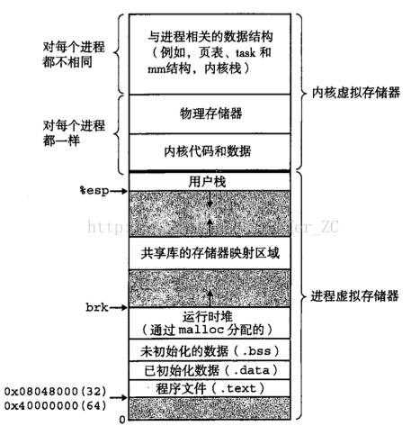
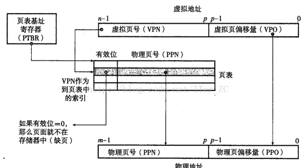
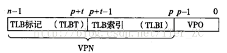
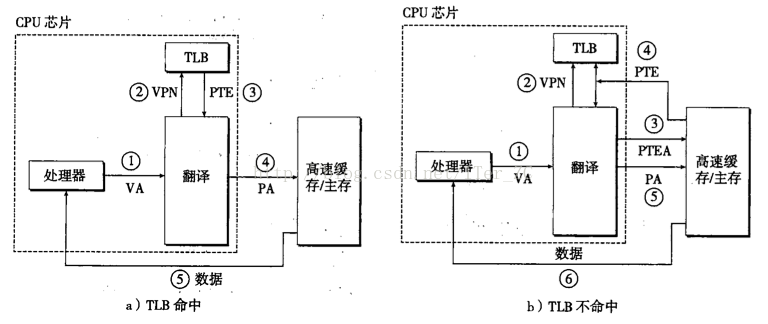
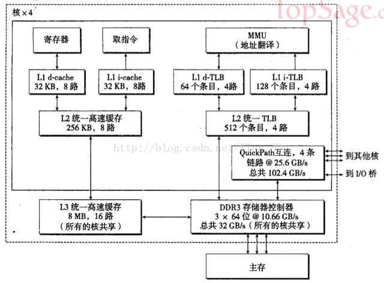

# 理解虚拟内存机制

---

虚拟内存主要提供了3个能力:

1. 给所有进程提供一致的地址空间, 每个进程都**认为自己是在独占使用单机系统的资源**.
2. 保护每个进程的地址空间不被其他进程破坏, 隔离了进程的地址访问.
3. 根据缓存原理, 上层存储是下层存储的缓存, 虚拟内存把主存作为磁盘的高速缓存, 在主存和磁盘间根据需要来回传送数据, 高效地使用了主存.

主要包括几块内容:

1. 虚拟地址和物理地址.
2. 页表.
3. 地址翻译.
4. 虚拟内存相关的数据结构.
5. 内存映射.

## 虚拟地址和物理地址

对于每个进程来说, 它使用到的都是虚拟地址, 每个进程都看到一样的虚拟地址空间, 对于32位计算机系统来说, 它的虚拟地址空间是 0-2^32, 也就是 0-4G. 对于64位的计算机系统来说(因为寻址能力强了), 理论的虚拟地址空间是 0-2^64. 虚拟地址空间不需要和物理地址空间一样大小.

Linux内核把虚拟地址空间分为两部分: 

* 用户进程空间
* 内核进程空间

两者比例一般是`3:1`, 比如4G的虚拟地址空间, 3G用于用户进程, 1G用于内核进程.

CPU在执行进程的指令时要取一个实际的物理地址的值的时候主要有几步:

1. 把进程指令使用的虚拟地址通过`MMU`转换成物理地址.
2. 把物理地址映射到高速缓存的缓存行.
3. 如果高速缓存命中就返回.
4. 如果不命中, 就产生一个缓存缺失中断, 从主存相应的物理地址取值, 并加载到高速缓存中. CPU从中断中恢复, 继续执行中断前的指令.

### 操作系统内存管理

在缓存原理中, 数据都是按块来进行逻辑划分的, 一次换入/换出的数据都是以块为最小单位，这样提高了数据处理的性能. 同样的原理应用到具体的内存管理时, 使用了**页(page)**来表示块, 虚拟地址空间划分为**多个固定大小的虚拟页(Virtual Page, VP)**, **物理地址空间划分为多个固定大小的物理页(Physical Page, PP)**, 通常虚拟页大小等于物理页大小, 这样简化了虚拟页和物理页的映射. 虚拟页的大小通常在4KB - 2MB之间.

#### 重要的概念

1. 对于CPU来说, 它的目标存储器是物理内存, 使用高速缓存做物理内存的缓存.
2. 同样, 对于虚拟内存来说, 它的目标存储器是磁盘空间, 使用物理内存做磁盘的缓存.

从缓存原理的角度来理解, 在任何时刻, 虚拟页的集合都分为3个不想交的子集:

1. **未分配的页**, 即没有任何数据和这些虚拟页关联, 不占用任何磁盘空间.
2. **缓存的页(和主存的某一物理页对应了)**, 即已经分配了的虚拟页, 并且已经缓存在具体的物理页中.
3. **未缓存的页(和磁盘上的某一空间对应了)**, 即已经为磁盘文件分配了虚拟页, 但是还没有缓存到具体的物理页中.

虚拟内存系统和高速缓存系统一样, 需要判断一个虚拟页面是否缓存在DRAM(主存)中, 如果命中, 就直接找到对应的物理页. 如果不命中, 操作系统需要知道这个虚拟页对应磁盘的那个位置, 然后根据响应的替换策略从DRAM中选择一个牺牲的物理页, 包虚拟页从磁盘中加载到DRAM的物理主存中.

虚拟内存的这种缓存管理机制是通过操作系统内核, `MMU(内存管理单元)`中的地址翻译硬件和每个进程存放在主存中的页表(page table)数据结构来实现的.

## 页表

页表(page table)是**存放在主存中**的, 每个进程维护一个单独的页表. **它是一种管理虚拟内存页和物理内存页映射和缓存状态的数据结构**. 它逻辑上是由**页表条目(Page Table Entry,PTE)**为基本元素构成的数组.

1. 数组的**索引**号对应着虚拟页号.
2. 数组的**值**对应着物理页号.
3. 数组的值可以留出极为来表示有效位, 权限控制位.
	* 有效位为`1`的时候表示虚拟页已经缓存.
	* 有效位为`0`, 数组值为`null`时, 表示未分配.
	* 有效位为`0`, 数组值不为`null`时, 表示已经分配了虚拟页, 但是还未缓存到具体的物理页中.
	* 权限位有可读,可写,是否需要`root`权限.

**DRAM缓存是全相联的, 即只有一组, 任意的缓存行可以缓存任意的内容, 有一个比较判断的过程, 即任意的虚拟页可以对应任意的物理页**.

DARM缓存的命中称为**页命中**, 不命中称为**缺页**.

1. CPU要访问的一个虚拟地址在虚拟页3上(VP3), 通过地址翻译硬件从页表的3号页表(PTE3)条目中取出内容,发现有效位0,即没有缓存,就产生一个缺页异常.
2. 缺页异常调用内核的缺页异常处理程序, 它会根据替换算法选择一个DRAM中的牺牲页, 比如PP3. PP3中已经缓存了VP4对应的磁盘文件的内容, 如果VP4的内容有改动, 就刷新到磁盘中去(内存 -> 磁盘). 然后把VP3对应的磁盘文件内容加载到PP3中. 然后更新页表条目, 把PTE3指向PP3, 并修改PTE4, 不再指向PP3.
3. 缺页异常处理程序返回后重新**启动缺页异常前**的指令, 这时候虚拟地址对应的内容已经缓存在主存中了, 页命中也可以让地址翻译硬件正常处理了.

磁盘和主存之间传送页的活动叫做交换(swapping)或者页面调度(页面调入,页面调出). 现代操作系统都采用按需调度的策略, 即不命中发生时才调入页面. 操作系统都会**在主存中分配一块交换区(swap)来作缓冲区**, 加速页面调度.

由于页的交换会引起磁盘流量, 所以具有好的局部性的程序可以大大减少磁盘流量, 提高性能. 而如果局部性不好产生大量缺页, 从而导致不断地在磁盘和主存交换页, 这种现象叫做**缓存颠倒**. 可以用`Unix`的函数`getrusage`来统计缺页的次数.

现代操作系统都采用多级页表的方式来压缩页表的大小.

1. 对于32位的机器来说, 支持4G的虚拟内存大小, 如果每个页是4KB大小, 那么采用一级页表的话, 需要10^6个页表条目PTE. 32位机器的页表条目是4个字节, 那么页表需要4MB大小的空间.
2. 假设使用4MB大小的页, 那么只需要10^3个页表项. 假设每个4MB大小的页又分为4KB大小的子页,那么每个4MB大小的页需要10^3个的页表项来指向子页. 也就是说可以分为**两级页表**, 第一级页表项只需要4KB大小的页表项, 每个一级页表项又指向一个4KB大小的二级页表, 二级页表项则指向实际的物理页.

页表项加载是按需加载的, **没有分配的虚拟页不需要建立页表项**, **所以可以一开始只建立一级页表项**, 而二级页表项按需创建, 这样大大压缩了页表的空间.

使用k级页表项的地址翻译如下:

Core i7采用4级页表的结构

## 地址翻译

地址翻译就是把N个元素的虚拟地址空间(VAS)映射到M个元素的物理地址空间(PAS)的过程. 下表是地址翻译时用到的符号:

### CPU如何把一个虚拟地址翻译到对应的物理地址

1. CPU有一个专门的页表基地址寄存器(page table base register, PTBR)指向当前页表的**基地址**, 从而可以快速定位到该进程的页表.
2. n位的虚拟地址划分为p位的虚拟地址偏移量VPO和(n-p)位的虚拟页号VPN.
3. 物理地址同样划分为p位的物理地址偏移量PPO和(m-p)位的物理页号PPN.
4. 由于虚拟页大小和物理页大小相同, 所以**VPO = PPO**.

**这里的偏移量和页号可以理解为 段:偏移量(汇编)**, 也就是地址分成两部分, 前部分是代表虚拟的页号, 后部分代表是的虚拟页偏移量.

页面的命中完全由硬件完成, 缺页则由经验和内核共同完成.

为了提高地址翻译的效率, 地址翻译硬件还引入了一个硬件设备来**缓存页表条目PTE**, 叫做翻译后备缓冲区`TLB`(translation lookaside buffer). 它是一个小的, 虚拟寻址的缓存, 每一行都保存一个由单个`PTE`组成的块. `TLB`也遵循缓存的设计原理, 分为组, 行, 块的结构. 一个虚拟地址映射到TLB的缓存结构如下:

而TLB的命中和不命中的流程如下:

Core i7处理器的地址翻译硬件结构如下:

### 总结地址翻译过程

1. CPU拿到一个虚拟地址, 分为两步:
	* 先通过页表机制确定该地址所在虚拟页的内容是否从磁盘加载到物理内存页中.
	* 然后通过高速缓存机制从该物理地址中取到数据.
2. 地址翻译硬件要把这个虚拟地址翻译成一个物理地址, 从而可以再根据高速缓存的映射关系, 把这个物理地址对应的值找到.
3. 地址翻译硬件利用页表数据结构, TLB硬件缓存等技术, **目的只是把一个虚拟地址映射到一个物理地址**. 要记住DRAM缓存是全相联的, 所以一个虚拟地址和一个物理地址是动态关联的, 不能直接根据虚拟地址推导出物理地址, 必须根据DRAM从磁盘把数据缓存到DRAM时存到页表时存的实际物理页才能得到实际的物理地址, 用物理页PPN + VPO就能算出实际的物理地址 (VPO = PPO，所以直接用VPO即可). PPN的值是存在页表条目PTE中的. 地址翻译做了一堆工作, **就是为了找到物理页PPN, 然后根据VPO页面偏移量, 就能定位到实际的物理地址**.
4. 得到实际物理地址后, 根据高速缓存的原理, 把一个物理地址映射到高速缓存具体的组, 行, 块中, 找到实际存储的数据.

## Linux虚拟内存机制

Linux把虚拟内存划分成区域area的集合, 每个存在的虚拟页面都属于一个area. 一个area包含了连续的多个页, Linux通过area相关的数据结构来灵活地管理虚拟内存.

1. 内核为每个进程维护了一个单独的任务结构`task_struct`.
2. `task_struct`的`mm`指针指向了`mm_struct`, 该结构描述了虚拟内存的运行状态.
3. `mm_struct`的`pgd`指针指向该进程的一级页表的基地址. mmap指针指向了`vm_area_struct`链表.
4. `vm_area_struct`是描述`area`结构的一个链表, 链表节点的几个重要属性如下:
	* `vm_start`表示`area`的开始位置.
	* `vm_end`表示`area`的结束位置.
	* `vm_prot`描述了`area`内的页的读写权限.
	* `vm_flags`描述该`area`内的页面是与其他进程共享还是进程私有.
	* `vm_next`指向下一个`area`节点.

### 内核的缺页异常处理

在Linux系统中, 当MMU翻译一个虚拟地址发生缺页异常时, 跳转到内核的缺页异常处理程序.

1. Linux的缺页异常处理程序会先检查一个虚拟地址是哪个area内的地址. 只需要比较所有area结构的vm_start和vm_end就可以知道. area都是一个连续的块. 如果这个虚拟地址不属于任何一个area, 将发生一个段错误, 终止进程.
2. 要访问的目标地址是否有相应的读写权限, 如果没有, 将触发一个保护异常, 终止进程.
3. 选择一个牺牲页, 如果牺牲页被修改过, 那么把它交换出去. 从磁盘加载虚拟页内容到物理页, 更新页表.

### 内存映射机制

**虚拟内存的目标存储器是磁盘**, 所以虚拟内存区域是和磁盘中的文件对应的. 初始化虚拟内存区域的内容时, 会把虚拟内存区域和一个磁盘文件对象对应起来, 这个过程叫**内存映射(memory mapping)**. 虚拟内存可以映射的磁盘文件对象包括两种:

1. 一个普通的磁盘文件, 文件中的内容被分成页大小的块. 因为按需进行页面调度, 只有真正需要读取这些虚拟页时, 才会交换到主存.
2. 一个匿名文件, 匿名文件是内核创建的, 内容全是二进制0, 它相当于一个占位符, 不会产生实际的磁盘流量. 映射到匿名文件中的页叫做请求二进制零的页(demand zero page).

一旦一个虚拟页面被初始化了, 它就在一个由内核维护的专门的交换区(swap area)之间换来换去.

由于内存映射机制, **所以一个磁盘文件对象可以被多个进程共享访问**, 也可以被多个进程对象私有访问. 

* 如果共享访问, 那么一个进程对这个对象的修改会显示到其他进程. 
* 如果是私有访问, 内核会采用写时拷贝copy on write的方式, 如果一个进程要修改一个私有的写时拷贝的对象, 会产生一个保护故障, 内核会拷贝这个私有对象, 写进程会在新的私有对象上修改, 其他进程仍指向原来的私有对象.

理解了内存映射机制就可以理解几个重要的函数:

1. `fork`函数会创建**带有独立虚拟地址空间的新进程**, 内核会为新进程创建各种数据结构, 分配一个唯一的PID, 把当前进程的`mm_struct`, `area`结构和页表都复制给新进程. 两个进程的共享同样的区域, 这些区域包括共享的内存映射和私有的内存映射. 私有的内存映射区域都被标记为私有的写时拷贝. 如果新建的进程对这些虚拟页做修改, 那么会触发写时拷贝, 为新的进程维护私有的虚拟地址空间.
2. `mmap`函数可以创建新的虚拟内存area,并把磁盘对象映射到新建的area. mmap可以用作高效的操作文件的方式, 直接把一个文件映射到内存, 通过修改内存就相当于修改了磁盘文件, 减少了普通文件操作的一次拷贝操作. 普通文件操作时会先把文件内容从磁盘复制到内核空间管理的一块虚拟内存区域area, 然后内核再把内容复制到用户空间管理的虚拟内存area. **mmap相当于创建了一个内核空间和用户空间共享的area, 文件的内容只需要在这个area对应的物理内存和磁盘文件之间交换即可**. mmap也可以通过映射匿名文件的方式来分配内存空间. 比如malloc当要求分配的内存大小超过了MMAP_THRESHOLD(默认128kb)时, 会使用mmap私有的, 匿名文件的方式来分配大块的内存空间.