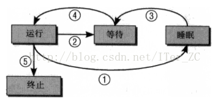
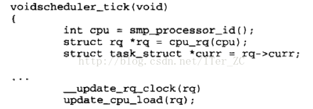
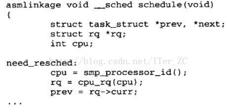
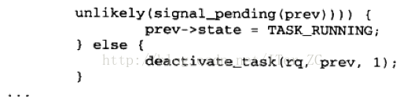
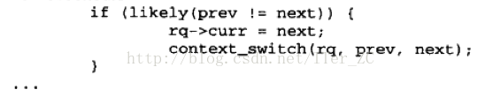
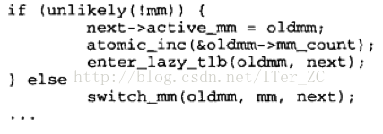

# 理解进程调度

进程调度是内核的一个重要工作, 由调度器完成.

## 进程状态

内核调度器调度的**实体(KSE, kernal schedule entry)是进程和线程**. 内核必须知道所有进程和线程的状态, 比如把时间片给一个阻塞的进程是没有意义的. 从内核的角度来看, 进程的状态有3种:

1. **运行**, 表示正在运行的进程.
2. **等待**, 没有运行, 但是等待时间片运行的进程.
3. **睡眠**, 也就是阻塞, 包括可中断的阻塞和不可中断的阻塞. 睡眠的进程在等待一个事件的发生, 调度器无法在下一次任务切换时选择睡眠的进程.

进程在几种状态中不断的切换:

* `1`表示运行的进程要等待某个事件, 进入到了睡眠状态.
* `2`表示运行的进程交出CPU资源, 进入到了等待状态.
* `3`表示睡眠的进程等待的事件发生了, 它进入到等待状态, 不能直接进入到运行状态.
* `4`表示等待的进程获得CPU资源, 变成运行状态.
* `5`表示运行的进程结束, 进入到终止状态.

内核将所有的进程保存在一个进程表中, 不论是运行, 等待, 睡眠. 睡眠的进程会被特别标记出来, 调度器知道它们无法立即运行, 就不会在下一个任务切换时选择它们. 睡眠的进程被分在多个队列中, 它们会在适当的时候被唤醒. 对于睡眠的进程, 又分为两种:

1. `TASK_INTERUPTIBLE`, 可中断的睡眠, 当内核发送信号给该进程表示它等待的事情已经发生时, **响应信号处理程序把进程状态改成`TASK_RUNNING`**, 表示进入可运行状态, 只要调度器选中它就可以运行.
2. `TASK_UNINTERUPTIBLE`, 不可中断的睡眠, 不能由外部信号唤醒, 即不响应外部信号, **只能由内核亲自唤醒**.

所谓的**僵尸进程**是指进程资源已经被释放, 但是还保存在进程表中的进程. 通常造成僵尸进程的原因是子进程已经被终结, 但是父进程没有调用`wait`系统调用来确认父进程知道子进程已死亡. 这样子进程由于没有被父进程确认死亡, 但是已经释放了资源, 变成了僵尸进程.

从执行权限的维度来考察进程状态, 进程状态分为用户态和核心态.

* 用户态: 只能访问进程自身的数据, 是受限的.
* 核心态: 具有无限权限, 可以访问任意数据.

用户态到核心态的切换有两种方式:

* 第一种是用户态**执行系统调用**, 会切换到核心态.
* 第二种是中断, 当中断发生时, 也会切换到核心态.

对于抢占式调度模型来说:

1. **中断具有最高权限**, 可以抢占处于用户态或者核心态的进程的时间片.
2. 当进程处于核心态并执行系统调用时, 不能被其他进程抢占, 当然中断除外.
3. 在用户态执行的进程可以随时被抢占.

## 调度器

调度器主要解决两个问题:

1. 调度策略: 即决定为每个进程分配多少运行时间, 何时切换到下一个进程, 下一个进程是什么.
2. 上下文切换: 即从进程A切换到进程B时, 要**保证进程B的执行环境和上次被撤销执行时完全一致**, 比如寄存器的内容, 虚拟地址空间的各个数据结构.

Linux的调度器和传统基于时间片的调度器有所区别, 它考虑的是进程的等待时间, 即所有可运行的进程在一个就绪队列里面等待的时间. 对CPU时间要求最严格的进程被挑选执行. 就绪队列中的进程被组织成一棵红黑树来加速操作. 等待最长的进程在最左边.

调度器子系统的主要组件如下:

1. 主调度器和周期性调度器称为通用调度器, 来确定是否要调度. 前者处理进程打算睡眠或者因为某种原因放弃CPU的情况, 后者以周期性频率运行, 检测是否需要上下文切换.
2. 调度器类来挑选下一个执行的进程. 调度器类分装了不同的调度算法, 比如完全公平调度, 实时调度, 以模块的方式运行.
3. 选中下一个要执行的进程后, 就要进行上下文切换, 需要和CPU紧密结合.
4. 每个进程都属于一个特定的调度器类, 由调度器类来管理所属的进程, 通用调度器不涉及进程的状态.

进程的`task_struct`结构中和调度相关的属性如下:

1. `prio, static_prio, normal_prio`表示进程的优先级信息.
	* `static_prio`表示静态优先级, 也就是进程启动时分配的`nice`优先级值.
	* `normal_prio`是基于`static_prio`和调度策略计算出来的优先级, 进程分支时, 子进程基础`normal_prio`. 
	* `prio`是调度器考虑的优先级, 有时候内核要临时提升某个进程的优先级, 就是修改`prio`值, 不影响`static_prio`和`normal_prio`.
2. `sched_class`表示该进程所属的调度器类.
3. `sched_entity`表示进程所属的调度实体, 调度器不仅可以调度进程, 还可以调度进程组, 线程等调度实体.
4. `policy`表示进程的调度策略, 比如`SCHED_NORMAL`调度普通进程, 用完全公平调度器类来处理. `SCHED_BATCH,SCHED_IDEL,SCHED_RR,SCHED_FIFO`等.
5. `time_slice`指定该进程可以使用的剩余时间片.

调度器类必须提供`sched_class`的实例, 指定了调度器类可以进行的操作:

1. `enqueue_task`表示把一个进程加入到就绪队列, 当一个**进程状态从睡眠变成可运行时**, 就是发生了这个操作进入到了就绪队列.
2. `dequeue_task`表示把一个进程移出就绪队列, 比如一个进程从可运行状态切换到不可运行状态.
3. `yield_task`表示进程自愿放弃CPU控制权的操作.
4. `check_preempt_curr`表示一个新唤醒的进程来抢占当前进程, 比如`wake_up_new_task`唤醒新进程时发生这个操作.
5. `pick_next_task`用于选择下一个执行的进程, 向进程提供CPU资源. 但在不同进程切换时, 还需要执行一个底层的上下文切换.
6. `task_tick`表示激活周期性调度器.
7. `task_new`表示将`fork`出来的新进程加入到调度器类.

用户层程序是无法直接和调度器类交互的, 都是通过调度策略常量, 比如

* `SCHED_NORMAL,SCHED_BATCH,SCHED_IDEL`映射到完全公平调度器类`fair_sched_class`.
* `SCHED_RR,SCHED_FIFO`映射到实时调度器`rt_sched_class`.

每个CPU都对应一个就绪队列, 一个活动进程只能出现在一个就绪队列中. 对于**只使用进程的程序来说, 一个进程只能同时在一个CPU执行**. 而基于线程的程序来说, **源于一个进程的不同线程可以同时运行在多个CPU**. 就绪队列的结构如下:

1. `nr_running`和`load`表示当前就绪队列的负载情况. 就绪队列的虚拟时钟的速度就是基于这个信息.
2. `cfs_rq`是完全公平调度器类的子就绪队列, `rt_rq`是实时调度器类的就绪队列.
3. `curr`指向当前正在运行的进程.
4. `clock`用于实现就绪队列自身的时钟, 每次调用周期性调度器都会更新`clock`值.

调度实体的结构如下, 它表示一般性的可以调度的实体, 包括进程, 进程组, 线程等等.

1. `load`表示负载, 表示该实体占用队列总负荷的比例. 计算负荷是调度器类的一个重任, 它影响到虚拟时钟的速度.
2. `run_node`表示红黑树的节点, 让这个实体可以出现在红黑树上.
3. `on_rq`来表示该实体是否处于就绪队列.
4. `exec_start`表示进程每次开始执行的时间, `sum_exec_runtime`表示该进程总共执行了的时间. 每次进程运行开始时, 都会记录`exec_start`值, 然后每次调用`update_curr`系统调用都会用当前时间减去`exec_start`, 把差值加到`sum_exec_runtime`中.
5. 当进程被撤销CPU时, 会把`sum_exec_runtime`保存到`pre_sum_exec_runtime`中去. 当进程抢占时, `sun_exec_time`又单调增长.
6. `vruntime`记录进程运行期间虚拟时钟流式的时间数量.

通用调度器有两类, 一个是周期性调度器, 一个是主调度器. 周期性调度器在`schedule_tick`函数中实现. 内核按照频率自动调用这个函数, 会激活当前进程的调度器类的周期性调度方法.

如果当前进程需要被重新调度, 那么调度器类会在`task_struct`中设置`TIF_NEED_RESCHED`标志, 内核会在适当的时机完成该调度请求.

主调度器负责把CPU从一个进程交给另一个进程. 主调度器在`schedule`函数中实现. 当系统调用返回时, 内核会检查当前进程是否设置了重调度标志`TIF_NEED_RESCHED`. 如果设置了该标志, 那么内核会调用`schedule`函数来切换.

1. `schedule`函数首先确定当前就绪队列, 并在`prev`指针保存当前还在运行的进程`task_struct`. 修改就绪队列的`clock`值, 取消`TIF_NEED_RESCHED`标志. 
2. 如果当前进程处于可中断睡眠状态, 并且接收到唤醒信号, 那么把当前进程状态改成可运行, 否则使进程停止活动, 进入睡眠队列.
3. 调用调度器类的`put_prev_task`通知调度器类当前进程要被另一个进程所替换. 调用`pick_next_task`选取下一个进程. 不一定会选取新的进程, 比如其他进程都处于睡眠状态, 就一个可以运行的进程. 一旦选择了一个进程, 那么就要准备执行硬件级的上下文切换.
4. `context_switch`负责执行硬件级的上下文切换.
5. 检查重调度标志, 如果当前进程设置了`TIF_NEED_SCHED`标志, 就`goto`到`need_resched`执行.

上下文切换做了什么工作:

1. 先调用和体系结构相关的`prepare_task_switch`函数为切换做事先准备.
2. `mm`和`oldmm`表示下一个进程的用户空间虚拟地址上下文实例和上一个进程的用户空间虚拟地址上下文实例.
3. `switch_mm`函数更换由`task_struct`的`mm`描述的用户空间虚拟地址上下文, 比如加载的页表,刷出TLB. 主要是存放在高速缓存和TLB中的供CPU使用的数据. 而更多的数据保存在内存中, 是不需要切换的的, 在需要时从内存加载.
4. `swtich_to`函数切换寄存器和内核栈中的数据, 将新进程用户空间程序之前使用到的寄存器内容恢复到寄存器. 关于寄存器的内容, 有一个要点是当用户态进入到核心态时, 会把用户空间程序的寄存器内容保存到内核栈. 所以上下文切换时, 寄存器内容不需要特别处理. 进程总是从核心态开始执行, 返回到用户空间时, 寄存器的内容会从内核栈恢复. 

完全公平调度器类的基本原理是计算进程的虚拟时钟值, **虚拟时钟值是度量一个等待的进程可以获得的CPU时间**. 这个值是由实际时钟和进程的负荷权重计算出来的. 所有与虚拟时钟相关的计算都是有`update_curr`函数相关的. `update_curr`被周期性调度器触发.

就绪队列的红黑树最左边节点是要被选出的节点, 红黑树是按照`vruntime`的值来排序的. 红黑树还维护了一个`min_vruntime`值, 表示整棵数最小的虚拟时钟值. 当最左边节点的`vruntime`值大于`min_vruntime`时, 会更新`min_vruntime`值为最左边节点的vruntime值.

1. `vruntime`值总是不断增长的, 也就是说节点在红黑树中不断**右移**. 当进程进入运行时, 它的`vruntime`会增长. 越重要的进程的`vruntime`值**增长越慢**, 也就是说右移的速度越慢.
2. `min_vruntime`值总是单调增长的. 当一个进程进入睡眠时它的`vruntime`是保持不变的, 当它醒来时, 它在红黑树中的位置相对左移, 被更优先调度.

进程调度是基于就绪队列的, 就绪队列中等待的进程都是可运行状态. 而睡眠的进程则处于等待队列, 在等待队列中的进程不会被调度器选择. 而睡眠的进程醒来之后, 会进入就绪队列. 睡眠的进程有两种, 可中断和不可中断. 唤醒一个在等待队列中睡眠的进程有几种方式:

1. 等待的信号到达, 处理可中断的睡眠进程.
2. 等待的事件发生, 比如读取网卡数据的进程在网卡没有数据的时候进入不可中断睡眠, 当网卡数据达到时, 会调用`wake_up`函数, 来唤醒在等待网卡数据的进程.