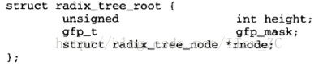
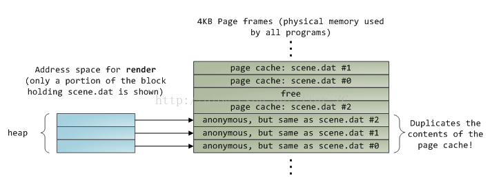

# 理解页缓存page cache和地址空间address_space

在`Linux 2.4`内核中**块缓存buffer cache和页缓存page cache是并存的**, 表现的现象是同一份文件的数据, 可能即出现在`buffer cache`中, 又出现在页缓存中, 这样就造成了物理内存的浪费. `Linux 2.6`内核两个cache进行了合并, 统一使用页缓存在做缓存, 只有极少数的情况下才使用到`buffer cache`.

在`/proc/meminfo`中存储了当前系统的内存使用情况, 比如下面这个例子:

* `Buffers`表示`buffer cache`的容量.
* `Cached`表示位于物理内存中的页缓存`page cache`.
* `SwapCached`表示位于磁盘交换区的页缓存`page cache`.

```
[ansible@production-front-1 ~]$ cat /proc/meminfo
MemTotal:        7747648 kB
MemFree:          473120 kB
MemAvailable:    3955192 kB
Buffers:          375692 kB
Cached:          3265740 kB
SwapCached:            0 kB
Active:          4750980 kB
Inactive:        1355768 kB
Active(anon):    2735940 kB
Inactive(anon):   342312 kB
Active(file):    2015040 kB
Inactive(file):  1013456 kB
Unevictable:       44972 kB
Mlocked:           44972 kB
SwapTotal:             0 kB
SwapFree:              0 kB
Dirty:               164 kB
Writeback:             0 kB
AnonPages:       2510356 kB
Mapped:           450272 kB
Shmem:            606228 kB
Slab:             810020 kB
SReclaimable:     706968 kB
SUnreclaim:       103052 kB
KernelStack:       22016 kB
PageTables:       109364 kB
NFS_Unstable:          0 kB
Bounce:                0 kB
WritebackTmp:          0 kB
CommitLimit:     3873824 kB
Committed_AS:   10051348 kB
VmallocTotal:   34359738367 kB
VmallocUsed:      151968 kB
VmallocChunk:   34359538688 kB
HardwareCorrupted:     0 kB
AnonHugePages:    227328 kB
HugePages_Total:       0
HugePages_Free:        0
HugePages_Rsvd:        0
HugePages_Surp:        0
Hugepagesize:       2048 kB
DirectMap4k:      184320 kB
DirectMap2M:     8204288 kB
```

所以**实际页缓存page cache的容量 =  Cached + SwapCached**

## `buffer cache`和`page cache`的区别

### 1

`buffer cache`是Unix和早期的Linux内核中主要的缓存组件. **不管是buffer cache还是page cache都是为了处理块设备和内存交互时高速访问的问题**.

`buffer cache`是**面向底层块设备的**, 所以它的**粒度是文件系统的块**, 块设备和系统采用块进行交互. 块再转换成磁盘的基本物理结构扇区. 扇区的大小是512KB, 而文件系统的块一般是2KB, 4KB, 8KB. 扇区和块之间是可以快速转换的. 随着内核的功能越来越完善, **块粒度的缓存已经不能满足性能的需要**.  内核的内存管理组件采用了比文件系统的块**更高级别的抽象**, `页page`, 页的大小一般从4KB到2MB, 粒度更大, 处理的性能更高. 所以缓存组件为了和内存管理组件更好地交互, 创建了页缓存`page cache`来代替原来的`buffer cache`.

**页缓存是面向文件, 面向内存的. 通过一系列的数据结构, 比如inode, address_space, page, 将一个文件映射到页的级别, 通过page + offset就可以定位到一个文件的具体位置**.

### 2

`buffer cache`实际操作时按块为基本单位, `page cache`操作时按页为基本单位, 新建了一个`BIO`的抽象, 可以同时处理多个非连续的页的IO操作, 也就是所谓的`scatter/gather IO`.

### 3

`buffer cache`目前主要用在需要按块传输的场景下, 比如超级块的读写等. 而`page cache`可以用在所有以文件为单元的场景下, 比如网络文件系统等等, 缓存组件抽象了地址空间`address_space`这个概念来**作为文件系统和页缓存的中间适配器**, 屏蔽了底层设备的细节.

### 4

`buffer cache`可以和`page cache`集成在一起, 属于一个`page`的块缓存使用`buffer_head`链表的方式组织, `page_cache`维护了一个`private`指针指向这个`buffer_head`链表, `buffer_head`链表维护了一个指针指向这个`页page`. 这样只需要在页缓存中存储一份数据即可.

### 5

文件系统的`inode`实际维护了这个文件所有的块`block`的块号, 通过对文件偏移量`offset`取模可以很快定位到这个偏移量所在的文件系统的块号, 磁盘的扇区号. 同样, 通过对文件偏移量`offset`进行取模可以计算出偏移量所在的页的偏移量, 地址空间`address_space`通过指针可以方便的获取两端`inode`和`page`的信息, 所以可以很方便地定位到一个文件的`offset`在各个组件中的位置:

**文件字节偏移量 --> 页偏移量 --> 文件系统块号 block  -->  磁盘扇区号**

## 页缓存`page cache`和地址空间`address_space`

页缓存的作用: **它位于内存和文件之间, 文件IO操作实际上只和页缓存交互, 不直接和内存交互**.

Linux内核使用`page`数据结构来描述物理内存页帧, 内核创建了`mem_map`数组来表示所有的物理页帧, `mem_map`的数组项就是`page`.

`page`结构不仅表示了物理内存页帧.

1.  一些标志位`flags`来表示该页是否是脏页, 是否正在被写回等等.
2.  `_count, _mapcount`表示这个页被多少个进程使用和映射.
3. `private`指针指向了这个页对应的`buffer cache`的`buffer_head`链表, 建立了页缓存和块缓存的联系.
4. `mapping`指向了地址空间`address_space`, 表示这个页是一个页缓存中页, 和一个文件的地址空间对应.
5. `index`是这个页在文件中的页偏移量, 通过文件的字节偏移量可以计算出文件的页偏移量.


**页缓存实际上就是采用了一个基数树结构将一个文件的内容组织起来存放在物理内存page中. 文件IO操作直接和页缓存交互. 采用缓存原理来管理块设备的IO操作.**



**一个文件`inode`对应一个地址空间`address_space`. 而一个`address_space`对应一个页缓存基数树. 这几个组件的关系如下: **


`address_space`是Linux内核中的一个关键抽象, **它是页缓存和外部设备中文件系统的桥梁, 可以说关联了内存系统和文件系统**, 文件系统可以理解成数据源.

1. `inode`指向这个地址空间的宿主, 也就是数据源.
2. `page_tree`指向了这个地址空间对应的页缓存的基数树. 这样就可以通过**inode --> address_space --> page_tree**找打一个文件对应的页缓存页.


**读文件时**, 首先通过要读取的文件内容的偏移量`offset`计算出要读取的页, 然后通过该文件的`inode`找到这个文件对应的地址空间`address_space`, 然后在`address_space`中访问该文件的页缓存, 如果页缓存命中, 那么直接返回文件内容, 如果页缓存缺失, 那么产生一个页缺失异常, 创建一个页缓存页, 然后从磁盘中读取相应文件的页填充该缓存页, 随后从页缺失异常中恢复, 继续往下读.

**写文件时**, 首先通过所写内容在文件中的偏移量计算出相应的页, 然后还是通过`inode`找到`address_space`, 通过`address_space`找到页缓存中页, 如果页缓存命中, 直接把文件内容修改更新在页缓存的页中. 写文件就结束了. 这时候文件修改位于页缓存, 并没有写回`writeback`到磁盘文件中去. 一个页缓存中的页如果被修改, 那么会**被标记成脏页**. 脏页需要写回到磁盘中的文件块. 有两种方式可以把脏页写回磁盘, 也就是`flush`.

1. 手动调用`sync()`或者`fsync()`系统调用把脏页写回.
2. `pdflush`进程会定时把脏页写回到磁盘.

脏页不能被置换出内存, 如果脏页正在被写回, 那么会被设置写回标记, 这时候该页就被上锁, 他写请求被阻塞直到锁释放.

**在某些情况下我们可能需要绕过页缓存机制**, 比如系统存在大日志的情况, 比如数据库系统, 日志不会被经常重复读取, 如果都缓存在内存中会影响系统的性能. 内核提供了直接IO的方式, `O_DIRECT`,可以绕过页缓存, 直接把文件内容从堆中写到磁盘文件.

文件IO: **普通文件IO需要复制两次, 内存映射文件mmap复制一次**, **普通文件IO是堆内操作, 内存映射文件是堆外操作**.

普通文件需要复制两次:

1. 第一次复制是从磁盘到内存缓冲区(页缓存).
2. 第二次是从内存缓冲区到进程的堆.

假如一个进程`render`要读取一个`scene.dat`文件, 实际发生的步骤如下:

1. `render`进程向内核发起读`scene.dat`文件的请求.
2. 内核根据`scene.dat`的`inode`找到对应的`address_space`, 在`address_space`中查找页缓存, 如果没有找到, 那么分配一个内存页`page`加入到页缓存.
3. **从磁盘中读取scene.dat文件相应的页填充页缓存中的页, 也就是第一次复制**.
4. **从页缓存的页复制内容到render进程的堆空间的内存中, 也就是第二次复制**.


最后物理内存的内容是这样的, 同一个文件scene.dat的内容存在了两份拷贝, 一份是页缓存, 一份是用户进程的堆空间对应的物理内存空间.



再来看看内存映射文件mmap只复制一次是如何做的, `mmap`只有一次页缓存的复制, 磁盘文件复制到页缓存中.

`mmap`会创建一个虚拟内存区域`vm_area_struct`, 进程的`task_struct`维护着这个进程所有的虚拟内存区域信息, 虚拟内存区域会更新相应的进程页表项, 让这些页表项直接指向页缓存所在的物理页`page`. `mmap`新建的这个虚拟内存区域和进程堆的虚拟内存区域不是同一个, 所以`mmap`是在堆外空间.


## 总结

1. 用户进程访问内存只能通过页表结构, 内核可以通过虚拟地址直接访问物理内存.
2. 用户进程不能访问内核的地址空间, 这里的地址空间指的是虚拟地址空间, 用户进程的虚拟地址空间和内核的虚拟地址空间是不重合的, 内核虚拟地址空间必须特权访问.
3. `page`结构表示物理内存页帧, 同一个物理内存地址可以同时被内核进程和用户进程访问, 只要将用户进程的页表项也指向这个物理内存地址. 也就是`mmap`的实现原理.