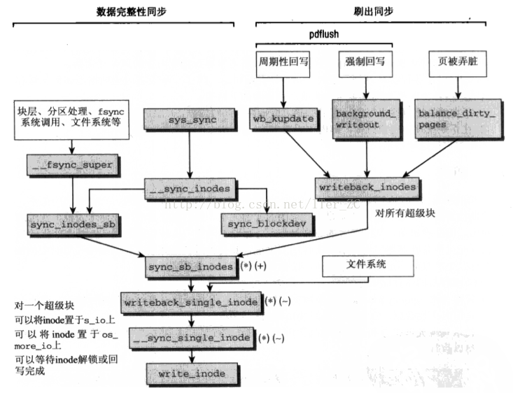

# 页缓存数据同步和页回收机制

* 数据同步处理的是内存/缓存的数据和后备设备的数据一致问题. 数据同步在任意时刻都有可能触发.
* 页回收处理的是在内存空间不足时如何回收已分配的物理内存页, 来获得足够空间分配干净页, 支持优先级更高的工作. 页回收则是在物理内存使用达到一定阀值的时候触发.

## 数据同步

数据同步就是把物理内存和页缓存中的脏页写回到后备设备的文件中去. 有两种方式可以调用数据同步:

1. 周期性的调用, 主要是`pdflush`机制.
2. 强制调用, 比如调用`sync`,`fsync`系统调用. 当脏页数量很多时, 内核也会强制进行数据同步, 来控制脏页的数量, 使数据同步造成的IO尽量平滑.

`pdflush`是一组内核线程, 相当于内核维护了一个`pdflush`线程池, 根据数据同步的负载来分配`pdflush`线程, 一个`pdflush`线程可以对应一个块设备, 这样多个`pdflush`线程对应多个块设备,可以**避免单个块设备的IO负载过大影响其他块设备的数据同步**.

下图给出了sync等系统调用触发的数据完整性同步(即同步所有的脏页), 以及`pdflush`触发的周期性刷出同步所调用的内核函数:

1. 可以看到数据同步的目标主要是文件系统的对象, 比如文件系统超级块, 文件`inode`元数据, 文件`inode`数据块.
2. 不管是数据完整性同步, 还是`flush`同步, 最后的调用路径都汇集到了`sync_sb_inodes`函数, 这个函数会同步给定超级块的所有脏`inodes`.

同步一个超级块的所有脏`inodes`如果每次都要遍历所有的`inode`链表去过滤脏`inode`, 那效率是相当低下的. 实际上内核专门维护了一个脏`inode`链表, 通过超级块的`super_block --> s_dirty`指针指向这个脏`inode`链表, 这样只要依次对这个链表的`inode`进行同步即可.

对一个`inode`同步包括两部分, 元数据同步和数据块同步, 内核提供了很多标志位来细化数据同步的操作细节.

比较几个强制同步的系统调用:

1. `sync`: 同步所有的脏页, 是数据完整性同步. 当IO请求发送到请求队列后就返回, 不等待磁盘操作的完成. **当磁盘发生故障时可能造成数据丢失**.
2. `fsync`: 对单个文件的元数据和数据块同步, 等待直到磁盘操作完成后才返回, 保证了数据的可靠性.
3. `fdatasync`: 对单个文件的数据块同步, 等待直到磁盘操作完成后才返回, 保证了数据的可靠性.
4. `msync`: 对`mmap`产生的脏页进行同步.

## 页回收

页回收机制包含了三部分:

* 数据刷出`flush`
* 交换`swap`
* 释放`release`

数据刷出`flush`和数据同步是类似的, 就是把有后备文件的页缓存都同步到磁盘, 从而可以回收这些页面.

交换`swap`主要是对匿名映射, 私有映射, `malloc`动态分配的内存这些没有后备文件的内存页进行回收, 把他们交换到位于磁盘的交换区, 从而可以回收这些页面.

释放`release`主要是一些针对一些LRU的只读内存页, 在压力大的情况下直接释放, 从而可以回收这样页面.

内核的页面回收机制主要要解决几个问题:

1. 采用何种回收算法来保证最大的收益.
2. 回收哪些页.
3. 如何组织交换区, 如何存取交换区中页.
4. 在回收压力大的情况下如何避免页颠簸.