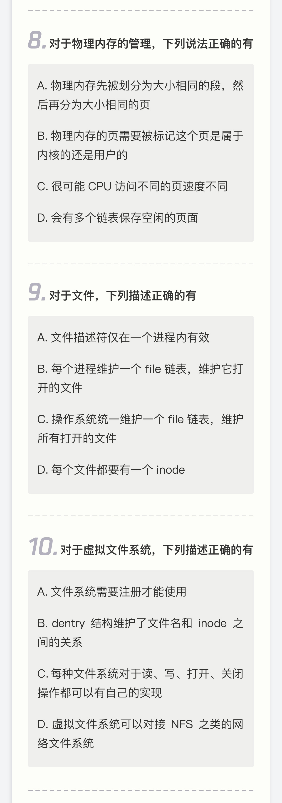
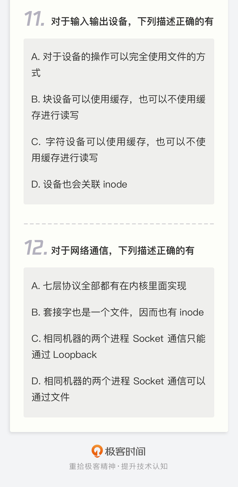

# 01 | 入学测验：你究竟对Linux操作系统了解多少？

---

## 笔记

### 考试题目

### 答案

#### 1

A,B,C,D

#### 2

不知道实模式

#### 3

B 

1号进程是`init`进程

#### 4

D

猜测的, 有个记忆是系统调用

#### 5

B

不太清楚

#### 6

B

不知道`CFS`

#### 7

C

不知道

#### 8

C, D(一级, 二级, 多级链表)

不知道 A(`slab`?)

#### 9

D

B,C 不知道

#### 10

B, D

#### 11

A, D

其他不知道

#### 12

B, D

七层协议记得自`TCP`以下是在内核里面实现

## 扩展