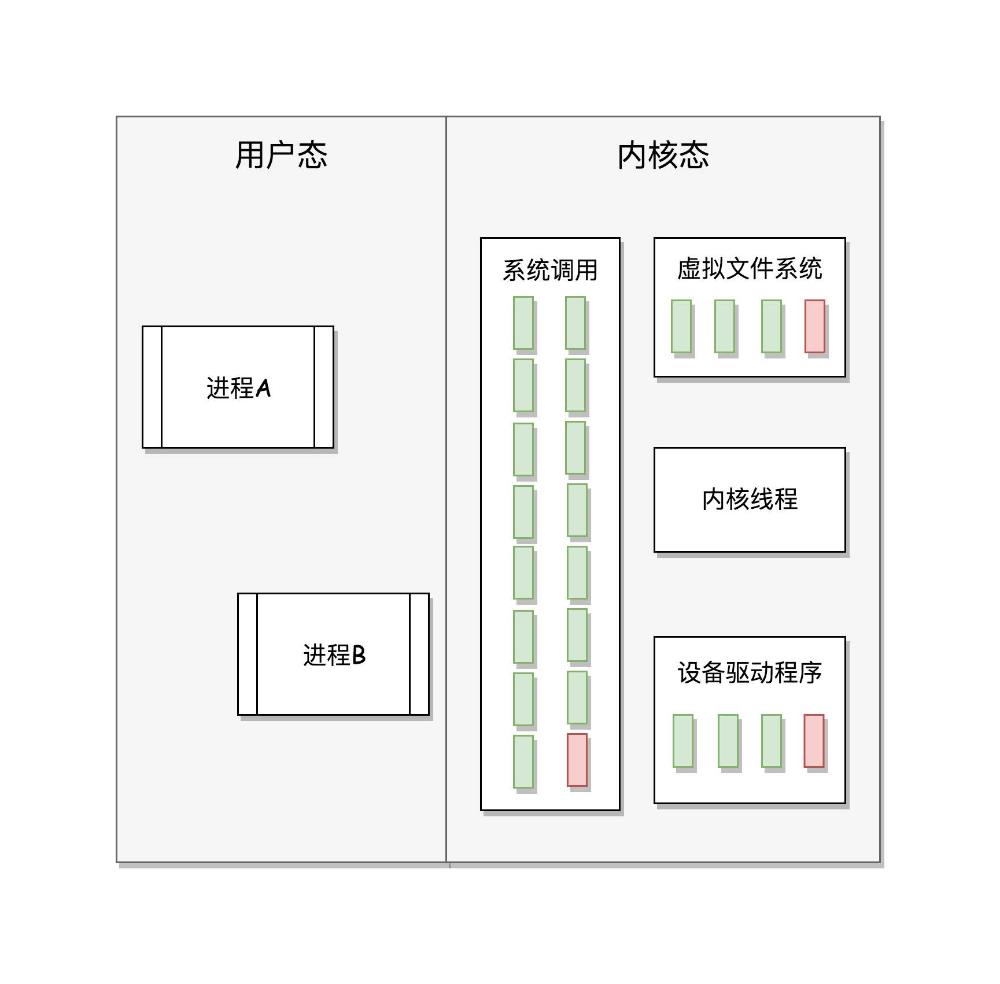

# 02 | 学习路径：爬过这六个陡坡，你就能对Linux了如指掌

## 笔记

### Linux学习过程中要爬的坡

1. 熟练使用`Linux`命令
2. 使用`Linux`进程程序设计
3. 了解`Linux`内核机制
4. 阅读`Linux`内核代码
5. 实验定制`Linux`组件
6. 落到生产实践

### 1. 抛弃旧的思维习惯, 熟练使用`Linux`命令行

* 鸟哥的`Linux`私房菜
* `Linux`系统管理技术手册

### 2. 通过系统调用或者`glibc`, 学会自己进行程序设计

**使用命令行的人是吃馒头, 写代码操作命令行的人就是做馒头**

* Unix环境高级编程

### 3. 了解Linux内核机制, 反复研习重点突破

**要蒸出更好的馒头, 就必须要对面粉有研究**

先了解`Linux`内核机制, 知道基本的原理和流程就可以了.

* 深入理解LINUX内核

### 4. 阅读Linux内核代码, 聚焦核心逻辑和场景

一开始阅读代码不要纠结一城一池的得失, 不要每一行都一定要搞清楚它是干嘛的, 而是**聚焦于核心逻辑和使用场景**

* LINUX 内核源代码情景分析

### 5. 实验定制化Linux组件, 已经没人能阻挡你称为内核开发工程师了

### 6. 面向真实场景的开发, 实践没有终点

### 总结

## 扩展