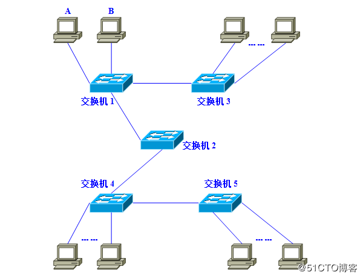
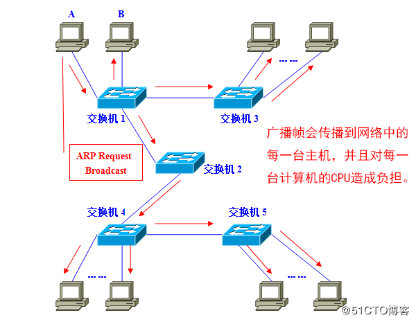
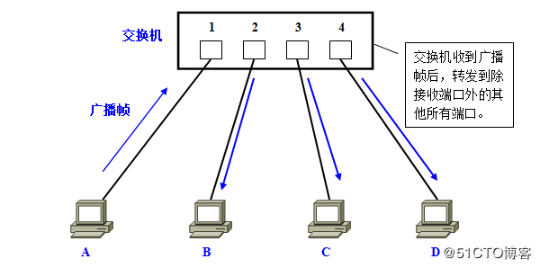
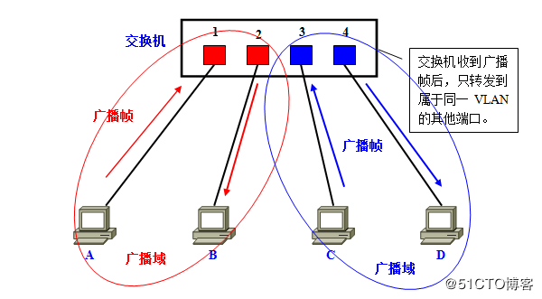
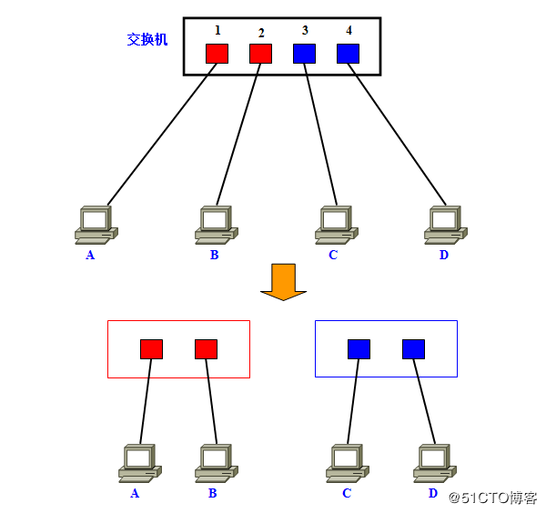
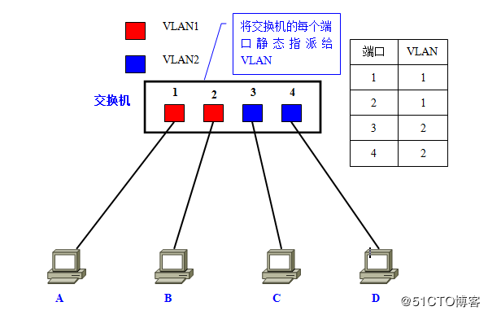
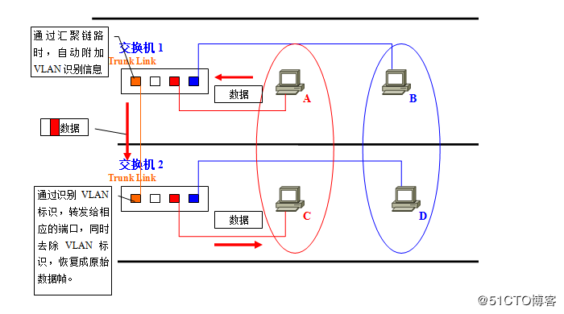
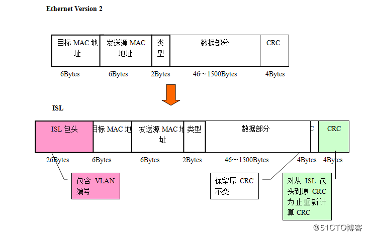
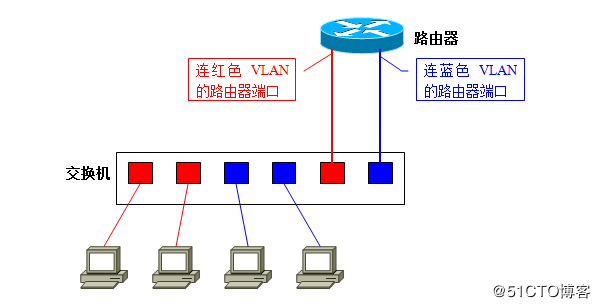

# VLAN

## 概念

### VLAN是什么

虚拟局域网. `VLAN`所指的`LAN`特指使用路由器分割的网络 -- 也就是广播域.

广播域, 指的是广播帧(目标`MAC`地址全部为`1`)所能传递到的访问, 也就是能够直接通信的访问.

* 多播帧(Multicast Frame)
* 目标不明的单播帧(Unknown Unicast Frame)

也能够在同一个广播域畅行无阻.

**二层交换机只能构建单一的广播域, 不过使用`VLAN`功能后, 它能够将网络分割成多个广播域**.

### 不分割广播域的结果

如果仅有一个广播域, **有可能会影响到网络整体的传输性能**.

图中有5台交换机. 加入A和B需要通信.

A必须先广播ARP请求, 来尝试获取计算机B的MAC地址.

交换机1收到广播帧(ARP), 会将它**转发给除接收端口外其他所有端口**, 也就是`Flooding`了, 交换机2收到广播帧后也会`Flooding`. 同理交换机3,4,5. **最终ARP请求会被转发到同一网络中的所有客户机上**.

`ARP`请求原本是为了获得计算机B的MAC地址. 但是:

* 数据帧缺传遍整个网络, 导致所有计算机都收到它了.
* 广播信息消耗了网络整体的带宽.
* 收到广播信息的计算机还要消耗一部分CPU时间来对它进行处理. 

**网络带宽和CPU运算能力的大量无谓消耗**.

### 广播信息频发发出吗

多类广播信息

* ARP: 建立IP地址和MAC地址的映射关系.
* DHCP: 用于自动设定IP地址的协议.
* RIP: 一种路由协议.

### 广播域的分割与VLAN的必要性

用于在二层交换机上分割广播域的技术就是`VLAN`. 通过`VLAN`我们可以自由设计广播域的构成, 提高网络设计的自由度.

## 实现VLAN的机制

### 实现VLAN的机制

交换机如何使用`VLAN`分割广播域.

在一台未设置任何VLAN的二层交换机上，任何广播帧都会被转发给除接收端口外的所有其他端口(`Flooding`).

计算机A发送广播信息后, 会被转发给端口2,3,4.

这时，如果在交换机上生成红、蓝两个VLAN；同时设置端口1、2属于红色VLAN、端口3、4属于蓝色VLAN。再从A发出广播帧的话, 交换机就只会把它转发给同属于一个VLAN的其他端口——也就是同属于红色VLAN的端口2, 不会再转发给属于蓝色VLAN的端口.

同样, C发送广播信息时, 只会被转发给其他属于蓝色VLAN的端口, 不会被转发给属于红色VLAN的端口.

实际中使用**`VLAN ID`**来区分.

### 直观描述VLAN

**把它理解为将一台交换机在逻辑上分割成了数台交换机**

在一台交换机上生成红、蓝两个VLAN, 也可以看作是将一台交换机换做一红一蓝两台虚拟的交换机.

**VLAN生成的逻辑上的交换机是互不想通的. 因此, 在交换机上设置VLAN后, 如果未做其他处理, VLAN间是无法通信的**.

### VLAN间通信

通常两个广播域之间由路由器连接, 广播域之间来往的数据报都由路由器中继的.

**VLAN间的通信也需要路由器提供中继服务, 这被称作VLAN间路由**

VLAN间路由, 可以使用普通的路由器, 也可以使用三层交换机.

## VLAN的访问链接

### 交换机的端口

* 访问链接(Access Link)
* 回去链接(Trunk Link)

### 访问链接

**只属于一个`VLAN`, 且仅向该`VLAN`转发数据帧的端口**. 一般访问链接所连的是客户机.

设置`VLAN`的顺序是:

* 生成`VLAN`
* 设定访问链接(决定各端口属于哪个一个`VLAN`)

#### 静态VLAN

事先固定的

**静态VLAN又被称为基于端口的VLAN(Port Based VLAN)**, 就是明确指定各端口属于哪个VLAN的设定方法.

需要一个个端口地指定, 当网络中的计算机数目超过一定数字, 设计操作就变得复杂.

**静态VLAN不适合那些需要频繁改变拓补结构的网络**.

#### 动态VLAN

动态VLAN则是根据每个端口所连的计算机, 随时改变端口所属的VLAN.

* 基于MAC地址的VLAN(MAC Based VLAN)
* 基于子网的VLAN(Subnet Based VLAN)
* 基于用户的VLAN(User Based VLAN)

**基于MAC地址的VLAN**, 就是通过查询并记录端口所连计算机上网卡的MAC地址来决定端口的所属.假定有一个MAC地址“A”被交换机设定为属于VLAN“10”, 那么不论MAC地址为“A”的这台计算机连在交换机哪个端口, 该端口都会被划分到VLAN10中去. 计算机连在端口1时, 端口1属于VLAN10; 而计算机连在端口2时, 则是端口2属于VLAN10.

**基于子网的VLAN**, 通过所连计算机的IP地址, 来决定端口所属VLAN的. 只要计算机的IP地址不变, 就仍可以加入原先设定的VLAN. 基于子网的VLAN是一种在OSI的第三层设定访问链接的方法.

**基于用户的VLAN**, 根据交换机各端口所连的计算机上当前登录的用户, 来决定该端口属于哪个VLAN. 这些用户名信息, 属于OSI第四层以上的信息,

**决定端口所属VLAN时利用的信息在OSI中的层面越高, 就越适于构建灵活多变的网络**.

### 访问链接的总结

* 静态VLAN(基于端口的VLAN): 将交换机的各端口固定指派给`VLAN`.
* 动态VLAN
	* 基于MAC地址的VLAN: 根据各端口所连计算机的MAC地址设定.
	* 基于子网的VLAN: 根据各端口所连计算机的IP地址设定.
	* 基于用户的VLAN:  根据端口所连计算机上登录用户设定.

## VLAN的汇聚链接

### 设置跨越多态交换机的VLAN

如图: 需要将不同楼层的`A,C`和`B,D`设置为同一个`VLAN`.

最简单方案, 在交换机1和交换机2上各设一个红, 蓝`VLAN`专用的接口并互联.

**扩展性和管理效率不好**

让交换机互联的网线集中到一根上, **汇聚链接(Trunk Link)**

### 汇聚链接

汇聚链接(Trunk Link)指的是**能够转发多个不同VLAN的通信的端口**.

汇聚链路上流通的数据帧, 都被附加了用于识别分属于哪个VLAN的特殊信息.

汇聚链接是如何实现跨越交换机间的VLAN的:

* A发送的数据帧**从交换机1经过汇聚链路到达交换机2时**, 在数据帧上**附加了表示属于红色VLAN的标记**.
* 交换机2收到数据帧后, 经过检查`VLAN`表示发现这个数据帧属于红色`VLAN`的端口.
* 去除标记后根据需要将复原的数据帧只转发给其他属于红色`VLAN`的端口.

只有当数据帧是一个广播帧、多播帧或是目标不明的帧时, 它才会被转发到所有属于红色VLAN的端口.

汇聚链路上流通着多个VLAN的数据, 自然负载较重. 在设定汇聚链接时, 有一个前提就是必须支持100Mbps以上的传输速度.

默认条件下, 汇聚链接会转发交换机上存在的所有VLAN的数据. 换一个角度看, 可以认为汇聚链接(端口)同时属于交换机上所有的VLAN.

**可以通过用户设定限制能够经由汇聚链路互联的VLAN**.

## VLAN的汇聚方式

### 汇聚方式

在交换机的汇聚链接上, 可以通过对数据帧附加VLAN信息, 构建跨越多台交换机的VLAN.

* IEEE802.1Q
* ISL

### IEEE802.1Q

IEEE802.1Q所附加的VLAN识别信息, 位于数据帧中"发送源MAC地址"与"类别域(Type Field)"之间. **具体内容为2字节的TPID和2字节的TCI, 共计4字节**.

而当数据帧离开汇聚链路时, TPID和TCI会被去除, 这时还会进行一次CRC的重新计算.

TPID的值, 固定为0x8100. 交换机通过TPID, 来确定数据帧内附加了基于IEEE802.1Q的VLAN信息. 而实质上的VLAN ID, 是TCI中的12位元. 由于总共有12位, 因此最多可供识别4096个VLAN.

基于IEEE802.1Q附加的VLAN信息, 就像在传递物品时**附加的标签**. 因此, 它也被称作"标签型VLAN(Tagging VLAN)".

### ISL(Inter Switch Link) - Cisco独有

使用ISL后, 每个数据帧头部都会被附加26字节的"ISL包头(ISL Header)", 并且在帧尾带上通过对包括ISL包头在内的整个数据帧进行计算后得到的4字节CRC值. **总共增加了30字节的信息**.

在使用ISL的环境下, 当数据帧离开汇聚链路时, 只要简单地去除ISL包头和新CRC就可以了. 由于原先的数据帧及其CRC都被完整保留, 因此无需重新计算CRC.

ISL有如用ISL包头和新CRC将原数据帧整个包裹起来, 也被称为**“封装型VLAN(Encapsulated VLAN)"**.

## VLAN间路由

### VLAN间路由

两台计算机即使连接在同一台交换机上, 只要所属的VLAN不同就无法直接通信.

在LAN内的通信, 必须在数据帧头中指定通信目标的MAC地址. 而为了获取MAC地址, TCP/IP协议下使用的是ARP. ARP解析MAC地址的方法, 则是通过广播. 也就是说, 如果广播报文无法到达, 那么就无从解析MAC地址, 亦即无法直接通信.

计算机分属不同的VLAN, 也就意味着分属不同的广播域, 自然收不到彼此的广播报文. 因此, **属于不同VLAN的计算机之间无法直接互相通信**. 为了能够在VLAN间通信, 需要利用网络层的信息(IP地址)来进行路由.

### 使用路由器进行VLAN间路由

路由器和交换机的接线方式:

* 将路由器与交换机上的每个VLAN分别连接
* 不论VLAN有多少个, 路由器与交换机都只用一条网线连接

#### 1

把路由器和交换机以VLAN为单位分别用网线连接.

将交换机上用于和路由器互联的每个端口设为访问链接, 然后分别用网线与路由器上的独立端口互联.

交换机上有2个VLAN, 那么就需要在交换机上预留2个端口用于与路由器互联.

路由器上同样需要有2个端口; 两者之间用2条网线分别连接.

**扩展性问题**

#### 2

当使用一条网线连接路由器与交换机、进行VLAN间路由时, 需要用到汇聚链接.

* 首先将用于连接路由器的交换机端口设为汇聚链接
* 路由器上的端口也必须支持汇聚链路
* 双方用于汇聚链路的协议自然也必须相同

尽管实际与交换机连接的物理端口只有一个, 但在理论上我们可以把它分割为多个虚拟端口, 在路由器上定义对应各个VLAN的“子接口(Sub Interface)". 

即使之后在交换机上新建VLAN, 仍只需要一条网线连接交换机和路由器. 用户只需要在路由器上新设一个对应新VLAN的子接口就可以了.

### 同一VLAN内的通信时数据的流程

* 红色VLAN(VLAN ID=1)的网络地址为192.168.1.0/24
* 蓝色VLAN(VLAN ID=2)的网络地址为192.168.2.0/24
* 各计算机的MAC地址分别为A/B/C/D
* 路由器汇聚链接端口的MAC地址为R

端口         |     MAC地址       |   VLAN    |
------------|------------------|------------|
1			|	  A				|	  1		 |
2			|	  B				|	  1		 |
3			|	  C				|	  2		 |
4			|	  D				|	  2		 |
5			|	  -				|	  -		 |
6			|	  R				|	  汇聚	 |

计算机`A`与统一`VLAN`内的计算机`B`之间通信时的情形:

* 计算机`A`发出`ARP`请求信息, 请求解析`B`的`MAC`地址.
* **交换机**收到数据帧后, 检索`MAC`地址列表中与收信端口同属一个`VLAN`的表项.
* 结果发现, 计算机`B`连接子啊端口`2`上, 于是交换机将数据帧转发给端口`2`, 最终计算机`B`收到该帧.

收发信双方同属一个`VLAN`之内的通信, 一切处理均在交换机内完成.