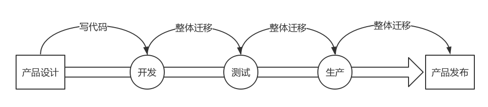

# 第29讲 | 容器网络：来去自由的日子，不买公寓去合租

## 笔记

虚拟机是公寓, 容器则相当于合租, 有一定的隔离, 但是隔离性没有那么好.

容器就是`Container`. **容器的思想就是要编程软件交付的集装箱**.

集装箱的特点:

* 打包
* 标准


没有集装箱的时候, 每次都要将货物卸下船来, 弄得乱七八糟, 然后还要再搬上传重新整齐摆好. 

有了尺寸全部都一样的集装箱以后, 可以把所有的货物都打包在一起, 每次换船的时候, 一个箱子整体搬过去就行了, 小时级别就能完成。

这就是**打包和标准**。


封闭环境:

* **看起来**隔离的技术: `namespace`, 每个`namespace`中的应用看到的是不同的`IP`地址, 用户控件, 程号.
* **用起来**隔离的技术: `cgroup`, 即命名整台机器有很多的`CPU`, 内存, 而一个应用智能用其中的一部分.

"将这个集装箱标准化", 这个标准就是**镜像**.

#### 镜像

就是将集装箱的状态保存下来, 将这一刻的状态保存成一系列文件. 无论从哪里运行这个额镜像, 都能完整地还原当时的情况.



### 命名空间(namespace)

`Linux`下很多资源都是全局的. 全局的进程`ID`, 网络也有全局的路由表. 当一台`Linux`上跑多个进程的时候, 可以将进程放在一个独立的`namespace`里面, 可以独立配置网络.

网络的`namespace`由`ip netns`命令操作. 可以创建, 删除, 查询`namespace`.

如图:

* 可以创建一个`Router`虚拟机来做这件事
* 通过`namespace`实现


创建一个`routerns`, 一个独立的网络空间就产生了.

```
ip netns add routerns
```

打开`forward`, `exec`就是进入这个网络空间做点事情.

```
ip netns exec routerns sysctl -w net.ipv4.ip_forward=1
```

初始化`iptables`，里面要配置`NAT`规则.

```
ip netns exec routerns iptables-save -c 
ip netns exec routerns iptables-restore -c
```

路由器需要一张网卡连到`br0`上, 因而要创建一个网卡.

```
ovs-vsctl -- add-port br0 taprouter -- set Interface taprouter type=internal -- set Interface taprouter external-ids:iface-status=active -- set Interface taprouter external-ids:attached-mac=fa:16:3e:84:6e:cc
```

如何进到`namesapce`？

```
ip link set taprouter netns routerns
```

给这个网卡配置一个`IP`地址, 应该是虚拟机网络的网关地址. 例如虚拟机私网网段为`192.168.1.0/24`, 网关的地址往往为`192.168.1.1`.

```
ip netns exec routerns ip -4 addr add 192.168.1.1/24 brd 192.168.1.255 scope global dev taprouter
```

为了访问外网, 还需要另一个网卡连载外网网桥`br-ex`上, 并塞在`namespace`里面.

```
ovs-vsctl -- add-port br-ex taprouterex -- set Interface taprouterex type=internal -- set Interface taprouterex external-ids:iface-status=active -- set Interface taprouterex external-ids:attached-mac=fa:16:3e:68:12:c0
```

```
ip link set taprouterex netns routerns
```

还需要为这个网卡分配一个地址, 这个地址应该和物理外网网络在一个网段. 假设物理外网为`16.158.1.0/24`, 可以分配一个外网地址`16.158.1.100/24`.

```
ip netns exec routerns ip -4 addr add 16.158.1.100/24 brd 16.158.1.255 scope global dev taprouterex
```

配置路由表

```
ip netns exec routerns route -n
Kernel IP routing table
Destination   Gateway     Genmask     Flags Metric Ref  Use Iface
0.0.0.0     16.158.1.1  0.0.0.0     UG  0   0    0 taprouterex
192.168.1.0    0.0.0.0     255.255.255.0  U   0   0    0 taprouter
16.158.1.0  0.0.0.0     255.255.255.0  U   0   0    0 taprouterex
```

* 默认路由去物理外网.
* 去`192.168.1.0/24`也即虚拟机私网, 走下面的网卡.
* 去`16.158.1.0/24`也即物理外网, 走上面的网卡.

如果在虚拟机里面提供服务, 提供给外网的客户端访问, 客户端需要访问外网`IP`, 会在外网网口`NAT`虚拟机私网`IP`. 这个`NAT`规则要在这个`namespace`里面配置.

```
ip netns exec routerns iptables -t nat -nvL
Chain PREROUTING
target  prot opt  in  out  source  destination
DNAT  all  --  *  *  0.0.0.0/0 16.158.1.103 to:192.168.1.3
Chain POSTROUTING
target  prot opt  in  out  source   destination
SNAT  all  --  *  *  192.168.1.3  0.0.0.0/0 to:16.158.1.103
```

* `SNAT`: 将虚拟机私网`IP` 192.168.1.3 `NAT`成物理外网`IP` 16.158.1.103.
* `DNAT`: 将物理外网`IP` 16.158.1.103 `NAT`成虚拟机私网`IP` 192.168.1.3

### 机制网络(cgroup)

`cgroup`全称是`control groups`, 是`Linux`内核提供的一种可以限制, 隔离进程使用的资源机制.

可以控制哪些资源:

* `CPU`子系统使用调度程序为进程控制`CPU`的访问
* `cpuset`, 如果是多核心`CPU`, 这个子系统会为进程分配单独的`CPU`和内存
* `memory`子系统, 设置进程的内存限制以及产生内存资源报告
* `blkio`子系统, 设置限制每个块设备的输入输出控制
* `net_cls`, 使用登记识别符(`classid`)标记网络数据包, 可允许`Linux`流量控制程序(tc)识别从具体`cgroup`中生成的数据包

`cgroup`提供了一个虚拟文件系统, 作为进行分组管理和各子系统设置的用户接口. **要使用cgroup, 必须挂载cgroup文件系统, 一般情况下都是挂载到`/sys/fs/cgroup`目录下**.

#### 测试`net_cls`

首先挂载一个`net_cls`文件系统

```
mkdir /sys/fs/cgroup/net_cls
mount -t cgroup -onet_cls net_cls /sys/fs/cgroup/net_cls
```


原来是按照`IP`来源设定的.

* 从`1.2.3.4`来的, 发给`port 80`, 从`1:10`走. 
* 其他从`1.2.3.4`发送来的包从`1:11`走.
* 其他的走默认.

```
tc filter add dev eth0 protocol ip parent 1:0 prio 1 u32 match ip src 1.2.3.4 match ip dport 80 0xffff flowid 1:10
tc filter add dev eth0 protocol ip parent 1:0 prio 1 u32 match ip src 1.2.3.4 flowid 1:11
```

现在按照`cgroup`来设定规则.

```
tc filter add dev eth0 protocol ip parent 1:0 prio 1 handle 1: cgroup
```

假如我们有两个用户`a`和`b`, 要对它们进行带宽限制

创建两个`net_cls`

```
mkdir /sys/fs/cgroup/net_cls/a   
mkdir /sys/fs/cgroup/net_cls/b
```

假设用户`a`启动的进程`ID`为`12345`, 把它放在`net_cls/a/tasks`文件中. 同样假设用户`b`启动的进程`ID`为`12346`, 把它放在`net_cls/b/tasks/`中.

`net_cls/a`目录下面, 还有一个文件`net_cls.classid`, 我们放`flowid 1:10`. `net_cls/b`目录下面, 也创建了一个文件`net_cls.classid`, 我们放`flowid 1:11`.

数字需要转换成一个`0xAAAABBBB`的值, `AAAA`对应`class`中冒号前面的数字, 而`BBBB`对应后面的数字.

```
echo 0x00010010 > /sys/fs/cgroup/net_cls/a/net_cls.classid    
echo 0x00010011 > /sys/fs/cgroup/net_cls/b/net_cls.classid
```

这样:

* 用户`a`的进程发的包, 会打上`1:10`这个标签.
* 用户`b`的进程发的包, 会打上`1:11`这个标签.

然后`TC`根据这两个标签, 让用户`a`的进程的包走左边的分支, 用户`b`的进程的包走右边的分支.

### 容器网络中如何融入物理网络

使用`docker run`运行一个容器, 应该能看到这样一个拓扑结构.


容器里面有张网卡, 容器外有张网卡, 容器外的网卡连到`docker 0`网桥, 通过这个网桥, 容器直接实现相互访问.

虚拟机通过`TUN/TAP`设备虚拟一个网卡给虚拟机, 容器是怎么处理?

在`Linux`下, 可以创建一对`veth pair`的网卡, 从一边发送包, 另一边就能收到.

```
ip link add name veth1 mtu 1500 type veth peer name veth2 mtu 1500
```

其中一边可以打到`docker0`网桥上.

```
ip link set veth1 master testbr    
ip link set veth1 up
```

一端放到容器里, 一个容器启动会对应一个`namespace`, 找到这个`namespace`. 对于`docker`来说, `pid`就是`namespace`的名字

```
docker inspect '--format={{ .State.Pid }}' test
```

假设结果是`12065`, 这个就是`namespace`名字.

默认`docker`创建的网络`namespace`不在默认路径下, `ip netns`看不到, 需要`ln`软连接一下. 

```
rm -f /var/run/netns/12065    
ln -s /proc/12065/ns/net /var/run/netns/12065
```

将另外一端`veth2`塞到`namespace`里面

```
ip link set veth2 netns 12065
```

将网卡重命名

```
ip netns exec 12065 ip link set veth2 name eth0
```

给容器内网卡设置`ip`地址

```
ip netns exec 12065 ip addr add 172.17.0.2/24 dev eth0    
ip netns exec 12065 ip link set eth0 up
```

#### 容器怎么访问外网

`Docker`默认使用`NAT`模式. 容器内部访问外部通过`SNAT`.


宿主机上有一条`IP`规则

```
-A POSTROUTING -s 172.17.0.0/16 ! -o docker0 -j MASQUERADE
```

所有从容器内部发出来的包, 都要做地址伪装, 将源`IP`地址, 转换为物理网卡的`IP`地址. 如果多个容器, 所有的容器共享一个外网`IP`地址, 但是在`conntrack`表中, 记录下这个出去的链接.

当服务器返回结果的时候, 到达物理机, 会根据`conntrack`表中的规则, 取出原来的私网`IP`, 通过`DNAT`将地址转换为私网`IP`地址, 通过网桥`docker0`实现对内的访问.

#### 容器提供外部进行访问

通过端口映射技术, 将容器内部的端口因社会到物理机上来. 如映射宿主机`10080`到容器`80`端口.


##### 1. docker-proxy

通过一个进程`docker-porxy`方式监听`10080`, 转为为`80`端口.

```
/usr/bin/docker-proxy -proto tcp -host-ip 0.0.0.0 -host-port 10080 -container-ip 172.17.0.2 -container-port 80
```

##### 2. DNAT

在`-A PREROUTING`阶段加一个规则, 将到端口`10080`的`DNAT`称为容器的私有网络.

```
-A DOCKER -p tcp -m tcp --dport 10080 -j DNAT --to-destination 172.17.0.2:80

```

## 扩展

### veth pair 网卡