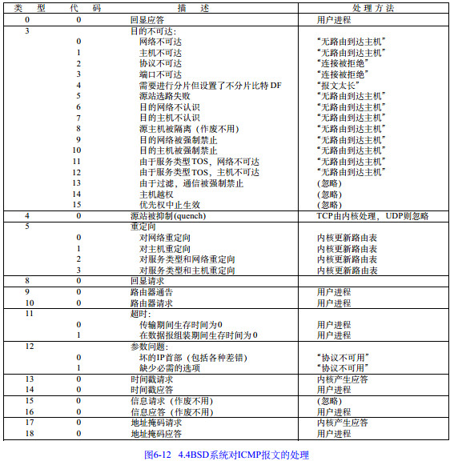

# 第七章 ICMP与ping：投石问路的侦察兵

## 知识点

### ICMP 协议的格式

`ICMP`全称`Internet Control Message Protocol`, 互联网控制报文协议.

`ICMP`报文是封装在`IP`报文里面的.

**ICMP**属于网络层协议.


`ICMP`报文有很多类型, 常用的:

* 主动请求为**8**
* 主动请求的应答为**0**

`1Byte`(1字节)=`8位`

ICMP包有一个8字节长的包头, 其中前4个字节是固定的格式：

* 包含8位类型字段
* 8位代码字段
* 16位的校验和
* 后4个字节根据ICMP包的类型而取不同的值

### 查询报文类型

`ping`就是查询报文, 是一种主动请求, 并且获得主动应答的`ICMP`协议.

`ping`发的包也是符合`ICMP`协议格式的, 只不过它在后面增加了自己的格式.

`ping`的主动请求, 网络抓包, 称为`ICMP ECHO REQUEST`. 主动请求的回复, 称为`ICMP ECHO REPLY`.

比原生的`ICMP`多了个两个字段:

* 标识符(用作区分)
* 序号(比如派出去10个, 回来10, 就说明前方不错. 如果派出去10个, 回来2个, 说明情况不妙)
* 选项数据中: 还会发送请求的时间值

#### 差错报文类型

异常情况发起的, 来报告发生了不好的事情. **ICMP的差错报文类型**

常见类型:

* **3**终点不可达
* **4**源抑制
* **11**超时
* **5**重定向

#### 终点不可达 `3`

代码: 

* `0`: 网络不可达
* `1`: 主机不可达
* `2`: 协议不可达
* `3`: 端口不可达
* `4`: 需要进行分片, 但设置了不分片位

示例:

* 网络不可达: 找不到地方
* 主机不可达: 找到地方没这个人
* 协议不可达: 找到地方, 找到人, 口号没对上
* 端口不可达: 找到地方, 找到人, 口号对上, 事情没对上.
* 需要进行分片, 但设置了不分片位: 走到一半, 山路狭窄, 想换小车, 但是禁止换小车, 没法送到了.

#### 源站抑制 `4`

让源站放慢发送速度. 

```
送粮草太多了, 吃不完
```

#### 时间超时 `11`

超过网络包的生存时间还是没到.

```
送粮草的人, 自己把粮草吃完了, 还没找到地方, 已经饿死啦.
```

#### 路由重定向 `5`

让下次发给另一个路由器.

```
上次送粮草的人本来只要走一站地铁,非得从五环绕,下次别这样了.
```

### 差错报文结构

除了前面还是`IP`, `ICMP`的前`8`字节不变, 后面则跟上出错的那个`IP`包的`IP`头和`IP`正文的前`8`个字节.

```
而且这类侦查兵特别恪尽职守, 不但自己返回来报信, 还把一部分遗物也带回来.

* 侦察兵：报告主公,张将军已经战死沙场,这是张将军的印信和佩剑.
* 主公：神马? 张将军是怎么死的(可以查看 ICMP 的前 8 字节)? 没错, 这是张将军的剑, 是他的剑(IP 数据包的头及正文前 8 字节).
```

### ping: 查询报文类的使用


* 主机`A`的`IP`地址是`192.168.1.1`
* 主机`B`的`IP`地址是`192.168.1.2`
* 在主机`A`上运行`ping 192.168.1.2`
	* 源主机构建一个`ICMP`请求数据包
	* `ICMP`数据包内包含多个字段:
		* 类型字段, 这里为**8**
		* 顺序号, 用于区分连续`ping`的时候发出的多个数据包. 每发出一个请求数据包, 顺序号就会自动加1. 为了能够计算往返时间`RTT`, 它会在报文的数据部分插入发送时间.
	* 由`ICMP`协议将这个数据包连同地址`192.168.1.2`一起交给`IP`层. `IP`层将以如下信息构建一个`IP`数据包
		* `192.168.1.2`作为目的地址
		* 本机`IP`地址作为源地址
		* 加上一些其他控制信息
	* 需要加入`MAC`头
		* 如果在本机`ARP`映射表中查找出`IP`地址`192.168.1.2`所对应的`MAC`地址, 则可以直接使用.
		* 如果没有, 需要发送`ARP`协议查询`MAC`地址
	* 获得`MAC`地址后, 由数据链路层构建一个数据帧, 依据以太网的介质访问规则, 将它们传送出去.
		* 目的地址是`IP`层传过来的`MAC`地址
		* 源地址是本机的`MAC`地址
		* 附加一些控制信息
* 主机`B`收到这个数据帧
	* 检查它的目的`MAC`地址, 并和本机的`MAC`地址对比
	* 如符合, 将`IP`数据包从帧中提取出来, 交给本机的`IP`层
	* 如符合, 将有用的信息提取后交给`ICMP`协议.
	* 主机`B`构建一个`ICMP`应答包, 发送给主机`A`
		* 数据类型为**0**
		* 顺序号为接收到的请求数据包中的顺序号
* 在规定的时间内, 源主机如果没有接收到`ICMP`的应答包, 则说明主机不可达.
* 如果接收到了`ICMP`应答包, 则说明主机可达.
	* 源主机会检查, 用当前时刻减去该数据包最初从源主机发出的时刻, 就是**ICMP 数据包的时间延迟**

#### 总结

`ping`这个程序使用了`ICMP`里面的`ECHO REQUEST`和`ECHO REPLY`类型.

### Traceroute: 差错报文类型的使用

#### TTL

`Traceroute`的第一个作用就是故意设置特殊的`TTL`, 来追踪去往目的地时沿途经过的路由器.

怎么知道`UPD`有没有到达目的主机呢?

Traceroute 程序会发送一份`UDP`数据报给目的主机,但它会选择一个不可能的值作为 UDP 端口号(大于 30000). 当该数据报到达时,将使目的主机的`UDP`模块产生一份"端口不可达"错误`ICMP`报文. 如果数据报没有到达,则可能是超时.

**为什么不发送正确的数据报**, 因为`UDP`是无连接的, 如果发送成功了, 得不到任何音信. 就无法区别到底是走丢了, 还是真正接收到了. 所以必须要**对方打出来**, 才会得到消息.

### 确定路径MTU

`Traceroute`还有一个作用是故意设置不分片, 从而确定路径的`MTU`. 要做的工作首先是发送分组, 并设置"不分片"标志. 发送的第一个分组的长度正好与出口`MTU`相等. 如果中间遇到窄的关口会被卡住, 会发送`ICMP`网络差错包, 型为"需要进行分片但设置了不分片位".

每次收到`ICMP`"不能分片"差错时就减小分组的长度, 直到到达目标主机.

### 总结

* `ICMP`相当于网络世界的侦察兵. 
	* 主动探查的查询报文.
	* 异常报告的差错报文.
* `ping`使用查询报文
* `traceroue`使用差错报文.

## 笔记整理

