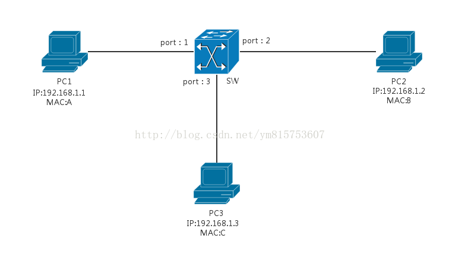
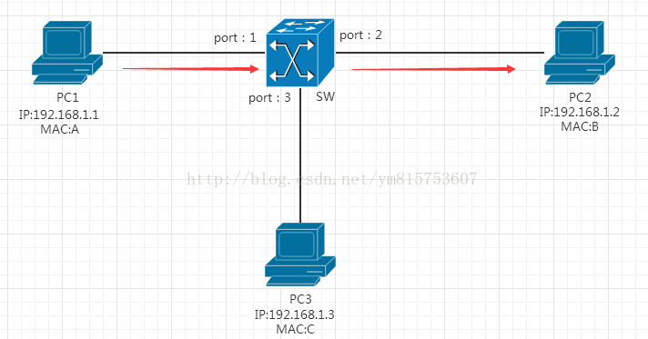

# 第五章 从物理层到MAC层：如何在宿舍里自己组网玩联机游戏？

## 笔记

### 电脑和电脑使用网线连接

**1-3,2-6**交叉接法.

水晶头的第 1、2 和第 3、6 脚, 它们分别起着收、发信号的作用. 将一端的 1 号和 3 号线、2 号和 6 号线互换一下位置, 就能够在物理层实现一端发送的信号, 另一端能收到.

### Hub 集线器

采取的是广播模. 需要解决几个问题:

1. 这个包是发给谁的？谁应该接收？
2. 大家都在发,会不会产生混乱？有没有谁先发、谁后发的规则？
3. 如果发送的时候出现了错误,怎么办？

### MAC

**解决: 大家都在发,会不会产生混乱？有没有谁先发、谁后发的规则？**

Medium Access Control, 媒体访问控制.

控制在往媒体发数据的时候, 谁先发, 谁后发的问题. 防止发生混乱. (解决上述第2个问题), 学名叫**多路访问**, 下面是解决多路访问的三种算法方式.

#### 信道划分

分多个车道. 每个车一个车道, 你走你的, 我走我的. 这在计算机网里叫作信道划分.

#### 轮流协议

今天单号出行, 明天双号出行, 轮着来. 这在计算机网络里叫作轮流协议.

#### 随机接入协议

不管三七二十一,有事儿先出门,发现特堵,就回去.错过高峰再出.我们叫作随机接入协议.著名的**以太网,用的就是这个方式**.

### 链路层地址

**解决: 这个包是发给谁的？谁应该接收？**

物理地址, 叫做**链路层(第一层)地址**. 因为第二层主要解决媒体接入控制的问题, 所以它常备称为`MAC`地址.

* 第2层最开始就是
	* 目标的`MAC`地址
	* 源的`MAC`地址
* 类型
	* 大部分类型都是`IP`数据包

#### NGINX 访问示例

有了这个目标 MAC 地址, **数据包在链路上广播**,MAC 的网卡才能发现,这个包是给它的.MAC 的网卡把包收进来,然后打开 IP 包,发现 IP 地址也是自己的,再打开 TCP 包,发现端口是自己,也就是 80,而 nginx 就是监听 80.

于是将请求提交给 nginx,nginx 返回一个网页.然后将网页需要发回请求的机器.然后层层封装,最后到 MAC 层.因为来的时候有源 MAC 地址,返回的时候,源 MAC 就变成了目标 MAC,再返给请求的机器.

### CRC

循环冗余检测.

**解决: 如果发送的时候出现了错误,怎么办？**

通过 XOR 异或的算法,来计算整个包是否在发送的过程中出现了错误.

### ARP 协议

已知`IP`地址, 求`MAC`地址的协议.

徐闻和回答的报文:

机器本地会进行`ARP`缓存. `ARP`的`MAC`地址缓存过一段时间就会过期.

### 交换机

**HUB**, 一旦机器数目增多, 问题就出现了. 因为 Hub 是广播的,不管某个接口是否需要,所有的`Bit`都会被发送出去,然后让主机来判断是不是需要. 产生冲突的概率就提高了. 

#### 交换机学习

一台`MAC1`电脑将一个包发送给另一台 MAC2 电脑, 当这个包到达交换机的时候,一开始交换机也不知道 MAC2 的电脑在哪个口, 所以没办法, 它只能将包转发给除了来的那个口之外的其他所有的口.但是,这个时候,交换机会干一件非常聪明的事情,就是交换机会记住, MAC1 是来自一个明确的口.以后有包的目的地址是 MAC1 的, 直接发送到这个口就可以了.

#### 转发表

当交换机作为一个关卡一样, 过了一段时间之后, 就有了整个网络的一个结构了, 这个时候, 基本上不用广播了, 全部可以准确转发. 当然, 每个机器的 IP 地址会变, 所在的口也会变,因而交换机上的学习的结果,我们称为转发表, 是有一个过期时间的.

### 总结

* `MAC`层是用来解决多路访问堵车问题的.
* `APR`是通过吼的方式来寻找目标的`MAC`地址的, 吼完之后记住一段时间, 这个叫做缓存.
* 交换机是有`MAC`地址学习能力的, 学完了它就知道谁在哪儿了, 不用广播了.

## 知识点

### 交换机学习

#### PC1

假定PC1的arp表项中没有对应通信的PC2的MAC地址B与IP映射, 那么PC1将广播一个**arp请求**, 交换机通过port1接收到PC1广播的arp请求报文, 通过查找交换机内部的转发表, 发现没有PC1的MAC地址A与端口1对应关系(假定交换机处于初始化状态), 如表1

**MAC地址表**

MAC地址  	  | 端口
------------- | -------------
  			  | 
              | 
              
于是, 交换机会将PC1发来的数据帧的源MAC地址A与端口1的对应关系更新到自己的转发表中.

**MAC地址表**

MAC地址  	  | 端口
------------- | -------------
 MAC：A 		   | Port1
              | 

接着交换机会广播arp请求(flooding)到除了接收端口的的其他端口, 如图2

#### PC2

PC2接收到arp请求后, 通过对比目的IP与自己IP, 如果相等, 则会将PC1的MAC地址A与IP映射关系更新到自己的arp表项中, 并且会以**单播**的形式通过端口2返回一个**"arp应答"**, 交换机接收到此arp应答后, 会将PC2发来的数据帧的源MAC地址B与对应的端口2更新到自己的转发表中

**MAC地址表**

MAC地址  	  | 端口
------------- | -------------
MAC：A 		   | Port1
MAC：B         | Port2

接着交换机查看自己的转发表发现arp应答目标MAC地址A对应端口1, 于是将此arp应答请求通过端口1发送给PC1, PC1得到arp应答, 将PC2 的MAC地址B与IP映射关系更新到自己的arp表项中. PC1发送由链路层封装的数据帧给PC2, 如图

经过交换机, 交换机通过转发表发现目的MAC地址是B, 对应端口为2, 于是通过端口2 将此数据帧传给PC.

#### PC3

PC3也接收到交换机广播来的arp请求, 如图2, 发现目的IP不是自己的IP, 于是不作出任何回应