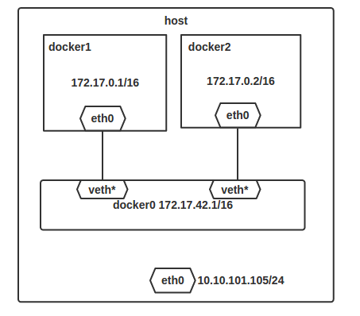

#docker的网络实现

---

####Docker 的 bridge模式

当Docker server启动时,会在主机上创建一个名为`docker0`的虚拟网桥,此主机上启动的Docker容器会连接到这个虚拟网桥上.

虚拟网桥的工作方式和物理交换机类似,这样主机上的所有容器就通过交换机连在了一个`二层`网络中.

`二层`: 数据链路层,根据物理地址查找.

**使用`ifconfig`可以查看到多了一块`docker0`网卡**

		[root@dev-server-2 chloroplast]# ifconfig
		docker0: flags=4163<UP,BROADCAST,RUNNING,MULTICAST>  mtu 1500
		        inet 192.168.42.1  netmask 255.255.255.0  broadcast 0.0.0.0
		        ether 02:42:ab:d4:59:8f  txqueuelen 0  (Ethernet)
		        RX packets 84224  bytes 156290828 (149.0 MiB)
		        RX errors 0  dropped 0  overruns 0  frame 0
		        TX packets 159714  bytes 162924420 (155.3 MiB)
		        TX errors 0  dropped 0 overruns 0  carrier 0  collisions 0
		 ...
		 vethxxxxx ...
		 
注意这里还有一块`veth`开头的网卡.这个是`veth pair`设备(veth pair是用于不同network namespace间进行通信的方式).
        
**静态路由**
        
		[root@dev-server-2 chloroplast]# route -n
		...
		192.168.42.0    0.0.0.0         255.255.255.0   U     0      0        0 docker0
		
词条路由表示所有目的IP地址为`192.168.42.0/24`的数据包从`docker0`网卡发出

**创建一个容器查看内部网卡**

我们下载一个`debian`的镜像(经常被用作base image)

		#下载debian镜像
		[root@dev-server-2 chloroplast]# docker pull debian
		...
	
		[root@dev-server-2 chloroplast]# docker images
		REPOSITORY           TAG                 IMAGE ID            CREATED             VIRTUAL SIZE
		docker.io/debian     latest              d4b2ba78e3b4        6 days ago          125.1 MB
		
		#启动一个debian的容器,
		[root@dev-server-2 chloroplast]# docker run -it -d docker.io/debian
		#进入该容器
		[root@dev-server-2 chloroplast]# docker exec -it my_debian /bin/bash
		root@126c7e5d8781:/# ifconfig
		bash: ifconfig: command not found
		
		#没有ifconfig,我们需要下载该包
		#更新源
		root@126c7e5d8781:/# apt-get update
		#下载
		root@126c7e5d8781:/# apt-get install -y net-tools
		root@126c7e5d8781:/# ifconfig
		eth0      Link encap:Ethernet  HWaddr 02:42:c0:a8:2a:0d
		          inet addr:192.168.42.13  Bcast:0.0.0.0  Mask:255.255.255.0
		          inet6 addr: fe80::42:c0ff:fea8:2a0d/64 Scope:Link
		          UP BROADCAST RUNNING MULTICAST  MTU:1500  Metric:1
		          RX packets:6854 errors:0 dropped:0 overruns:0 frame:0
		          TX packets:3677 errors:0 dropped:0 overruns:0 carrier:0
		          collisions:0 txqueuelen:0
		          RX bytes:10310446 (9.8 MiB)  TX bytes:274805 (268.3 KiB)
		
		lo        Link encap:Local Loopback
		          inet addr:127.0.0.1  Mask:255.0.0.0
		          inet6 addr: ::1/128 Scope:Host
		          UP LOOPBACK RUNNING  MTU:65536  Metric:1
		          RX packets:0 errors:0 dropped:0 overruns:0 frame:0
		          TX packets:0 errors:0 dropped:0 overruns:0 carrier:0
		          collisions:0 txqueuelen:0
		          RX bytes:0 (0.0 B)  TX bytes:0 (0.0 B)
		          
我们发现容器内有`eth0`和`lo`两块网卡.`lo`是本机回环网卡.`eth0`是容器与外界通信的网卡.`etho0`的`ip`为`192.168.42.13`,和我们上文宿主机上的`docker`网桥在同一个网段(`192.168.42.0/24`)		  
		
在我们宿主机上还有一块`veth`开头的设备,`veth pair`总是成对出现的,用来连接两个`network namespace`,那么另一个应该就是容器中的`eth0`了.

**`docker0`是网桥不是网卡**

所以`docker0`不只是一个简单的网卡设备,而是一个网桥.

图上ip只是网上找的图片中的示例,不是我本机的ip.

**Docker完成网络配置的过程**

1. 在主机上创建一对虚拟网卡`veth pair`设备.veth设备总是成对出现的,它们组成了一个数据的通道,数据从一个设备进入,就会从另一个设备出来.因此,veth设备常用来连接两个网络设备.
2. Docker将`veth pair`设备的一端放在新创建的容器中,并命名为`eth0`.另一端放在主机中,以`vethxxx`这样类似的名字命名,并将这个网络设备加入到`docker0`网桥中,可以通过`brctl show`命令查看.

		[root@dev-server-2 chloroplast]# brctl show
		bridge name	bridge id		STP enabled	interfaces
		docker0		8000.0242abd4598f	no		vethe24ca58
												vethf57a259
												
3. 从docker0子网中分配一个IP给容器使用,并设置docker0的IP地址为容器的默认网关.
		
		#在容器内
		root@126c7e5d8781:/# route -n
		Kernel IP routing table
		Destination     Gateway         Genmask         Flags Metric Ref    Use Iface
		default         192.168.42.1    0.0.0.0         UG    0      0        0 eth0
		192.168.42.0    *               255.255.255.0   U     0      0        0 eth0
		
	* 第一行: `默认路由`,默认网关为宿主机的`docker0`
	* 第二行: 表示传往(`192.168.42.0/24`)因为和主机在同一个段,通信时不需要通过网关
	
####iptables

我们在宿主机查看iptables规则

####首先我们先了解Docker链

docker在启动后会在`filter`表中和`nat`表中创建docker链.
		
		#查看filter表中的链,有DOCKER链
		[root@dev-server-2 chloroplast]# iptables -vnL -t filter
		...
		hain DOCKER (1 references)
 		pkts bytes target     prot opt in     out     source               destination
 		...
 		
 		#查看nat表中的链,有DOCKER链
 		iptables -vnL -t nat
 		Chain DOCKER (2 references)
 		pkts bytes target     prot opt in     out     source               destination
 		
 		#查看mangle表,无DOCKER链
 		[root@dev-server-2 chloroplast]# iptables -vnL -t mangle
		Chain PREROUTING (policy ACCEPT 21081 packets, 2822K bytes)
		 pkts bytes target     prot opt in     out     source               destination
		
		Chain INPUT (policy ACCEPT 21081 packets, 2822K bytes)
		 pkts bytes target     prot opt in     out     source               destination
		
		Chain FORWARD (policy ACCEPT 0 packets, 0 bytes)
		 pkts bytes target     prot opt in     out     source               destination
		
		Chain OUTPUT (policy ACCEPT 20933 packets, 2928K bytes)
		 pkts bytes target     prot opt in     out     source               destination
		
		Chain POSTROUTING (policy ACCEPT 20933 packets, 2928K bytes)
		 pkts bytes target     prot opt in     out     source               destination
			
####filter(用于`过滤`数据包,哪些数据报可以通过,哪些数据报不可以通过)

**`-A FORWARD -o docker0 -j DOCKER`**

* `-A FORWARD`: 添加转发数据规则(什么样的数据包可以转发)
* `-o docker0`: 从这块网卡(`docker0`)`流出`的数据
* `-j DOCKER`: 跳到`DOCKER`链中

使主机接收转发所有从容器中发出跳到`DOCKER`链中去匹配

**`-A FORWARD -i docker0 -o docker0 -j ACCEPT`**

* `-A FORWARD`: 添加转发数据规则(什么样的数据包可以转发)
* `-i docker0`: 从这块网卡(`docker0`)`流入`的数据
* `-o docker0`: 从这块网卡(`docker0`)`流出`的数据
* `-j ACCEPT`: 这个参数用于指定匹配的数据包的目标.用在这里表示接受和允许符合上述标准的数据包通过.

这条规则代表`允许`容器之间互相通信.

如果`Docker server`启动参数`--icc`(`icc`参数表示是否允许容器间相互通信)设置为`false`时,以上规则会被设置为`DROP`,`Docker`容器间的相互通信就被禁止.在这种情况下想让两个容器通信就需要在`docker run`时使用`--link`选项.

**`-A FORWARD -i docker0 ! -o docker0 -j ACCEPT`**

* `-A FORWARD`: 添加转发数据规则(什么样的数据包可以转发)
* `-i docker0`: 从这块网卡(`docker0`)`流入`的数据
* `-o docker0`: 从这块网卡(`docker0`)`流出`的数据,这里前面加了`!`表示不是从`docker0`网卡`流出`的.
* `-j ACCEPT`: 这个参数用于指定匹配的数据包的目标.用在这里表示接受和允许符合上述标准的数据包通过.

使主机接收转发所有从容器中发出但不是通往其他容器的数据包.

**`-A FORWARD -o docker0 -m conntrack --ctstate RELATED,ESTABLISHED -j ACCEPT`**

* `-A FORWARD`: 添加转发数据规则(什么样的数据包可以转发)
* `-o docker0`: 从这块网卡(`docker0`)`流出`的数据
* `-m conntrack`: 加载`conntrack`模块(conntrack模块可以根据先前的连接来确定数据包之间的关系)
* `-–ctstate ELATED,ESTABLISHED`: `--ctstate`该参数是conntrack模块提供的,它可以确定如何用现在的数据包去匹配先前获得的数据包.`ESTABLISHED`值将自动允许现有连接的数据包,`RELATED`值将允许已建立连接的相关数据包.这样就与`SSH`会话特性相匹配上了.
* `-j ACCEPT`: 这个参数用于指定匹配的数据包的目标.用在这里表示接受和允许符合上述标准的数据包通过.

对于发往docker0(连接是从本机向外发起的,`-o docker 0`从`docker 0`发出,所以连接建立后,就可以用上面的规则从外部网络拉取数据),并且属于已经建立的`连接`的数据包,主机同样接收转发.

`连接`用以接收通信.

`ESTABLISHED`连接代表能够看到两个方向数据包的连接,而`RELATED`类型代表,数据包开启一个新连接,但是与现有连接相关联

**`-A DOCKER -d 192.168.42.2/32 ! -i docker0 -o docker0 -p tcp -m tcp --dport 5000 -j ACCEPT`**

该规则如果每多一个对外映射端口的容器就多一条改规则.

这条规则和下面`nat`的`-A DOCKER ! -i docker0 -p tcp -m tcp --dport 5000 -j DNAT --to-destination 192.168.42.2:5000`是一起使用的.

* `-A DOCKER`: 在`DOCKER`链中追加规则
* `-d`: 目标地址为`192.168.42.2/32`
* `-i docker0`: 从这块网卡(`docker0`)`流入`的数据,这里前面加了`!`表示不是从`docker0`网卡`流入`的
* `-p tcp`: 匹配`tcp`协议,指按照tcp协议操作
* `-m tcp`: 装载tcp模块(tcp扩展模块提供了 --dport, --tcp-flags, --sync等功能),其实只用 -p tcp 了话,iptables也会默认的使用 -m tcp 来调用 tcp模块提供的功能.
* `--dport`: 指定目标端口,这里是`5000`
* `-j ACCEPT`: 这个参数用于指定匹配的数据包的目标.用在这里表示接受和允许符合上述标准的数据包通过.

对目标`192.168.42.2/32`端口为`5000`,并且不是从`docker 0`网卡流入的数据允许通过.即外网访问`192.168.42.2:5000`(这里是我的私有仓库)允许访问通过.

#####nat(修改数据包`地址`,源地址,目标地址,源端口,目标端口)

**`-A PREROUTING -m addrtype --dst-type LOCAL -j DOCKER`**

* `-A PREROUTING`: 添加`数据包到达防火墙时改变包的目的地址的`规则
* `-m addrtype`: 添加`addrtype`模块  
* `--dst-type`: 目标地址类型为`LOCAL`本地
* `-j DOCKER`: 跳到`DOCKER`链中

`addrtype模块`:

This module matches packets based on their address type.Address types are used within the kernel networking stack and categorize addresses into various groups.The exact definition of that group depends on the specific layer three protocol.

* `UNSPEC` an unspecified address `(i.e. 0.0.0.0)`
* `UNICAST` an unicast address  `(!BROADCAST, !MULTICAST, !ANYCAST)`
* `LOCAL` a local address `(127.0.0.0/8)`
* `BROADCAST` a broadcast address `(*.*.*.255)`
* `ANYCAST` an anycast packet `(*.*.*.*)`
* `MULTICAST` a multicast address `(224.0.0.0/4)`
* `BLACKHOLE` a blackhole address,these destinations are unreachable,Packets are discarded silently,The local senders get an EINVAL error.
* `UNREACHABLE` an unreachable address,these destinations are unreachable. Packets are discarded and the ICMP message host unreachable is generated.The local senders get an EHOSTUNREACH error.
* `PROHIBIT` a prohibited address,these destinations are unreachable.  Packets are discarded and the  ICMP  message  communication  administratively prohibited is generated.  The local senders get an EACCES error.
* `THROW FIXME`
* `NAT FIXME`
* `XRESOLVE`

**`-A OUTPUT ! -d 127.0.0.0/8 -m addrtype --dst-type LOCAL -j DOCKER`**

* `-A OUTPUT`: 添加`改变本地产生数据包的目标地址`的规则
* `! -d 127.0.0.0/8`: 目标地址不是`127.0.0.0/8`段(我个人理解这里意味着是docker容器自己的ip段,但也是本地的)
* `-m addrtype`: 添加`addrtype`模块  
* `--dst-type`: 目标地址类型为`LOCAL`本地
* `-j DOCKER`: 跳到`DOCKER`链中

**`-A POSTROUTING -s 192.168.42.0/24 ! -o docker0 -j MASQUERADE`**

容器访问外网.

* `-A`: 追加
* `POSTROUTING`: `POSTROUTING`链,在数据包离开防火墙时.
* `-s`: 指定源地址为 `192.168.42.0/24`端
* `-o docker0`: 从这块网卡(`docker0`)`流出`的数据,这里前面加了`!`表示不是从`docker0`网卡`流出`的.
* `-j MASQUERADE`: 源地址伪装

这条规则会将源地址为`192.168.42.0/24`的包(也就是从Docker容器产生的包),并且不是从`docker0`网卡发出的,进行源地址转换,转换成主机网卡的地址.

举例说明,假设主机有一块网卡为`eth0`,IP地址为10.10.101.105/24,网关为10.10.101.254.从主机上一个IP为192.168.42.0/24的容器中ping百度(180.76.3.151).IP包首先从容器发往自己的默认网关docker0,包到达docker0后,也就到达了主机上.然后会查询主机的路由表,发现包应该从主机的eth0发往主机的网关10.10.105.254/24.接着包会转发给eth0,并从eth0发出去.这时候,上面的iptable规则就会起作用,对包做`SNAT`转换,将源地址换为eth0的地址.这样,在外界看来,这个包就是从10.10.101.105上发出来的,Docker容器对外是不可见的.

**`-A POSTROUTING -s 192.168.42.2/32 -d 192.168.42.2/32 -p tcp -m tcp --dport 5000 -j MASQUERADE`**

该规则如果每多一个对外映射端口的容器就多一条改规则.

* `-A POSTROUTING`: 添加`在数据包离开防火墙时`的规则
* `-s`: 指定源地址为 `192.168.42.2/32`端(和子网掩码AND后即是192.168.42.2)
* `-d`: 指目标地址为 `192.168.42.2/32`
* `-p tcp`: 匹配`tcp`协议,指按照tcp协议操作
* `-m tcp`: 装载tcp模块
* `--dport`: 指定目标端口,这里是`5000`
* `-j MASQUERADE`: 源地址伪装

对于从本机发出的packet,路由决策后,如果原地址为`192.168.42.2/32`并且目标地址为`192.168.42.2/32`并且目的地端口为`5000`则将源地址伪装.

**`-A DOCKER ! -i docker0 -p tcp -m tcp --dport 5000 -j DNAT --to-destination 192.168.42.2:5000`**

外网访问容器内

该规则如果每多一个对外映射端口的容器就多一条改规则.

这个是我本机私有仓库的容器服务,对外`5000`端口.

		[root@dev-server-2 chloroplast]# docker ps
		...
		32d6d7b34db5        registry:latest     "docker-registry"   2 days ago          Up 2 days           0.0.0.0:5000->5000/tcp   self-registry
		
* `-A DOCKER`: 在`DOCKER`链中追加规则
* `-i docker0`: 从这块网卡(`docker0`)`流入`的数据,这里前面加了`!`表示不是从`docker0`网卡`流入`的
* `-p tcp`: 匹配`tcp`协议,指按照tcp协议操作
* `-m tcp`: 装载tcp模块(tcp扩展模块提供了 --dport, --tcp-flags, --sync等功能),其实只用 -p tcp 了话,iptables也会默认的使用 -m tcp 来调用 tcp模块提供的功能.
* `--dport`: 指定目标端口,这里是`5000`
* `-j DNAT`: DNAT目标地址转换
* `--to-destination`: 匹配目标地址`192.168.42.2:5000`

以上参数使用`iptables -m tcp -j DNAT --help`查询. 

此条规则就是对主机`非` `docker0`网卡收到的目的地端口`5000`的`tcp`流量进行DNAT转换,将流量发往`192.168.42.2:5000`,也就是我们的容器仓库的ip地址.所以外界只需访问`120.25.87.35:5000`(我阿里云仓库服务器的外网ip)即可访问我的容器.
		
		#通过外网ip访问到我容器仓库信息
		root@dev-server-1 chloroplast]# curl http://120.25.87.35:5000/v1/search
		{"num_results": 1, "query": "", "results": [{"description": "", "name": "library/php-test"}]}
		#进入我的仓库容器
		[root@dev-server-2 chloroplast]# docker exec -it self-registry /bin/bash
		root@32d6d7b34db5:/# ifconfig
		eth0      Link encap:Ethernet  HWaddr 02:42:c0:a8:2a:02
		          inet addr:192.168.42.2  Bcast:0.0.0.0  Mask:255.255.255.0
		          inet6 addr: fe80::42:c0ff:fea8:2a02/64 Scope:Link
		          UP BROADCAST RUNNING MULTICAST  MTU:1500  Metric:1
		          RX packets:159788 errors:0 dropped:0 overruns:0 frame:0
		          TX packets:84230 errors:0 dropped:0 overruns:0 carrier:0
		          collisions:0 txqueuelen:0
		          RX bytes:162930386 (162.9 MB)  TX bytes:157470650 (157.4 MB)
		          
		          

		

		
				