# etcd

---

etcd 是一个应用在分布式环境下的 key/value 存储服务.利用 etcd 的特性,应用程序可以在集群中`共享信息`,`配置`或作`服务发现`,etcd 会在集群的各个节点中复制这些数据并保证这些数据始终正确.etcd 无论是在 CoreOS 还是 Kubernetes 体系中都是不可或缺的一环.

### 规范词汇表

**node**

`node`指一个`raft`状态机实例.每个`node`都具有唯一的标识,并在处于`leader`状态时记录其它节点的步进数.

**member**

`member`指一个`etcd`实例.`member`运行在每个`node`上,并向这一`node`上的其它应用程序提供服务.

**Cluster**

`Cluster`由多个`member`组成.每个`member`中的`node`遵循`raft`共识协议来复制日志.`Cluster`接收来自`member`的提案消息,将其提交并存储于本地磁盘.

**Peer**

同一`Cluster`中的其它`member`.

**Clinet**

`Client`指调用`Cluster API`的对象.

### Raft 共识算法

`raft`共识算法的优点在于可以在高效的解决分布式系统中各个节点日志内容一致性问题的同时,也使得集群具备一定的容错能力.即使集群中出现部分节点故障、网络故障等问题,仍可保证其余大多数节点正确的步进.甚至当更多的节点(一般来说超过集群节点总数的一半)出现故障而导致集群不可用时,依然可以保证节点中的数据不会出现错误的结果.

#### 集群建立与状态机

`raft`集群中的每个节点都可以根据集群运行的情况在三种状态间切换:

* follower
* candidate
* leader

`leader`向`follower`同步日志,`follower`只从`leader`处获取日志.在节点初始启动时,节点的`raft`状态机将处于`follower`状态并被设定一个`election timeout`,如果在这一时间周期内没有收到来自`leader`的`heartbeat`,节点将发起选举: 节点在将自己的状态切换为`candidate`之后,向集群中其它`follower`节点发送请求,询问其是否选举自己成为`leader`.当收到来自集群中过半数节点的接受投票后,节点即成为`leader`,开始接收保存`client`的数据并向其它的`follower`节点同步日志.`leader`节点依靠定时向`follower`发送`heartbeat`来保持其地位.任何时候如果其它`follower`在`election timeout`期间都没有收到来自`leader`的 `heartbeat`,同样会将自己的状态切换为`candidate`并发起选举.每成功选举一次,新 `leader`的步进数都会比之前`leader`的`步进数大1`.

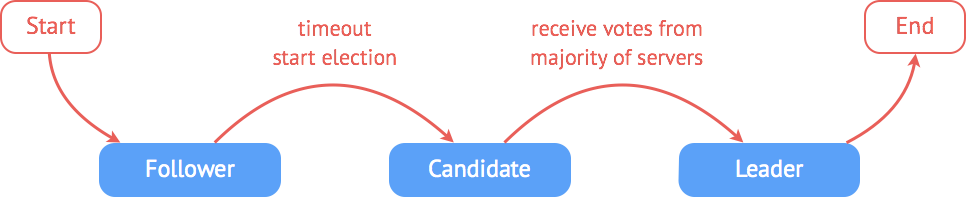

#### 选举

**一个`candidate`成为`leader`需要具备三个要素**

* 获得集群多数节点的同意
* 集群中不存在比自己`步进数更高`的candidate
* 集群中不存在`其他leader`

**一个`etcd`集群选举过程的简单描述**

* 初始状态下集群中的所有节点都处于`follower`状态

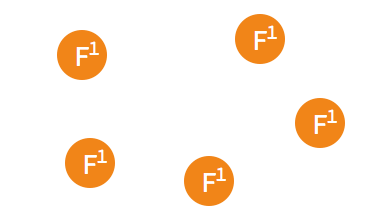

* 某一时刻,其中的一个`follower`由于没有收到`leader`的`heartbeat`率先发生`election timeout`进而发起选举

* 只要集群中超过半数的节点接受投票,`candidate`节点将成为即切换`leader`状态

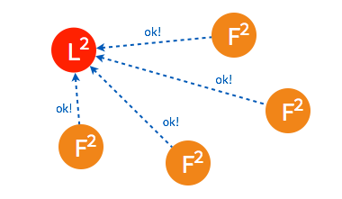

* 成为`leader`节点之后,`leader`将定时向`follower`节点同步日志并发送`heartbeat`.

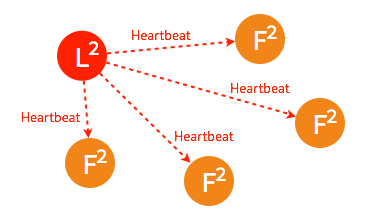

#### 节点异常

集群中各个节点的状态随时都有可能发生变化.从实际的变化上来分类的话,节点的异常大致可以分为四种类型:

* `leader`不可用
* `follower`不可用
* 多个`candidate`或多个`leader`
* 新节点加入集群

**`leader`不可用**

* 一般情况下,`leader`节点定时发送`heartbeat`到`follower`节点.

* 由于某些异常导致`leader`不再发送`heartbeat`,或`follower`无法收到`heartbeat`.

* 当某一`follower`发生`election timeout`时,其状态变更为`candidate`,并向其他`follower`发起投票.

* 当超过半数的`follower`接受投票后,这一节点将成为新的`leader`,`leader`的步进数加1并开始向`follower`同步日志.

* 当一段时间之后,如果之前的`leader`再次加入集群,则两个`leader` `比较彼此的步进数`,步进数低的`leader`将切换自己的状态为`follower`.

* 较早前`leader`中不一致的日志将被清除,并与现有`leader`中的日志保持一致.

**`follower`节点不可用**

`follower`节点不可用的情况相对容易解决.因为集群中的日志内容始终是从`leader`节点同步的,只要这一节点再次加入集群时重新从`leader`节点处复制日志即可.

* 集群中的某个`follower`节点发生异常,不再同步日志以及接收`heartbeat`.

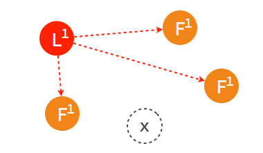

* 经过一段时间之后,原来的`follower`节点重新加入集群.

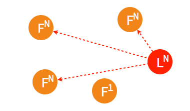

* 这一节点的日志将从当时的`leader`处同步.

**多个`candidate`或多个`leader`**

在集群中出现多个`candidate`或多个`leader`通常是由于数据传输不畅造成的.出现多个`leader`的情况相对少见,但多个 `candidate`比较容易出现在集群节点启动初期尚未选出`leader`的"混沌"时期.

* 初始状态下集群中的所有节点都处于`follower`状态.

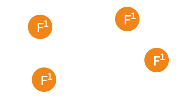

* 两个节点同时成为`candidate`发起选举.

* 两个`candidate`都只得到了少部分`follower`的接受投票.

* `candidate`继续向其他的`follower`询问.

* 由于一些`follower`已经投过票了,所以均返回拒绝接受.

* `candidate`也可能向一个`candidate`询问投票.

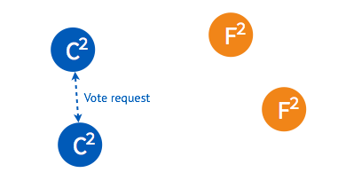

* 在步进数相同的情况下,`candidate`将拒绝接受另一个`candidate`的请求

* 由于第一次未选出`leader`,candidate将随机选择一个等待间隔(150ms ~ 300ms)再次发起投票

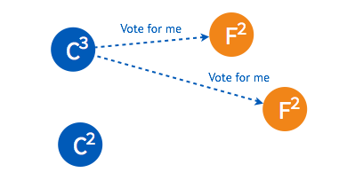

* 如果得到集群中半数以上的`follower`的接受,这一`candidate`将成为`leader`.

* 稍后另一个`candidate`也将再次发起投票.

* 由于集群中已经选出`leader`,`candidate`将收到拒绝接受的投票.

* 在被多数节点拒绝之后,并已知集群中已存在`leader`后,这一`candidate`节点将终止投票请求、切换为`follower`,从 `leader`节点同步日志.

#### 日志

**复制**

* 在`raft`集群中,所有日志都必须首先提交至`leader`节点.`leader`在每个`heartbeat`向`follower`同步日志,`follower`在收到日志之后向`leader`反馈结果,`leader`在确认日志内容正确之后将此条目提交并存储于本地磁盘.

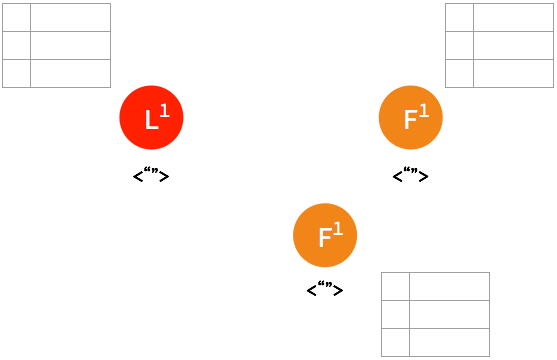

* 首先有一条`uncommitted`的日志条目提交至`leader`节点.

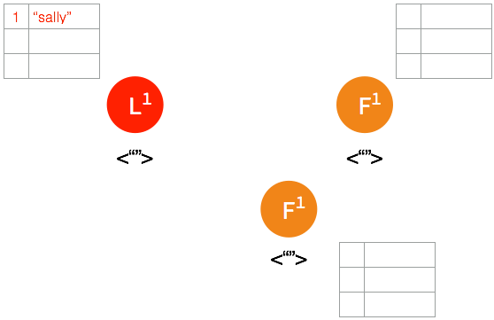

* 在下一个`heartbeat`,`leader`将此条目复制给所有的`follower`.

* 当大多数节点记录此条目之后,`leader`节点认定此条目有效,将此条目设定为已提交并存储于本地磁盘.

* 在下一个`heartbeat`,`leader`通知所有`follower`提交这一日志条目并存储于各自的磁盘内.

####容错

如果由于网络的隔断,成集群中多数的节点在一段时间内无法访问到`leader`节点.按照`raft`共识算法,没有`leader`的那一组集群将会通过选举投票出新的`leader`,甚至会在两个集群内产生不一致的日志条目.在集群重新完整连通之后,原来的 `leader`仍会按照`raft`共识算法从步进数更高的`leader`同步日志并将自己切换为`follower`.

* 集群的理想状态.

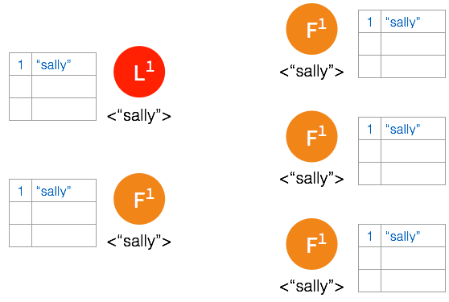

*  网络间隔造成大多数的节点无法访问 leader 节点.

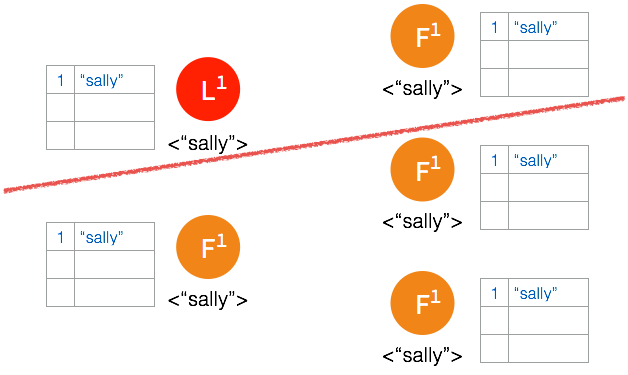

* 新的日志条目添加到`leader`中.

* `leader`节点将此条日志同步至能够访问到`leader`的节点.

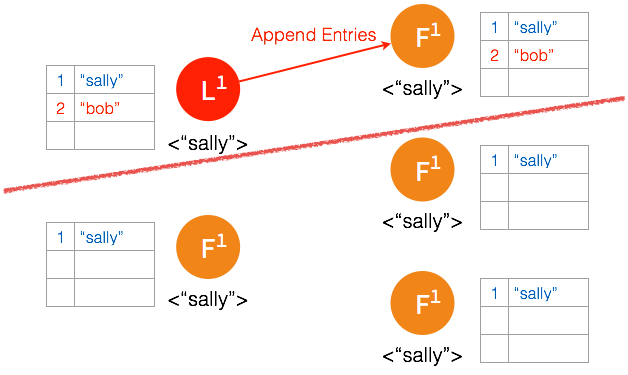

* `follower`确认日志被记录,但是确认记录日志的`follower`数量没有超过集群节点的半数,`leader`节点并不将此条日志存档.

* 在被隔断的这部分节点,在`election timeout`之后,`followers`中产生`candidate`并发起选举.

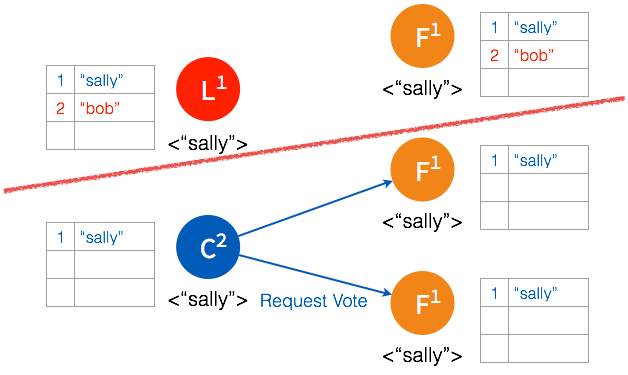

* 多数节点接受投票之后,`candidate`成为`leader`.

* 一个日志条目被添加到新的`leader`.

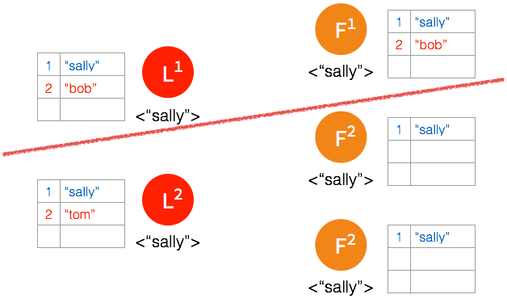

* 日志被复制给新`leader`的`follower`.

* 多数节点确认之后,`leader`将日志条目提交并存储.

* 在下一个`heartbeat`,`leader`通知`follower`各自提交并保存在本地磁盘.

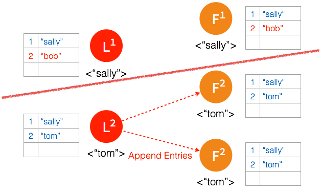

*  经过一段时间之后,集群重新连通到一起,集群中出现两个`leader`并且存在不一致的日志条目.

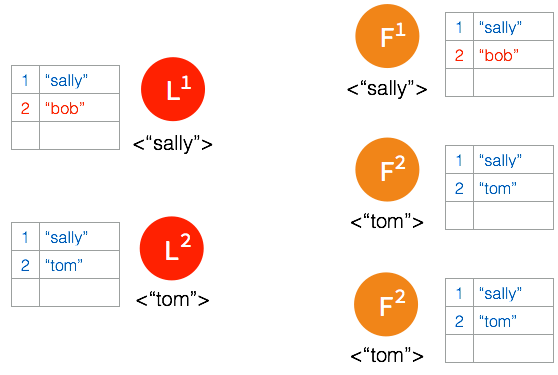

* 新的`leader`在下一次`heartbeat timeout`时向所有的节点发送一次`heartbeat`.

* `#1 leader`在收到步进数更高的`#2 leader heartbeat`时放弃`leader`地位并切换到`follower`状态.

* 节点中所有未存档的日志条目都将被丢弃

* 未被复制的日志条目将会被同步给所有的`follower`.

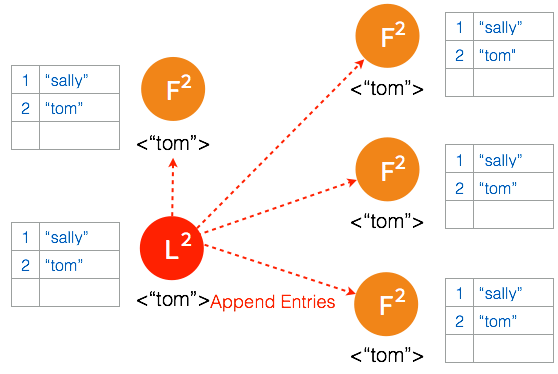

**总结**

通过这种方式,只要集群中有效连接的节点超过总数的一半,集群将一直以这种规则运行下去并始终确保各个节点中的数据始终一致.

####实现

**etcd结构**

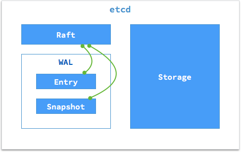

一个`etcd`节点的核心由三部分组成:

* `Raft`: `raft状态机`是对`raft共识算法`的实现.
* `WAL`: `raft`日志存储.
* `Storage`: 数据的存储与索引.

`WAL(Write-ahead logging)`,是用于向系统提供`原子性`和`持久性`的一系列技术.在使用`WAL`的系提供中,所有的修改在提交之前都要先写入`log`文件中.`etcd`的`WAL`由`日志存储`与`快照存储`两部分组成,其中`Entry`负责存储具体日志的内容,而`Snapshot`负责在日志内容发生变化的时候保存`raft`的状态.`WAL`会在本地磁盘的一个指定目录下分别日志条目与快照内容.

#### 服务

**Clients**

在默认设定下,`etcd`通过主机的`2379`端口向`Client`提供服务.如下图:

每个主机上的应用程序都可以通过主机的`2379`以`HTTP + JSON`的方式向`etcd`读写数据.写入的数据会由`etcd`同步到集群的其它节点中.

**Peers**

在默认设定下,`etcd`通过主机的`2380`端口在各个节点中同步`raft`状态及数据.

#### 创建

从方法上来划分,创建`etcd`集群的方式分为两种:

* `Static`:通过制定`peers`的IP与端口创建.
* `Discovery`:通过一个发现服务创建.

**Static**

`Static`方式需要预先知道集群所有节点的`IP`,所以适合小规模的集群或者搭建一个临时的开发与测试环境.

**Discovery**

`Discovery`方式不需要预先了解其他节点的`IP`.启动时`etcd`通过访问一个`Discovery URL`来注册自己并获取其他节点的信息.这种方式通常适合将`etcd`部署在某个云服务平台或是一个`DHCP`环境中.

