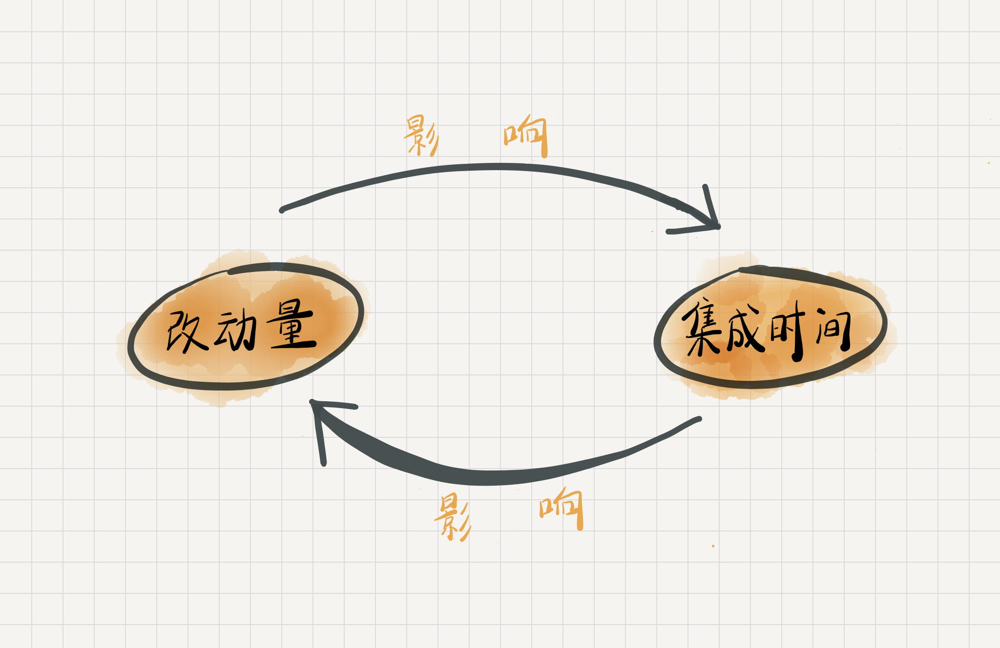

# 05 | 持续集成：集成本身就是写代码的一个环节

## 笔记

**写代码是程序员的职责, 但我们更有义务交付一个可运行的软件**

### 集成之"灾"

### 迈向持续集成

**Daily Build, 每日构建**即**每天集成一次**

持续集成的一个关键的思维破局是, 将原来分成两个阶段的开发与集成合二为一了, 也就是一边开发一边集成.

### "地面上"的持续集成

一个好的做法是尽早把代码和已有代码集成到一起, 而不应该等着所有代码都开发完了, 再去提交.

### 总结

**尽早提交代码去集成**

## 扩展