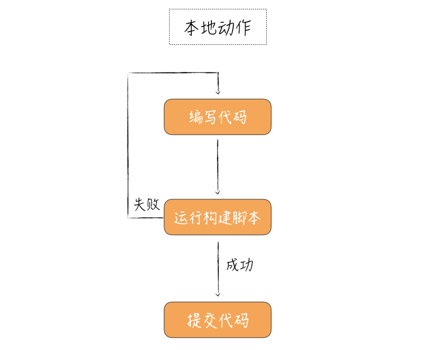
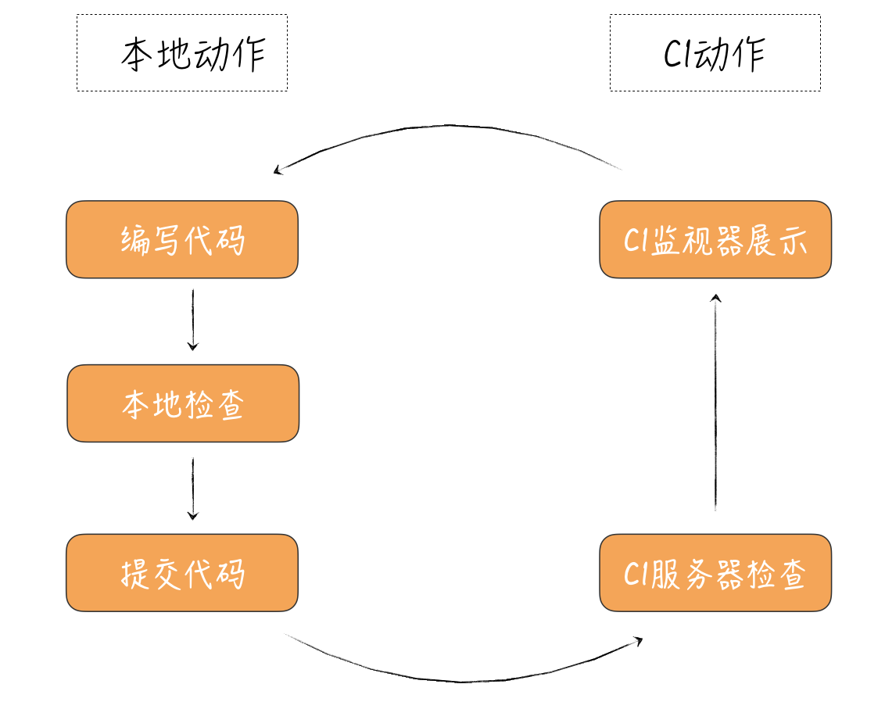

# 24 | 快速反馈：为什么你们公司总是做不好持续集成？

## 笔记

持续集成的诞生, 就是人们尝试缩短集成周期的结果. 为什么要缩短周期呢? 希望尽早得到反馈, 知道自己的工作结果是否有效.

**快速反馈**

两个重要目标:

* 怎样快速地得到反馈
* 什么样的反馈是有效的

### 快速得到反馈

**执行同样的操作, 本地环境会快于CI服务器环境**

CI服务器

本地环境

#### 提交纪律

**只有CI服务器处于绿色的状态才能提交代码**

#### 做好持续集成的关键点

用好本地构建脚本(build script), 保证各种各样的检查都可以在本地环境执行.

在本地执行**单元测试**和**集成测试**, 把更复杂的系统测试放到CI服务器上运行.

### 得到有效的反馈

**即时反馈**, 持续集成监视器.

**怎么引人注目, 怎么呈现**

**CI服务器一旦检查出错, 要立即修复**

## 总结

* 只有CI服务器处于绿色的状态才能提交代码
* CI服务器一旦检查出错, 要立即修复

做好持续集成的关键在于, **快速反馈**

## 扩展