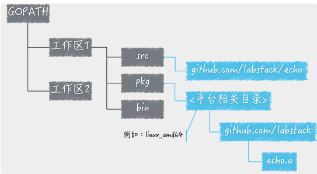

# 01-工作区和GOPATH

--

* `GOROOT`：Go 语言安装根目录的路径，也就是 GO 语言的安装路径。
* `GOPATH`：若干工作区目录的路径。是我们自己定义的工作空间。
* `GOBIN`：GO 程序生成的可执行文件（executable file）的路径。

`GOPATH`简单理解成 Go 语言的工作目录，它的值是一个目录的路径，也可以是多个目录路径，每个目录都代表 Go 语言的一个工作区（workspace）。

工作区，去放置 Go 语言的源码文件（source file），以及安装（install）后的归档文件（archive file，也就是以“.a”为扩展名的文件）和可执行文件（executable file）。执行go install，会将生成的可执行文件放入GOPATH/bin目录，还会将包文件编译后生成的文件放入`GOPATH/pkg`。

### 1. Go 语言源码的组织方式

一个代码包的导入路径实际上就是从`src`子目录，到该包的实际存储位置的相对路径。

