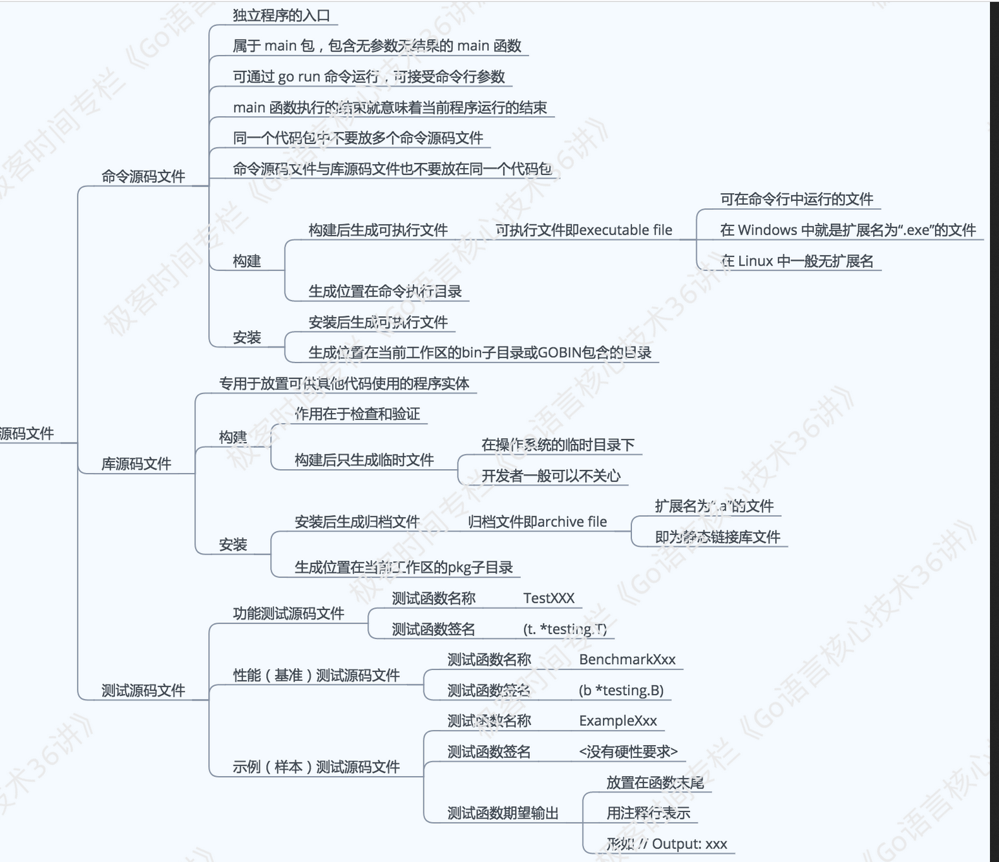

# 02-命令源码文件

---

### 命令源码文件

如果一个源码文件声明属于main包，并且包含一个无参数声明且无结果声明的main函数，那么它就是命令源码文件。

当需要模块化编程时，我们往往会将代码拆分到多个文件，甚至拆分到不同的代码包中。但无论怎样，对于一个独立的程序来说，命令源码文件永远只会也只能有一个。如果有与命令源码文件同包的源码文件，那么它们也应该声明属于main包。

`flag.Parse()`, 解析命令参数，并把他们的值赋给相应的变量。