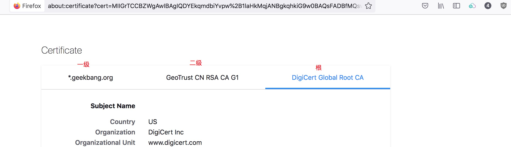

# README

## 第一章 初识Nginx

### NGINX 目录

* auto
	* cc: 编译
	* os: 操作系统判断
* conf, 示例配置文件
* contrib/vim, vim 配置文件
* html
	* 50x.html
	* index.html
* man, linux 帮助文件
* src, 源代码
* configure
	* --xx=PATH, 设定寻找目录
	* --with-xx, 使用哪些模块（默认不会编译进nginx）
	* --without-xx，不使用哪些模块（默认编译进nginx）
* objs, 编译时的中间文件
	* ngx_modules.c, 编译时模块
	* nginx, (make后生成的二进制文件)

### NGINX 常用信号

* TERM, INT: Quick shutdown
* QUIT: Graceful shutdown  平缓停止Nginx服务
* HUP: Configuration reload ,Start the new worker processes with a new configuration Gracefully shutdown the old worker processes. 改变配置文件,平滑的重读配置文件
* USR1: Reopen the log files 重读日志,在日志按月/日分割时有用
* USR2: Upgrade Executable on the fly 平滑的升级
* WINCH: Gracefully shutdown of worker processes 平缓停止worker进程，用于Nginx服务器平滑升级

```
nginx -g WINCH
```

### NGINX 静态资源

`$limit_rate ?`如`set $limit_rate 1k;`, 限制访问速率

`log_format`日志格式

### NGINX 缓存

* `proxy_cache_path`
	* 缓存路径
	* 命名

### 工具

`go access`查看`nginx`的`access`日志

### 证书

* DV: 域名验证
* OV: 组织验证, 申请证书验证组织机构
* EV: 扩展验证, 更严格的验证

NGINX向浏览器发送两个证书, 二级与一级证书。根证书操作系统内部自己验证。



### TLS通讯过程

1. 验证身份
2. 达成安全套件共识
3. 传递密钥
4. 加密通讯

## 第二章 Nginx架构基础

### Nginx的请求处理流程

worker进程数量需要与CPU核数匹配

### Nginx的进程结构

* 单进程结构: 调试
* 多进程结构
	* 父进程: master-process，worker进程管理
	* 子进程
		* cache, 缓存在多个worker进程之间共享
			* cache manager 进程
			* cache loader 进程
		* worker, 处理真正请求，多个worker进程，希望每个worker进程占有一个CPU,

worker进程数与CPU核心数匹配，并且绑定CPU, 可以最大限度防止缓存失效。

进程间通信使用共享内存管理。

为什么多进程结构, 需要高性能，高可靠性。因为线程之间共享同一个地址空间，一个线程段错误，整个进程挂掉。

### Nginx reload 流程

1. 向`master`进程发送`HUP`信号(`reload`命令)
2. `master`进程校验配置语法是否正确
3. `master`进程打开新的监听端口(可能会打开新的端口，子进程会集成父进程端口)
4. `master`进程用新配置启动新的`worker`子进程
5. `master`进程向老`worker`子进程发送`QUIT`信号
6. 老`worker`进程关闭监听句柄，处理完当前连接后结束进程

### Nginx 热升级流程

1. 将旧`Nginx`文件换成新`Nginx`文件（注意备份）
2. 向`master`进程发送`USR2`信号
3. `master`进程修改`pid`文件名，加后缀`.oldbin`
4. `master`进程用新`Nginx`文件启动新`master`进程
5. 向老`master`进程发送`QUIT`信号，关闭老`master`进程
6. 回滚: 向老`master`发送`HUP`, 向新`master`发送`QUIT`

### `worker`进程：优雅的关闭

1. 设置定时器`worker_shutdown_timeout`
2. 关闭监听句柄
3. 关闭空闲连接
4. 在循环中等待全部连接关闭, 超过`worker_shutdown_timeout`则强制关闭
5. 退出进程

### Nginx 一线程同时处理多连接

* 用户态代码完成连接切换
* 建立减少OS进程切换

### Nginx模块

`nginx`编译后模块可通过在`objs/ngx_modules.c`中检查是否编译某个模块。

### Nginx模块的分类

* `NGX_CORE_MODULE`: 核心模块, 也会衍生定义子类型模块
* `NGX_CONF_MODULE`: 解析配置文件
* `NGX_EVENT_MODULE`: 事件模块

### Nginx 连接池

### Nginx 内存池

内存池会提前分配内存，产生内存碎片小。

链接内存，保存上下文少。`connection_pool_size`

对于请求内存，保存上下文较多。`request_pool_size`

### Nginx 进程间的通信方式

* 基础同步工具
	* 信号
	* 共享内存
* 高级通讯方式
	* 锁，多个内存共同操作一个内存，旧的操作系统使用信号量，目前操作系统使用自旋锁。使用自旋锁，要求`nginx`的`worker`必须快速使用内存。
	* Slab内存管理器

### slab 内存管理

### Nginx 容器

*  数组
	* 多块连续内存
* 链表
* 队列
* 哈希表
	* 静态不变的内容，`Nginx`刚启动就能确定内容
	* `bucket size`需要考虑`CPU`的`cache line`的大小，要保证对齐
		* CPU不再是按字节访问内存，而是以64字节为单位的块(chunk)拿取，称为一个缓存行(`cache line`)
* 红黑树
	* 便于查找
	* 高度差不会太大
* 基数树

### Nginx 动态模块

通过`configure`查看，如果模块`--with-*=dynamic`代表可以支持动态模块, 在配置文件中使用`load_module`动态加载该模块。

## 第三章 详解HTTP模块

* 合并
	* 值指令: 存储配置项的值
		* 子配置不存在时，直接使用父配置块
		* 子配置存在时，直接覆盖父配置块
* 不能合并
	* 动作类指令: 指定行文

### HTTP请求头部的流程

*  接收`URI`
	* 分配请求内存池`request_pool_size: 4k`, 如果超过`4k`会扩充
	* 状态机解析请求行
	* 分配大内存`large_client_header_buffers:4 8k`
	* 状态机解析请求行
	* 标识URI
* 接收`header`
	* 状态机解析`header`
	* 分配大内存`large_client_header_buffers:4 8k`
		* `4 8k`代表先分配一个`8k`, 不够在分配一个`8k`
	* 标识`header`
	* 移除超时定时器`cleint_header_timeout: 60s`
	* 开始11个阶段的`http`请求处理

#### `request_pool_size`

nginx在接收到每个http请求时，都会为其申请一个内存池，该参数指定了该内存池的大小，需要注意的是，该内存池本质上就是从`connection_pool_size`内存池中进行申请

* `connection_pool_size`是 nginx 框架和客户端建立了连接时就产生的
* 当客户端有数据请求发来时，这时候是`request_pool_size 4k`的空间里，开始分配出具体的 `client_header_buffer_size 1k`
* 如果客户端的请求头部太长、超过了 4k ，这时候`large_client_header_buffers 4 8k`会其作用

#### `large_client_header_buffers`
# 
`client_header_buffer_size`, 该参数指定了用户请求的http头部的size大小，如果请求头部大小超过了该数值，那么就会将请求就会交由large_client_header_buffers参数定义的buffer处理。

### 正在额表达式

工具`pcretest`验证正则表达式

`$0`标识`url`本身

### 如何找到处理请求的`server`指令

`server`匹配顺序

1. 精确匹配
2. `*`在前的泛域名
3. `*`在后的泛域名
4. 按文件中的顺序匹配正则表达式域名
5. `default server`
	* 第一个
	* `linsten`指定`default`

**`server_name_in_redirect`**

If server_name_in_redirect is on, then Nginx will use the first value
of the server_name directive for redirects. If server_name_in_redirect
is off, then nginx will use the requested Host header.

### HTTP请求的11个阶段

* POST_READ
	* 读取请求头部之后, `realip`模块
* SERVER_REWRITE
	* `rewrite`模块
* FIND_CONFIG
	* `location`匹配
* REWRITE
* POST_REWRITE
* PREACCESS
	* 限流`limit_conn`,`limit_req`模块
* ACCESS
	* 用户能否访问`auth_basic`,`access`,`auth_request`模块
* POST_ACCESS
* PRECONTENT
	* `try_files`
* CONTENT
	* `index`,`autoindex`,`concat`
* LOG
	* `access_log`

#### `realip`模块

属于`postread`阶段

启用`real_ip_recursive on`后，是` X-Forward-For `从右边开始数，第一个非可信地址的IP.

`set_real_ip_from`设置可信`ip`.

#### `rewrite`模块的`return`指令

属于`rewrite`阶段

* `return`指令
* `error_page`

#### `rewrite`模块的`rewrite`指令

修改用户传入的`url`

`rewrite_log`，默认没有开启，会在`rewrite_error.log`中记录重写`url`的日志.

#### `rewrite`模块的`if`指令
