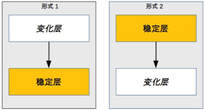
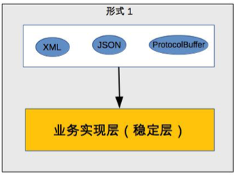

# 06 | 复杂度来源：可扩展性

## 笔记

### 可扩展性

是指系统为了**应对将来需求变化**而提供的一种扩展能力.

当有新的需求出现时, 系统不需要或者仅需要少量修改旧可以支持, 无须整个系统重构或者重建.

面向对象 -> 设计模式.

#### 良好的可扩展性

* 正确预测变化
* 完美封装变化

### 正确预测变化

软件: 不断有新的需求需要实现.

#### 预测变化的复杂性

* 不能**每个设计点**都考虑可扩展性.
* 不能**完全不考虑**可扩展性.
* 所有的预测都**存在出错的可能性**.

只能靠经验把我预测的程度和提升预测结果的准确性.

### 完美封装变化(应对变化)

预测变化正确, 还要看**应对变化**的能力.

将"变化"封装在一个"变化层", 将不变的部分封装在一个独立的"稳定层".

应对形式1:

应对形式2:

#### 产生的问题

##### 系统需要拆分出变化层和稳定层

**变化层和稳定层的区分**不明确, 认证见仁智者见智.

##### 需要设计变化层和稳定层之间的接口

提炼出一个**抽象层**和一个**实现层**.

参见**设计模式**.

## 扩展