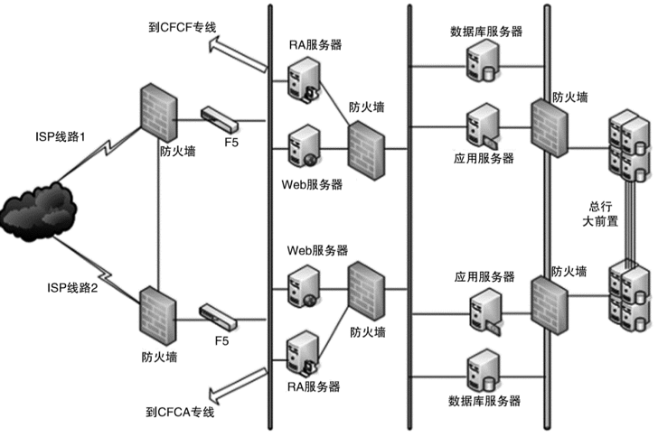
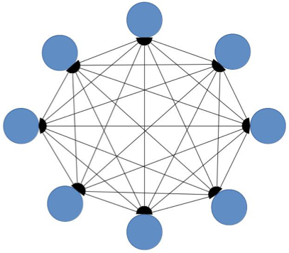

# 07 | 复杂度来源：低成本、安全、规模 

## 笔记

### 低成本

增加服务器满足**高性能**和**高可用**.

需要减少服务器的数量才能达成**低成本**的目标.

低成本本质上是与高新能和高可用冲突的, 低成本是**架构设计的附加约束**.

### 安全

#### 功能安全

防小偷.

功能安全更多地是和具体的编码相关.

#### 架构上的安全

防强盗. 防止故意破坏.

##### 防火墙

通过防火墙将网络划分成不同的区域, 制定出不同区域之间的**访问控制策略**来控制不同信任程度区域间传送的数据流.

### 规模

规模带来复杂度的主要原因就是**量变引起质变**.

#### `功能`越来越多, 导致系统复杂度指数级上升

3个功能的复杂度

8个功能的复杂度

#### `数据`越来越多, 导致系统复杂度指数级上升

如`MySQL`单表数据过多, 需要拆分表, 导致业务处理复杂度提升.

## 扩展