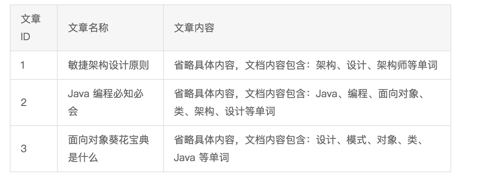
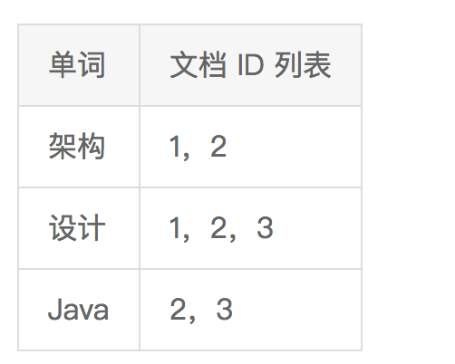

# 16 | 高性能NoSQL

## 笔记

NoSQL = Not Only SQL

### NoSQL 分类

* `K-V`存储
	* 解决关系数据库无法存储数据结构的问题`Redis`
* 文档数据库
	* 解决关系数据库强`schema`约束的问题`MongoDB`
* 列式数据库
	* 解决大数据场景下的`I/O`问题`HBase`
* 全文搜索引擎
	* 解决关系数据库的全文搜索性能问题, `ES`

#### K-V 存储

`Redis`的事务只能保证**隔离性**和**一致性**(`I`和`C`). 无法保证**原子性**和**持久性**.

#### 文档数据库

最大特点是`no-schema`, 可以存储和读取任意的数据.

很容易存储复杂数据.

不支持事务.

#### 列式数据库

使用场景:

```
统计某个城市体重超重人员数据, 实际上只需要读取每个人的体重这一列并进行统计即可. 而行式存储即使最终只有一列, 也会将所有行数据都读取处理.如果单行用户信息有 1KB, 其中体重只有 4 个字节, 行式存储还是会将整行 1KB 数据全部读取到内存中, 这是明显的浪费. 而如果采用列式存储, 每个用户只需要读取 4 字节的体重数据即可, I/O 将大大减少.
```

高压缩比: 单个列的数据相似度比行来说更高,能够达到更高的压缩率.

一般用于离线的大数据分析和统计, 因为这种场景主要是针对部分单例进行操作, 且数据写入后就无须再更新删除.

#### 全文搜索引擎

关系型数据库实现全文搜索的缺点:

* 全文搜索条件可以随意排列组合, 如果通过索引来满足, 则索引的数量会非常多
* 全文搜索的模糊匹配模式, 索引无法满足,只能用`like`查询, 而`like`查询是整表扫描, 效率非常低.

##### 全文搜索基本原理

**倒排索引(Inverted index)**, 基本原理是建立单词到文档的索引.

**正排索引**建立文档那个到单词的索引.

正排索引示例:



倒排索引示例:



#### 全文搜索引擎 和 关系数据库

全文搜索引擎的索引对像是单词和文档.

关系数据库的索引对象是键和行.

## 扩展