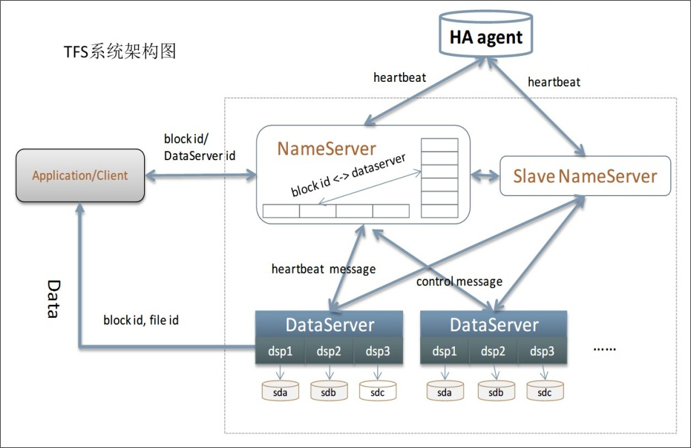

# 40 | 互联网架构模板：“存储层”技术

## 笔记

### SQL

**NoSQL是SQL的补充**

数据库拆分的复杂度:

* 数据如何拆分
* 数据如何组合

业务发展到一定阶段后, 将这部分功能独立成**中间件**.

后续独立部署自己的`SQL`集群.

### NoSQL

* Memcached: `key-value`
* Redis: 复杂数据结构
* MongoDB: 文档数据结构

`NoSQL`几区的基础之上实现统一**存储平台**

* 资源按需动态分配
	* 根据利用率动态分配给多个业务使用
* 资源自动化管理
	* 只需申请空间, 无须关心哪台服务器提供服务
* 故障自动化管理
	* 主备自动切换

**集群数量大才会有收益**

### 小文件存储

* HBase
* Hadoop
* Hypertable
* FastDFS

淘宝`TFS`

### 大文件存储

* 业务数据
	* 视频
* 日志数据

开源方案

* Hadoop
* HBase
* Storm
* Hive

`Hadoop`生态圈

## 扩展