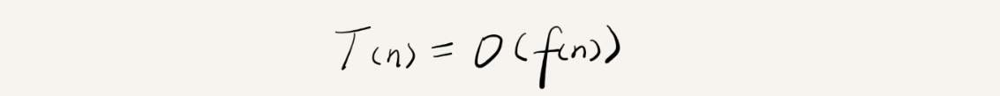
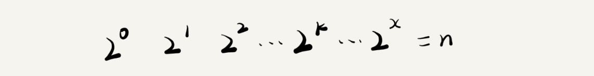
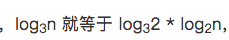
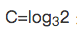
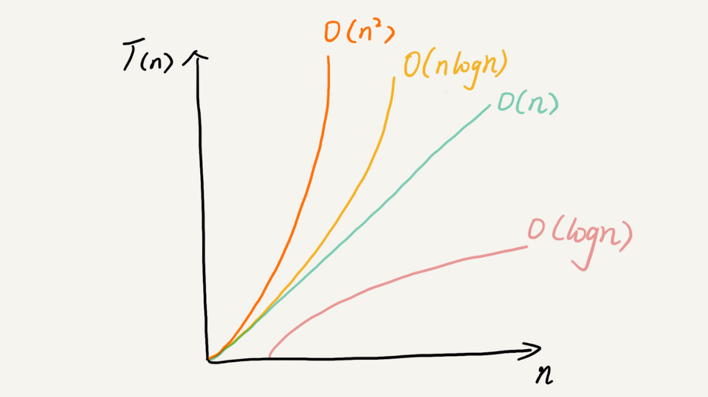

# 03 | 复杂度分析（上）：如何分析、统计算法的执行效率和资源消耗？

## 笔记

### 为什么需要复杂度分析?

#### 事后统计法

把代码跑一遍, 通过统计, 监控, 就能得到算法执行的时间和占用的内存大小.

局限性:

1. 测试结果非常依赖测试环境. 测试环境中的硬件的不同会对测试结果有很大的影响(比如, 不同性能的处理器).
2. 测试结果受数据规模的影响很大. **所以我们需要一个不用具体的测试数据来测试, 就可以粗略地估计算法的执行效率的方法**.

### 大 O 复杂度表示法

```
# 求 1,2,3...n 的累加和

1 int cal(int n) {
2   int sum = 0;
3   int i = 1;
4   for (; i <= n; ++i) {
5     sum = sum + i;
6   }
7   return sum;
8 }
```

从`CPU`的角度来看, 这段代码的每一行都执行者类似的操作: **读数据-运算-写数据**.

* 假设每行代码执行的时间都一样, 为`unit_time`.
* 第`2,3`行代码分别需要`1`个`unit_time`的执行时间.
* 第`4,5`行都运行了`n`遍, 所以需要`2n*unit_time`的执行时间.

所以这段代码的执行时间就是`(2n+2)*unit_time`. 可以看出， **所有代码的执行时间T(n)与每行代码的执行次数成正比**.

```
1 int cal(int n) {
2   int sum = 0;
3   int i = 1;
4   int j = 1;
5   for (; i <= n; ++i) {
6     j = 1;
7     for (; j <= n; ++j) {
8       sum = sum +  i * j;
9     }
10   }
11 }
```

* `2,3,4`行需要`1`个`unit_time`
* `5,6`代码需要执行`n`遍, 需要`2n*unit_time`
* `7,8`行代码循环执行了`n^2`遍, 所以需要`2n^2*unit_time`的执行时间

`T(n) = (2n^2+2n+3)*unit_time`

**所有代码的执行时间T(n)与每行代码的执行次数 n 成正比**

**公示**



* `T(n)`, 表示代码执行的时间.
* `n`, 表示数据规模的大小.
* `f(n)`, 表示没醒代码执行的次数综合, 这是一个公示, 所以用`f(n)`来表示.
* `O`, 表示代码的执行时间`T(n)`与`f(n)`表达式成正比.

第一个例子`T(n) = O(2n+2)`, 第2个例子`T(n) = O(2n^2 + 2n +3)`. **这就是大O时间复杂度表示法**. 大O时间复杂度实际上并不具体表示代码真正的执行时间, 而是表示**代码执行时间随数据规模增长的变化趋势**(注意这里是**趋势**). 也叫做**渐进时间复杂度**(asymptotic time complexity), 简称**时间复杂度**.

**算法**

当`n`很大时. 而**公式中的低阶, 常量, 系数三部分并不左右增长趋势, 所以都可以忽略. 我们只需要记录一个最大量级就可以了.**

上面两个例子可以记为`T(n) = O(n)`, `T(n) = O(n^2)`.

### 时间复杂度分析

#### 1. 只关注循环执行次数最多的一段代码

大`O`表示一种变化趋势. 通常会忽略掉公式中的常量, 低阶, 系数只需记录一个最大阶的量级.

**我们在分析一个算法, 一段代码的时间复杂度的时候, 也只关注循环执行次数最多的那一行代码就可以了**.

```
# 求 1,2,3...n 的累加和

1 int cal(int n) {
2   int sum = 0;
3   int i = 1;
4   for (; i <= n; ++i) {
5     sum = sum + i;
6   }
7   return sum;
8 }
```

* `2,3`行代码都是常量级的执行时间, 与`n`大小无关, 对于复杂度没有影响.
* `4,5`是执行次数最多的行, 这里代码要重点处理. 这两行代码被执行了`n`次, 所以总的时间复杂度就是`O(n)`

#### 2. 加法法则: 总副再度等于量级最大的那段代码的复杂度

```
int cal(int n) {
   int sum_1 = 0;
   int p = 1;
   for (; p < 100; ++p) {
     sum_1 = sum_1 + p;
   }

   int sum_2 = 0;
   int q = 1;
   for (; q < n; ++q) {
     sum_2 = sum_2 + q;
   }
 
   int sum_3 = 0;
   int i = 1;
   int j = 1;
   for (; i <= n; ++i) {
     j = 1; 
     for (; j <= n; ++j) {
       sum_3 = sum_3 +  i * j;
     }
   }
 
   return sum_1 + sum_2 + sum_3;
 }
```

* `sum_1`执行了`100`次, 是一个常量的执行时间, 跟`n`无关. 只要是一个已知的数, 当`n`无限大的时候, 就可以忽略. 尽快对代码的执行时间会有很大影响, 但是对于**时间复杂度**概念, 表示的是一个**算法执行效率与数据规模增长的变化趋势**, 所以不管常量的执行时间多大, 我们都可以忽略掉. 因为它本身对增长趋势并没有影响.
* `sum_2`是`O(n)`
* `sum_3`是`O(n^2)`

这三段代码, 我们**取其中最大的量级**. 所以整段代码的时间复杂度就为`O(n^2)`.

**总的时间复杂度就等于量级最大的那段代码的时间复杂度**

```
如果 T1(n)=O(f(n))，T2(n)=O(g(n))；
那么 T(n)=T1(n)+T2(n)=max(O(f(n)), O(g(n)))=O(max(f(n), g(n)))
```

#### 3. 乘法法则: 嵌套代码的复杂度等于嵌套内外代码复杂度的乘积

```
如果 T1(n)=O(f(n))，T2(n)=O(g(n));
那么 T(n)=T1(n)*T2(n)=O(f(n))*O(g(n))=O(f(n)*g(n))
```

假如

```
T1(n) = O(n)，T2(n) = O(n2)
T1(n) * T2(n) = O(n3)
```

乘法可以看做**嵌套循环**.

```
int cal(int n) {
   int ret = 0; 
   int i = 1;
   for (; i < n; ++i) {
     ret = ret + f(i); //这里调用了 f() 函数
   } 
 } 
 
 int f(int n) {
  int sum = 0;
  int i = 1;
  for (; i < n; ++i) {
    sum = sum + i;
  } 
  return sum;
 }
```

* `cal()`函数, 复杂度`T1(n) = O(n)`,
* `f()`, 复杂度`T2(n) = O(n)`,

所以整个`cal()`函数的时间复杂度就是`T(n) = T1(n) * T2(n) = O(n*n) = O(n2)`.

### 集中常见时间复杂度实例分析


分为: **多项式量级**和**非多项式量级**. 其中非多项式量级只有两个`O(2^n)`和`O(n!)`,

把时间复杂度为非多项式量级的算法叫做**NP(Non-Deterministic Polynomial 非确定多项式)**问题.

当数据规模`n`越来越大时, 非多项式量级算法的执行时间会急剧增加, 求解问题的执行时间会无限增长. 所以, **非多项式时间复杂度的算法其实是非常低效的算法**.

### 非多项式时间复杂度

#### 1. O(1)

O(1)是量级的表示, **不是指只执行了一行代码**. 

```
 int i = 8;
 int j = 6;
 int sum = i + j;
```

复杂度是**O(1)**不是**O(3)**.

**只要代码的执行时间不随`n`的增大而增长, 这样代码的时间复杂度我们都记做O(1)**, 只要算法中不存在循环, 递归, 即使有成千上万行大妈, 其时间复杂度也是O(1).

#### 2. O(logn), O(nlogn)

```
 i=1;
 while (i <= n)  {
   i = i * 2;
 }
```

第三行代码是循环执行次数最多的. 只要能计算出这行代码被执行了多少次, 就能知道整段代码的时间复杂度.

变量`i`从`1`喀什, 每循环一次就乘以`2`. 当大于`n`时, 循环结束.



`x`为代码执行的次数. 通过`2^x=n`求解`x`, 即`x=log2n`. 这段代码的复杂度是`O(log2n)`.

```
 i=1;
 while (i <= n)  {
   i = i * 3;
 }
```

这段代码的复杂度是`O(log3n)`.

**对数之间可以互相转换**,, 所以O(log3n) = O(C * log2n), 其中是一个常量. 忽略系数, 即O(Cf(n)) = O(f(n)). 所以, `O(log2n)`等于`O(log3n)`.

在对数阶副再度的表示方法里, 忽略对数的"底", 统一表示为`O(logn)`

`O(nlogn)`: 如果一段代码的复杂度是`O(logn)`, 循环执行`n`遍, 时间复杂度就是`O(nlogn)`.

#### 3. O(m+n), O(m*n)

复杂度由两个数据的规模来表示.

```
int cal(int m, int n) {
  int sum_1 = 0;
  int i = 1;
  for (; i < m; ++i) {
    sum_1 = sum_1 + i;
  }

  int sum_2 = 0;
  int j = 1;
  for (; j < n; ++j) {
    sum_2 = sum_2 + j;
  }

  return sum_1 + sum_2;
}
```

`m`和`n`是两个数据规模, **无法事先评估 m 和 n 谁的量级大**, 所以上面代码的时间复杂度就是`O(m+n)`.

加法规则为: `T1(m) + T2(n) = O(f(m) + g(n))`
乘法规则依然有效.

### 空间复杂度分析

时间复杂度的全称是**渐进时间复杂度, 表示算法的执行时间与数据规模之间的增长关系**.

空间复杂度全称就是**渐进空间复杂度(asymptotic space complexity), 表示算法的存储空间与数据规模之间的增长关系**.

```
1 void print(int n) {
2  int i = 0;
3  int[] a = new int[n];
4  for (i; i <n; ++i) {
5    a[i] = i * i;
6  }
7
8  for (i = n-1; i >= 0; --i) {
9    print out a[i]
10  }
11 }
```

* 第`2`行代码申请了一个空间存储变量`i`, 它是常量阶, 跟数据规模`n`没有关系. **忽略**
* 第`2`行代码申请了一个大小为`n`的`int`类型数组, 除此之外, 剩下的代码都没有占用更多空间, 所以整段代码的空间复杂度就是`O(n)`.

常见的空间复杂度就是 O(1)、O(n)、O(n^2).

### 总结



## 扩展