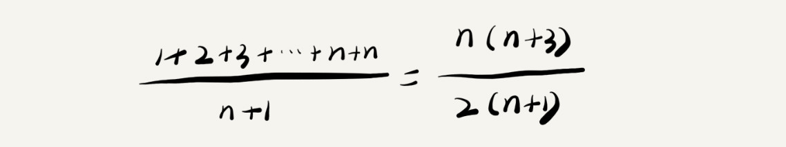
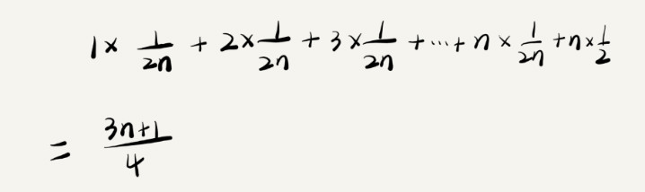
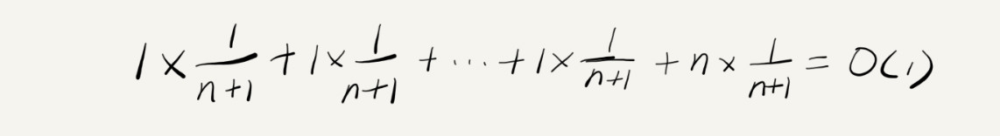

# 04 | 复杂度分析（下）：浅析最好、最坏、平均、均摊时间复杂度

## 笔记

### 知识点

* 最好情况时间复杂度(`best case time complexity`)
* 最坏情况时间复杂度(`worst case time complexity`)
* 平均情况时间复杂度(`average case time complexity`)
* 均摊时间复杂度(`amortized time complexity`)

### 最好, 最坏情况时间复杂度

```
// n表示数组array的长度
int find(int[] array, int n, int x) {
  int i = 0;
  int pos = -1;
  for (; i < n; ++i) {
    if (array[i] == x) pos = i;
  }
  return pos;
}
```

在一个无序的数组(`array`)中, 查找变量`x`出现的位置. 如果没有找到, 就返回`-1`.
代码的复杂度是`O(n)`, `n`代表数组的长度.

并不需要每次都把整个数组都遍历一遍, 有可能中途找到就结束循环了. 优化后的代码:

```
// n表示数组array的长度
int find(int[] array, int n, int x) {
  int i = 0;
  int pos = -1;
  for (; i < n; ++i) {
    if (array[i] == x) {
       pos = i;
       break;
    }
  }
  return pos;
}
```

要查找的变量`x`可能出现在数组的任意位置. 

* 如果数组中第一个元素正好是要查找的变量`x`, 就不需要继续遍历后面的`n-1`个数据了, 时间复杂度就是`O(1)`.
* 如果数组中不存在变量`x`, 就需要把整个数组都遍历一遍, 时间复杂度就成了`O(n)`.

**定义**:

* 最好情况时间复杂度就是, 在最理想的情况下, 执行这段代码的时间复杂度. 要查找的变量`x`正好是数组的第一个元素.
* 最坏情况时间复杂度就是, 在最糟糕的情况下, 执行这段代码的时间复杂度. 没有找到变量`x`, 需要把整个数组都遍历一遍

### 平均情况时间复杂度

最好和最坏都对应的是**极端情况下**的代码复杂度.

要查找的变量`x`在数组中的位置, 有`n+1`种情况:

* 在数组的`0 ~ n-1`位置中
* 不在数组中

把每种情况下, 查找需要遍历的元素个数累加起来, 然后再除以`n+1`, 就可以得到需要遍历的元素个数的平均值, 即



```
# 解释下这个公示

1 + 2 + 3 + ... + n + n, 这里有2个n. 因为第一个n代表在n上找见元素了, 第二个n代表遍历了全部元素, 还是没有找见

为什么 n(n+3)/2(n+1)

1+2+3+ ... + n = n(n+1)/2, 这里可以这样对应:

1 +  2  +  3  ... +  n 
n + n-1 + n-2 + ... + 1

有n个n+1, 然后除以2

所以推到公式等于 
(n(n+1)/2 + n) / (n + 1)
((n^2 + n + 2n)/2) / (n + 1)
((n^2 + 3n)/2) / (n + 1)
(n(n+3)/2) / (n + 1)
n(n+3)/2(n+1)
```

公示简化之后得到的平均时间复杂度是`O(n)`.

计算过程添加概率统计:

* 假设在数组中与不在数组中的概率都为1/2
* 要查找的数据出现在`0 ~ n-1`在这`n`个位置的概率也是一样的, 为`1/n`. 

所以, 根据概率乘法法则, 要查找的数据出现在`0 ~ n-1`中任意位置的概率就是`1/(2n)`了.

把每种概率发生的情况也算进去.



```
# 解释公示

1+2+3+ ... + n = n(n+1)/2
(1+2+3+ ... + n) * 1/2n = (n(n+1)/2) * (1/2n)
(1+2+3+ ... + n) * 1/2n = (n+1)/4
(1+2+3+ ... + n) * 1/2n + n*1/2 = (n+1)/4 + n*1/2
(1+2+3+ ... + n) * 1/2n + n*1/2 = (3n+1)/4
```

这个值就是概率论中的**加权平均值**, 也叫做**期望值**, 所以平均时间复杂度的全称应该叫做**加权平均时间复杂度**或者**期望时间复杂度**.

`(3n+1)/4`, 这段代码的加权平均时间复杂度仍然是`O(n)`.

很多时候, 我们使用一个复杂度就可以满足需求了. 只有一块代码在不同的情况下, 时间复杂度有量级的差距, 我们才会使用这三种复杂度表示法来区分.

### 均摊时间复杂度

```
 // array表示一个长度为n的数组
 // 代码中的array.length就等于n
 int[] array = new int[n];
 int count = 0;
 
 void insert(int val) {
    if (count == array.length) {
       int sum = 0;
       for (int i = 0; i < array.length; ++i) {
          sum = sum + array[i];
       }
       array[0] = sum;
       count = 1;
    }

    array[count] = val;
    ++count;
 }
```

这段代码实现了一个往数组中插入数据的功能.

* 当数组满了之后, 代码中`count == array.length`, 我们用`for`循环遍历数组求和, 并清空数组, 将求和之后的`sum`值放到数组的第一个位置, 然后再将新的数据插入.
* 如果数组一开始就有空闲空间, 则直接将数据插入数组.

用三种时间复杂度的分析方法分析一下:

最理想清空, 数组中有空闲空间, 只需要将数据插入到数组下标为`count`的位置就可以了, 最好情况时间复杂度为`O(1)`. 最坏情况没有空间了, 需要先做一次数组的遍历求和, 然后再将数据插入, 最坏情况的时间复杂度为`O(n)`.

**平均时间复杂度是O(1)**.

假设数组的长度是`n`, 根据数据插入的位置的不同, 可以分为`n`种情况, 每种情况的时间复杂度是`O(1)`. 还有一种"额外"的情况, 在数组没有空闲空间时插入一个数据. 这个时候的时间复杂度是`O(n)`. 这`n+`种情况发生的概率一样, 都是`1/(n+1)`. 加权平均计算:



对比下`insert()`和`find()`函数.

* 第一
	* `find()`在极端情况下, 复杂度才为`O(1)`.
	* `insert()`在大部分情况下, 复杂度都为`O(1)`, 只有个别情况下, 复杂度才比较高.
* 第二
	* `insert()`,`O(1)`时间复杂度的插入和`O(n)`时间复杂度的插入是有规律的, 有前后时序的. 一般都是一个`O(n)`插入之后, 紧跟着`n-1`个`O(1)`的插入操作, 循环往复. **针对这样一种特殊场景的复杂度分析**, 并**不需要**像之前讲平均复杂度分析方法那样, 找出所有的输入情况及相应的发生概率, 然后再计算加权平均值.

**针对这种特殊场景**, 引入一种更加简单的分析方法**摊还分析法**, 通过**摊还分析法**得到的时间复杂度叫**均摊时间复杂度**.

每一次`O(n)`的插入操作, 都会跟着`n-1`次`O(1)`的插入操作, 所以把耗时多的那次操作均摊到接下来的`n-1`次耗时少的操作上, 均摊下来, 这一组连续的操作的均摊时间复杂度就是`O(1)`. 这就是均摊分析的大致思路. 将较高时间复杂度那次操作的耗时, 平摊到其他那些时间复杂度比较低的操作上. 而且, 在能够应用均摊时间复杂度分析的场合, 一般均摊时间复杂度就等于最好情况时间复杂度.

### 练习

`add()`函数的复杂度

```
// 全局变量，大小为10的数组array，长度len，下标i。
int array[] = new int[10]; 
int len = 10;
int i = 0;

// 往数组中添加一个元素
void add(int element) {
   if (i >= len) { // 数组空间不够了
     // 重新申请一个2倍大小的数组空间
     int new_array[] = new int[len*2];
     // 把原来array数组中的数据依次copy到new_array
     for (int j = 0; j < len; ++j) {
       new_array[j] = array[j];
     }
     // new_array复制给array，array现在大小就是2倍len了
     array = new_array;
     len = 2 * len;
   }
   // 将element放到下标为i的位置，下标i加一
   array[i] = element;
   ++i;
}
```

均摊下来是`O(1)`.

## 扩展