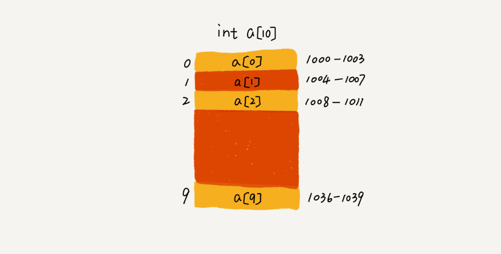
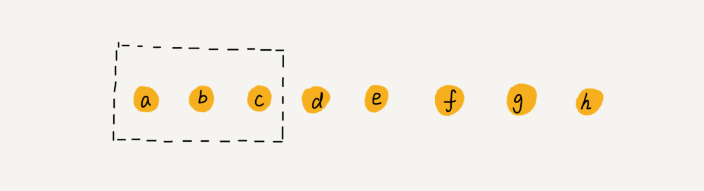

# 05 | 数组：为什么很多编程语言中数组都从0开始编号？

## 笔记

### 如何实现随机访问(任意访问)

**数组(Array)是一种线性表数据结构. 它用一组连续的内存空间, 来存储一组就要有相同类型的数据.**

#### 数组特性一: 线性表

**线性表**, 就是数据排成像一条线一样的机构. 每个线性表上的数据最多只有前和后两个方向. 链表, 队列, 栈也是线性表结构.


**非线性表**, 数据之间不是简单的前后关系. 如, 二叉树, 堆, 图等.


#### 数组特性二: 连续的内存空间和相同类型的数据

* 优点: 随机访问
* 缺点: 数据操作低效, 如删除数据, 为了保证**连续性**, 需要做大量的数据搬移工作.

**如何实现根据下标随机访问**

* 数组`a[10]`
* 连续内存空间`1000 ~ 1039`
* 内存块的首地址为`base_address = 1000`



计算机会给每个内存单元分配一个地址, 计算机通过地址来访问内存中的数据. **当计算机需要随机访问数组中的某个元素时, 会通过下面的寻址公式, 计算出存储内存地址**.

```
a[i]_address = base_address + i * data_type_size
```

* `data_type_size`: 数组中每个元素的大小. 如`int`, 为`4`个字节

#### 数组特性

**数组支持随机访问, 根据下标随机访问的时间复杂度为O(1)**, 适合查找操作, 但是即便排好序的数据组, 用二分查找, 时间复杂度也是`O(logn)`.

### 低效的"插入"和"删除"

#### 插入操作

假设数组长度为`n`, 如果我们需要将一个数据插入到数组中的第`k`个位置. 为了把第`k`个位置腾出来, 给新来的数据, **我们需要将第 k~n 这部分的元素都顺序地往后挪一位.**

插入操作的时间复杂度:

* 在数组的末尾插入元素, 就不需要移动数据了, 这时间复杂度为`O(1)`.
* 在数组的开头插入元素, 所有的数据需要依次往后移动一位, 最坏时间复杂度是`O(n)`.
* 我们子啊每个位置插入元素的概率是一样的, 所以平均情况时间复杂度为`(1+2+...n)/n = O(n)`

* 数组有序: 当在某个位置插入一个新的元素时, 就必须按照刚才的办法搬移`k`之后的数据.
* 数组中存储的数据并没有任何规律, 数组只是当一个存储数据的集合. 如果需要将某个数据插入到第`k`个位置, 为了**避免大规模的数据搬移**, 把`k`位的数据搬移到数组元素的最后, 把新的元素直接放入第`k`个位置.

* `a[10]`中存储了5个元素, `a,b,c,d,e`.
* 元素`x`插入到第`3`个位置
	* `c`放入到`a[5]`
	* `a[2]`赋值为`x`即可


在特定场景下, 在第`k`个位置插入一个元素的时间复杂度就会降为`O(1)`.

#### 删除操作

和插入类似:

* 删除数组末尾的数据, 最好的情况时间复杂度为`O(1)`
* 删除数组开头的数据, 最好的情况时间复杂度为`O(n)`

平均情况时间复杂度为`O(n)`

**不一定追求数组中数据的连续性**提高删除的效率, 将多次删除操作集中在一起执行.

数组`a[10]`中存储了`8`个元素: `a, b, c, d, e, f, g, h`. 依次删除`a, b, c`三个元素.



* 先记录下已经删除的数据.
* 每次的删除操作并不是真正地搬移数据, 只是记录数据已经被删除.
* 当数组没有更多空间存储数据时, 再触发一次真正的删除操作.

**减少了删除操作导致的数据搬移**, 标记垃圾回收算法的核心.

### 警惕数组的访问越界问题

`x86架构的小端模式`, 也可能因为编译器不同而不能复现. 需要开启`-fno-stack-protector`选项.

```C
int main(int argc, char* argv[]){
    int i = 0;
    int arr[3] = {0};
    for(; i<=3; i++){
        arr[i] = 0;
        printf("hello world\n");
    }
    return 0;
}
```

上段代码, 会无限打印`hello world`. 当`i=3`时, 数组`a[3]`访问越界.

在`C`中, 只要不是访问受限的内存, 所有的内存空间都是可以自有访问的. 根据数组寻址公示, `a[3]`会被定位到某块不属于数组的内存地址上, 而这个地址正好是存储变量`i`的地址, 那么`a[3]=0`就相当于`i=0`, 所以会导致代码无限循环.

**数组越界**在`C`语言中是一种未决行为. 因为, 访问数组的本质就是访问一段连续内存, 只要数组通过偏移计算得到的内存地址是可用的, 那么程序可能不会报任何错误.

`Java`会有越界检查.

### 容器能否完全替代数组

容器类型, `Java`的`ArrayList`, `C++`的`vector`.

`ArrayList`的优势

* **将很多数组操作的细节封装起来**. 如, 数组插入, 删除数据时需要搬移其他数据等.
* 支持动态扩容.

数组本身在定义的时候需要预选指定大小, **因为需要分配连续的内存空间**. 如果我们申请了大小为`10`的数组, 当第`11`个数据需要存储到数组中时, 就需要重新分配一块更大的空间, 将原来的数据复制过去, 再将新的数据插入. 在每次存储空间不够的时候, `ArrayList`会将空间自动扩容为`1.5`倍大小.

扩容操作涉及内存申请和数据搬移, 比较耗时. 最好在创建`ArrayList`的时候事先指定数据大小.

```java
ArrayList<User> users = new ArrayList(10000);
for (int i = 0; i < 10000; ++i) {
  users.add(xxx);
}
```

### 数组为什么要从`0`开始编号

从数组存储的内存模型上来看, **"下标"最确切的定义应该是"偏移(offset)"**. 

* `a[0]`就是偏移为`0`的位置, 也就是首地址.
* `a[k]`就是偏移`k`个`type_size`的位置, 所以`a[k]`的内存地址计算公式为.

```
a[k]_address = base_address + k * type_size
```

如果数组从`1`开始计数, 那我们计算数组元素`a[k]`的内存地址就会变为:

```
a[k]_address = base_address + (k-1) * type_size
```

**从1开始编号, 每次随机访问数组元素都多了一次减法运算, 对于CPU来说, 就是多了一次减法指令**. 为了建好一次减法操作, 数组选择了从0开始编号.

后续因为历史原因, 减少学习成本. 继续沿用了从`0`开始计数的习惯.

## 扩展

### 越界问题, 为什么`a[3]`会访问到`i`

`i`和数组的数据从高位地址到低位地址依次是：`i, a[2], a[1], a[0]`, a[3]通过寻址公式, 计算得到地址正好是i的存储地址, 所以a[3]=0, 就相当于i=0.

在Linux进程的内存布局中, 栈区在高地址空间, 从高向低增长.

```
栈底 （高地址）
----------
i
a[2]
a[1]
a[0]
----------
栈顶 （低地址）
```

**局部变量** 栈区(stack): 由`编译器`自动分配释放,存放函数的`参数值`,`局部变量的值`等. 操作方式类似数据结构中的栈

#### 实验

```
[ansible@sandbox-services ~]$ cat test.c
#include <stdio.h>

int main(int argc, char* argv[]){
    int i = 0;
    int arr[3] = {0};
    for(; i<=3; i++){
        arr[i] = 0;
        printf("hello world\n");
    }
    return 0;
}
```

编译后, 无线循环输出`hello world`. 修改下程序.

```
[ansible@sandbox-services ~]$ cat test.c
#include <stdio.h>

int main(int argc, char* argv[]){
    int i = 0;
    int arr[3] = {0};
    arr[0] = 0;
    arr[1] = 1;
    arr[2] = 2;

    printf("arr[0] address is %p \n", &arr[0]);
    printf("arr[1] address is %p \n", &arr[1]);
    printf("arr[2] address is %p \n", &arr[2]);
    printf("i address is %p \n", &i);
    printf("arr[3] address is %p \n", &arr[3]);

    return 0;
}

------------

[ansible@sandbox-services ~]$ ./a.out
arr[0] address is 0x7fff63596440
arr[1] address is 0x7fff63596444
arr[2] address is 0x7fff63596448
i address is 0x7fff6359644c
arr[3] address is 0x7fff6359644c
```

最易下面两行, `i`和`arr[3]`的地址是一样的. 所以会出现无限循环问题.

**示例2**

```
#include <stdio.h>
int main(){
    int a=3;
    int b=2;
    int array[2]; //这里声明为2个元素, 但是下面赋值3个元素

    array[0]=1;
    array[1]=10;
    array[2]=100;


   printf("array[0] address is %p \n", &array[0]);
   printf("array[1] address is %p \n", &array[1]);
   printf("array[2] address is %p \n", &array[2]);
   printf("a address is %p \n", &a);
   printf("b address is %p \n", &b);

   printf("array[2] values is %d \n", array[2]);
   printf("b values is %d \n", b);
}
```

输出结果发现:

```
array[0] address is 0x7fff5621f740
array[1] address is 0x7fff5621f744
array[2] address is 0x7fff5621f748
a address is 0x7fff5621f74c
b address is 0x7fff5621f748
array[2] values is 100
b values is 100
```

`b`和`array[2]`的地址是一样的, 值是一样的. 因为被覆盖了.

```
int a=3;
int b=2;
int array[2];

--
3
--
2
--
0
--
0
--
```

```
array[0]=1;
array[1]=10;
array[2]=100;
    
--
3
--
100  //这里越界覆盖了b
--
10
--
1
--
```