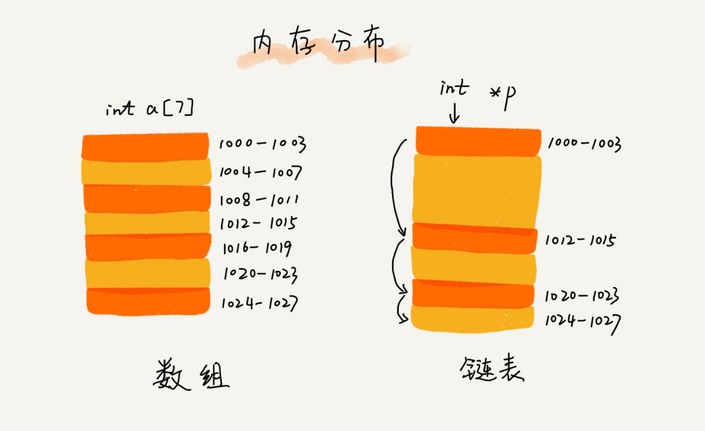
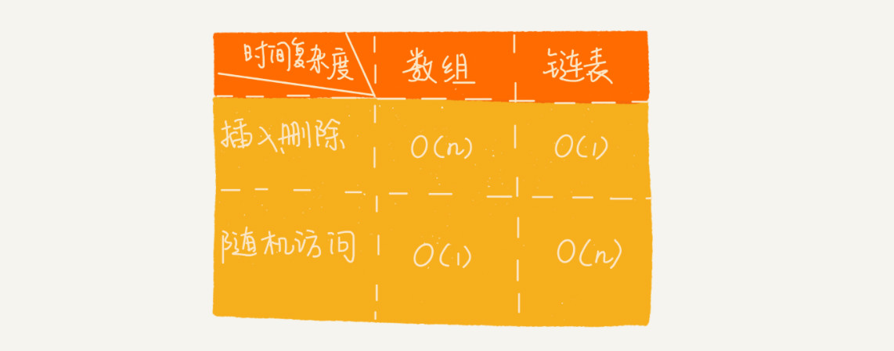

# 06 | 链表（上）：如何实现LRU缓存淘汰算法?

## 笔记

经典链表应用场景, `LRU`缓存淘汰算法.

当缓存被用满时, 缓存淘汰策略:

* 先进先出策略`FIFO`(First In, First Out)
* 最少使用策略`LFU`(Least Frequently Used)
* 最近最少使用策略`LRU`(Least Recently Used)

**如何用链表实现`LRU`缓存淘汰策略**

### 五花八门的链表结构

#### 底层的存储结构

* 数组: 需要一块**连续的内存空间**来存储, 对内存要求高. 如果内存中没有连续的, 足够大的存储空间时, 即便内存的剩余总可用空间大于`100MB`, 仍然会申请失败.
* 链表: 不需要一块连续的内存空间, 它通过"指针"将一组**零散的内存块**串联起来使用, 即便不是连续的内存, 但是空间够就不会有问题.

#### 常见链表结构

* 单链表
* 双向链表
* 循环链表

#### 单链表

链表通过**指针**将一组零散的内存块串联在一起.

* 内存块称为链表的**结点**
* 为了将所有的结点串起来, 每个链表的结点除了存储数据之外, 还需要记录链上的下一个节点的地址. **把这个记录下个节点地址的指针叫做后继指针 next**.

* **头结点**: 第一个节点. 用来记录链表的基地址. 用了它, 可以遍历得到整条链表.
* **尾节点**: 最后一个节点. 指针不是指向下一个节点, 是指向一个**空地址 NULL**, 表示这是链表上最后一个节点.

链表的插入和删除, 并不需要为了保持内存的连续性而搬移结点. 因为链表的存储空间本身就不是连续的. 所以, 在链表中插入和删除一个数据是非常快速的.

链表想要随机(任意)访问, 没有数组高效. 饮料链表中的数据并非连续存储的, 无法像数组那样, 通过寻址公式计算出对应的内存地址, 而是**需要根据指针一个结点一个结点地一次遍历, 知道找到相应的节点**. 需要`O(n)`的时间复杂度.

#### 循环链表

**循环链表是一种特殊的单链表**. 它跟单链表唯一的区别就在尾结点. **循环链表的尾节点指针是指向链表的头节点**.

从链尾到链头比较方便. 处理的数据具有**环形结构**特点, 就特别适合采用循环链表. 比如注明的**约瑟夫问题**.

#### 双向链表

支持两个方向, 每个节点有:

* 后继指针`next`指向后面的结点
* 前驱指针`prev`指向前面的结点

双向链表需要额外的两个空间来存储后继结点和前去结点的地址. 支持**双向遍历**, 支持`O(1)`时间副再度的情况下找到前驱结点.

##### 双向链表的插入和删除操作

* 情况一, 遍历查找要删除的结点,时间复杂度为`O(n)`.
* 情况二, 已经找到了要删除的结点, 删除某个节点`q`需要知道其前驱节点，**而单链表并不支持直接获取前驱节点, 为了找到前驱节点, 还是要从头节点开始遍历链表, 直到 p->next=q, 说明 p 是 q 的前驱结点.**, 双向链表中的节点已经保存了前驱节点的指针, **不需要再向单链那样遍历**. 这种勤快删除只需要`O(1)`的时间复杂度极客完成.

删除同理.

对于一个**有序链表**, 双向链表的按值查询的效率也要比单链表高. 可以记录上次查找的位置`p`, 每次查询时, 根据要查找的值与`p`的大小关系, 决定是往前还是往后查找, 平均只需要查找一半的数据.

#### 用空间换时间

**双向链表高效是用空间换时间**, 空间复杂度相对较高, 时间复杂度相对较低的算法结构. 但是, 如果在内存比较紧缺(手机, 单片机), 需要反过来用时间换空间.

缓存就是利用空间换时间的设计思想. 数据存储在磁盘上节省空间, 但是慢. 数据放在内存中, 耗费内存空间, 但是快.

#### 双向循环链表

### 链表 vs 数组性能比拼

* 数组
	* 优点: 简单, 使用连续内存空间, 可以借助**CPU 缓存机制, 预读数组中的数据**.
	* 缺点: 大小固定, 一经声明就要征用整块连续内存空间, 声明数组过大可能会导致内存不足. 声明数组过小, 可能出现不够用情况. 只能在申请一个更大的内存空间, 把原数组拷贝进去, 费时.
* 链表
	* 优点: 链表本身没有大小限制, 天然支持动态扩容.
	* 缺点: 内存不连续存储, 对CPU缓存不友好, 无法预读. 对链表进行频繁地插入, 删除操作, 还会导致频繁地内存申请和释放, 容易造成内存碎片.

### 基于链表实现LRU缓存淘汰算法

维护一个有序单链表, 越靠近尾部的节点是越早之前访问的. 当有一个新的数据被访问时, 我们从链表头开始顺序遍历链表.

1. 如果此数据之前已经被缓存在链表中了, 遍历得到这个数据对应的结点, 并将其从原来的位置删除, 然后再插入到链表的头部.
2. 如果此数据没有在缓存链表中
	* 缓存未满, 将此结点直接插入到链表的头部.
	* 缓存已满, 链表尾结点删除, 将新的数据结点插入到链表的头部.

访问的时间复杂度, 无论缓存有没有满, 我们都需要遍历一遍链表, 缓存访问的时间复杂度是`O(n)`.

## 扩展