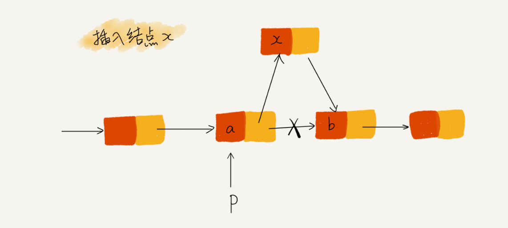
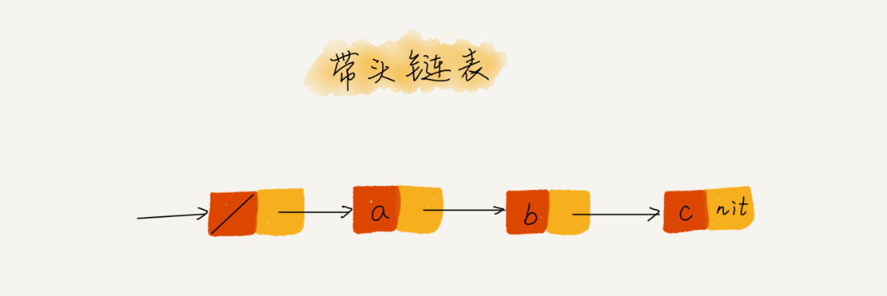
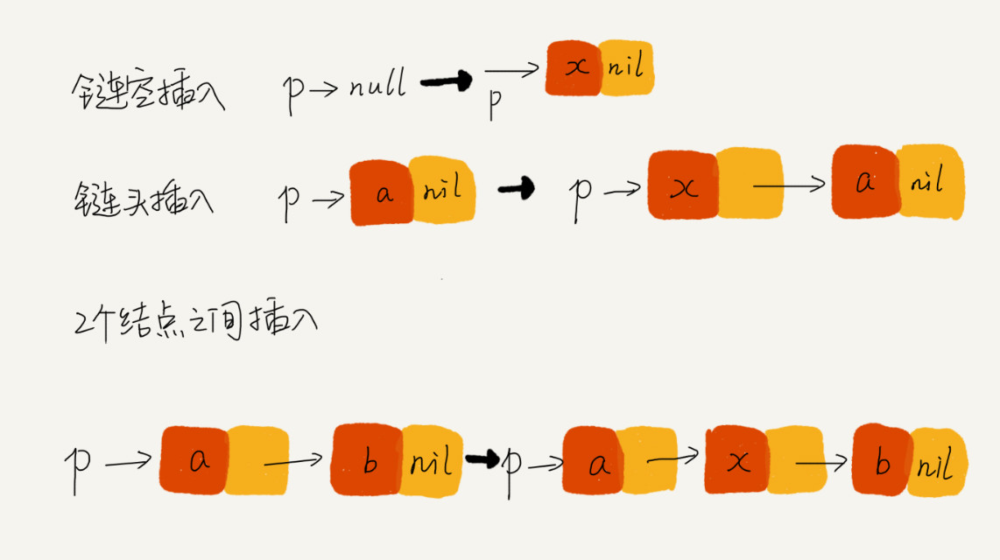

# 07 | 链表（下）：如何轻松写出正确的链表代码？

## 笔记

### 理解指针或引用的含义

无论是**指针**还是**引用**, 实际上它们的意思都是一样的, 都是**存储所知对象的内存地址**.

指针的理解: **将某个变量赋值给指针, 实际上就是将这个变量的地址赋值给指针, 或者反过来说, 指针中存储了这个变量的内存地址, 指向了这个变量, 通过指针就能找到这个变量**.

如链表代码中`p->next=q`. `p`结点中的`next`指针存储了`q`结点的内存地址.

`p->next=p->next->next`. 表示`p`结点的`next`指针存储了`p`结点的下下一个节点的内存地址.

### 警惕指针丢失和内存泄漏

指针丢失的示例:



希望在结点`a`和相邻的结点`b`之间插入结点`x`, 假设当前指针`p`指向节点`a`. 如果我们代码如下, 就会发生指针丢失和内存泄露.

```
p->next = x;  // 将p的next指针指向x结点；
x->next = p->next;  // 将x的结点的next指针指向b结点；
```

第一步操作完之后`p->next`已经不再指向结点`b`了, 而是指向结点`x`. 第二步相当于把自己指向自己. 从结点`b`后的所有结点都无法访问了.

`C`语言内存管理是由程序员负责的, 如果没有手动释放结点对应的内存空间, 就会产生**内存泄露**. 

插入节点要注意操作顺序.

1. 先把结点`x`的`next`指针指向`b`
2. 把`a`的`next`指针指向节点`x`.

把刚才的代码调换下顺序就可以了.

**删除链表结点时, 要记得手动释放内存空间**, 否则会产生**内存泄露的问题**. 对于`Java`虚拟机自动管理内存的编程语言来说, 不需要考虑这么多.

### 利用哨兵简化难度

回顾下**插入**和**删除**

#### 插入

##### 插入 - 节点

在结点`p`后面插入一个新的节点, 需要下面代码

```
new_node->next = p->next;
p->next = new_node;
```

#### 插入 - 第一个结点

向一个空链表中插入第一个结点, 需要进行特殊处理. `head`表示链接表的头节点.

```
if (head == null) {
  head = new_node;
}
```

#### 删除

##### 删除 - 节点

删除结点`p`的后继结点

···
p->next = p->next->next
···

##### 删除 - 最后一个节点

需要特殊处理

```
if (head->next == null) {
   head = null;
}
```

#### 哨兵

**需要对插入第一个结点和删除最后一个结点的情况进行特殊处理**

哨兵是解决**边界问题**, 不直接参与业务逻辑.

原来: `head=null`表示链表中没有结点了. `head`表示头结点指针, 指向链表中的第一个结点.

引入哨兵后: 任何时候, 不管链表是不是空, `head`指针都会一直指向这个哨兵结点. 我们也把这种有哨兵结点的链表叫**带头链表**. 没有哨兵的链表叫作**不带头链表**.

**哨兵结点不存储数据, 因为哨兵结点一直存在, 所以插入第一个结点和插入其他结点, 删除第一个结点和删除其他结点, 都可以统一为相同的代码实现逻辑**.



##### 哨兵代码的比较

代码一

```C
// 在数组a中，查找key，返回key所在的位置
// 其中，n表示数组a的长度
int find(char* a, int n, char key) {
  // 边界条件处理，如果a为空，或者n<=0，说明数组中没有数据，就不用while循环比较了
  if(a == null || n <= 0) {
    return -1;
  }
  
  int i = 0;
  // 这里有两个比较操作：i<n和a[i]==key.
  while (i < n) {
    if (a[i] == key) {
      return i;
    }
    ++i;
  }
  
  return -1;
}
```

代码二

```
// 在数组a中，查找key，返回key所在的位置
// 其中，n表示数组a的长度
// 我举2个例子，你可以拿例子走一下代码
// a = {4, 2, 3, 5, 9, 6}  n=6 key = 7
// a = {4, 2, 3, 5, 9, 6}  n=6 key = 6
int find(char* a, int n, char key) {
  if(a == null || n <= 0) {
    return -1;
  }
  
  // 这里因为要将a[n-1]的值替换成key，所以要特殊处理这个值
  if (a[n-1] == key) {
    return n-1;
  }
  
  // 把a[n-1]的值临时保存在变量tmp中，以便之后恢复。tmp=6。
  // 之所以这样做的目的是：希望find()代码不要改变a数组中的内容
  char tmp = a[n-1];
  // 把key的值放到a[n-1]中，此时a = {4, 2, 3, 5, 9, 7}
  a[n-1] = key;
  
  int i = 0;
  // while 循环比起代码一，少了i<n这个比较操作
  while (a[i] != key) {
    ++i;
  }
  
  // 恢复a[n-1]原来的值,此时a= {4, 2, 3, 5, 9, 6}
  a[n-1] = tmp;
  
  if (i == n-1) {
    // 如果i == n-1说明，在0...n-2之间都没有key，所以返回-1
    return -1;
  } else {
    // 否则，返回i，就是等于key值的元素的下标
    return i;
  }
}
```

两段代码执行次数最多的就是`while`循环. 第二段代码, 通过哨兵`a[n-1] = key`, 声调了一个比较语句`i<n`. 

第二段代码性能好, 但是可读性太差.

### 重点留意边界条件处理

* 如果链表为**空**时, 代码是否能正常工作? **空边界**
* 如果链表只包含**一个结点**时, 代码是否能正常工作? **一个结点**
* 如果链表只包含**两个结点**时, 代码是否能正常工作? **多个结点**
* 代码逻辑在处理**头结点**和**尾结点**的时候, 是否能正常工作? **头, 尾处理**

### 举例画图, 辅助思考

画出示例, 辅助思考



## 扩展