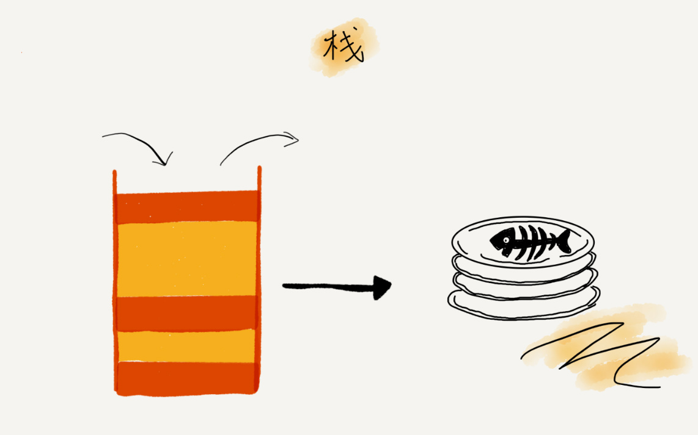
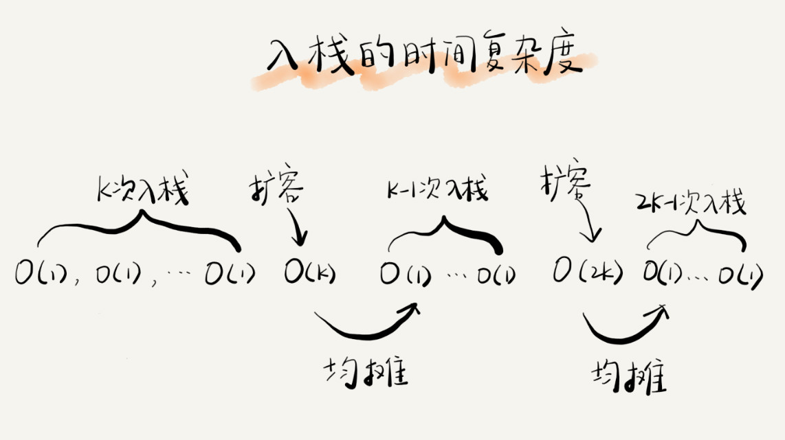

# 08 | 栈：如何实现浏览器的前进和后退功能？

## 笔记

### 如何理解"栈"

理解为叠在一起的盘子. **后进者先出, 先进者后出 FILO**.



**栈是一种"操作受限"的线性表**, 只允许在一端插入数据和删除数据.

#### 栈 和 数组, 队列的区别

从功能上来说, 数组和链表可以代替栈. 但是**特定的数据结构是对特定场景的抽象**.

数组和链表暴露了太多的操作接口. 

**当某个数据集合只涉及在一端插入和删除数据, 并且满足后进先出, 先进后出的特性**就选择"栈"这种数据结构.

### 如何实现一个"栈"

* 用**数组**实现栈, 叫做**顺序栈**.
* 用**链表**实现栈, 叫做**链式栈**.

```java

// 基于数组实现的顺序栈
public class ArrayStack {
  private String[] items;  // 数组
  private int count;       // 栈中元素个数
  private int n;           //栈的大小

  // 初始化数组，申请一个大小为n的数组空间
  public ArrayStack(int n) {
    this.items = new String[n];
    this.n = n;
    this.count = 0;
  }

  // 入栈操作
  public boolean push(String item) {
    // 数组空间不够了，直接返回false，入栈失败。
    if (count == n) return false;
    // 将item放到下标为count的位置，并且count加一
    items[count] = item;
    ++count;
    return true;
  }
  
  // 出栈操作
  public String pop() {
    // 栈为空，则直接返回null
    if (count == 0) return null;
    // 返回下标为count-1的数组元素，并且栈中元素个数count减一
    String tmp = items[count-1];
    --count;
    return tmp;
  }
}
```

空间复杂度是`O(1)`. 存储数据只需要一个大小为`n`的数组. 入栈和出栈过程中, 只需要一两个临时变量存储空间, 所以空间复杂度是`O(1)`.

**空间复杂度是指除了原本的数据存储空间外, 算法运行还需要额外的存储空间**.

时间复杂度是`O(1)`, 入栈, 出栈, 只涉及栈顶个别数据的操作.

### 支持动态扩容的顺序栈

链式栈的大小不受限, 但要存储`next`指针, 内存消耗较多. 用数组实现支持动态扩容栈.

当栈满了后, 就申请一个更大的数组, 将原来的数据搬移到新数组中.


出栈, 时间复杂度是`O(1)`.

入栈, 最好是`O(1)`, 最差是`O(n)`.

假设:

* 栈空间不够时, 我们重新申请一个是原来大小两倍的数组.
* 为了简化分析, 假设只有入栈操作没有出栈操作.
* 定义不涉及内存搬移的入栈操作为`simple-push`操作, 时间复杂度为`O(1)`.

如果当前栈大小为`K`, 并且已满, 当再有新的数据要入栈时, 就需要重新申请`2`倍大小的内存, 并且做`K`个数据的搬移操作, 然后在入栈. 但是, 接下来`K-1`次入栈操作, 我们都不需要再重新申请内存和搬移数据, 所以这`K-1`次入栈操作都只需要一个`simple-push`操作都可以完成.



**均摊时间复杂度一般都等于最好情况时间复杂度**. 大部分情况下, 入栈操作的时间复杂度`O`都是`O(1)`, 还有在个别时刻会是`O(n)`. 所以, 把耗时多的入栈操作时间均摊到其他入栈操作上, 平均情况下耗时就接近`O(1)`.

### 栈在函数调用中的应用

**函数调用栈**

操作系统给每个线程都分配了一块独立的内存空间, 这块内存被组织成"栈"这种结构, 用来存储函数调用时的临时变量. 每进入一个函数, 就会将临时变量作为一个栈帧入栈, 当被调用函数执行完成, 返回之后, 将这个函数对应的栈帧出栈.

```

int main() {
   int a = 1; 
   int ret = 0;
   int res = 0;
   ret = add(3, 5);
   res = a + ret;
   printf("%d", res);
   reuturn 0;
}

int add(int x, int y) {
   int sum = 0;
   sum = x + y;
   return sum;
}
```

`main()`函数调用了`add()`函数.


### 栈在表达式求值中的应用

编译器通过两个栈来实现:

* 一个保存操作数的栈.
* 一个保存运算符的栈.

从左向右遍历表达式, 当遇到数字, 直接压入操作数栈. 当遇到运算符, 就与运算符栈的栈顶元素比较. 比运算符栈顶元素的优先级高, 就将当前运算符压入栈. 如果比运算符栈顶元素的优先级低或者相同, 从运算符栈中取栈顶运算符, 从操作数栈的栈顶取`2`个操作数, 然后进行计算,再把计算完的结果压入操作数栈, 继续比较.

`3+5*8-6`


### 栈在括号匹配中的应用

假设表达式中只包含三种括号, 圆括号 `()`、方括号`[]`和花括号`{}`, 并且它们可以任意嵌套. 比如，`{[] ()[{}]}`或`[{()}([])]`等都为合法格式. 一个包含三种括号的表达式字符串, 如何检查它是否合法呢.

用栈来保存未匹配的左括号, 从左到右依次扫描字符串. 当扫描到左括号时, 则将其压入栈中; 当扫描到右括号时, 从栈顶取出一个左括号. 如果能够匹配, 比如"("跟")"匹配, "["跟"]"匹配, "{"跟"}"匹配，则继续扫描剩下的字符串. 如果扫描的过程中, 遇到不能配对的右括号, 或者栈中没有数据, 则说明为非法格式.

当所有的括号都扫描完成之后, 如果栈为空, 则说明字符串为合法格式; 否则, 说明有未匹配的左括号, 为非法格式.


## 扩展