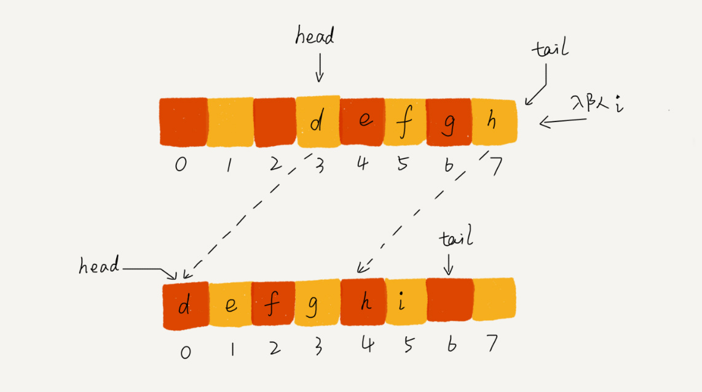
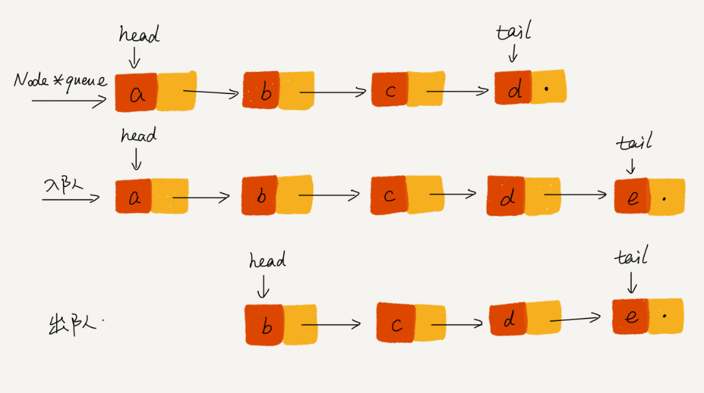
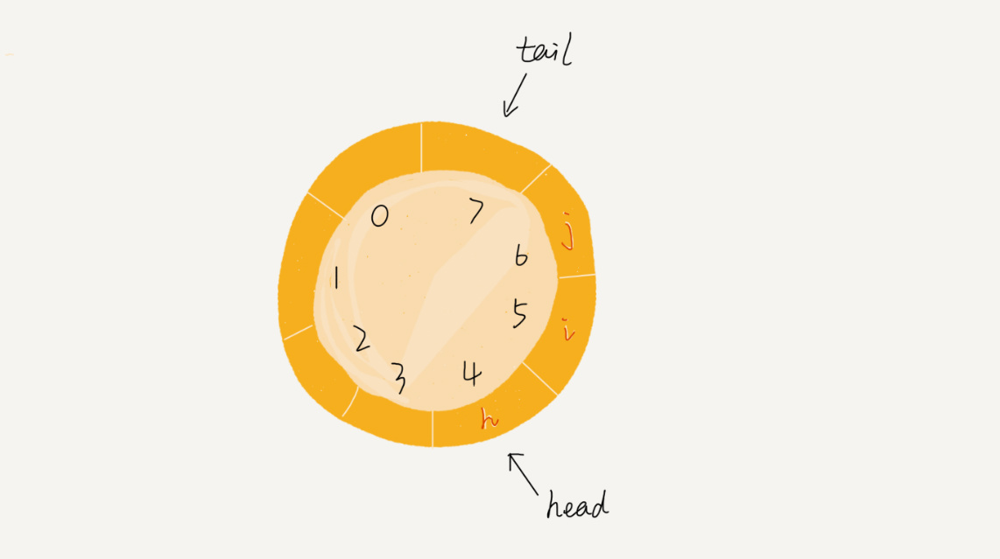
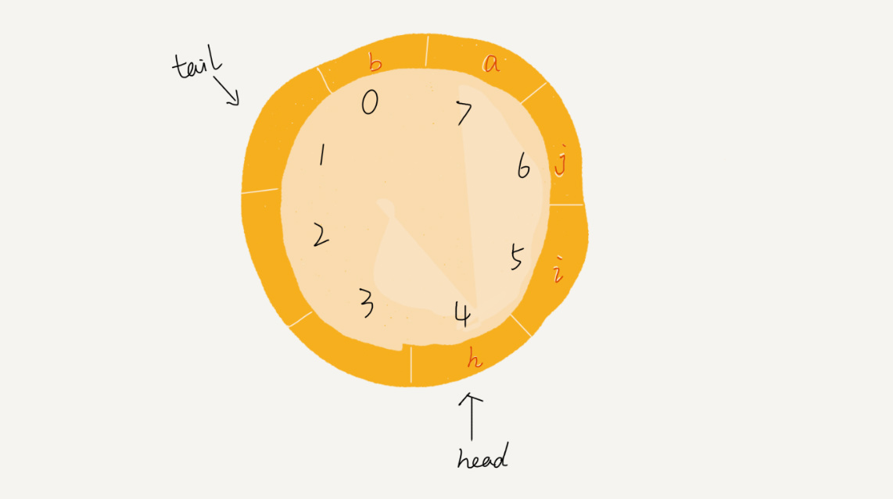
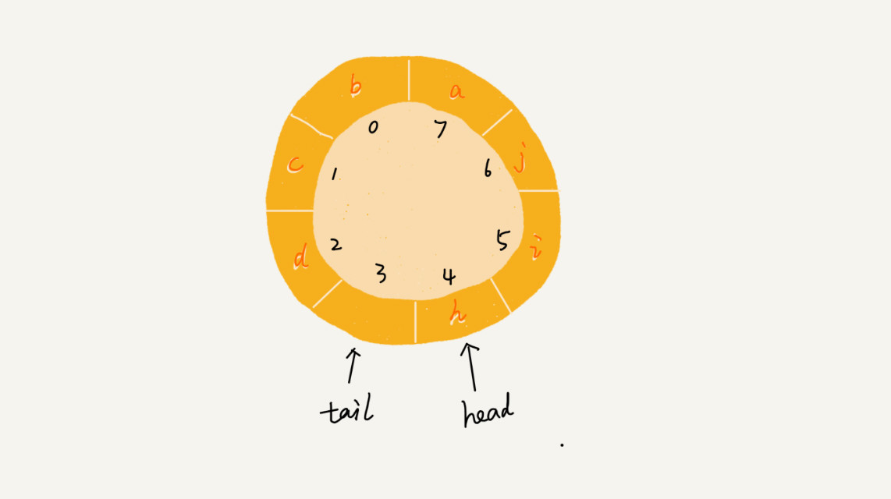
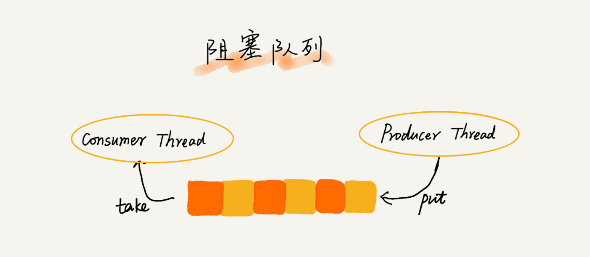
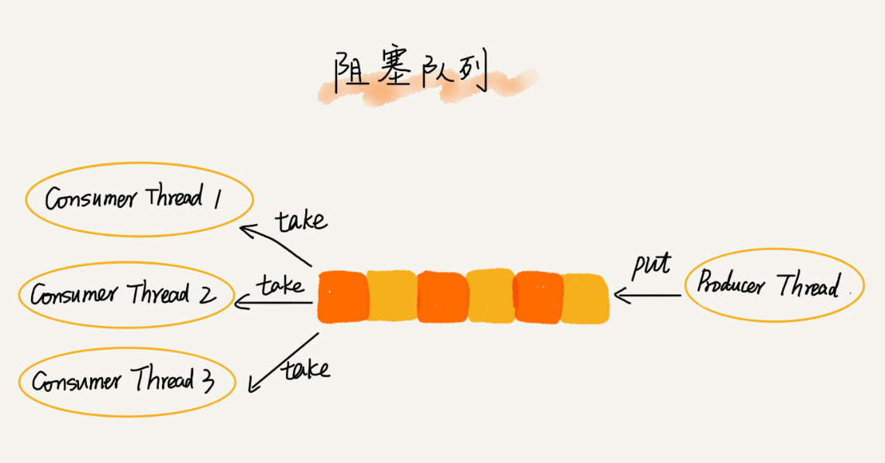

# 09 | 队列：队列在线程池等有限资源池中的应用

## 笔记

`CPU`资源是有限的, 任务的处理速度与县城个数并**不是线性正相关**. 过多的线程反而会导致`CPU`频繁切换, 处理性能下降. **线程池的大小一般都是综合考虑要处理任务的特点和硬件环境, 来事先设置的**.

线程池没有空闲线程时，新的任务请求线程资源时，线程池该如何处理?

* 非阻塞, 直接拒绝任务请求.
* 阻塞, 将请求排队, 等到有空闲线程时, 取出排队的请求继续处理. 如何存储排队
	* 公平地处理每个排队的请求, 先进者先服务, 可以使用队列.
		* 链表队列: 支持无线排队的无界队列(`unbounded queue`), 会导致过多的请求排队等待, 请求处理响应时间过长. 不适用于针对响应时间比较敏感的系统.
		* 数组队列: 有界队列(`bounded queue`), 队列的大小有限, 线程池中排队的请求超过队列大小时, 后面的请求会被拒绝. 适用于响应时间敏感的系统.

一般如使用在数据里连接池上. 对于大部分资源有限的场景, 当没有空闲资源时, 基本上都可以通过"队列"这种数据结构来实现请求排队.

### 如何理解"队列"?

可以把它想象成排队买票. **先进者先出 FIFO**.

基本的操作:

* 入队`enqueue()`, 放一个数据到队列尾部.
* 出对`dequeue()`, 从队列头部取出一个元素.


队列和栈一样, **操作受限的线性表数据结构**.

### 顺序队列和链式队列

队列可以用**数组**来实现, 也可以用**链表**来实现. 

* 用数组实现的队列叫做**顺序队列**
* 用链表实现的对类叫做**链式队列**

示例: 基于数组实现的队列

```Java
// 用数组实现的队列
public class ArrayQueue {
  // 数组：items，数组大小：n
  private String[] items;
  private int n = 0;
  // head表示队头下标，tail表示队尾下标
  private int head = 0;
  private int tail = 0;

  // 申请一个大小为capacity的数组
  public ArrayQueue(int capacity) {
    items = new String[capacity];
    n = capacity;
  }

  // 入队
  public boolean enqueue(String item) {
    // 如果tail == n 表示队列已经满了
    if (tail == n) return false;
    items[tail] = item;
    ++tail;
    return true;
  }

  // 出队
  public String dequeue() {
    // 如果head == tail 表示队列为空
    if (head == tail) return null;
    // 为了让其他语言的同学看的更加明确，把--操作放到单独一行来写了
    String ret = items[head];
    ++head;
    return ret;
  }
}
```

队列需要两个指针:

* `head`指针, 指向队头.
* `tail`指针, 指向队尾.

`a,,b,c,d`依次入队后, `head`指向`0`, `tail`指向下标为`4`的位置.


调用两次出队操作之后, 对列中`head`指针指向下标为`2`的位置.


问题: 随着不停的入队, 出队操作, `head`和`tail`都会持续往后移动. 当`tail`移动到最右边, 及时数组中还有空闲空间, 也无法继续往队列中添加数据了.

每次进行出队炒作都相当于删除数组下标为`0`的数据, 要搬移整个队列中的数据(第5章, 删除数组数据要进行**数据搬移**), 这样时间复杂度会由`O(1)`变为`O(n)`.

可以在入队时, 集中触发一次数据的搬移操作. 修改`enqueue()`函数.

```Java
   // 入队操作，将item放入队尾
  public boolean enqueue(String item) {
    // tail == n表示队列末尾没有空间了
    if (tail == n) {
      // tail ==n && head==0，表示整个队列都占满了
      if (head == 0) return false;
      // 数据搬移
      for (int i = head; i < tail; ++i) {
        items[i-head] = items[i];
      }
      // 搬移完之后重新更新head和tail
      tail -= head;
      head = 0;
    }
    
    items[tail] = item;
    ++tail;
    return true;
  }
```

当`tail`指针移动到数组最右边, 如果有新的数据入队, 将`head`到`tail`之间的数据, 整体搬移到数组中`0`到`tail-head`的位置.



**当数组的`tail`指针指向最后, 即队尾满了, 就做一次整体迁移**

### 基于链表的队列实现方法

* `head`指针, 指向链表的第一个结点.
* `tail`指针, 指向链表的最后一个结点.

入队时:

* `tail->next = new_node`
* `tail = tail->next`

出队时:

* `head = head->next`



### 循环队列

用数组实现队列的时候, 在`tail==n`时, 会有数据搬移操作, **入队操作性能会受影响**.

循环队列:



* 入队`a`, `a`放置在`tail`原来位置`7`, 后面`tail`指向`0`
* 入队`b`, `a`放置在`tail`原来位置`0`, 后面`tail`指向`1`



可以避免了数据搬移操作, 但是关键是**确定好队空和队满的判定条件**.

非循环队列(数组)

* 队满: `tail==n`
* 队空: `head==tail`

循环队列

* 队空: `head==tail`
* 队满: `(tail+1)%n=head`, `n`是队列长度.



最后`tail`指向的位置实际上是没有存储数据的. 循环队列会浪费一个数组的存储空间.

公式可以这么理解, 队满时候, `tail`在`head`的前一个位置.


```
public class CircularQueue {
  // 数组：items，数组大小：n
  private String[] items;
  private int n = 0;
  // head表示队头下标，tail表示队尾下标
  private int head = 0;
  private int tail = 0;

  // 申请一个大小为capacity的数组
  public CircularQueue(int capacity) {
    items = new String[capacity];
    n = capacity;
  }

  // 入队
  public boolean enqueue(String item) {
    // 队列满了
    if ((tail + 1) % n == head) return false;
    items[tail] = item;
    tail = (tail + 1) % n;
    return true;
  }

  // 出队
  public String dequeue() {
    // 如果head == tail 表示队列为空
    if (head == tail) return null;
    String ret = items[head];
    head = (head + 1) % n;
    return ret;
  }
}
```

### 阻塞队列和并发队列

**阻塞队列**在队列基础上增加了阻塞操作.

*  当队列为空的时候, 从队头取数据会被阻塞. 因为此时没有数据可取, 直到队列中有了数据才能返回.
*  队列已经满了, 插入数据的操作就会被阻塞, 直到队列中有空闲位置后再插入数据, 然后在返回.



**生产者 - 消费者模型**, 可以有效地协调生产和消费的速度. 还可以通过协调"生产者"和"消费者"的个数, 来提高数据的处理效率. 可以多配置几个"消费者", 来应对一个"生产者".



多线程情况下, 会有多个线程同时操作队列, 会存在线程安全问题. 线程安全的队列叫做**并发队列**. 最简单直接在`enqueue()`和`dequeue()`方法上加锁, 并发度会比较低, 同一时刻仅允许一个存或者取操作.

## 扩展