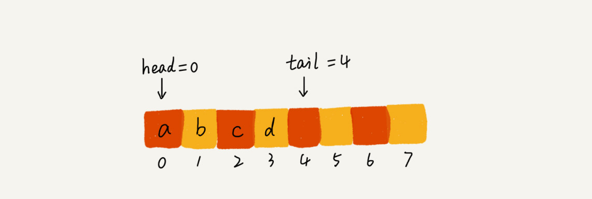
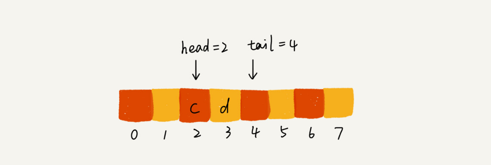

# 09 | 队列：队列在线程池等有限资源池中的应用

## 笔记

`CPU`资源是有限的, 任务的处理速度与县城个数并**不是线性正相关**. 过多的线程反而会导致`CPU`频繁切换, 处理性能下降. **线程池的大小一般都是综合考虑要处理任务的特点和硬件环境, 来事先设置的**.

### 如何理解"队列"?

可以把它想象成排队买票. **先进者先出**.

基本的操作:

* 入队`enqueue()`, 放一个数据到队列尾部.
* 出对`dequeue()`, 从队列头部取出一个元素.


队列和栈一样, **操作受限的线性表数据结构**.

### 顺序队列和链式队列

队列可以用**数组**来实现, 也可以用**链表**来实现. 

* 用数组实现的队列叫做**顺序队列**
* 用链表实现的对类叫做**链式队列**

示例: 基于数组实现的队列

```Java
// 用数组实现的队列
public class ArrayQueue {
  // 数组：items，数组大小：n
  private String[] items;
  private int n = 0;
  // head表示队头下标，tail表示队尾下标
  private int head = 0;
  private int tail = 0;

  // 申请一个大小为capacity的数组
  public ArrayQueue(int capacity) {
    items = new String[capacity];
    n = capacity;
  }

  // 入队
  public boolean enqueue(String item) {
    // 如果tail == n 表示队列已经满了
    if (tail == n) return false;
    items[tail] = item;
    ++tail;
    return true;
  }

  // 出队
  public String dequeue() {
    // 如果head == tail 表示队列为空
    if (head == tail) return null;
    // 为了让其他语言的同学看的更加明确，把--操作放到单独一行来写了
    String ret = items[head];
    ++head;
    return ret;
  }
}
```

队列需要两个指针:

* `head`指针, 指向队头.
* `tail`指针, 指向队尾.

`a,,b,c,d`依次入队后, `head`指向`0`, `tail`指向下标为`4`的位置.



调用两次出队操作之后, 对列中`head`指针指向下标为`2`的位置.



问题: 随着不停的入队, 出队操作, `head`和`tail`都会持续往后移动. 当`tail`移动到最右边, 及时数组中还有空闲空间, 也无法继续往队列中添加数据了.

每次进行出队炒作都相当于删除数组下标为`0`的数据, 要搬移整个队列中的数据(第5章, 删除数组数据要进行**数据搬移**), 这样时间复杂度会由`O(1)`变为`O(n)`.

可以在入队时, 集中触发一次数据的搬移操作. 修改`enqueue()`函数.

```Java
   // 入队操作，将item放入队尾
  public boolean enqueue(String item) {
    // tail == n表示队列末尾没有空间了
    if (tail == n) {
      // tail ==n && head==0，表示整个队列都占满了
      if (head == 0) return false;
      // 数据搬移
      for (int i = head; i < tail; ++i) {
        items[i-head] = items[i];
      }
      // 搬移完之后重新更新head和tail
      tail -= head;
      head = 0;
    }
    
    items[tail] = item;
    ++tail;
    return true;
  }
```

## 扩展