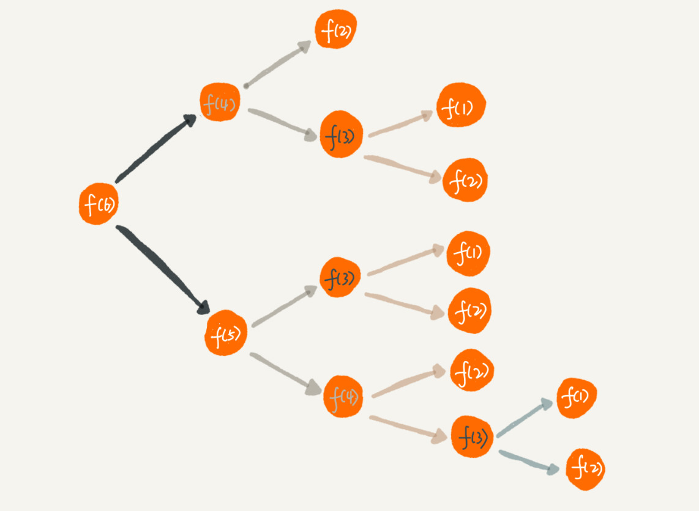

# 10 | 递归：如何用三行代码找到“最终推荐人”？

## 笔记

### 如何理解"递归"

去的过程叫"递", 回来的过程叫"归".

场景: 电影院找自己的座位, 自己的座位就是前一位的位置+1, 于是问前一排的人, 前一排的人也不清楚自己的位置, 他也问前一排的人. 就这样一排一排往前问, 直到问到第一排, 说我在第一排, 然后再一排一排把数字传回来. 直到你前面的人告诉你他在哪一排.

递归问题可以用递推公示来表示:

```
f(n)=f(n-1)+1 其中，f(1)=1
```

* `f(n)`: 自己在哪一排.
* `f(n-1)`: 前面一排所在的排数.
* `f(1)`: 第一排的人直到自己在第一排.

递归代码:

```
int f(int n) {
  if (n == 1) return 1;
  return f(n-1) + 1;
}
```

### 递归需要满足的三个条件

#### 1. 一个问题的解可以分解为几个子问题的解

子问题就是数据规模更小的问题.

#### 2. 这个问题与分解之后的子问题, 除了数据规模不同, 求解思路完全一样

如示例中, "自己在哪一排"的思路, 和前面已派人求解"自己在哪一排"的思路是一模一样的.

#### 3. 存在递归终止条件

问题分解为子问题, 子问题分解为子子问题, 一层一层分解下去, 不能存在无限循环, 需要有**终止条件**.

如示例中, 第一排的人不需要继续询问任何人, 也就是`f(1)=1`, 这就是递归的终止条件.

### 如何编写递归代码

写递归代码最关键的是**写出递归公示, 找到终止条件**.

假如有`n`个台阶, 可以跨1个台阶或者跨2个台阶, 走这`n`个台阶有多少种走法. 如`2,2,2,1`或`1,2,1,1,2`.

可以根据第一步的走法把所有走法分为两类:

1. 第一步走了1个台阶
2. 第一步走了2个台阶

`n`个台阶的走法就等于先走`1`阶后, `n-1`个台阶的走法**加**先走`2`阶后, `n-2`个台阶的走法. 公示就是:

```
f(n) = f(n-1) + f(n-2)
``` 

终止条件:

1. `f(1)=1`
2. `f(2)=2`, 2个台阶有2种走法

```
f(1) = 1;
f(2) = 2;
f(n) = f(n-1)+f(n-2)
```

转换为代码

```
int f(int n) {
  if (n == 1) return 1;
  if (n == 2) return 2;
  return f(n-1) + f(n-2);
}
```

写递归代码的关键:

* 将大问题分解为小问题的**规律**, 基于此写出递推公示.
* 确定终止条件.
* 将递推公示和终止条件翻译成代码.

### 怎么理解递归

**不要**看到递归时, 把递归平铺展开, 脑子里循环, 一层一层往下调, 然后再一层一层返回, 试图想搞清楚计算机每一步都是怎么执行的. 很容易被饶进去.

**需要**如果一个问题A可以分解为若干子问题 B,C,D . 可以假设子问题B, C, D已经解决, 在此基础上思考如何解决问题A. 只需要思考问题 A 与子问题 B,C,D 两层之间的关系即可, **不需要一层一层往下思考子问题与子子问题, 子子问题与子子子问题之间的关系**. **屏蔽掉递归细节**.

编写递归代码的关键是, **只要遇到递归, 我们就把它抽象成一个递推公示, 不用想一层层的调用关系, 不要试图用人脑去分解递归的每个步骤**.

### 递归代码要警惕堆栈溢出

函数调用会使用栈来保存临时变量. 每调用一个函数, 都会将临时变量封装为栈帧压入内存栈, 等函数执行完成返回时, 才出栈. 系统栈和虚拟机栈空间一般都不大. 如果递归求解的数据规模很大, 调用层次很深, 一直压入栈, 就会有堆栈溢出的风险.

**如果避免出现堆栈溢出**, 限制递归调用的最大深度方式来解决这个问题. 递归调用超过一定深度之后, 就不继续往下再递归了, 直接返回报错.

电影院的示例

```
// 全局变量，表示递归的深度。
int depth = 0;

int f(int n) {
  ++depth；
  if (depth > 1000) throw exception;
  
  if (n == 1) return 1;
  return f(n-1) + 1;
}
```

**问题**, 最大允许的递归深度跟当前线程剩余的栈空间大小有关, 事先无法计算. 如果实时计算, 代码过于复杂. 搜易这种方法不实用.

### 递归代码要警惕重复计算

第2个示例分解后



可以看见`f(4)`和`f(5)`都需要计算`f(3)`. `f(3)`被计算了很多次, 这就是**重复计算问题**

可以通过一个数据结构(如散列表)来保存已经求结果的`f(k)`. 当递归调用到`f(k)`时, 可以查下是否已经求解过了. 如果是则直接返回.

```
public int f(int n) {
  if (n == 1) return 1;
  if (n == 2) return 2;
  
  // hasSolvedList可以理解成一个Map，key是n，value是f(n)
  if (hasSolvedList.containsKey(n)) {
    return hasSolvedList.get(n);
  }
  
  int ret = f(n-1) + f(n-2);
  hasSolvedList.put(n, ret);
  return ret;
}
```

递归调用一次就会在内存栈中保存一次现场数据, 需要额外考虑这部分开销.

电影院示例递归代码, 空间复杂度是`O(n)`.

### 怎么讲递归代码改写为非递归代码

递归代码:

* 优点
	* 表达力强
	* 写起来简洁
* 缺点
	* 空间复杂度高
	* 有堆栈溢出风险
	* 存在重复计算
	* 过多的函数调用耗时较多

**递归实现**

```
int f(int n) {
  int ret = 1;
  for (int i = 2; i <= n; ++i) {
    ret = ret + 1;
  }
  return ret;
}
```

**非递归实现(迭代循环)**

```
int f(int n) {
  if (n == 1) return 1;
  if (n == 2) return 2;
  
  int ret = 0;
  int pre = 2;
  int prepre = 1;
  for (int i = 3; i <= n; ++i) {
    ret = pre + prepre;
    prepre = pre;
    pre = ret;
  }
  return ret;
}
```

使用迭代循环实现递归代码. 因为递归本身就是借助栈来实现的, 我们使用的栈是系统或者虚拟机本身提供的. 如果我们自己在内存上实现栈, 手动模拟入栈, 出栈过程, 这样任何递归代码都可以改写成阿克苏农行去不是递归代码的样子.

## 扩展