# 11 | 排序（上）：为什么插入排序比冒泡排序更受欢迎？

## 笔记

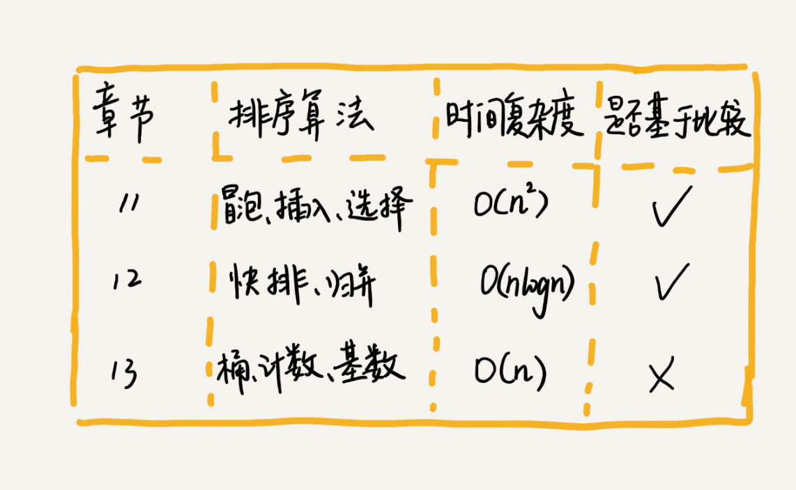

### 如何分析一个"排序算法"?

#### 1. 排序算法的执行效率

#### 1.1 最好情况, 最坏情况, 平均情况时间复杂度

* 最好情况
	* 最好情况对应的要排序的原始数据
* 平均情况
* 最坏情况
	* 最坏情况对应的要排序的原始数据

需要知道排序算法在不同数据下的性能表现.

#### 1.2 时间复杂度的系数, 常数, 低阶

时间复杂度反应的是数据规模`n`很大的时候的一个增长趋势, 会忽略系数, 常数, 低阶.

时间软件开发中, 排序的可能是规模很小的数据. 同一阶时间复杂度的排序算法性能对比的时候, 需要把系数, 常数, 低阶也考虑进来.

#### 1.3 比较次数 和 交换(移动)次数

比较排序算法涉及两种操作:

1. 元素比较大小
2. 元素交换或移动

#### 2. 排序算法的内存消耗

**原地排序(Sorted in place)**, **空间复杂度**是`O(1)`的排序算法.

#### 3. 排序算法的稳定性

**稳定性**, 如果待排序的序列中存在值相等的元素, 经过排序之后, 相等元素之间原有的先后顺序不变.

原数据`2，9，3，4，8，3`, 排序之后`2，3，3，4，8，9`.

这两个`3`, 经过排序之后的**前后顺序没有改变**. 就是**稳定的排序算法**. 如果**前后顺序发生改变**, 就是**不稳定的排序算法**.

#### 3.1 为什么要考察稳定性?

因为在实际软件开发中, 我们要排序的往往不是单纯的整数, 而是一组对象, **需要按照对象的某个`key`来排序**.

**示例**, 订单排序. 订单有两个属性: 1. 下单时间, 2. 订单金额. 我们有10万条订单数据, 希望按照金额从小到大对订单数据排序. 金额相同的订单, 按照下单时间从早到晚有序.

方法一: 先按照金额排序, 在遍历排序之后的订单数据, 对于每个金额相同的订单在按照下单时间排序.

方法二: 先按照下单时间排序, 完成后, 用**稳定排序算法**, 按照订单金额重新排序. **稳定排序算法可以保持金额相同的两个对象, 在排序之后的前后顺序不变**.


### 冒泡排序(`Bubble Sort`)

**只会操作相邻的两个数据**. 每次冒泡曹组哦都会对相邻的两个元素进行比较, 看是否满足大小关系要求. 如果不满足就让它俩互换. **一次冒泡会让至少一个元素移动到它应该在的位置, 重复`n`次, 就完成了`n`个数据的排序工作**.

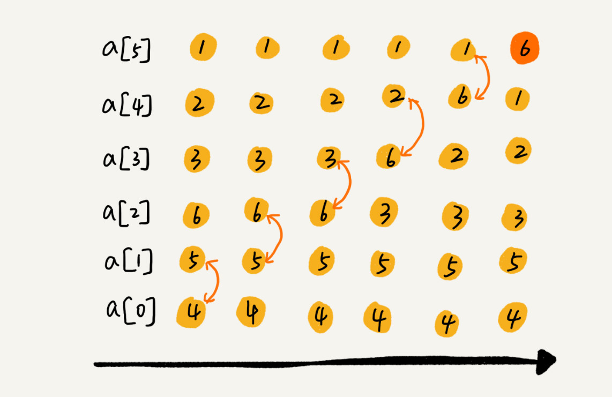

完成所有的冒泡, 只要进行`6`次这样的冒泡操作。

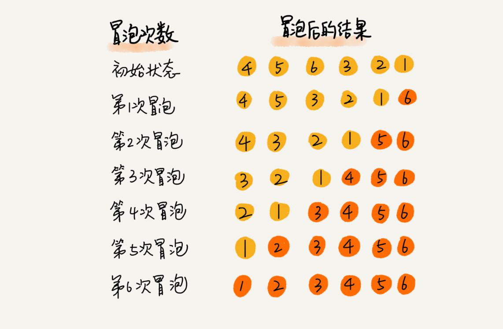

#### 冒泡排序的优化

**当某次冒泡数据已经没有数据交换时, 说明已经达到完全有序, 不用再继续的冒泡操作**.

6个元素, 4次冒泡操作即可.

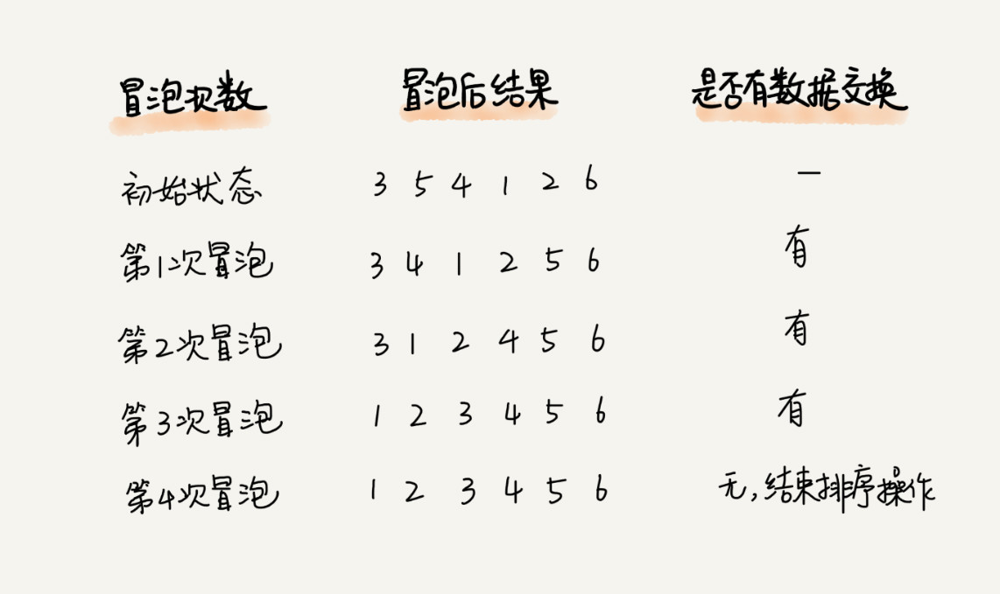

#### 冒泡排序的代码

```
// 冒泡排序，a表示数组，n表示数组大小
public void bubbleSort(int[] a, int n) {
  if (n <= 1) return;
 
 for (int i = 0; i < n; ++i) {
    // 提前退出冒泡循环的标志位
    boolean flag = false;
    for (int j = 0; j < n - i - 1; ++j) {
      if (a[j] > a[j+1]) { // 交换
        int tmp = a[j];
        a[j] = a[j+1];
        a[j+1] = tmp;
        flag = true;  // 表示有数据交换      
      }
    }
    if (!flag) break;  // 没有数据交换，提前退出
  }
}
```

#### 冒泡排序算法

* 只涉及**相邻数据**的交换操作, 只需要**常量级**的临时空间, 所有它的**空间复杂度为`O(1)`**, 是一个**原地排序算法**.
* 只有**交换才可以改变两个元素的前后顺序**. 想有相邻的两个元素大小相等的时候, 不做交换, **相同大小的数据在排序前后不会改变顺序**, 是**稳定排序算法**
* 时间复杂度
	* 最好情况, 有序的数据, 只需要进行一次排序操作. 最好情况是`O(n)`(`n`是要做一轮`n`次比较).
	* 最坏情况, 倒序的数据, 需要进行`n`次冒泡. 复杂度是`O(n^2)`(`n`轮`n`次排序)

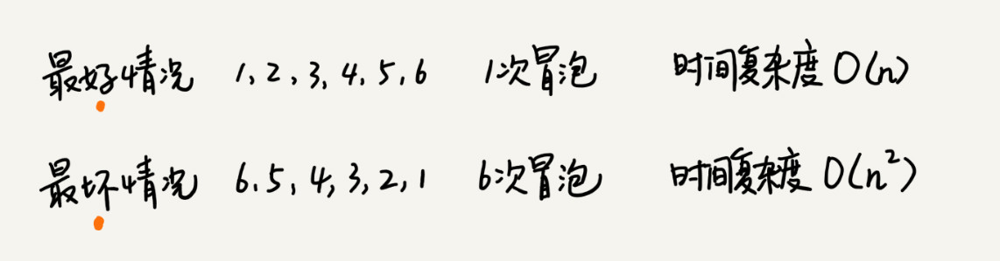	

**平均情况下复杂度**, `n`个数据有`n!`种排列方式. 不同的排列, 需要进行的冒泡次数不同(可能提前没有没有数据交换, 终止排序). 用概率统计较为复杂, 通过**"有序度"**和**"逆序度"**来分析.

**有序度**是数组中具有有序关系的元素对的个数. 有序元素对的数学表达式如下:

```
有序元素对：a[i] <= a[j], 如果i < j。
```

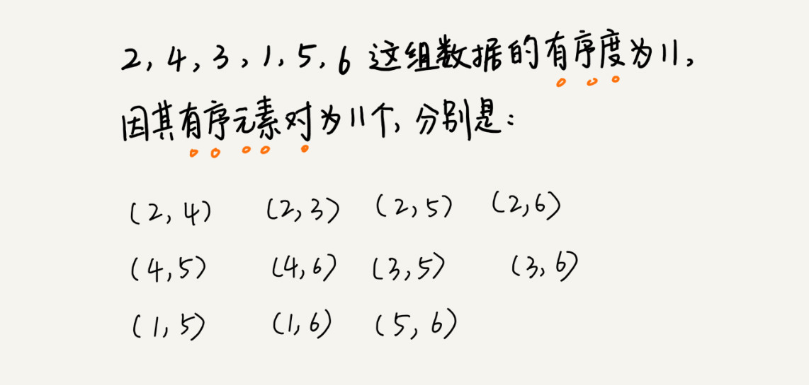	

* 一个倒序排列的数组, `6,5,4,3,2,1`, 有序度是`0`.
* 一个完全有序的数组, `1,2,3,4,5,6`, 有序度就是`n*(n-1)/2`, `15`. 完全有序的数组的有序度叫做**满有序度**.

```
(n-1) + (n-2) + (n-3) + ... (n-(n-1))  序列1

=> 1 + 2 + ... + (n-1)  序列2, 序列1反过来 

=> n*(n-1)/2 

序列1 + 序列2 = n-1 次的 n 的和除以 /2， 除以2因为两个相同数组相加
```

```
逆序元素对：a[i] > a[j], 如果i < j。
```

**逆序度 = 满有序度 - 有序度**, 排序的过程就是一种**增加有序度, 减少逆序度的过程, 最后达到满续度**, 就说明排序完成了.

`4，5，6，3，2，1`, 有序度是`3`. `n=6`, 排序完成之后满有序度是`n*(n-1)/2 = 15`.

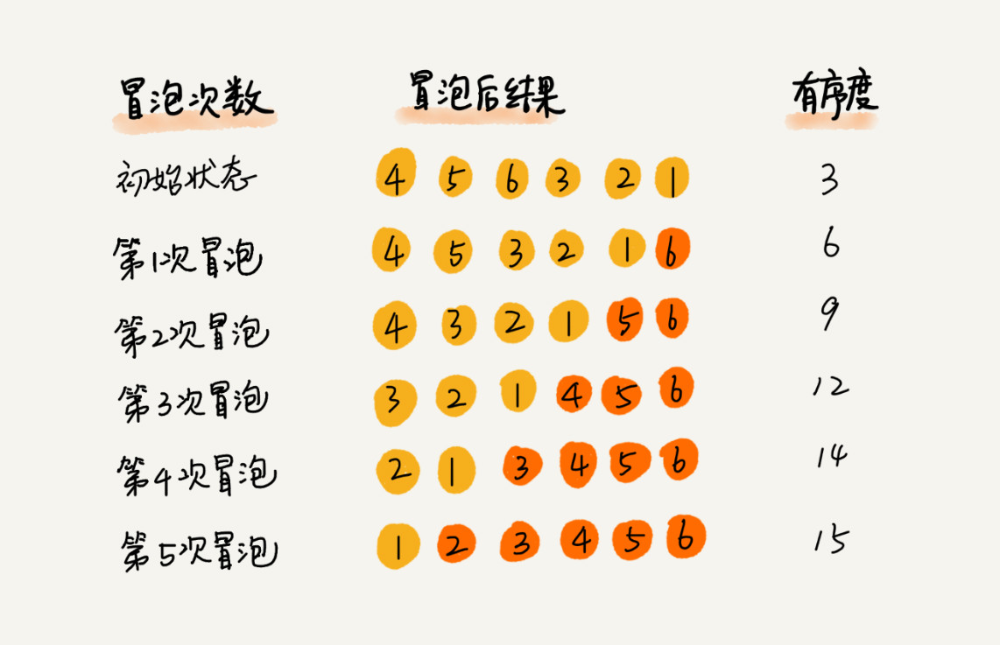

冒泡排序包含两个操作原子, **比较**和**交换**. **每交换一次, 有序度加1**. 不管算法怎么改进, **交换次数**是确定的, 即为**逆序度**, 也就是**`n*(n-1)/2` - 初始有序度**. 本例就是`15-3 = 12`, 需要进行`12`次交换操作.

对于`n`个数据的数组进行冒泡排序, 平均交换次数:

* 最坏情况, 初始有序度是`0`, 进行`n*(n-1)/2`次交换.
* 最好情况, 初始状态的有序度是`n*(n-1)/2`, 不需要及交换.

取中间值`n*(n-1)/4`, 表示初始有序度平均的情况.

### 插入排序(`Insertion Sort`)

一个有序数组, 添加一个新的数据后, 如何继续保持数据有序? **只要遍历数组, 找到数据应该插入的位置将其插入即可**.

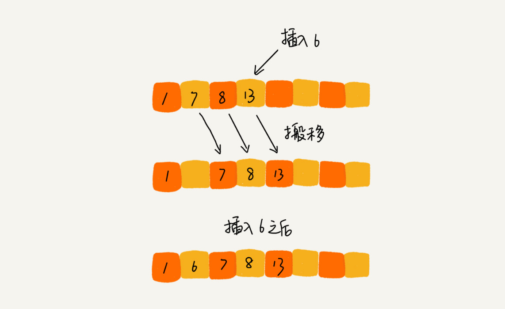

动态排序过程, 即动态地往有序集合中添加数据, 通过这种方法保持集合中的数据一直有序.

**静态数据, 简介上面的插入方法, 进行排序. 这就是插入排序算法**.

#### 插入排序具体是如何解除上面的思想来实现排序?

* 数组中的数据分为两个区间
	* 已排序区
	* 未排序区
* 初始排序区间只有一个元素(数组的第一个元素)
* **插入算法的核心**, 取未排序区间中的元素, 在已排序区间中找到合适的插入位置将其插入, 并保证排序区间数据一直有序.
	* 重复这个过程, 直到未排序区间中元素为空, 算法结束.

示例, `4,5,6,1,3,2`. 左侧为已排序区间, 右侧为未排序区间.

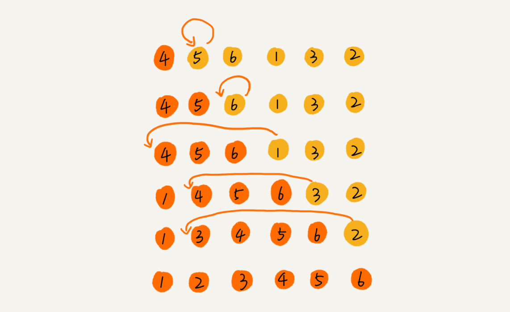

#### 插入排序的操作

* 元素的比较
* 元素的移动

需要将一个数据`a`插入到已排序区间时, 需要拿`a`与已排序区间的元素依次比较大小, 找到合适的插入位置.

找到插入点后, 需要将插入点之后的元素顺序往后移动一位, 腾出位置给元素`a`插入.

* 不同**查找**插入点方法(从头到尾, 从尾到头), 元素的比较次数有区别
* 一个给定的初始序列, 移动操作的次数是**固定的, 等于逆序度**

满有序度是`15`, 初始序列的有序度是`5`, 逆序度是`10`. 移动的个数总和等于`10=3+3+4`.

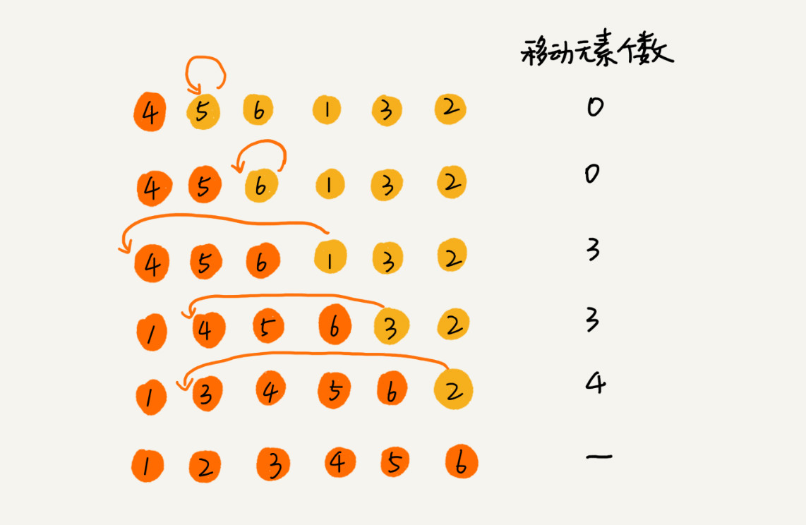

```
// 插入排序，a表示数组，n表示数组大小
public void insertionSort(int[] a, int n) {
  if (n <= 1) return;

  for (int i = 1; i < n; ++i) {
    int value = a[i];
    int j = i - 1;
    // 查找插入的位置
    for (; j >= 0; --j) {
      if (a[j] > value) {
        a[j+1] = a[j];  // 数据移动
      } else {
        break;
      }
    }
    a[j+1] = value; // 插入数据
  }
}
```

#### 插入排序算法

* 插入排序算法运行不需要额外的存储空间, 空间复杂度是`O(1)`. 是**原地排序算法**.
* 对于值相同的元素, 后面出现的元素, 插入到前面出现元素的后面, **保持原有的前后顺序不变**, 是**稳定的排序算法**.
* 时间复杂度
	* 最好情况: 有序数组, 不需要搬移数据. 从尾到头在有序数组里找插入位置, 每次只需要比较一个数据就能确定插入的位置. 时间复杂度是`O(n)`.
	* 最坏情况: 倒序数组, 每次插入都相当于在数组的第一个位置插入新的数据, 需要移动大量数据, 最坏情况时间复杂度为`O(n^2)`.
	* 平均时间复杂度
		* 在数组中插入一个数据的平均时间复杂度是`O(n)` **第5讲**
		* 插入排序, 每次插入操作都相当于在数组中插入一个数据, 循环执行`n`次插入操作, 平均时间复杂度是`O(n^2)`.

### 选择排序

类似插入排序, 分为已排序区间和未排序区间. **选择排序每次会从未排序区间中找到最小的元素, 将其放到已排序区间的末尾**.

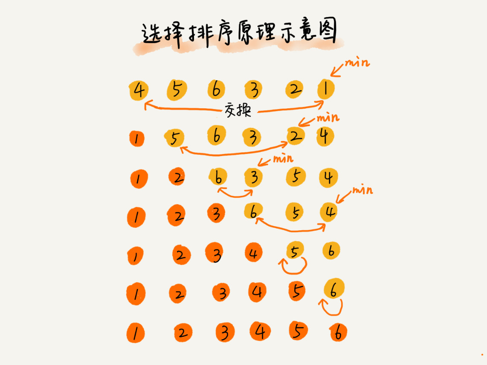

* 空间复杂度是`O(1)`
* 时间复杂度
	* 最好`O(n^2)`
	* 最坏`O(n^2)`
	* 平均`O(n^2)`

**不是稳定的排序算法**, 选择排序每次都要找剩余未排序元素中的最小值, 并和前面的元素交换, 这样会破坏稳定性.

`5,8,5,2,9`, 第一次, 最小元素`2`, 与第一个`5`交换位置. 那么第一个`5`和中间的`5`顺序就变了, 不稳定.

### 冒泡排序 vs 插入排序

* 冒泡排序不管怎么优化, 元素的交换次数是固定值, 原始数据的逆序度.
* 插入排序不管怎么优化, 元素的移动次数是固定值, 原始数据的逆序度.

冒泡排序的数据交换比插入排序的数据移动复杂. 冒泡排序需要`3`个赋值操作, 插入排序需要`1`个赋值操作.

```
冒泡排序中数据的交换操作：
if (a[j] > a[j+1]) { // 交换
   int tmp = a[j];
   a[j] = a[j+1];
   a[j+1] = tmp;
   flag = true;
}

插入排序中数据的移动操作：
if (a[j] > value) {
  a[j+1] = a[j];  // 数据移动
} else {
  break;
}
```

冒泡排序和插入排序对同一个逆序度是`K`的数组操作. 冒泡排序, 需要`K`次交换操作, 需要`3`个赋值语句. 总交换时间是`3*K`单位时间.

插入排序需要`K`个单位时间.

**性能上插入排序更好**

### 总结

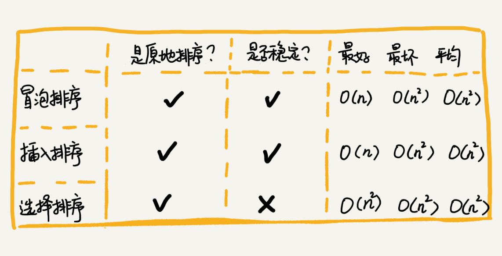

## 扩展