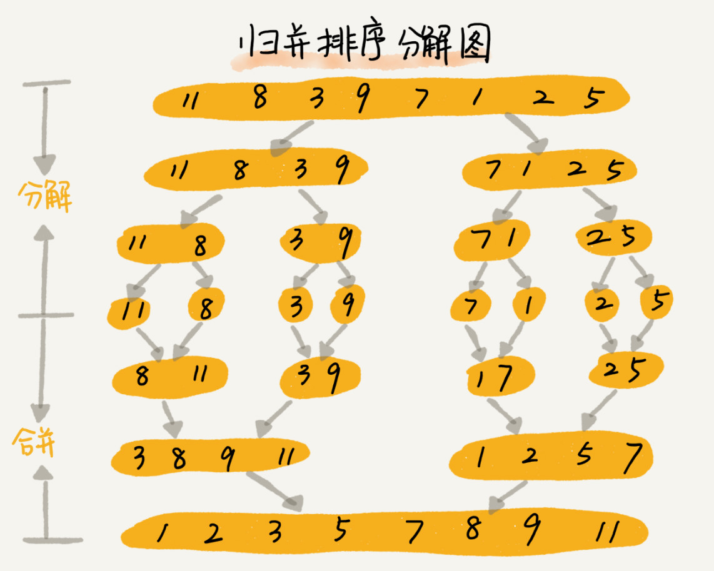
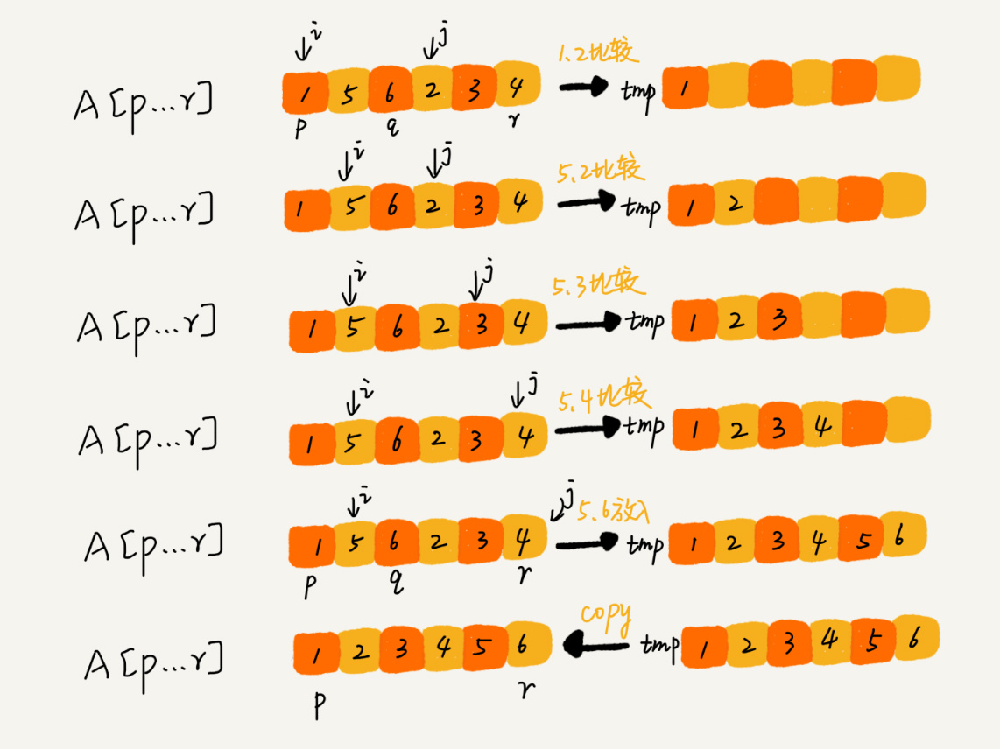
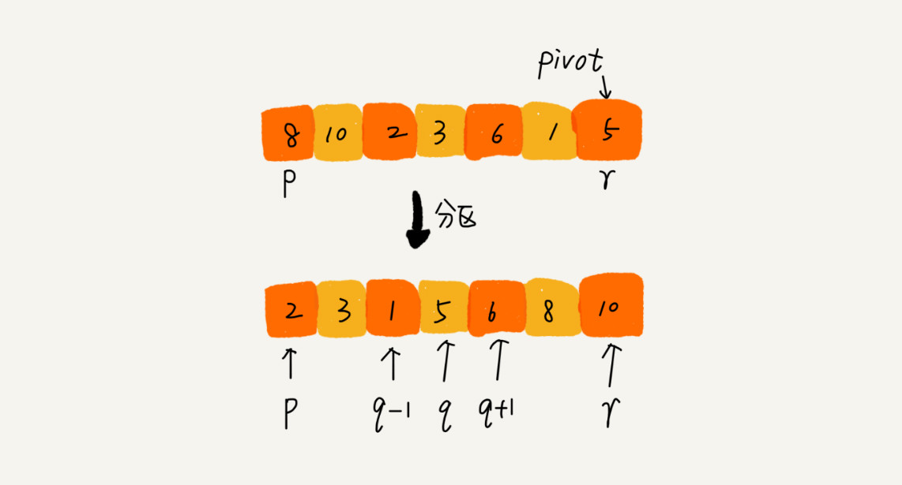
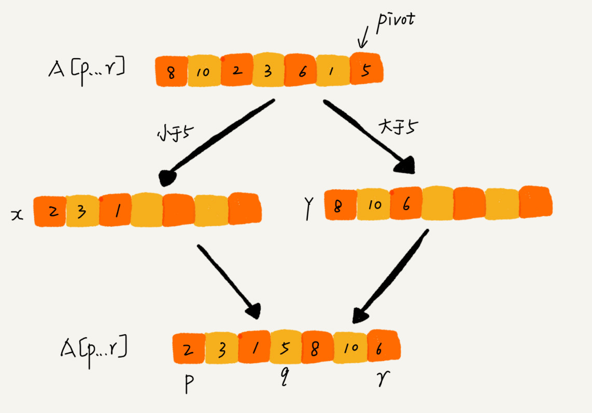
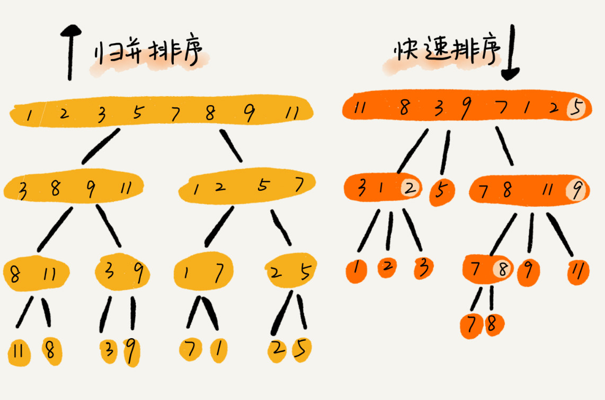
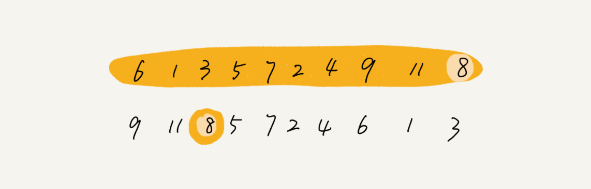

# 12 | 排序（下）：如何用快排思想在O(n)内查找第K大元素？

## 笔记

归并排序和快速排序都用到了**分治思想**. 解决非排序问题"如何在O(n)的时间复杂度内查找一个无序数组中的第K个大元素".

### 归并排序原理

**归并排序(Merge Sort)**

核心思想:

* 把数组从中间分成前后两部分
* 对前后两部分分别排序
* 再将排好序的两部分合并在一起



**分治思想**, 将一个大问题分解成小的子问题来解决. 

分治思想和递归思想很像, 分治算法一般都是用**递归**来实现的. **分治是一种解决问题的处理思想, 递归是一种编程技巧**.

归并排序的递推公式:

```
递推公式：
merge_sort(p…r) = merge(merge_sort(p…q), merge_sort(q+1…r))

终止条件：
p >= r 不用再继续分解
```

* `merge_sort(p…r)`, 下标从`p`到`r`之间的数组排序.
* 这个排序问题转换为两个子问题.
	* `merge_sort(p…q)`
	* `merge_sort(q+1…r)`
	* `q`等于`p`和`r`的中间位置, 也就是`(p+r)/2`

伪代码

```
// 归并排序算法, A是数组，n表示数组大小
merge_sort(A, n) {
  merge_sort_c(A, 0, n-1)
}

// 递归调用函数
merge_sort_c(A, p, r) {
  // 递归终止条件
  if p >= r  then return

  // 取p到r之间的中间位置q
  q = (p+r) / 2
  // 分治递归
  merge_sort_c(A, p, q)
  merge_sort_c(A, q+1, r)
  // 将A[p...q]和A[q+1...r]合并为A[p...r]
  merge(A[p...r], A[p...q], A[q+1...r])
}
```

`merge(A[p…r], A[p…q], A[q+1…r])`的作用是, 将已经有序的`A[p…q]和 A[q+1…r]`合并成一个有序的数组.

* 申请一个临时数组`tmp`, 大小与`A[p...r]`相同. 
* 两个游标`i`和`j`, 分别指向`A[p...q]`和`A[q+1...r]`的第一个元素.
* 比较两个元素`A[i]`和`A[j]`(最小的放入到临时数组).
	* 如果`A[i]<=A[j]`, 则把`A[i]`放入到临时数组`tmp`中, `i`后移一位.
	* 否则, `A[j]`放入到数组`tmp`中, `j`后移一位.
	* 直到其中一个子数组中的所有数据都放入临时数组中, 再把另一个数组中的数据依次加入到临时数组的末尾, 这时, 临时数组中存储的就是两个子数组合并之后的结果了. 
	* 最后, 把临时数组`tmp`中的数据拷贝到原始数组`A[p...r]`中.



`merge()`函数伪代码

```
merge(A[p...r], A[p...q], A[q+1...r]) {
  var i := p，j := q+1，k := 0 // 初始化变量i, j, k
  var tmp := new array[0...r-p] // 申请一个大小跟A[p...r]一样的临时数组
  while i<=q AND j<=r do {
    if A[i] <= A[j] {
      tmp[k++] = A[i++] // i++等于i:=i+1
    } else {
      tmp[k++] = A[j++]
    }
  }
  
  // 判断哪个子数组中有剩余的数据
  var start := i，end := q
  if j<=r then start := j, end:=r
  
  // 将剩余的数据拷贝到临时数组tmp
  while start <= end do {
    tmp[k++] = A[start++]
  }
  
  // 将tmp中的数组拷贝回A[p...r]
  for i:=0 to r-p do {
    A[p+i] = tmp[i]
  }
}
```

备注:

```
echo k++; //0
echo k; //1
```

### 归并排序的性能分析

#### 1. 是稳定的排序算法

合并过程中, 如果`A[p…q]`和`A[q+1…r]`之间有值相同的元素, 伪代码里面是先把`A[p…q]`中的元素放入`tmp`数组. **保证了值相同的元素, 在合并前后的先后顺序不变**.

#### 2. 归并排序的时间复杂度是多少

递推关系公式.

```
T(a) = T(b) + T(c) + K
```

* `T(a)`是求解问题`a`的时间
* `T(b)`是求解问题`b`的时间
* `T(c)`是求解问题`c`的时间
* `K`是将两个子问题`b,c`的结果合并成问题`a`的结果所消耗的时间.

归并排序的时间复杂度.

假设

* 对`n`个元素进行归并排序需要的时间是`T(n)`
* 分解成两个子数组排序的时间都是`T(n/2)`
* `merge()`函数合并两个有序子数组的时间复杂度是`O(n)`

```
T(1) = C；   n=1时，只需要常量级的执行时间，所以表示为C。
T(n) = 2*T(n/2) + n； n>1
```

继续分解公示, 根据`T(n) = 2*T(n/2) + n`分解

```
T(n) = 2*T(n/2) + n
     = 2*(2*T(n/4) + n/2) + n = 4*T(n/4) + 2*n
     = 4*(2*T(n/8) + n/4) + 2*n = 8*T(n/8) + 3*n
     = 8*(2*T(n/16) + n/8) + 3*n = 16*T(n/16) + 4*n
     ......
     = 2^k * T(n/2^k) + k * n
     ......
```

得到`T(n) = 2^kT(n/2^k)+kn`, 当`T(n/2^k)=T(1)`时, 即`n/2^k=1 => n = 2^k`, 得到` k=log2n`. `k`带入公示, 可得`T(n)=Cn+nlog2n`. 则`T(n)=O(nlogn)`

归并排序的执行效率与要排序的原始数组有序程度无关, 所以其时间复杂度较为稳定. 最好,最坏还是平均时间复杂度都是`O(nlogn)`.

#### 3. 归并排序的空间复杂度是多少?

归并排序不是原地排序算法. 因为归并排序的合并函数. 在合并两个有序数组为一个有序数组时, 需要额外的存储空间.

尽管每次合并操作都需要申请额外的内存空间, 但在合并完成之后, 临时开辟的内存空间就被释放掉了. 任意时刻, `CPU`只会有一个函数在执行, 也就只有一个临时的内存空间在使用. **临时空间最大也不会超过`n`个数据的大小, 所以时间复杂度是`O(n)`**

### 快速排序的原理

也是利用分治思想.

思想:

* 待排序数组下标从`p`到`r`
* 选择`p`到`r`之间的任意个数据作为`pivot`(区分点)
* 遍历`p`到`r`之间的数据
	* 小于`piovt`的放到左边
	* 大于`pivot`的放到右边
	* `pivot`放到中间
* 至此, 数组`p`到`r`分为成了三个部分
	* `p`到`q-1`是小于`pivot`
	* 中间是`pivot`
	* `q+1`到`r`是大于`pivot`



根据分治, 递归的处理思想, 递归排序下标从`p`到`q-1`自建的数据和下标从`q+1`到`r`之间的数据, 直到区间缩小为`1`, 就说明所有的数据都有序了.

```
递推公式：
quick_sort(p…r) = quick_sort(p…q-1) + quick_sort(q+1… r)

终止条件：
p >= r
```

伪代码

```
// 快速排序，A是数组，n表示数组的大小
quick_sort(A, n) {
  quick_sort_c(A, 0, n-1)
}
// 快速排序递归函数，p,r为下标
quick_sort_c(A, p, r) {
  if p >= r then return
  
  q = partition(A, p, r) // 获取分区点
  quick_sort_c(A, p, q-1)
  quick_sort_c(A, q+1, r)
}
```

**如果不考虑空间消耗**, 申请两个临时数组`X`和`Y`, 遍历`A[p...r]`, 将小于`pivot`的元素拷贝到临时数组`X`, 将大于`pivot`的元素拷贝到临时数组`Y`, 最后再将数组`X`和数组`Y`中的数据顺序拷贝到`A[p...r]`.



**我们希望快排是原地排序算法, 那么它的空间复杂度是O(1)**, 那么`partion()`分区函数不能占用太多额外的内存空间, 就需要在`A[p...r]`的原地完成分区操作.

伪代码

```
partition(A, p, r) {
  pivot := A[r]
  i := p
  for j := p to r-1 do {
    if A[j] < pivot {
      swap A[i] with A[j]
      i := i+1
    }
  }
  swap A[i] with A[r]
  return i
```

类似**选择排序**, 通过游标`i`把`A[p...r-1]`分成两部分.

* `A[p...i-1]`的元素都是小于`pivot`, **已处理空间**
* `A[i...r-1]`是**未处理空间**

每次从未处理的区间`A[i…r-1]`取出一个元素`A[j]`, 与`pivot`对比, 如果小于`pivot`, 则将其加入到已处理区间的尾部, 就是`A[i]`的位置.

因为插入涉及到数据搬移, 我们这里使用交换. 在`O(1)`的时间复杂度内完成插入操作. 所以`A[i]`和`A[j]`交换, 可以在`O(1)`时间复杂度内将`A[j]`放到下标为`i`的位置.


**不稳定排序算法**, `6，8，7，6，3，5，9，4`, 经过第一次的分区操作两个`6`的顺序会变.

```
4 是 pivot

到 3 时, 3 < 4, 3 和第一个6换位置, 第一个 6 会换到 第二个 6 的后面.
```



* 归并排序的处理过程是**由下到上**的, **先处理子问题, 在合并**
* 快排的处理过程是**由上到小**, **先分区, 在处理子问题**

### 快速排序的性能分析

如果每次分区操作, 都能**正好把数据分成大小接近相等的两个小区间**, 快排的时间复杂度递推求解公示跟归并是相同的. 快排的时间复杂度也是`O(nlogn)`.

```
T(1) = C；   n=1时，只需要常量级的执行时间，所以表示为C。
T(n) = 2*T(n/2) + n； n>1
```

**实际上很难分成大小接近相等的两个小区间**，如`1,3,5,6,8`. 如果每次选最后一个元素作为`pivot`, 那每次分区得到的两个区间都是不均等的. 需要进行大约`n`次分区操作, 才能完成快排. 每次分区**平均扫描**大约`2/n`个元素. 

快排的时间复杂度就从`O(nlogn)`退化成了`O(n^2)`.

* 最好情况, 分区均衡
* 最坏情况, 分区不均衡

`T(n)`在大部分情况下的时间复杂度都可以做到`O(nlogn)`, 只有在极端情况下, 才会退化到`O(n^2)`


### 题

`O(n)`时间复杂度内求无序数组中的第`K`大元素, 比如`4， 2， 5， 12， 3`这样一组数据, 第`3`大元素就是`4`.

` A[0…n-1]`的最后一个元素`A[n-1]`作为`pivot`

* A[0…p-1]
* A[p]
* A[p+1…n-1]

如果`p+1=K`, 则`A[p]`就是解.

* 如果`K>p+1`,说明第`K`大元素出现在`A[p+1…n-1]`区间.
* 如果`K<p+1`,那我们就在`A[0…p-1]`区间查找.



第一次分区查找，我们需要对大小为 n 的数组执行分区操作，需要遍历 n 个元素。第二次分区查找，我们只需要对大小为 n/2 的数组执行分区操作，需要遍历 n/2 个元素。依次类推，分区遍历元素的个数分别为、n/2、n/4、n/8、n/16.……直到区间缩小为 1.

`n+n/2+n/4+n/8+…+1`的和等于`2n-1`. 所以时间复杂度是`O(n)`.

## 扩展