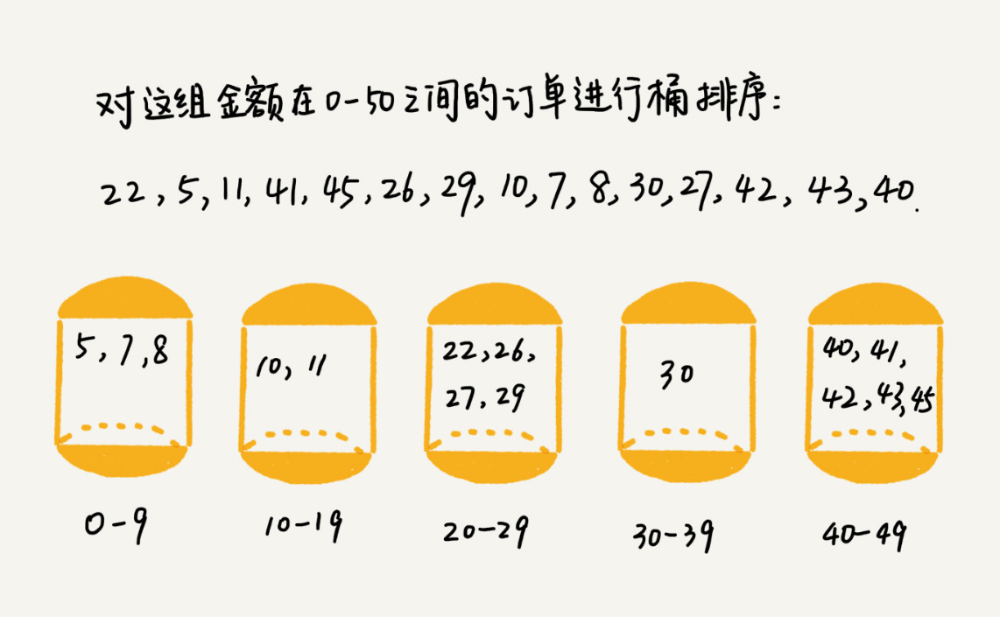
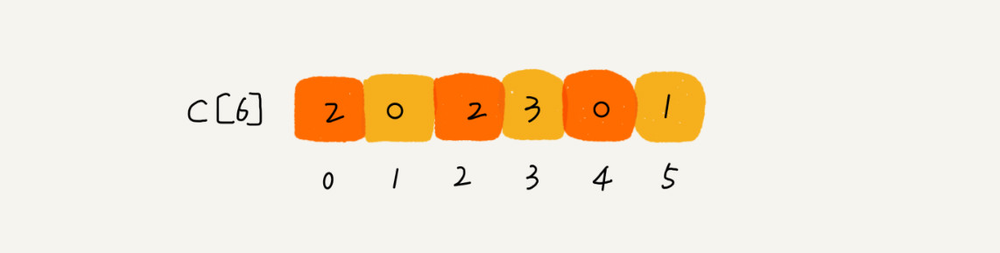
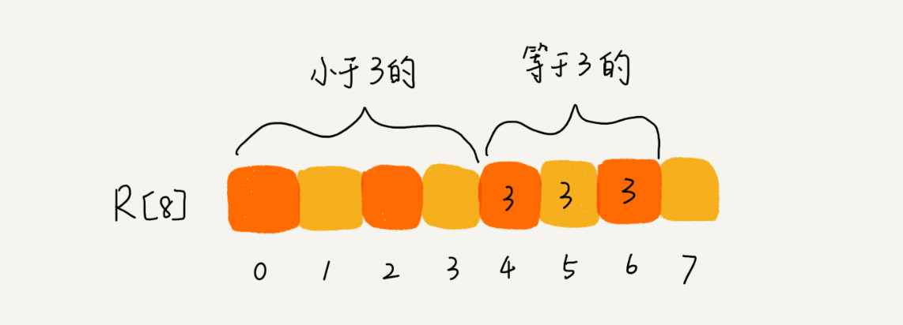
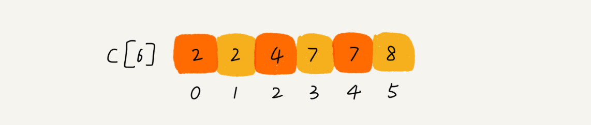
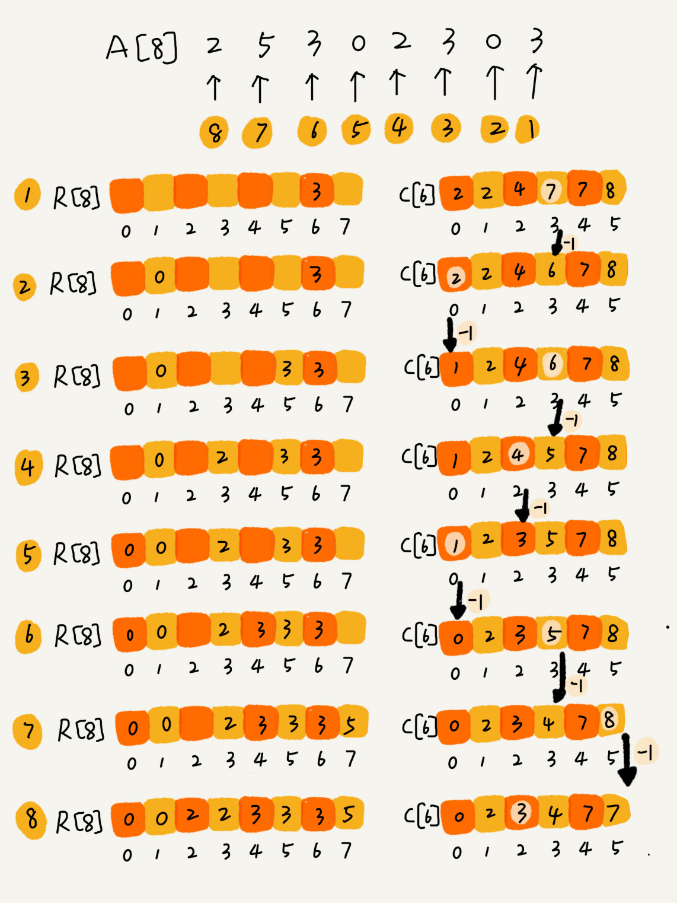
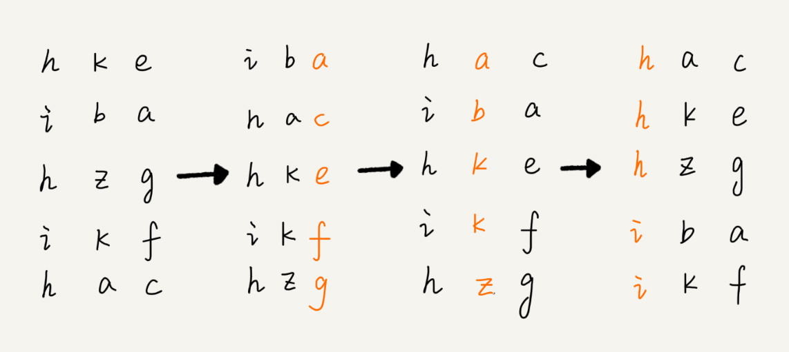

# 13 | 线性排序：如何根据年龄给100万用户数据排序？

## 笔记

`O(n)`排序算法: 桶排序, 计数排序, 基数排序. 这些排序算法的时间复杂度是**线性**的, 叫做**线性排序**.

这几种排序算法, 都不是基于比较的排序算法, 都**不涉及元素之间的比较操作**.

这几种排序算法对**要排序的数据要求很苛刻**.

### 桶排序(`Bucket Sort`)

核心思想: **将要排序的数据分到几个有序的桶里, 每个桶里的数据再单独进行排序. 再把每个桶里的数据按照顺序依次取出, 组成的序列就是有序的**.



如果要排序的数据有`n`个, 我们把它们均匀地划分到`m`个桶内, 每个桶里就有`k=n/m`个元素. 每个桶内部使用快速排序, 时间复杂度为`O(k * logk)`. `m`个桶排序的时间复杂度就是`O(m * k * logk)`, 因为`k=n/m`, 所以整个桶排序的时间复杂度就是`O(n*log(n/m))`. 当桶的个数`m`接近数据个数`n`时, `log(n/m)`就是一个非常小的常量, 这个时候桶排序的时间复杂度接近`O(n)`.

#### 对排序数据要求

* 要排序的数据能划分成`m`个桶
* 桶与桶之间有着天然大大小顺序, 这样每个桶排序完成之后, 桶与桶之间的数据不需要再进行排序.
* 数据在各个桶之间是比较均匀的. 如果不平均, 极端情况下, 所有的数据都被划分到一个桶里, 那就退化为`O(nlogn)`的排序算法

#### 适用场景

比较适合用在外部排序中. 数据在磁盘， 数据量比较大, 内存有限, **无法将数据全部加载到内存中**.

如`10GB`订单数据, 按订单金额进行排序, 内存只有几百`MB`, 无法一次性把`10GB`的数据都加载到内存中.

* 首先扫描一遍文件, 看订单金额所处的数据范围. 假设, 扫描后可知订单金额最小1元, 最大是10万元. 
* 把所有订单根据金额划分到100个桶里, `1-1000, 1001-200...`.
* 理想期刊, 订单金额在1到10万之间均匀分布, 订单会被均匀划分到100个文件中, 每个文件存储大约`100MB`的订单数据, **将这些文件依次放到内存中, 用快排来排序**.
* 所有文件都排序好之后, 按照文件编号, 从小到大依次读取每个小文件中的数据, 并将其写入到一个文件中.
* 最后这个文件就是排序好的文件.

如果数据不能均匀分布, 有的文件比较大, 没法一次性读到内存中. 继续将数据划分到更小的区间如`1-1000`划分为10个小文件`1-100, 101-200...`. 直到所有的文件都可以被读到内存中.

### 计数排序(`Counting sort`)

**计数排序是桶排序的一种特殊情况**. 当要排序的`n`个数据, 所处的范围并不大, 比如最大值是`k`, 我们可以把数据划分成`k`个桶. 每个桶内的数据值都是相同的, **省掉了桶内排序的时间**.

比如高考, 满分是`900`分, 最小是`0`分. 我们分成`901`个桶, 对应分数从`0`分到`900`分.

根据考生成绩, 把考生划分到这`901`个桶里. 因为桶内数据都是分数相同的考生, 所以并不需要再进行排序. 只需要依次扫描每个桶, 将桶内的考生依次输出到一个数组中, 就实现了所有考生的排序. 因为**只涉及扫描遍历操作, 所以时间复杂度是`O(n)`**.

#### 示例(计数的含义)

`8`个考生, 分数在`0`到`5`之间. 这`8`个考生我们放在一个数组`A[8]`中, 分别是`2，5，3，0，2，3，0，3`.

考生成绩从`0`到`5`分. 使用大小为`6`的数组`C[6]`. 下标对应分数, 存储的是考生的个数. 遍历一遍考生分数, 可以得到`C[6]`的值.



可以得到:

* 分数为`3`分的考生有`3`个.
* 小于`3`分的考生有`4`个.



对`C[6]`数组顺序求和, `C[k]`里面存储小于等于分数`k`的考生个数.



比如`C[3]`的值是`7`, 就表示到目前为止, 包括自己在内, 分数小于等于`3`的考生有`7`个, **也就是说, `3`是数组`R`中的第`7`个元素(下标`6`的位置)**. 当`3`放入到数组`R`中后, 小于等于`3`的元素就只剩下`6`个了, 所以`C[3]`变为`6`.



伪代码

```
// 计数排序，a是数组，n是数组大小。假设数组中存储的都是非负整数。
public void countingSort(int[] a, int n) {
  if (n <= 1) return;

  // 查找数组中数据的范围
  int max = a[0];
  for (int i = 1; i < n; ++i) {
    if (max < a[i]) {
      max = a[i];
    }
  }

  int[] c = new int[max + 1]; // 申请一个计数数组c，下标大小[0,max]
  for (int i = 0; i <= max; ++i) {
    c[i] = 0;
  }

  // 计算每个元素的个数，放入c中
  for (int i = 0; i < n; ++i) {
    c[a[i]]++;
  }

  // 依次累加
  for (int i = 1; i <= max; ++i) {
    c[i] = c[i-1] + c[i];
  }

  // 临时数组r，存储排序之后的结果
  int[] r = new int[n];
  // 计算排序的关键步骤，有点难理解
  for (int i = n - 1; i >= 0; --i) {
    int index = c[a[i]]-1;
    r[index] = a[i];
    c[a[i]]--;
  }

  // 将结果拷贝给a数组
  for (int i = 0; i < n; ++i) {
    a[i] = r[i];
  }
}
```

#### 适用场景

* 数据范围不大的场景中
* 只能给非负整数排序, 如果有其他类型, 需要将其在不改变相对大小的情况下, 转化为非负整数
	* 如小数, 统一乘以`10, 100, ...`转换为整数
	* 负数, 统一加上`10, 100, ...`转换为整数

### 基数排序

假如`10`万个手机号码, 从小到大排序.

规律: 比较两个手机号码`a,b`的大小, 如果前面几位中, `a`手机号码已经比`b`手机号码大了, 那后面几位就不用看了.

**借鉴11章的稳定排序, 订单示例的思想**

* 先按照最后一位排序手机号码.
* 再按照倒数第二位重新排序.
* 以此类推, 最后按照第一位重新排序. 经过`11`次排序之后, 手机号码都有序了.



按照每位来排序的排序算法是要**稳定的**.

只根据每一位来排序, 可以用**桶排序**和**计数排序**, 复杂度可以是`O(n)`. 如果要排序的数据有`k`位, 则复杂度是`O(k*n)`. 如果`k`不大, 则**基数排序**的时间复杂度就近似于`O(n)`.

对于不等长的数据, 可以把补位. 然后继续使用基数排序.

**基数排序对要排序的数据是有要求的, 需要可以分割出独立的"位"来比较, 而且位之间有递进的关系, 如果`a`数据的高位比`b`数据大, 那剩下的低位就不用比较了. 除此之外, 每一位的数据范围不能太大, 要可以用线性排序算法来排序, 否则, 基数排序的时间复杂度就无法做到 `O(n)`了**.

### 课后题

**题**

假设我们现在需要对 D，a，F，B，c，A，z 这个字符串进行排序，要求将其中所有小写字母都排在大写字母的前面，但小写字母内部和大写字母内部不要求有序。比如经过排序之后为 a，c，z，D，F，B，A，这个如何来实现呢？如果字符串中存储的不仅有大小写字母，还有数字。要将小写字母的放到前面，大写字母放在最后，数字放在中间，不用排序算法，又该怎么解决呢？

**答**

用两个指针a、b：a指针从头开始往后遍历，遇到大写字母就停下，b从后往前遍历，遇到小写字母就停下，交换a、b指针对应的元素；重复如上过程，直到a、b指针相交。
对于小写字母放前面，数字放中间，大写字母放后面，可以先将数据分为小写字母和非小写字母两大类，进行如上交换后再在非小写字母区间内分为数字和大写字母做同样处理。

## 扩展