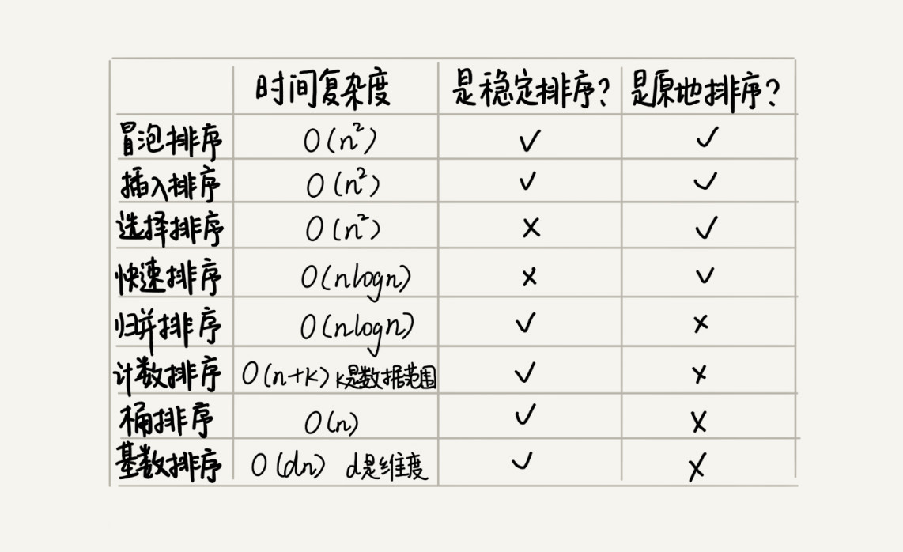

# 14 | 排序优化：如何实现一个通用的、高性能的排序函数？

## 笔记

**如何实现一个通用的, 高性能的排序函数**

### 如何选择合适的排序算法



* 线性排序: 时间复杂度较低, 使用场景特殊.
* 小规模数据排序, 可以选择时间复杂度是`O(n^2)`
* 大规模数据排序, 可以选择时间复杂度是`O(nlogn)`, 所以**一般会首选`O(nlogn)`**.

归并排序**不是原地排序算法**, 空间复杂度是`O(n)`, 需要额外占用内存空间. 所以选择不多.

快排使用比较多, 但是最坏情况下的时间复杂度是`O(n^2)`, 如何解决复杂度恶化情况.

### 如何优化快速排序

**`O(n^2)`复杂度出现的主要原因还是因为我们分区点选的不够合理**. 这种情况发生在数据原来就是有序的或者接近有序的, 每次分区点都是选择最后一个数据.

### 如何选择分区点?

最理想的分区点: **被分区点分开的两个分区中, 数据的数量差不多**, 为了提高排序算法的性能, 要尽可能地让每次分区都比较平均.

### 常用分区算法

#### 1. 三数取中

从区间的**首, 尾, 中间**分别取出一个数, 然后对比大小, 取这3个数的中间值作为分区点. 如果要排序的数组表大, 可以增加选取的数.

#### 2. 随机法

随机选择一个元素作为分区点. 并不能保证每次分区点都选的比较好, **从概率角度来说, 不大可能会出现每次分区点都选的很差的情况**.

### 递归过多, 栈堆溢出问题

为避免递归过深而堆栈过小, 导致堆栈溢出.

* 限制递归深度. 一旦递归过深, 超过了我们事先确定的阙值, 就停止递归.
* 在堆上模拟事先一个函数调用栈, 手动模拟递归压栈, 出栈的过程, 这样就没有了系统大小的限制.

### 举例分析排序函数

`Glibc`的`qsort()`. 综合使用了多种排序算法.

`qsort()`优先使用归并排序来排序输入数据. 数据量不大的情况, 额外占用内存问题不大.
数据量大的情况下, 使用快速排序.

`qsort()`选择分区点的方法就是"三数取中法".

`qsort()`是通过自己实现一个堆上的栈, 手动模拟递归来解决的.

在快速排序过程中, 当要排序的区间中, 元素的个数小于等于`4`时候, `qsort()`就退化为插入排序, 不再继续使用递归来做快速排序. **在小规模数据面前, `O(n^2)`时间复杂度的算法并不一定比`O(nlogn)`的算法执行时间长**.

**实际上时间复杂度并不等于代码实际的运行时间**.

**时间复杂度代表的是一个增长趋势**, `O(n^2)`比`O(nlogn)`的增长趋势猛. 大`O`表示法会省略低阶, 系数和常数. `O(nlogn)`在没有省略低阶、系数、常数之前可能是`O(knlogn + c)`, 而且`k`和`c`有可能还是一个比较大的数.


```
# 加入 k=1000, c=200. 对小规模数据 n=100, n^2的值实际上比 knlogn+c 要小

knlogn+c = 1000 * 100 * log100 + 200 远大于10000

n^2 = 100*100 = 10000
```

**所以小规模数据我们选择比较简单的, 不需要递归的插入排序算法**

`qsort()`还在插入排序的算法实现中, 利用了**哨兵**来简化代码.

## 扩展