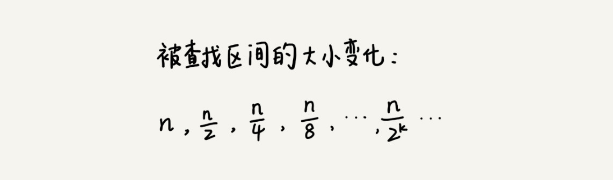

# 15 | 二分查找（上）：如何用最省内存的方式实现快速查找功能？

## 笔记

1000万个数据, 每个数据占`8`个字节. 设计数据结构和算法, 快速判断某个整数是否出现在这1000万数据, 不要占用太多的内存空间.

* 二分查找, 1000万个数据, 每个数据占`8`个字节约为`80MB`内存.
* 散列表, 二叉树需要额外的内存空间. `100MB`内存不够, 二分只依赖数组,内存较为固定.

### 无处不在的二分思想

给定一个范围才`0 - 100`的数字`23`, 猜几次猜中.


二分法, `7`次就猜出来了.

示例, 10个订单, 金额分别是`8，11，19，23，27，33，45，55，67，98`. 查询`19`元订单.


**二分查找针对的是一个有序的数据集合, 查找思想有点类似分治思想. 每次都通过跟区间的中间元素对比, 将待查找的区间缩小为之前的一半, 知道找到要查找的元素, 或者区间被缩小为`0`.

#### `O(logn)`惊人的查找速度

假设数据大小是`n`, 每次查找后数据都会缩小为原来的 一半(除以2), 最坏情况下, 知道查找空间被缩小为空, 才停止.



`n/(2^k) = 1`时, `k`的值就是总共缩小的次数. 每次缩小操作只涉及两个数据的大小比较, 所以, 经过了`k`次区间的缩小操作, 时间复杂度就是`O(k)`. 因为`n/(2^k) = 1`, `k=log2n`, 所以时间复杂度是`O(logn)`.

#### `O(logn)` vs `O(1)`

即使`n`非常大, 对应的`logn`也很小. 比如`n=42亿`, 在这个量级做数据查找最多需要比较`32`次.

因为大`O`表示法, 会省略掉常数, 系数和低阶. 对弈常量级时间复杂度的算法来说, `O(1)`有可能是一个非常大的常量值. 如`O(1000)`, `O(10000)`.

#### 对数 和 指数

反过来, **对数对应指数**. 在大规模数据面前, 指数时间复杂度的算法是无效的.

### 二分查找的递归与非递归实现

#### 1. 有序数组中不存在重复元素

用二分查找值等于给定值的数据.

```
public int bsearch(int[] a, int n, int value) {
  int low = 0;
  int high = n - 1;

  while (low <= high) {
    int mid = (low + high) / 2;
    if (a[mid] == value) {
      return mid;
    } else if (a[mid] < value) {
      low = mid + 1;
    } else {
      high = mid - 1;
    }
  }

  return -1;
}
```

容易出错的三个地方:

1. 循环退出条件, `low <= high`而不是`low < high`
	* `high = mid - 1`和`low = mid + 1`是`low <= high`的终止条件
2. `mid`取值
	* `mid=(low+high)/2`, 如果`low`和`high`交大, 两者之和就有可能会溢出.
	* `low+(high-low)/2`, 不会溢出.
	* `low+((high-low)>>1)`, 会运算效率更高.
3. `low`和`high`的更新
	* `low=mid+1，high=mid-1`防止死循环
	* 如果`low=nid`或者`high=mid`, 当`high=3, low=3`时会造成死循环.

**用递归来实现**

```
// 二分查找的递归实现
public int bsearch(int[] a, int n, int val) {
  return bsearchInternally(a, 0, n - 1, val);
}

private int bsearchInternally(int[] a, int low, int high, int value) {
  if (low > high) return -1;

  int mid =  low + ((high - low) >> 1);
  if (a[mid] == value) {
    return mid;
  } else if (a[mid] < value) {
    return bsearchInternally(a, mid+1, high, value);
  } else {
    return bsearchInternally(a, low, mid-1, value);
  }
}
```

### 二分查找应用场景的局限性

#### 1. 依赖的顺序表结构(数组)

二分查找算法需要按照下标随机访问元素. 我们在数组和链表那两节讲过, 数组按照下标随机访问数据的时间复杂度是`O(1)`, **而链表随机访问的时间复杂度是`O(n)`**. 用链表存储, 二分查找的时间复杂就会变得很高.

#### 2. 二分查找针对的是有序数据

数据必须有序, 如果数据无序, 则要先排序.

排序的时间复杂度最低是`O(nlogn)`.

有序数据, 一次排序, 多次二分查找. 二分查找的编辑成本就会降低.

频繁插入和删除操作的数据, 要想用二分查找, 每次插入, 删除之后都要进行排序. **维护有序的成本较高**.

**二分查找只能用在插入、删除操作不频繁，一次排序多次查找的场景中**.

针对动态数据, 使用**二叉树**。

#### 3. 数据量太小不适合二分查找

数据量太小, 顺序遍历速度也差不多.

如果比较操作比较耗时, 使用二分查找可以有效的减少比较次数.

#### 4. 数据量太大不适合二分查找

数据量太大需要使用数组, 需要**连续的大内存空间**. **连续**的内存空间可能会不够.


## 扩展