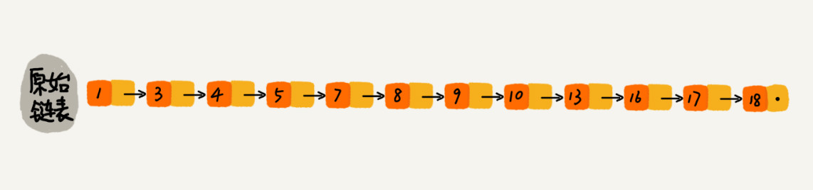
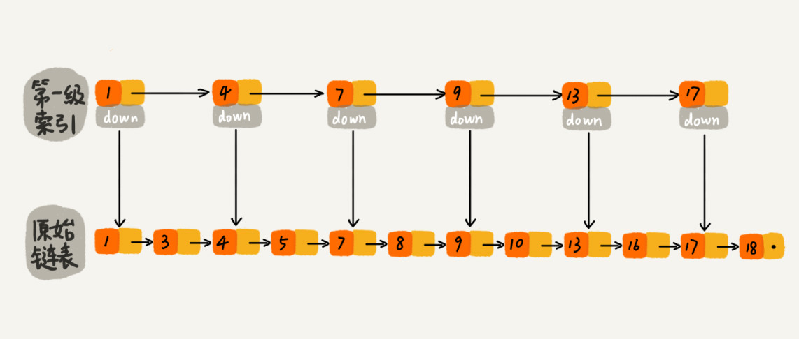
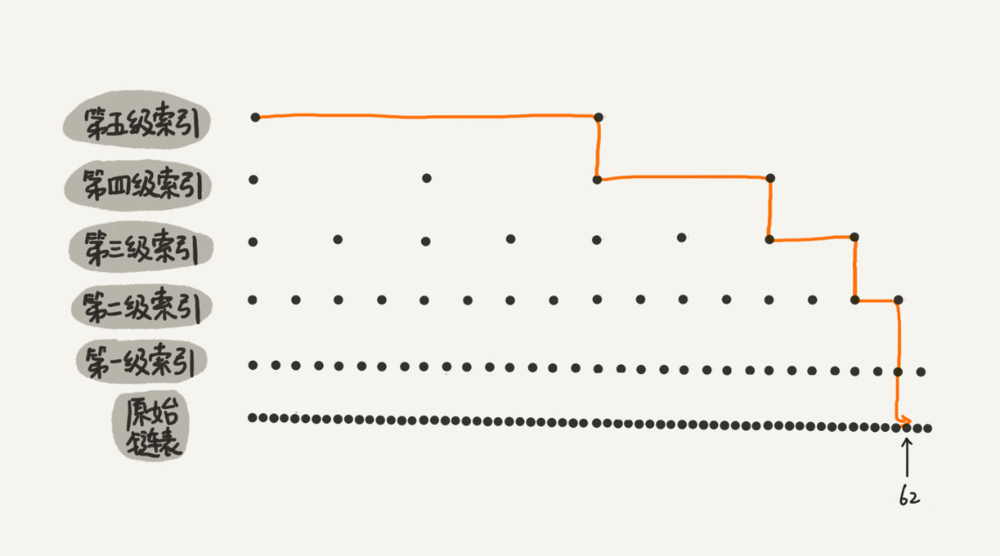
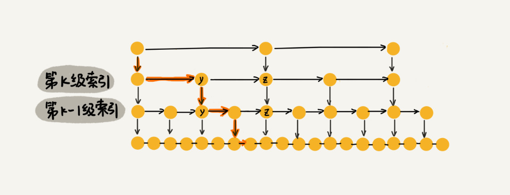
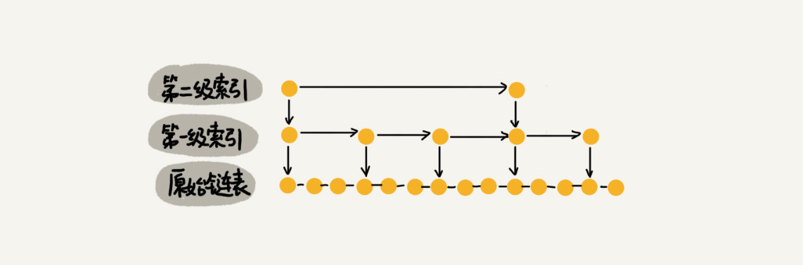
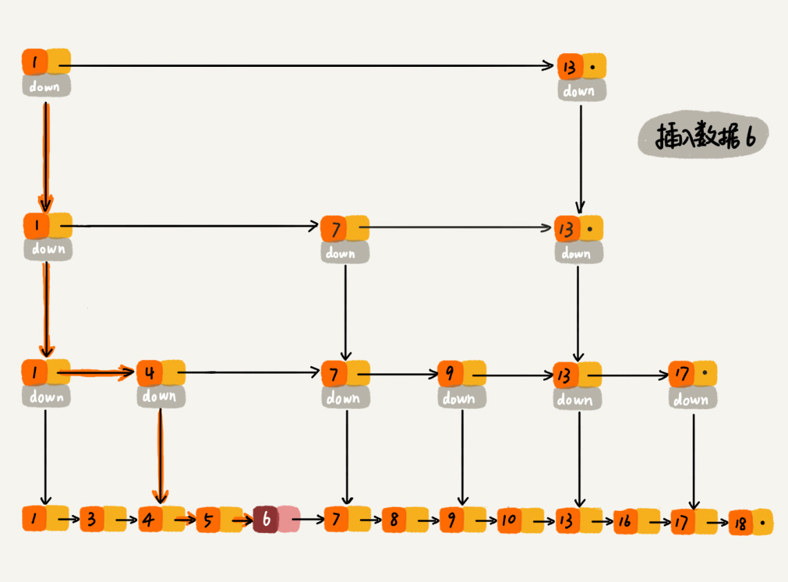
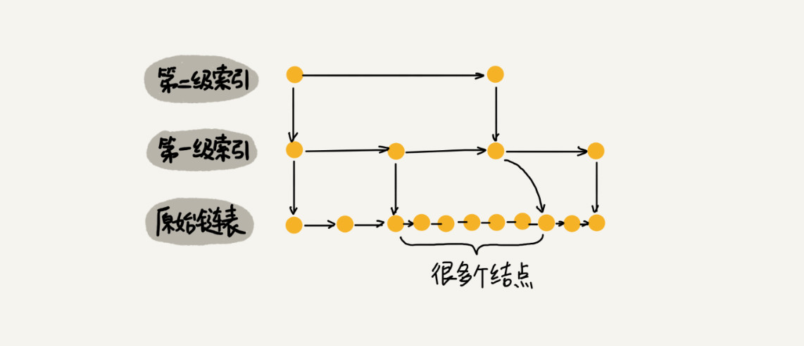
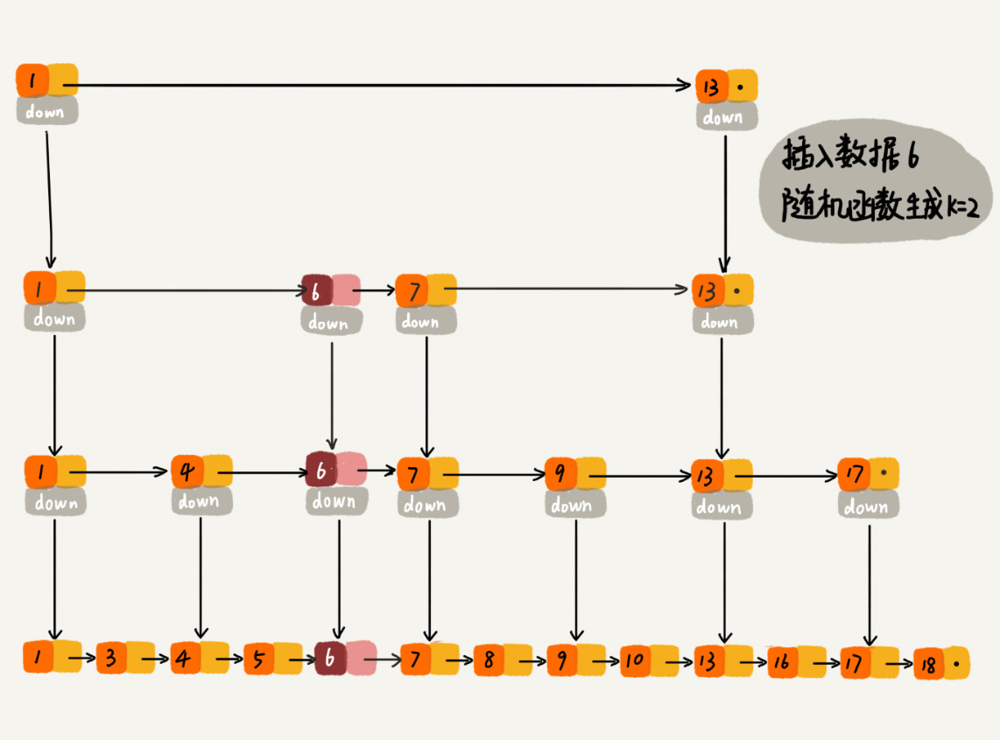

# 17 | 跳表：为什么Redis一定要用跳表来实现有序集合？

## 笔记

链表改造为**跳表(`Skip List`)**.

跳表, 动态数据结构, 支持快速的插入, 删除, 查找操作.

`Redis`中的有序集合(`Sorted Set`)就是用跳表来实现的.

`Redis`的有序集合支持的核心操作有:

* 插入一个数据
* 删除一个数据
* 查找一个数据
* 按照区间查找数据(如值在[100,356]之间)
* 迭代输出有序序列

按照区间来查找数据这个操作, 跳表比红黑树效率高. 跳表在`O(logn)`的时间复杂度内定位区间的起点, 然后在原始链表中顺序往后遍历就可以了.

### 如何理解"跳表"?

链表本身存储的数据是有序的, 想要在其中查找某个数据, **只能从头到尾遍历**. 这样查找效率会很低, 时间复杂度会很高, `O(n)`.



#### 如何提升效率?

* 建立一级索引
* 每两个节点提取一个节点到上一级, 叫做**索引**或**索引层**



`down`表示`down`指针, 指向下一级节点.

比如查找`16`, 我们在索引层查找. 遍历到`13`时, 发现下一个节点是`17`, 那么节点`16`肯定经就在这两个节点之间了.

下来, 通过所以层节点的`down`指针, 下降到原始链表这一层, 继续遍历. 这时候, **我们只需要遍历`2`个节点**, 就可以找到需要的值了.

这样, **原来**需要查找`16`要遍历**10**个节点, 现在值需要遍历**7**个节点.

**加上一层索引之后, 查找一个节点需要遍历的节点个数减少了**, 也就是说**查找效率提高了**.

#### 如果在加上一层索引呢?


现在查找`16`只需要遍历**6**个节点了, **需要遍历的节点数量又减少了**.

#### 大量数据情况下

`64`个节点的链表.



* **原来**没有索引, 查找`62`需要遍历`62`个结点.
* **现在**只需要遍历`11`个节点.

**当链表长度`n`比较大的时候, 在构建索引之后, 查找效率提升会非常明显**.

#### 跳表

**这种链表加多级索引结构, 就是跳表**.

### 用跳表查询到底有多快?

一个单链表中查询某个数据的时间复杂度是`O(n)`.

如果一个链表有`n`个节点, 会有多少索引? **每2个**节点会抽出一个节点作为上一级索引的节点, 那第一级索引的结点个数大约是`n/2`, 第二级索引的节点个数大约是`n/4`, 以此类推. **第`k`级索引的节点个数是第`k-`级索引的节点个数的`1/2`, 那第`k`级索引节点的个数就是`n/(2^k)`.

假设索引有`h`级, 最高级的索引有`2`个结点, 通过上面公示可知`n/(2^h) = 2`, 从而求得`h = log2(n-1)`. 如果包含原始链表这一层, 整个跳表的高度就是`log2n`. 我们在跳表中查询某个数据的时候, 如果每一层都要遍历`m`个节点, 那在跳表中查询一个数据的时间复杂度就是`O(m*logn)`

每一级索引最多只需要遍历`3`个节点.

* 假设要查找数据`x`, 在第`k`级索引中, 遍历到`y`结点之后, 发现`y < x < z`, 通过`y`的`down`指针, 从第`k`级索引下降到第`k-1`级索引. 
* 在`k-1`索引中, `y`和`z`之间只会有`3`个节点, (包含`y`和`z`), 所以在`k-1`级索引中最多只需要遍历`3`个节点.
* **依次类推, 每一级都最多只需要遍历`3`个结点**



通过上面分析可知`m=3`, 所以在跳表中查询任意数据的时间复杂度就是`O(logn)`. 查找时间的复杂度跟二分查找一样. **在单链表实现了二分查找**. **用空间换时间的设计思路**.

### 跳表是不是很浪费内存?

跳表的空间复杂度.

假设原始链表大小为`n`, 第一级索引有`n/2`个结点, 第二级索引有`n/4`个结点, 以此类推, 每上升一级就减少一半, 知道剩下`2`个结点.


索引之和为`n/2+n/4+n/8…+8+4+2 = n-2`, 跳表的空间复杂度是`O(n)`. **如果将包含`n`个节点的单链表构造成跳表, 需要额外`n`个结点的存储空间**.

#### 降低索引占用的内存空间

每三个结点或每五个节点, 抽一个节点到上级索引.



* 第一级索引需要大约`n/3`个结点
* 第二级索引需要大约`n/9`个结点
* 每往上一级, 索引节点个数都除以`3`.

假设最高一级的索引节点个数是`1`.


根据**等比数列求和公示**, 总的索引结点**大约**就是`n/3+n/9+n/27+…+9+3+1=n/2`

```
S = n/3+n/9+n/27+…+9+3+1
3S = n + n/3 + n/9 + ...+ 27 + 9 + 3

3S - S = 2S = n + ... 18 + 6 + 2
2S = n + ... 18 + 6 + 2
S = n/2
```

**比上面每两个结点抽一个结点的索引构建方法, 要减少了一半的索引结点存储空间**.

实际软件开发中，原始链表中存储的有可能是很大的对象, 而索引结点只需要存储关键值和几个指针, 并不需要存储对象, **所以当对象比索引结点大很多时, 那索引占用的额外空间就可以忽略了**.

### 高效的动态插入和删除

#### 插入

支持动态的插入, 删除操作, 而且插入, 删除操作的时间复杂度也是`O(logn)`.

原始链表, 插入结点的时间复杂度是`O(1)`, 但是为了保证原始链表中数据的有序性, 需要先找到要插入的位置, **查找操作比较耗时, 时间复杂度是`O(n)`**.

对于**跳表**来说, 查找某个结点的时间复杂度是`O(logn)`.



#### 删除

如果这个节点在索引中也有出现

* 删除原始链表中的结点
* 删除索引中的结点

单向链表,删除时,还需要找到要删除的结点的前驱结点. 如果是链表, 就不需要考虑这个问题了.

### 跳表索引动态更新

如果插入数据, 不更新索引. 就会出现`2`个节点之间数据非常多的情况.



需要通过一些手段来维护索引与原始链表大小之间的平衡. 即链表中的结点多了, 索引节点就相应地增加一些.

在往跳表插入数据的时候, 选择同时将这个数据插入到部分索引层汇总. 通过一个随机函数, 来决定将这个结点插入到哪几级索引中. 如果随机数为`k`, 就将这个结点添加到第一级到第`k`级这个`k`级索引中.



**从概率上讲, 能够保证跳表的索引大小和数据大小平衡性**.


## 扩展