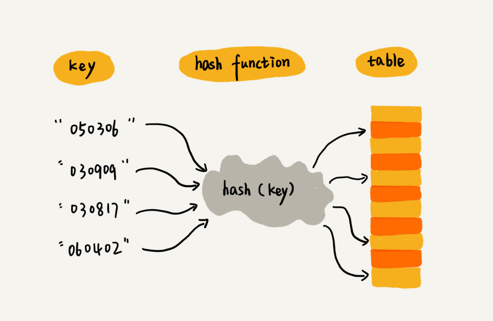
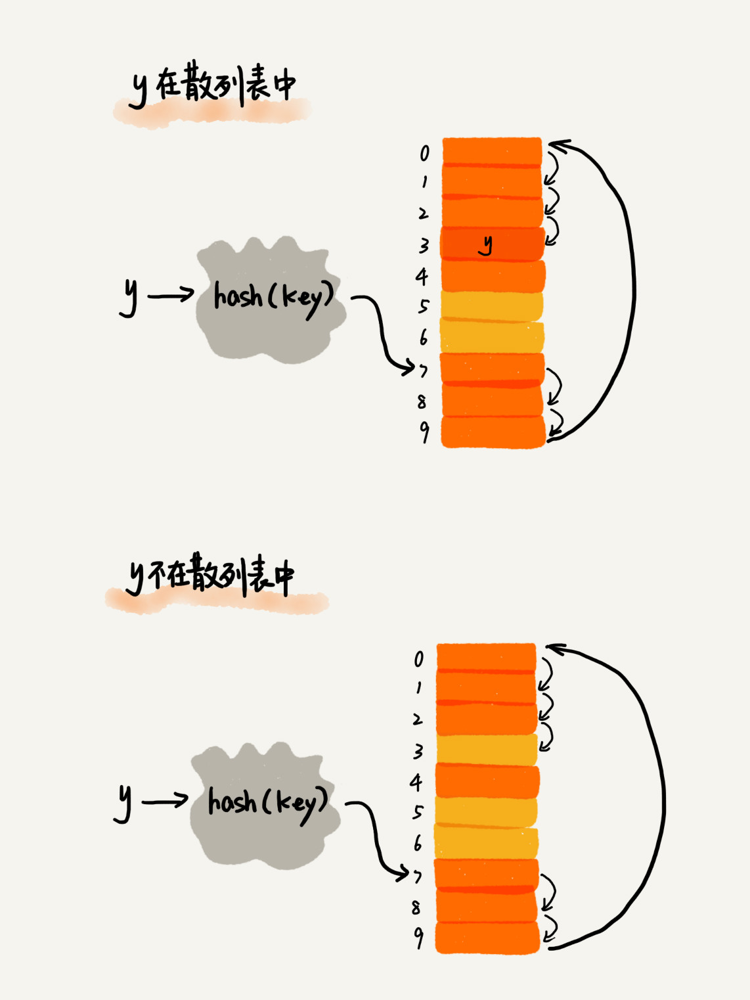
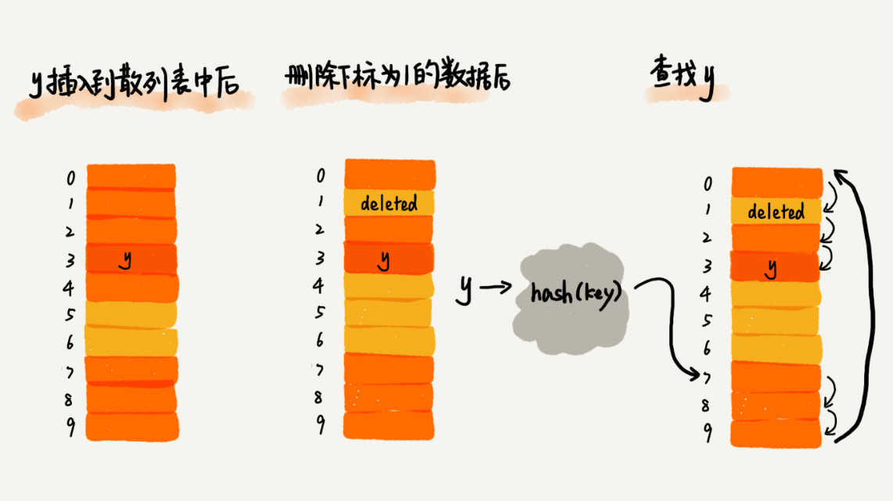

# 18 | 散列表（上）：Word文档中的单词拼写检查功能是如何实现的？

## 笔记

### 散列思想

**散列表用的是数组支持按照下标随机访问数据的特性, 散列表是数组的一种扩展, 由数组演化而来**.

通过数组的下标查找数据, 时间复杂度就是`O(1)`.

**键(`key`)或者叫关键字**, 把编号转换为数组下标的映射方法叫做**散列函数**(`hash`函数, 散列函数计算得到值叫做**散列值**.



散列表用的就是数组支持按照下标随机访问时时间复杂度是`O(1)`的特性. 通过散列函数把元素的键值映射为下标, 然后将数据存储在数组中对应下标的位置.

当按照键值查询元素时, 用同样的散列函数, 将键值转化数组的下标, 从对应的数组下标的位置取数据.

### 散列函数

`hash(key)`, `key`是元素的键值, `hash(key)`的值表示经过散列函数计算得到的散列值.

```
#散列函数的示例

int hash(String key) {
  // 获取后两位字符
  string lastTwoChars = key.substr(length-2, length);
  // 将后两位字符转换为整数
  int hashValue = convert lastTwoChas to int-type;
  return hashValue;
}
```

### 散列函数设计的基本要求

* 散列函数计算得到的散列值是一个非负整数
* 如果`key1 = key2`，那`hash(key1) == hash(key2)`
* 如果`key1 ≠ key2`，那`hash(key1) ≠ hash(key2)`

现实情况找到一个不同的`key`对应的散列值都不一样的散列函数是不可能的. 散列值一样的情况叫做**散列冲突**, 因为数组存储空间有限, 也会加大散列冲突的概率.

### 散列冲突

#### 1. 开放寻址法

如果出现散列冲突, 就重新探测一个空闲位置, 将其插入. 

探测新位的方法, 如**线性探测(`Linear Probing`)**, 当我们往散列表插入数据时, 如果某个数据经过散列函数散列之后, 存储位置已经被占用了, **就从当前位置开始, 依次往后查找, 看是否有空闲位置, 直到找到为止**.


* 黄色是空闲的位置

示例中:

* 散列表大小为`10`
* `x`插入之前, 已经`6`个元素插入到散列表中
* `x`经过`Hash`算法之后, 被散列到位置下标为`7`的位置, 因为该位置已经有数了, **散列冲突**.
* 顺序地往后一个一个找空闲位置, 找到尾部都没有继续从头部开始找, 最终找到空闲位置`2`, 于是将其插入

##### 查找过程

类似插入过程

* 通过散列函数求出要查找元素的键值对应的散列值
* 比较数组中的下标为散列值的元素和要查找的元素
	* 如果相等, 说明找见了
	* 否则就按顺序往后依次查找. **如果遍历到数组中的空闲位置, 还没有找到, 就说明要查找的元素并没有在散列表中**.



##### 删除过程

不能单纯地把要删除的元素设置为空. 因为查找过程中, 找到一个空闲的位置, 就可以认定散列表中不存在该数据. **如果这个空闲位置是删除的, 会导致查找算法失效**.

将删除的元素做标记, 如标记为`deleted`. 查找时, 遇到`deleted`继续查找.



##### 缺点

当散列表中插入的数据越来越多时, 散列冲突发生的可能性会越来越大, 空闲位置会越来越少, 线性探测的时间会越来越久. 极端情况下探测整个散列表, 最坏的时间复杂度为`O(n)`. 

#### 2. 二次探测法(`Quadratic probing`)

类似线性探测, 线性探测的步长是`1`, 它探测的下标序列就是`hash(key)+0，hash(key)+1，hash(key)+2`.

二次探测的步长是原来的"二次方". `hash(key)+0，hash(key)+1^2，hash(key)+2^2……`

#### 3. 双重散列(`Double hashing`)

不仅要使用一个散列函数, 使用一组散列函数.

`hash1(key)，hash2(key)，hash3(key)`

* 先用第一个散列函数
* 如果占用, 再用第二个散列函数
* 依次类推, 直到找到空闲的存储位置

#### 4. 链表法

在散列表中, 每个"通"(`bucket`)或者"槽"(slot)会对应一条链表, **所有散列值相同的元素都放到相同槽位对应的链表中**.


* 插入时, 通过散列函数计算出对应的散列槽位, 将其插入到对应链表中即可, 插入的时间复杂度是`O(1)`
* 查找, 删除时
	* 通过散列函数计算出对应的槽
	* 遍历链表查找或删除

查找, 删除的时间复杂度是`O(k)`, `k`是链表的长度. 理论上对于散列比较均匀的函数来说, `k=n/m`.

* `n`是散列中的数据的个数
* `m`散列表中"槽"的个数

### 示例: word检查拼写错误

常用的英文单词有 20 万个左右，假设单词的平均长度是 10 个字母，平均一个单词占用 10 个字节的内存空间，那 20 万英文单词大约占 2MB 的存储空间，就算放大 10 倍也就是 20MB。对于现在的计算机来说，这个大小完全可以放在内存里面。所以我们可以用散列表来存储整个英文单词词典。

当用户输入某个英文单词时，我们拿用户输入的单词去散列表中查找。如果查到，则说明拼写正确；如果没有查到，则说明拼写可能有误，给予提示。借助散列表这种数据结构，我们就可以轻松实现快速判断是否存在拼写错误。

### 总结

如果散列表的空闲位置不多, 散列冲突的概率就会提高, 为了尽可能保障散列表的操作效率, 一般情况下, 会尽可能保证散列表有一定比例的空闲槽位.

**装载因子(`load factor`)表示空位的多少**.

```
散列表的装载因子=填入表中的元素个数/散列表的长度
```

装载因子越大, 说明空闲位置越少, 冲突越多, 散列表的性能会下降.

## 扩展