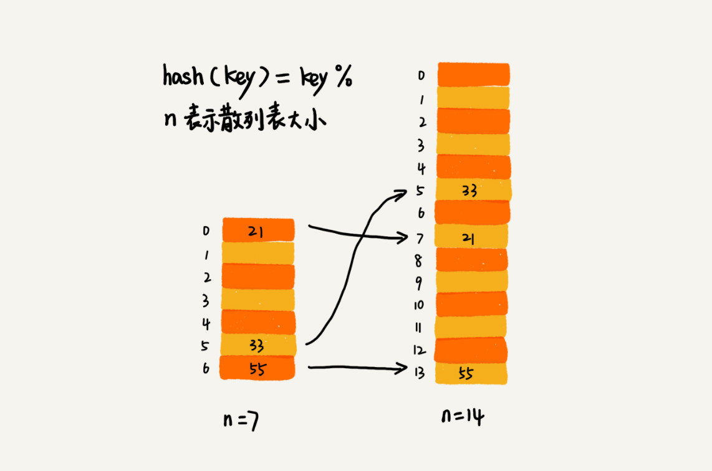
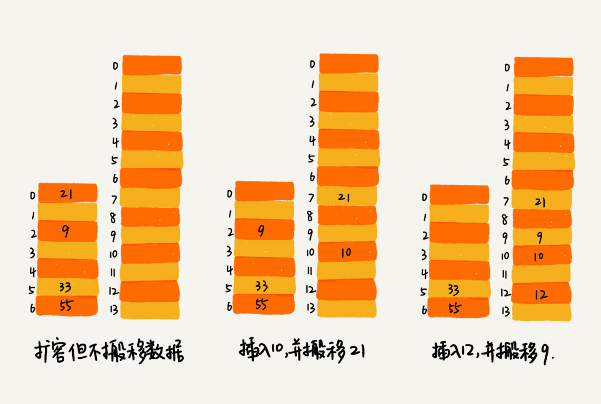
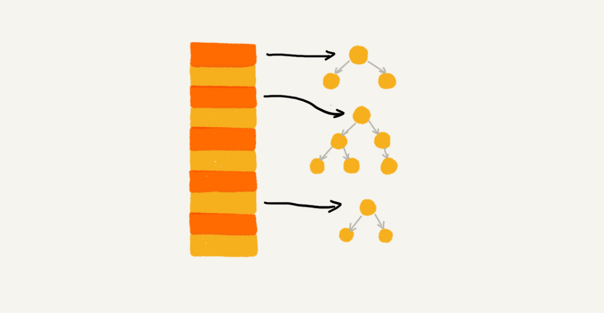

# 19 | 散列表（中）：如何打造一个工业级水平的散列表？

## 笔记

散列表的查询跟散列函数, 装载因子, 散列冲突都有关系. **装载因子过高, 导致散列冲突发生的概率升高, 查询效率下降**.

如果通过精心构造数据, 是所有数据经过散列函数之后, 都散列到同一个槽里. 如果使用基于链表的冲突解决方法. **这时, 散列表就会退化为链表, 查询时间复杂度从`O(1)`退化为`O(n)`**.

### 如何设计散列函数

* 设计不能太复杂, 复杂的函数会消耗很多`CPU`计算时间, 间接影响到散列表的性能.
* 散列函数生成的值要尽可能随机并且均匀分布, 避免或者最小化散列冲突.

* 散列函数设计法
	* **数据分析法**: 分析散列数据, 寻求重复性小的方法. 如手机号码后四位比较随机.
	* 直接寻址法
	* 平方取中法
	* 折叠法
	* 随机数法

### 装载因子过大了怎么办?

装载因子越大, 说明散列表中的元素越多, 空闲位置越少, 散列冲突的概率就越大.

没有频繁插入和删除的**静态数据**, 可以预先根据数据特点设计散列函数.

针对散列表, 当装载因子过大时, 可以进行动态扩容, 重新申请一个更大的散列表, 将数据搬移到这个新散列表中. 假设每次扩容我们都申请一个原来散列表大小两倍的空间. 如果原来散列表的装载因子是`0.8`, 那经过扩容之后, 新散列表的装载因子就下降为原来的一半, 变为`0.4`.

散列表搬移操作要复杂的多. 因为散列表的大小变了, 数据的存储位置也变了, 所以需要通过散列函数重新计算每个数据的存储位置.



原来`21`在`0`的位置, 搬移到新的散列表后存储在下标为`7`的位置.

* 最好情况下, 不需要扩容, 时间复杂度是`O(1)`.
* 最坏情况下, 扩容, 重新申请内存空间, 计算哈希值, 搬移数据, 所以时间复杂度是`O(n)`.
* 均摊情况下是`O(1)`.

动态散列表, 随着数据删除, 散列表中的数据越来越少, 空闲空间越来越多. 如果对空间敏感, 可以在装载因子小于某个值之后, 启动动态缩容.

当散列表的装载因子超过某个阈值时, 就需要进行扩容.

* 阙值过大, 会导致冲突很多. 内存空间紧张, 对执行效率要求不高.
* 阙值很小, 会导致内存浪费严重. 内存空间不紧张, 对执行效率要求高.

### 如何避免低效地扩容

* 大部分情况, 动态扩容的散列表插入一个数据都很快.
* 特殊情况下, 装载因子已经到达阙值, 需要先进行扩容, 再插入数据. **会变慢**

扩容耗时, 如当前散列表大小为`1GB`, 如要想扩容为原来的两倍大小, 就需要对`1GB`的数据重新计算哈希值, 并从原来的散列表搬移到新的散列表.

导致, 大部分插入一个数据速度很快, 极个别的插入操作非常慢.

**解决方案**, 为了解决一次性扩容耗时过多的情况, 将扩容操作穿插在操作的过程中, 分批完成. 

* 当装载因子触达阙值后
	* 只申请新空间, 但并不将老的数据搬移到新散列表中
	* 当有新数据要插入时, 将新数据插入到新散列表中, **并且**从老的散列表中拿出一个数据放到新散列表中
	* **每次插入一个数据到散列表, 都重复上面的过程**, 经过多次插入之后, 老的散列表中的数据就逐步搬移到新散列表中了.



大部分情况下, 插入一个时间的复杂度都是`O(1)`.

### 如何选择冲突解决方法

#### 1. 开放寻址法

**优点** 不需要链表, 数据都存储在数组中, 可以有效地利用`CPU`缓存加快查询速度. 序列化简单(因为不想链表包含指针).

**缺点** 删除数据麻烦, 需要特殊标记已经删除掉的数据. 因为所有数据都存储在一个数组中, 比起链表来说, 冲突的代价更高. 使用开放寻址法解决冲突的散列表, 装载因子的上限不能太大. 比链表法更浪费内存.

**当数据量比较小, 装载因子小的时候, 适合采用开放寻址法**.

#### 2. 链表法

**优点** 

链表法对内存的利用率比寻址法高. **因为链表结点可以在需要的时候再创建, 并不需要像开放寻址法那样事先申请好**.

对大装载因子的容忍度更高. 开放寻址法只能适用装载因子小于`1`的情况. 接近`1`时, 就可能会有大量的散列冲突, 导致大量的探测, 再散列等. 对于链表法来说, 只要散列函数的随机均匀, 即便装载因子变成`10`, 也就是链表长度编程了而已, 虽然查找效率有所下降, 但是比起顺序查找还是快.

如果我们存储的是大对消, 要存储的对象的大小远远大于一个指针的大小, **那链表中指针的内存消耗在大对象面前就可以忽略了**.

可以改造为, 跳表, 红黑树. 这种情况下, 出现散列冲突, 极端情况下, **所有的数据都散列到一个桶内**, 最终退化成的散列表的查找时间也只不过是`O(logn)`. 



**基于链表的散列冲突处理方法比较适合存储大对象, 大数据量的散列表, 而且, 比起开放寻址法,更加灵活, 支持更多的优化策略, 比如使用红黑树代替链表**.

### 工业级散列表举例分析

示例: `Java`中的`HashMap`.

#### 1. 初始大小

`HashMap`默认的初始大小是`16`, 这个默认值是可以设置的. **如果实现知道大概的数据量有多大, 可以铜鼓哦修改默认初始大小, 减少动态扩容的次数**, 提高`HashMap`的性能.

#### 2. 装载因子和动态扩容

最大装载因子默认是`0.75`, 当`HashMap`中元素个数超过`0.75*capacity`(`capacity`表示散列表的容量), 就会启动扩容, 每次扩容都会扩容为原来的两倍大小.

#### 3. 散列冲突解决方法

`HashMap`底层采用链表发来解决冲突. 一旦出现拉链过长, 会严重影响`HashMap`的性能.

在`JDK1.8`, 当链表长度太长(默认超过`8`)时, **链表就会转换为红黑树**. 当红黑树结点个数少于`8`个的时候, 会将红黑树转换为链表.

* 数据量大, 红黑树快速增删查改
* 数据量小, 红黑树维护平衡耗费性能

#### 4. 散列函数

简单高效, 分布均匀.

```
int hash(Object key) {
    int h = key.hashCode()；
    return (h ^ (h >>> 16)) & (capicity -1); //capicity表示散列表的大小
}
```

### 如何设计工业级的散列函数

* 支持快速的查询, 插入, 删除操作
* 内存占用合理, 不能浪费过多的内存空间
* 性能稳定, 极端情况下,散列表的性能也不会退化到无法接受的情况

如何实现:

* 设计一个合适的散列函数
* 定义装载因子阙值, 设计动态扩容策略
* 选择合适的散列冲突解决方法

## 扩展