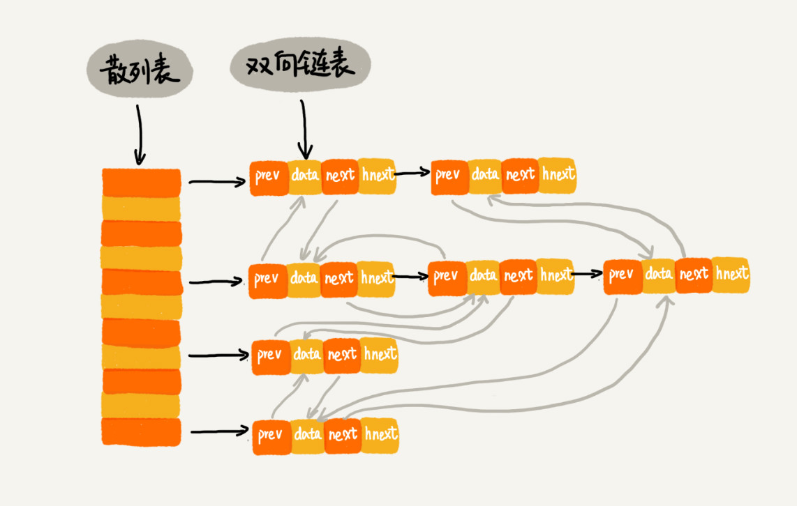
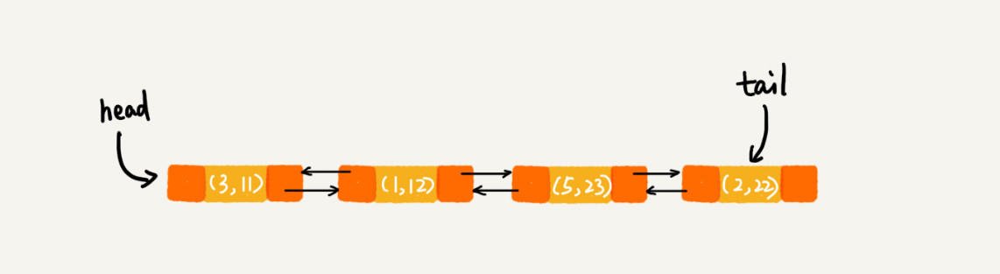

# 20 | 散列表（下）：为什么散列表和链表经常会一起使用？

## 笔记

为什么散列表和链表会经常放到一块使用

因为散列表可以高效支持数据**插入, 删除, 查找**, 但是散列表中的数据是无序存储的. 所以一般会将散列表和链表(跳表)结合起来使用.

### LRU 缓存淘汰算法

使用散列表可以把`LRU`缓存淘汰算法的时间复杂度降低为`O(1)`

#### 通过链表实现`LRU`缓存淘汰算法

维护一按照访问时间从大到小有序排列的链表结构. 

* 当缓存空间不够, 需要淘汰一个数据的时候, 就直接将链表头部的结点删除.
* 当要缓存某个数据的时候,现在链表中查找这个数据.
	* 如果没找到, 则直接数据放到链表的尾部.
	* 如果找到了, 就把它移动到链表的尾部.

查找数据需要遍历链表, 单纯使用链表实现的`LRU`缓存淘汰算法时间复杂度是`O(n)`.

一个缓存系统主要包含下面的操作:

* 往缓存中添加一个数据
* 从缓存中删除一个数据
* 在缓存中查找一个数据

这三种操作都涉及**查找**, 如果单纯用链表, 时间复杂度是`O(n)`. 如果将散列表和链表两种数据结构结合使用, 三种操作的时间复杂度都可以降到`O(1)`.



双向链表增加一个特殊字段`hnext`.

散列表通过链表法解决散列冲突, 每个结点会在两条链中. 

* 双向链表
* 散列表的**拉链**

* **前驱和后驱**指针: 将结点穿在双向链表中.
* `hnext`指针是为了将结点穿在散列表的拉链中.

#### 如何做到三个操作的时间复杂度是`O(1)`

**查找一个数据**, 散列表查找数据的时间复杂度接近`O(1)`, 通过散列表可以很快的在缓存中找到一个数据. 找到数据之后, 还需要将它移动到双向链表的尾部.

**删除一个数据**, 找到数据后, 因为我们的链表是双向的, 可以通过前驱指针在`O(1)`的时间复杂度获取到前驱结点. 删除结点只需要`O(1)`的时间复杂度.

**添加一个数据**, 需要先查看这个数据是否已经在缓存中.

* 如果在, 需要将其移动到双向链表的尾部
* 如果不在
	* 如果缓存满了, 将双向链表的头部的节点删除, 再将数据放到链表的尾部.
	* 如果没有满, 直接将数据放到链表的尾部.

因为涉及的查找操作都可以通过散列表来完成. 其他的操作, 删除, 插入都可以在`O(1)`的时间复杂度内完成. 所以三个操作都是`O(1)`.

### Redis 有序集合

`Redis`根据`key`和`score`查找.

可以把分数用跳表实现, `key`用`hash`表实现. 类似上面的`LRU`例子.

### Java LinkedHashMap

```
HashMap<Integer, Integer> m = new LinkedHashMap<>();
m.put(3, 11);
m.put(1, 12);
m.put(5, 23);
m.put(2, 22);

for (Map.Entry e : m.entrySet()) {
  System.out.println(e.getKey());
}
```

打印顺序就是`3,1,5,2`. 散列表中数据是经过散列函数打乱之后无规律存储的, 如何实现按照数据的插入顺序来遍历打印的.

`LinkedHashMap`通过散列表和链表组合在一起实现的. 支持按插入顺序遍历数据, 按访问顺序遍历数据.

```
// 10是初始大小，0.75是装载因子，true是表示按照访问时间排序
HashMap<Integer, Integer> m = new LinkedHashMap<>(10, 0.75f, true);
m.put(3, 11);
m.put(1, 12);
m.put(5, 23);
m.put(2, 22);

m.put(3, 26);
m.get(5);

for (Map.Entry e : m.entrySet()) {
  System.out.println(e.getKey());
}
```

打印结果是`1,2,3,5`.

**调用`put()`函数**



**将`3`放入到`LinkedHashMap`**

```
m.put(3, 26);
```

会先查找这个键值是否已经存在, 然后, 再将存在的`(3,11)`删除, 并且将新的`(3,26)`放到链表的尾部. 数据会变成下面的样子


**访问`5`**

```
m.get(5);
```

将被访问到的数据移动到链表的尾部.


**`LinkedHashMap`是通过双向链表和散列表这两种数据结构组合实现的. `LinkedHashMap`中的"Linked"实际上是指的是双向链表, 并非指用链表法解决散列冲突.**

## 扩展

### 总结

其实就两种数据结构, **链表和数组**.

* 数组占据随机访问的优势, 却有需要连续内存的缺点.
* 链表具有可不连续存储的优势, 但访问查找是线性的.

所以一般会结合使用.