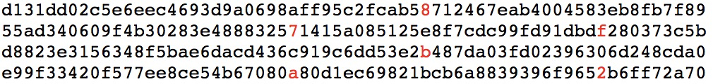

# 21 | 哈希算法（上）：如何防止数据库中的用户信息被脱库？

## 笔记

### 什么是哈希算法?

将任意长度的纹紧致串映射为固定长度的二进制串, 这个映射的规则就是**哈希算法**, 通过原始数据映射之后得到的二进制串就是**哈希值**.

哈希算法的要求:

* 从哈希值不能**反向**推到原始数据(单向)
* 对输入数据**敏感**, 哪怕原始数据只修改了一个`Bit`, 最后得到的哈希值也大不相同
* 散列冲突的概率要很小, 不同的原始数据, 哈希值相同的概率非常小.
* 算法执行效率要**高效**

#### 示例1 两个完全不相同的字符串

```
MD5("今天我来讲哈希算法") = bb4767201ad42c74e650c1b6c03d78fa
MD5("jiajia") = cd611a31ea969b908932d44d126d195b
```

#### 示例2 两个近似的字符串

```
MD5("我今天讲哈希算法！") = 425f0d5a917188d2c3c3dc85b5e4f2cb
MD5("我今天讲哈希算法") = a1fb91ac128e6aa37fe42c663971ac3d
```

#### 哈希算法的应用

* 安全加密
* 唯一标识
* 数据校验
* 散列函数
* 负载均衡
* 数据分片
* 分布式存储

### 应用一: 安全加密

常用的算法:

* `MD5`: `MD5`消息摘要算法
* `SHA`: 安全散列算法
* `DES`: 数据加密标准
* `AES`: 高级加密标准

#### 为什么哈希算法无法做到零冲突

哈希算法产生的哈希值的长度是固定有限的.

`MD5`有`128`位二进制串. 表示的数据是有限的, 最多表示`2^128`. 一般情况下, 哈希值越长, 散列冲的概率越低.

两段字符串, `MD5`值相同.



因为哈希值的范围很大, 冲突的概率很低. 如`MD5`, 散列冲突的概率要小于`1/2^128`.

### 应用二: 唯一标识

在海量图片中查找一张图片是否存在, 可以对图片进行摘要. 可以从图片的二进制码串开头取`100`个字节, 从中间取`100`个字节, 从最后再取`100`个字节, 然后将这`300`个字节放到一块, 通过哈希算法(比如 MD5), 得到一个哈希字符串, 用它作为图片的唯一标识.

先根据摘要比对, 如果有相同的在做全量比对.

### 应用三: 数据校验

如`BT`下载不同的文件块, 可以对不同的文件块分别取哈希值, 然后存到种子中在依次比对. 如果不同就说明被篡改了.

### 应用四: 散列函数

哈希算法用于散列函数

* 对冲突要求低, 就算冲突可以使用开放寻址或链表法解决
* 对执行效率要求高
* 关注散列后是否可以平均分布

### 总结

一般存密码还会存一个盐(`salt`).

## 扩展

### 区块链

区块链是一块块区块组成的, 每个区块分为两部分: 区块头和区块体.

区块头保存着 自己区块体 和 上一个区块头 的哈希值.

因为这种链式关系和哈希值的唯一性, 只要区块链上任意一个区块被修改过, 后面所有区块保存的哈希值就不对了.

区块链使用的是`SHA256`哈希算法, 计算哈希值非常耗时, 如果要篡改一个区, 就必须重新计算该区块后面所有的区块的哈希值, 短时间内几乎不可能做到.