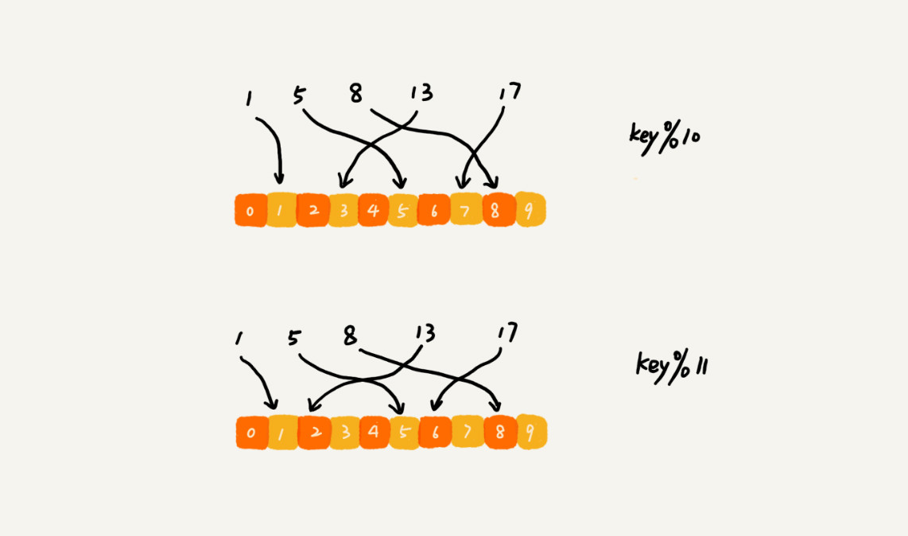

# 22 | 哈希算法（下）：哈希算法在分布式系统中有哪些应用？

## 笔记

### 应用五: 负载均衡

实现一个会话粘滞(`session sticky`)的负载均衡算法, 需要在同一个客户端上, 在一次会话中的所有请求都路由到同一个服务器上.

通过哈希算法, 对客户端IP地址或者会话ID计算哈希值, 将取得的哈希值与服务器列表的大小进行取模运算, 最终得到的值就是应该被路由到的服务器编号.

### 应用六: 数据分片

#### 1. 如何统计"搜索关键词"出现的次数

有一个大日志文件, 要快速统计出每个关键词被搜索的次数.

两个难点:

1. 搜索日志很大, 一台机器的内存无法处理
2. 只用一台机器来处理这么巨大的数据, 处理时间会很长

**针对数据进行分片, 然后采用多台机器处理的方法, 来提高处理速度**

这也就是`MapReduce`的基本设计思想.

#### 2. 如何快速判断图片是否在图库中

上上节课不同的是, 现在假设我们有1亿张图片, 明显在单台机器上构建散列表是行不通的. 因为单台机器的内存有限, 1亿张图片构建散列表显然远远超过了单台机器的内存上限.

可以对数据进行分片, 采用多机处理, 每台机器只维护某一部分图片对应的散列表.

每次从图库中取出一张图片, 计算唯一标识, 然后与机器个数`n`求余取模, 得到的值就对应要分配的机器编号, 然后将这个图片的唯一标识和图片路径发往对应的机器构建散列表. 在去散列表查找.

**估算服务器数量**

1亿图片, 通过`MD5`计算哈希值, 长度是`128`比特, 是`16`字节. 文件路径长度的上限是`256`自建, 假设平均长度是`128`字节, 指针还占用`8`字节, 散列表中每个互数据单元就占用`152`字节.

假设一台机器的内存大小为`2GB`, 赞列表的装载因子为`0.75`, 那一台机器可以给一个大约`1000`万(`2GB*0.75/152`)张图片构建散列表. 所以最终需要大约10台机器.

### 应用七: 分布式存储

如分布式缓存, 我们把数据通过哈希算法对数据取哈希值, 然后对机器个数取模, 这个最终值就是应该存储的缓存机器编号.

但是当我们扩充一台机器后, 取模会发生变化. 

```
#原来
13通过10取模, 在编号3机器上

#扩充后
13通过11取模, 在编号2机器上
```



这样会导致所有的数据都要重新计算哈希值, 然后重新搬移到正确的机器上. 这就相当于缓存失效. 所有的数据请求都会穿透缓存, 直接去请求数据库. 这样就可能发生**雪崩效应**, 压垮数据库.

需要一种方法**在新加入一台及其后, 并不需要做大量的数据搬移**, 这就是**一致性哈希**.

#### 一致性哈希

假设有`k`个机器, 数据的哈希值的范围是`[0, MAX]`. 将整个范围划分成`m`个小区间(`m`远大于`k`), 每个机器负责`m/k`个小区间.  都有新机器加入的时候, 就将某几个小区间的数据, 从原来的机器中搬移到新的机器中. 这样, 既不用全部重新哈希, 搬移数据, 也保持了各个机器上数据里的均衡.

## 扩展

[一致性hash](https://www.jianshu.com/p/735a3d4789fc)