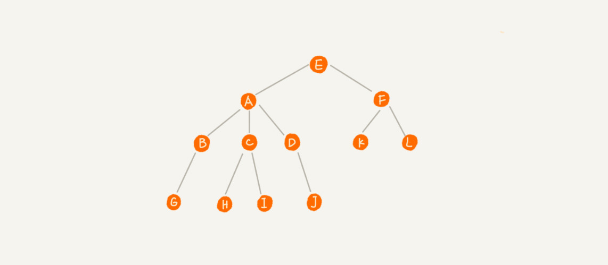
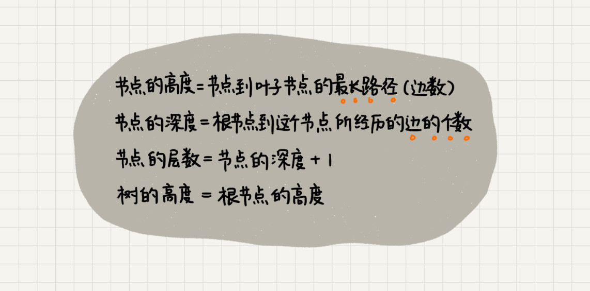
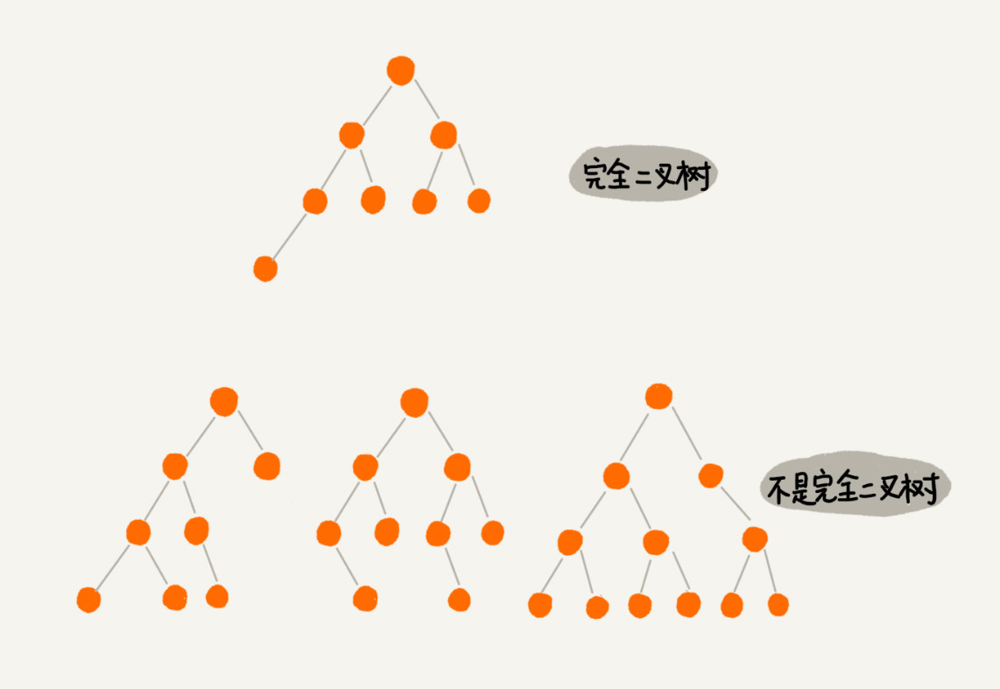
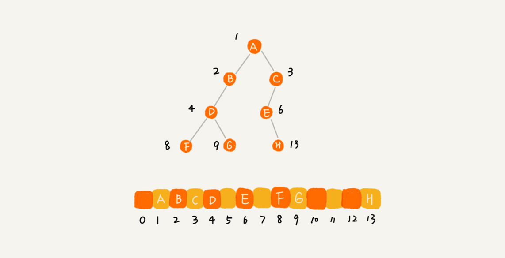

# 23 | 二叉树基础（上）：什么样的二叉树适合用数组来存储？

## 笔记

### 树(Tree)


每个元素我们叫做"节点"

连线相邻节点之间的关系叫做"父子关系"



* `A`节点就是`B`节点的**父节点**
* `B`节点就是`A`节点的**子节点**
* `B,C,D`这个三个节点的父节点是同一个节点, 他们之间互称**兄弟节点**
* `E`, 没有父节点叫做**根节点**
* `G,H,I,J,K,L`没有子节点的节点叫做**叶子节点**或者**叶节点**




* 高度: **从下往上**度量.
* 深度: **从上往下**度量. 从根节点开始度量. 技术起点是`0`
* 层数: 和深度类似, 技术起点是`1`

### 二叉树(`Binary Tree`)

每个节点最多有两个"叉", 两个子节点. 

* 左子节点
* 右子节点


* `2`号: 叶子节点全都在最底层, 除了叶子节点外, 每个节点都有左右两个子节点. **满二叉树**.
* `3`号: 从根结点到倒数第二层满足完美二叉树, 最后一层可以不完全填充, 其叶子结点都靠左对齐. **完全二叉树**.(每个结点按照满二叉树的结构注册顺序编号, 如果编号出现空档, 就不是完全二叉树)

### 完全二叉树



### 如何表示(存储)一颗二叉树

* 基于指针(引用)的二叉链式存储法
* 基于数组的顺序存储法

#### 链式存储法

较为常用, 通常的存储方案

每个节点有三个字段

1. 存储数据
2. 指向"左右"节点的指针


#### 顺序存储法

* 根节点存储在`i`
* 左子节点为`2i`
* 右子节点为`2i+1`

依次类推


节点`x`存储在`i`

* `2i`就是左子节点
* `2i+1`就是右子节点
* `i/2`父节点

这样只要知道根节点的位置(一般是`1`), 都可以通过下标计算把整棵树都串起来.

**如果是非完全二叉树**, 会浪费比较多的数组空间存储空间.



完全二叉树适合用数组存储, 最节省内存. 因为不需要像链表那样, 存储额外的左右子节点指针. 因为完全二叉树是顺序的(最后一层子节点都靠左), 所以也适合存储内存(不会浪费).

**堆**其实就是一种完全二叉树, 最常用的存储方式就是数组.

### 二叉树的遍历

* **前序遍历**: 对于树中的任意节点, 先打印这个节点, 在打印它的左子树, 最后打印它的右子树. 
* **中序遍历**: 对于树中的任意节点, 先打印它的左子树, 再打印它本身, 最后打印它的右子树.
* **后序遍历**: 对于树中的任意节点, 先打印它的左子树, 在带引它的右子树, 最后打印这个节点本身.


遍历就是一个**递归**的过程.

```
前序遍历的递推公式：
preOrder(r) = print r->preOrder(r->left)->preOrder(r->right)

中序遍历的递推公式：
inOrder(r) = inOrder(r->left)->print r->inOrder(r->right)

后序遍历的递推公式：
postOrder(r) = postOrder(r->left)->postOrder(r->right)->print r
```

代码

```
void preOrder(Node* root) {
  if (root == null) return;
  print root // 此处为伪代码，表示打印root节点
  preOrder(root->left);
  preOrder(root->right);
}

void inOrder(Node* root) {
  if (root == null) return;
  inOrder(root->left);
  print root // 此处为伪代码，表示打印root节点
  inOrder(root->right);
}

void postOrder(Node* root) {
  if (root == null) return;
  postOrder(root->left);
  postOrder(root->right);
  print root // 此处为伪代码，表示打印root节点
}
```

遍历二叉树, 因为每个节点最多会被访问两次, 所以遍历操作的时间复杂度和节点数`n`成正比, 二叉树遍历的时间复杂度是`O(n)`.

## 扩展


