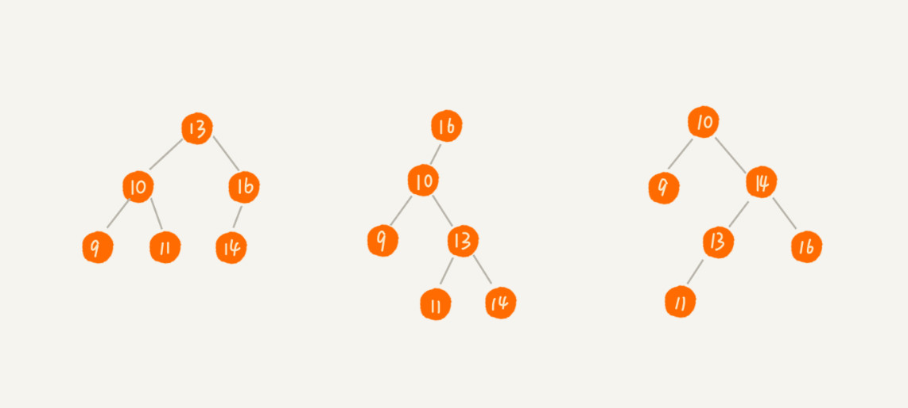
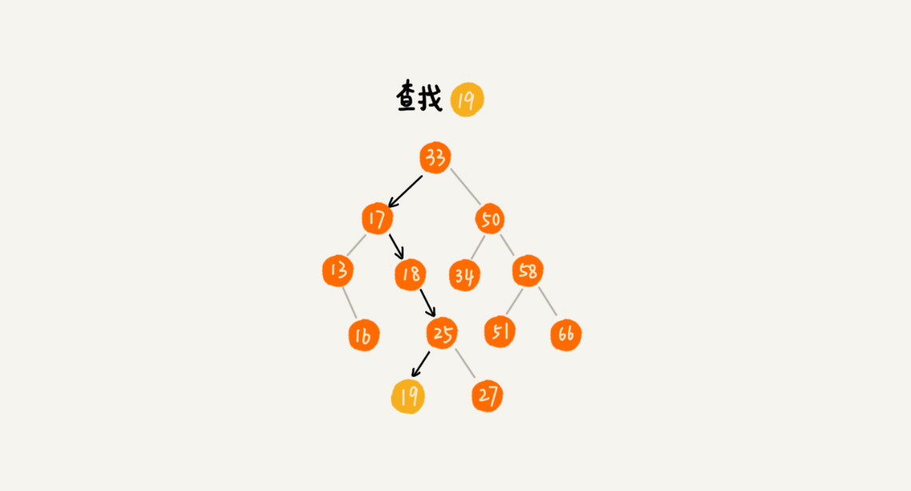
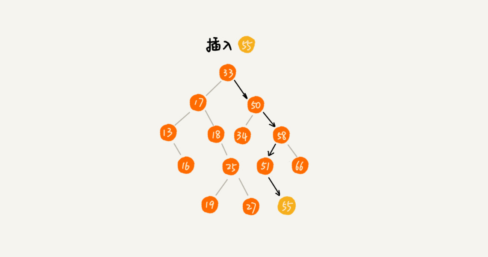
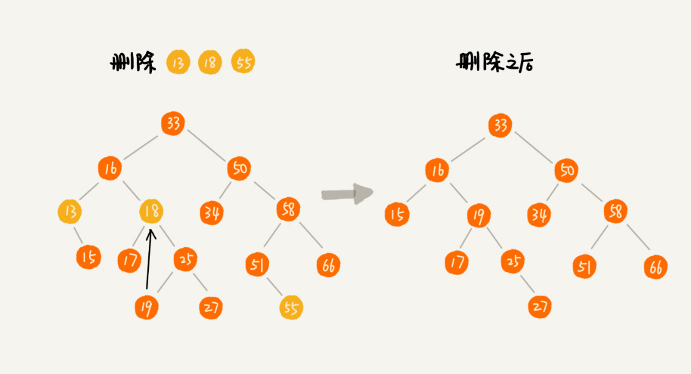
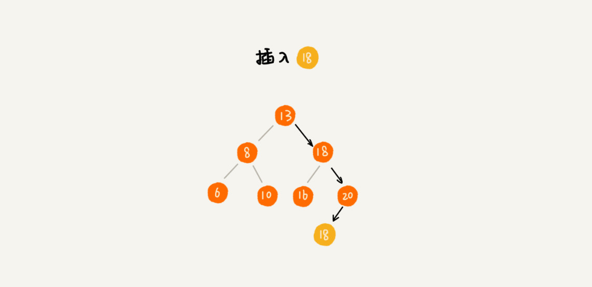
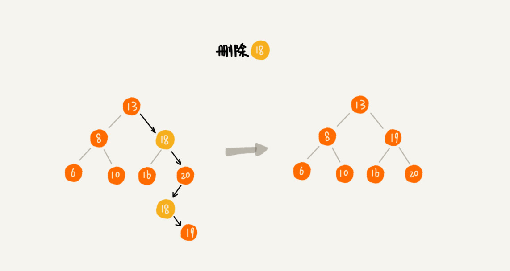

# 24 | 二叉树基础（下）：有了如此高效的散列表，为什么还需要二叉树？

## 笔记

### 二叉查找树(Binary Search Tree)

二叉查找树要求, 在树中的任意一个节点, 其左子树中的每个节点的值, 都要小于这个节点的值, 而右子树节点的值都大于这个节点的值.



#### 1. 二叉查找树的查找操作

如何在二叉查找树中查找一个节点.

* 先去**根节点**, 如果它等于我们要查找的数据, 那就返回.
* 如果要查找的数据比根节点的值**小**, 那就在**左子树**中**递归查找**.
* 如果要查找的数据比根节点的值**大**, 那就在**右子树**中**递归查找**. 



```
public class BinarySearchTree {
  private Node tree;

  public Node find(int data) {
    Node p = tree;
    while (p != null) {
      if (data < p.data) p = p.left;
      else if (data > p.data) p = p.right;
      else return p;
    }
    return null;
  }

  public static class Node {
    private int data;
    private Node left;
    private Node right;

    public Node(int data) {
      this.data = data;
    }
  }
}
```

#### 2. 二叉查找树的插入操作

插入过程类似查找操作. 新插入的数据一般都在叶子节点上, 需要从根节点开始, 依次比较要插入的数据和节点的大小关系.

* 要插入的数据比节点的数据大
	* 并且节点的右子树为空, **就将新数据直接插到右子节点的位置**.
	* 如果不为空, **递归遍历右子树**, 查找插入位置.
* 如果要插入的数据比节点值小
	* 并且节点的左子树为空, **就将新数据直接插到左子节点的位置**.
	* 如果不为空, **递归遍历左子树**, 查找插入位置.



```
public void insert(int data) {
  if (tree == null) {
    tree = new Node(data);
    return;
  }

  Node p = tree;
  while (p != null) {
    if (data > p.data) {
      if (p.right == null) {
        p.right = new Node(data);
        return;
      }
      p = p.right;
    } else { // data < p.data
      if (p.left == null) {
        p.left = new Node(data);
        return;
      }
      p = p.left;
    }
  }
}
```

#### 3. 二叉查找树的删除操作

* 如果要删除的节点没有子节点, 只需要将父节点中, 指向要删除节点的指针置为`null`(示例`55`)
* 要删除的节点只有一个子节点(只有左子节点或者右子节点), 只需要更新父节点中, 指向要删除节点的指针, 让它指向要删除**节点的子节点**就可以了(示例`13`)
* 要删除的节点有两个子节点, 要找到这个节点的右子树中最小的节点, 把它替换到要删除的节点上. 然后再删除这个最小节点(最小节点没有左节子节点)(示例`18`)



```
public void delete(int data) {
  Node p = tree; // p指向要删除的节点，初始化指向根节点
  Node pp = null; // pp记录的是p的父节点
  while (p != null && p.data != data) {
    pp = p;
    if (data > p.data) p = p.right;
    else p = p.left;
  }
  if (p == null) return; // 没有找到

  // 要删除的节点有两个子节点
  if (p.left != null && p.right != null) { // 查找右子树中最小节点
    Node minP = p.right;
    Node minPP = p; // minPP表示minP的父节点
    while (minP.left != null) {
      minPP = minP;
      minP = minP.left;
    }
    p.data = minP.data; // 将minP的数据替换到p中
    p = minP; // 下面就变成了删除minP了
    pp = minPP;
  }

  // 删除节点是叶子节点或者仅有一个子节点
  Node child; // p的子节点
  if (p.left != null) child = p.left;
  else if (p.right != null) child = p.right;
  else child = null;

  if (pp == null) tree = child; // 删除的是根节点
  else if (pp.left == p) pp.left = child;
  else pp.right = child;
}
```

**不实际删除**

还可以把要删除的节点标记为"已删除", 并不真正从树中将这个节点去掉. 原本删除的节点还需要存储在内存中, 比较浪费内存空间, 但是删除操作就更为简单, 且没有增加插入, 查找操作代码实现的难度.

#### 4. 二叉查找树的其他操作

**快速查找最大节点和最小节点, 前驱节点和后继节点**

**中序遍历二叉查找树, 可以输出有序的数据序列, 时间复杂度是`O(n)`**, 因此二叉查找树也叫二叉排序树.

### 支持重复数据的二叉查找树

实际开发中, 二叉查找树中存储的是一个包含很多字段的对象. 利用对象的某个字段作为键值(`key`)来构建二叉查找树. 对象中的其他字段叫做卫星数据.

重复数据解决方法:

#### 方法一: 把值相同的数据都存储在同一个节点上

二叉查找树中的每个节点不会存储一个数据, 通过链表和支持动态扩容的数据等数据结构, **把值相同的数据都存储在同一个节点上**.

#### 方法二(更加优雅)

每个节点仍然只存储一个数据, 如果**插入**数据时, 碰到一个节点的值与要插入数据的值相同, 就将这个要插入的数据放到这个节点的右子树. **把这个新插入的数据当做大于这个节点的值来处理**.



要**查找**数据时, 遇到值相同的节点, 并不停止查找操作, 继续在右子树中查找, 知道遇到叶子节点, 才停止. 这样可以把键值等于要查找值的所有节点都找出来.


**删除**操作, 先**查找**到每个要删除的节点, 然后依次删除.



### 二叉查找树的时间复杂度分析


第一种情况(**最糟情况**), 根节点的左右子树极度不平衡, 退化成了链表, 查找的时间复杂度是`O(n)`.

**最理想情况**, 二叉查找树是一棵完全二叉树(满二叉树). 插入, 删除还是查找, **时间复杂度和树的高度成正比, O(height)**. 等同于一棵包含`n`个节点的完全二叉树的高度.

树的高度等于最大层数减一. 完全二叉树中第`k`层包含的节点个数就是`2^(k-1)`. 但是最后一层不遵守上面的规律. 包含的节点个数在`1`到`2^(k-1)`个之间.

```
n >= 1+2+4+8+...+2^(L-2)+1
n <= 1+2+4+8+...+2^(L-2)+2^(L-1)
```

`L`的范围是`[log2(n+1), log2n +1]`. 完全二叉树的层数小于等于`long2n + 1`, 完全二叉树的高度小于等于 `log2n`.

极度不平衡的二叉查找树, 它的查找性能肯定不能满足需求. 平衡二叉查找树的高度接近`logn`, 时间复杂度是`O(logn)`.

### 二叉查找树 和 散列表 对比

* 第一, 散列表中的数据是无序存储的, 如果要输出有序的数据, 需要先进行排序. 二叉查找树, 只需要中序遍历, 就可以在`O(n)`的时间复杂度内, 输出有序的数据序列.
* 第二, 散列表扩容耗时多, 散列冲突时, 性能不稳定. 平衡二叉查找树性能较为稳定(`O(logn)`).
* 第三, 因为散列表的冲突的存在, 还有哈希函数的耗时, 性能不一定比平衡二叉查找树效率高.
* 第四, 散列表的构造比二叉查找树复杂.
	* 散列表: 散列函数的设计, 冲突解决办法, 扩容, 缩容.
	* 平衡二叉查找树只要考虑平衡性

## 扩展