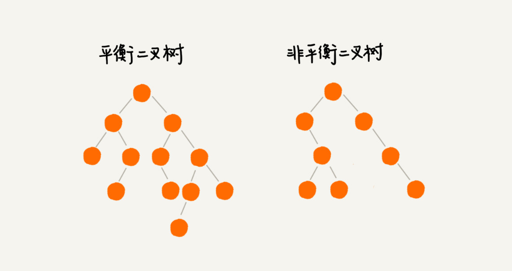
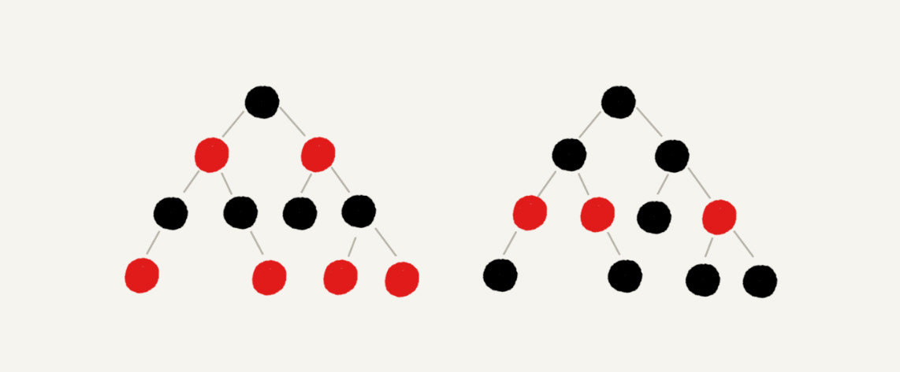
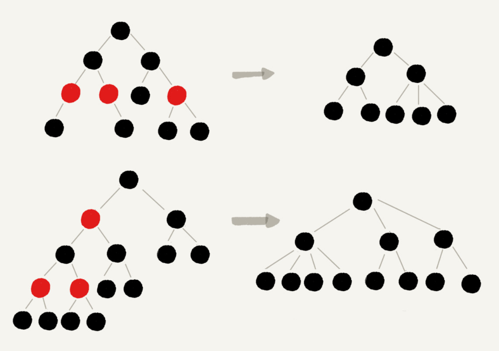

# 25 | 红黑树（上）：为什么工程中都用红黑树这种二叉树？

## 笔记

二叉查找树在频繁的动态更新过程中, 可能会出现树的高度远大于`log2n`的情况. 极端情况下, 二叉树会退化为链表, 时间复杂度会退化到`O(n)`.

### 什么是"平衡二叉查找树"

**二叉树中任意一个节点的左右子树的高度相差不能大于1**

满二叉树其实都是平衡二叉树, 非完全二叉树也有可能是平衡二叉树.

平衡二叉查找树不仅满足上面平衡二叉树的定义, 还满足二叉查找树的特点. 最先被发明的平衡二叉查找树是**AVL树**, 严格符合我们刚讲到的平衡二叉查找树的定义.

但是很多平衡二叉查找树并没有严格符合上面的定义(树中任意一个节点的左右子树的高度相差不能大于1), 如**红黑树**, 它从根节点到各个叶子节点的最长路径, 有可能会比最短路径大一倍.

**平衡二叉查找树发明的初衷**, 解决普通二叉查找树在频繁的插入, 删除等动态更新的情况下, 出现时间复杂度退化的问题.

**平衡**的意思, 其实就是让整棵树左右看起来比较"对称", 比较"平衡", 不要出现左子树很高, 右子树很矮的情况. 这样就能让整棵树的高度相对来说低一些, 相应的插入, 删除, 查找等操作的效率高一些.

所以只要树的高度不比`log2n`大很多, 仍然可以说只是一个合格的平衡二叉查找树.

### 如何定义一棵"红黑树"

红黑树的英文是"Red-Black Tree", 简称`R-B Tree`. 是一种不严格的平衡二叉查找树.

红黑树的节点, 一类被交际为黑色, 一类被标记为红色. 同时满足一下需求:

* 根节点是**黑色**的
* 每个叶子节点都是**黑色**的空节点(`Nil`), **叶子节点不存储数据**.
* 任何相邻的节点都不能同时为红色, **红色节点是被黑色节点隔开的**.
* 每个节点, 从该节点到达其可达叶子节点的所有路径, 都包含相同数目的黑色节点.

**下图会省略, 黑色的, 空的叶子节点**

### 为什么红黑树是"近似平衡"的

**”平衡"**的意思等价为性能不退化.

**"近似平衡"**就等价位性能不会退化太严重.

二叉查找树很多操作的性能和树的高度成正比. 一棵慢二叉树的高度大约是`log2n`, **红黑树是近似平衡的, 只要红黑树的高度稳定低趋近log2n就好**.

#### 1. 将红色节点从红黑树中去掉, 单纯包含黑色节点的红黑树的高度是多少?

有些二叉树会转换为多叉树.

完全二叉树的高度近似`log2n`, 这里的多叉黑树的高度低于完全二叉树, 去掉红色节点的"黑树"高度不会超过`log2n`.

#### 2. 目前知道只包含黑色节点的"黑树"的高度, 我们现在把红色节点加回去, 高度会变成多少?

红黑树中, 红色节点不能相邻, 有一个红色节点至少有一个黑色节点, 将它给其他红色节点隔开. 红黑树中包含最多黑色节点的路径不会超过`log2n`, 加入红色节点之后, 最长路径不会超过`2*log2n`. 也就是说, 红黑树的高度近似`2*log2n`

### 总结

`AVL`数是一种高度平衡的二叉树, 效率非常高, 但是为了维持这种高度的平衡就要付出更多的代价. 每次更新都要做调整, 比较复杂耗时. 频繁更新(插入, 删除)操作的数据集合, 使用`AVL`树的代价有点高.

红黑树只是近似平衡, 不是严格平衡, 所以在维护平衡的成本上, 比`AVL`树要低.

## 扩展