# 26 | 红黑树（下）：掌握这些技巧，你也可以实现一个红黑树

## 笔记

### 实现红黑树的基本思想

**遇到什么样的节点排布, 就对应怎么去调整**. 只要按照这些固定的调整规则来操作, 就能将一个非平衡的红黑树调整成平衡的.

一棵合格的红黑树需要满足这样几个要求:

1. 根节点是黑色的
2. 每个叶子节点都是黑色的空节点(`NIL`), 也就是说, 叶子节点不存储数据
3. 任何相邻的节点都不能同时为红色，也就是说，红色节点是被黑色节点隔开的
4. 每个节点，从该节点到达其可达叶子节点的所有路径，都包含相同数目的黑色节点

在**插入**, **删除**节点的过程中. **3,4**可能会被破坏. **平衡调整**实际上就是把要被破坏的第三, 第四点恢复过来.

* **左旋(rotate left)**: 围绕某个节点的左旋
* **右旋(rotate right)**: 围绕某个节点的右旋

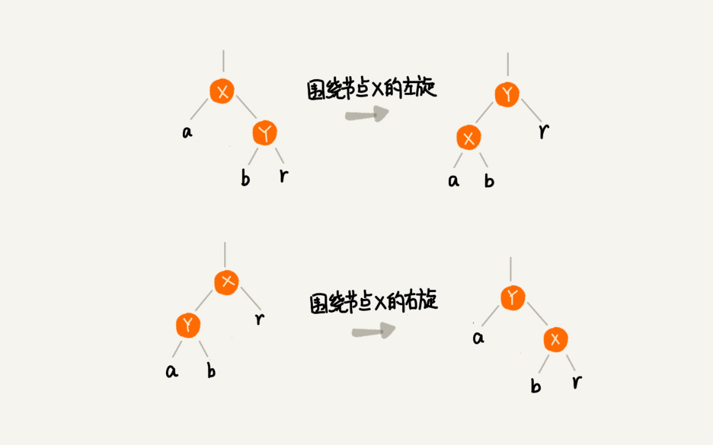

`a,b,r`表示子树, 可以为空.

### 插入操作的平衡调整

**红黑树规定, 插入的节点必须是红色的. 而且, 二叉查找树中新插入的节点都是放在叶子节点上**.

* 如果插入节点的父节点是黑色的, 什么都不用做, 仍然满足红黑树的定义.
* 如果插入的节点是根节点, 直接改变它的颜色, 把它变成黑色的就可以了.

除此之外, 其他情况都会违背红黑树的定义. 需要调整:

* 左右旋转
* 改变颜色

红黑树的平衡调整过程是一个迭代的过程. 把正在处理的节点叫做**关注节点**. 关注节点会随着不停地迭代处理, 而不断发生变化. 最开始的关注节点就是新插入的节点.

**叔叔节点是父节点兄弟节点**

**父节点的父节点叫做祖父节点**

#### CASE 1. 如果关注节点是`a`, 叔叔节点`d`是红色

* 将关注节点`a`的父节点`b`、叔叔节点`d`的颜色都设置成黑色
* 将关注节点`a`的祖父节点`c`设置成红色
* 关注节点变成`a`的祖父节点`c`
* 跳到`CASE 2`或`CASE 3`

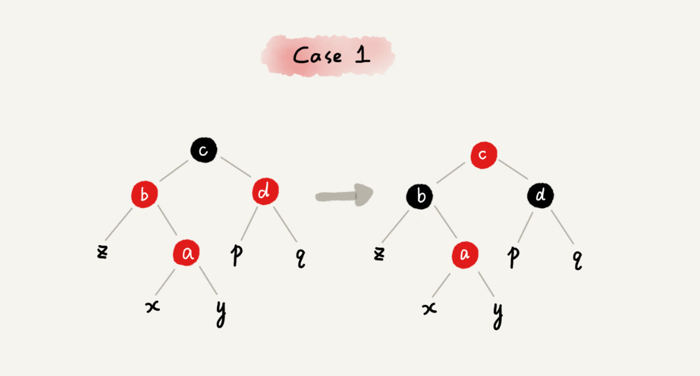

#### CASE 2. 如果关注节点是`a`, 它的叔叔节点`d`是黑色, 关注节点`a`是其父节点 `b`的右子节点

* 关注节点变成节点`a`的父节点`b`
* 围绕新的关注节点`b`左旋
* 跳到`CASE 3`

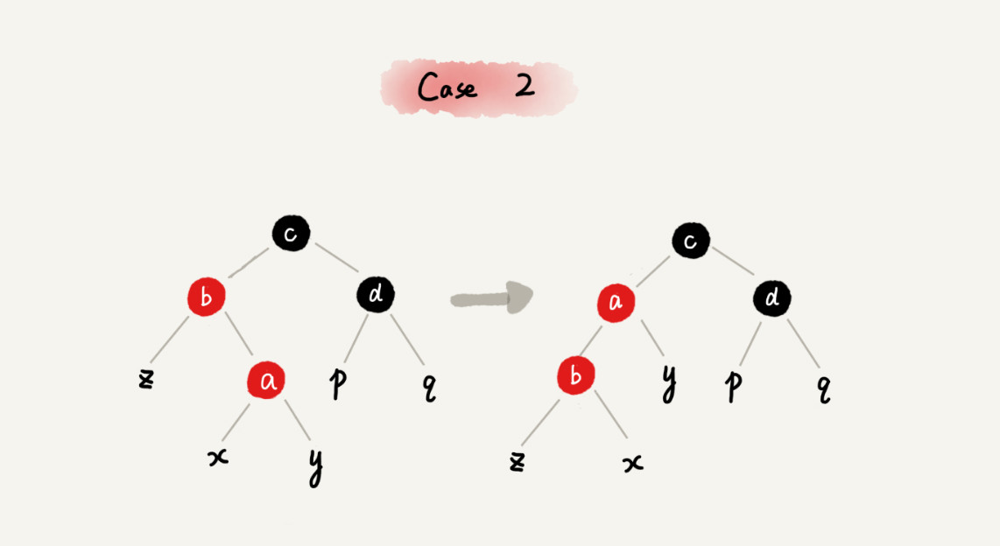

### CASE 3：如果关注节点是`a`, 它的叔叔节点`d`是黑色, 关注节点`a`是其父节点`b `的左子节点

* 围绕关注节点`a`的祖父节点`c`右旋
* 将关注节点`a`的父节点`b`、兄弟节点`c`的颜色互换
* 调整结束

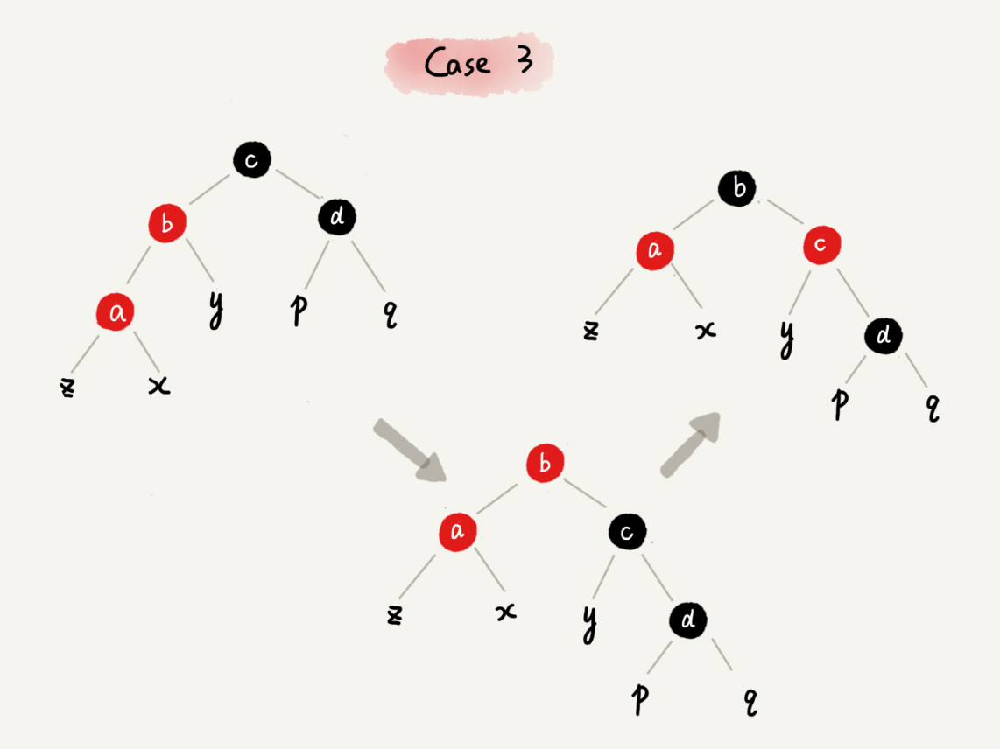

### 删除操作的平衡调整

根据关注节点与周围节点的排布特点, 按照一定的规则去调整就可以.

删除操作的平衡分为两步:

1. 针对删除节点初步调整, **保证整颗红黑树在一个节点删除之后, 仍然满足最后一条定义的要求, 每个节点, 从该节点到达其可达叶子节点的所有路径, 都包含相同数目的黑色节点**
2. 针对关注节点进行二次调整, **满足红黑树的三条定义, 不存在相邻的两个红色节点**

### 1. 针对删除节点初步调整

经过初步调整之后, 为了保证满足红黑树定义的最后一条要求, 有些节点会被标记成两种颜色. **"红-黑"**或**"黑-黑"**. 如果一个节点被标记为了"黑-黑", 那在计算黑色节点个数的时候, 要算成两个黑色节点.

#### CASE 1: 如果要删除的节点是`a`，它只有一个子节点`b`

* 删除节点`a`, 并且把节点`b`替换到节点`a`的位置, 和普通的二叉查找树的删除操作一样.
* 节点`a`只能是黑色, 节点`b`也只能是红色, 其他情况均不符合红黑树的定义. 这种情况下, 我们把节点`b`改为黑色.
* 调整结束, 不需要进行二次调整

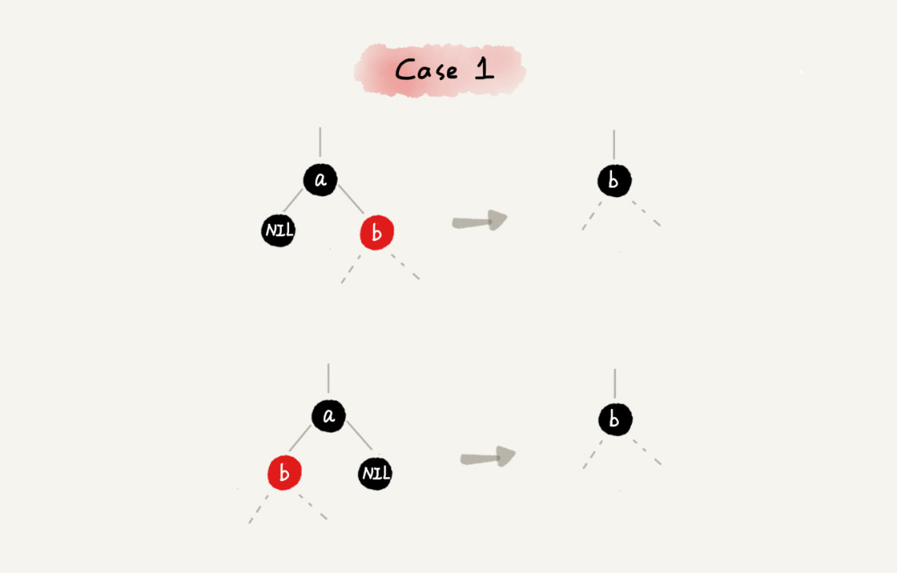

#### CASE 2: 如果要删除的节点`a`有两个非空子节点, 并且它的后续节点就是节点`a`的右子节点`c`

* 如果节点`a`的后继节点就是右子节点`c`, 那右子节点`c`肯定没有左子树(**中序遍历**), 把节点`a`删除, 并且将节点`c`替换到节点`a`的位置.
* 然后把节点`c`的颜色设置为跟节点`a`相同的颜色.
* 如果节点`c`是黑色, 为了不违反红黑树的最后一条定义, 给`d`多加一个黑点, 这是节点`d`会变为**红-黑**或者**黑-黑**
* 这时, 关注节点变成了节点`d`

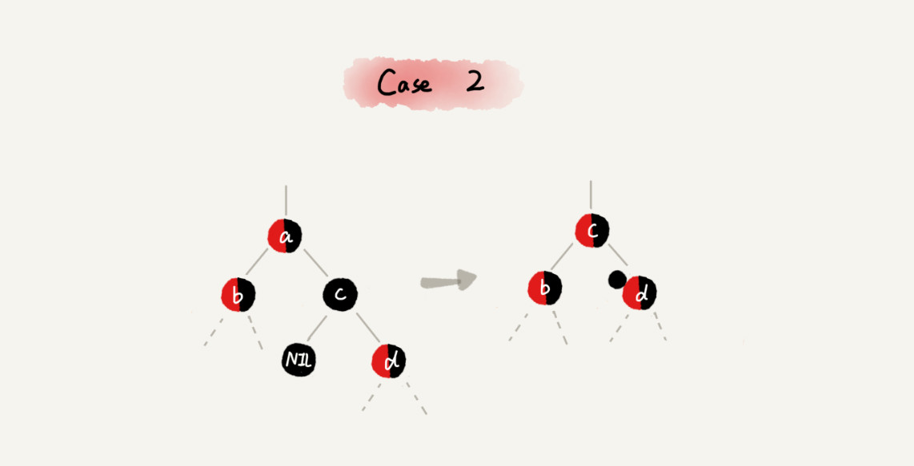

#### CASE 3：如果要删除的是节点`a`, 它有两个非空子节点, 并且节点`a`的后继节点不是右子节点

* 找到后继节点`d`, 并将它删除, 删除后继节点`d`的过程参照`CASE 1`；
* 将节点`a`替换成后继节点`d`;
* 把节点`d`的颜色设置为跟节点`a`相同的颜色;
* 如果节点`d`是黑色, 为了不违反红黑树的最后一条定义, 我们给节点`d`的右子节点`c`多加一个黑色, 这个时候节点`c`就成了"红 - 黑"或者"黑 - 黑"
* 关注节点变成了节点`c`

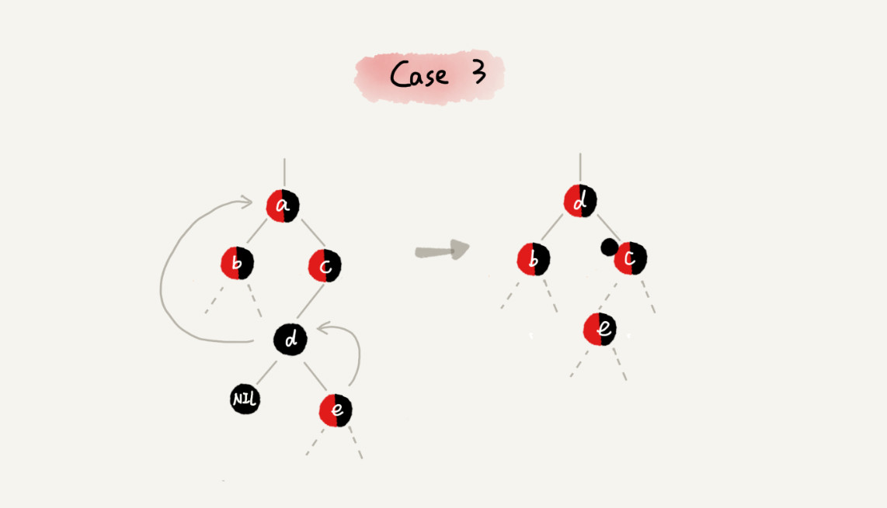

### 2. 针对关注节点进行二次调整

经过初步调整之后, 关注节点变成了"红 - 黑"或者"黑 - 黑"节点. 我们进行二次调整. 二次调整是为了让红黑树中不存在相邻的红色节点.

#### CASE 1：如果关注节点是`a`，它的兄弟节点`c`是红色的

* 围绕关注节点`a`的父节点`b`左旋
* 关注节点`a`的父节点`b`和祖父节点`c`交换颜色
* 关注节点不变
* 继续从四种情况中选择适合的规则来调整

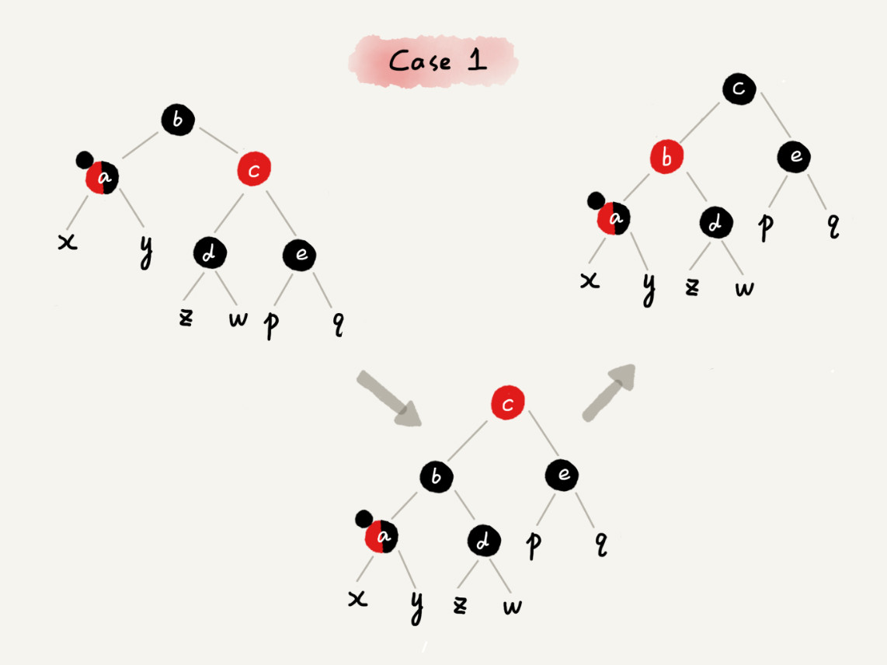

#### CASE 2：如果关注节点是`a`, 它的兄弟节点`c`是黑色的, 并且节点`c`的左右子节点`d、e`都是黑色的

* 将关注节点`a`的兄弟节点`c`的颜色变成红色
* 从关注节点`a`中去掉一个黑色, 这个时候节点`a`就是单纯的红色或者黑色
* 给关注节点`a`的父节点`b`添加一个黑色, 这个时候节点`b`就变成了"红 - 黑"或者"黑 - 黑"
* 关注节点从`a`变成其父节点`b`
* 继续从四种情况中选择符合的规则来调整

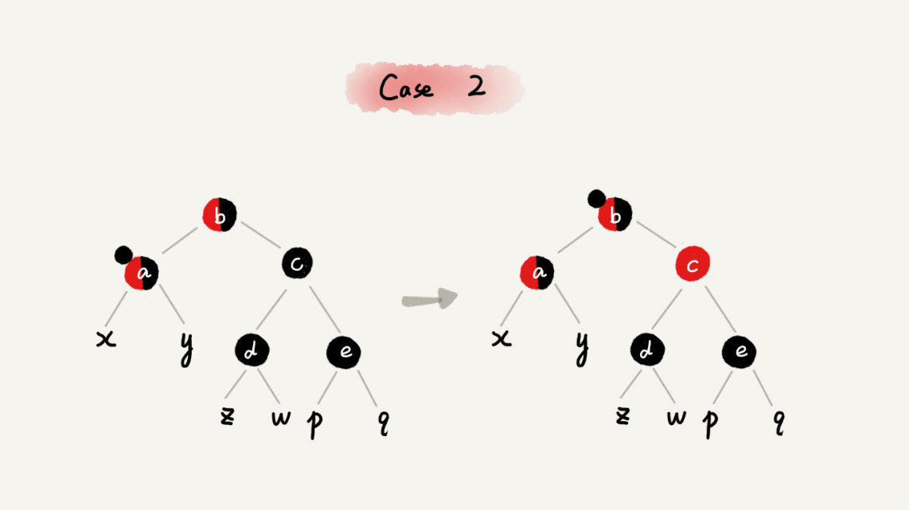

#### CASE 3：如果关注节点是`a`, 它的兄弟节点`c`是黑色, `c`的左子节点`d`是红色, `c`的右子节点`e`是黑色

* 围绕关注节点`a`的兄弟节点`c`右旋
* 节点`c`和节点`d`交换颜色
* 关注节点不变
* 跳转到`CASE 4`, 继续调整

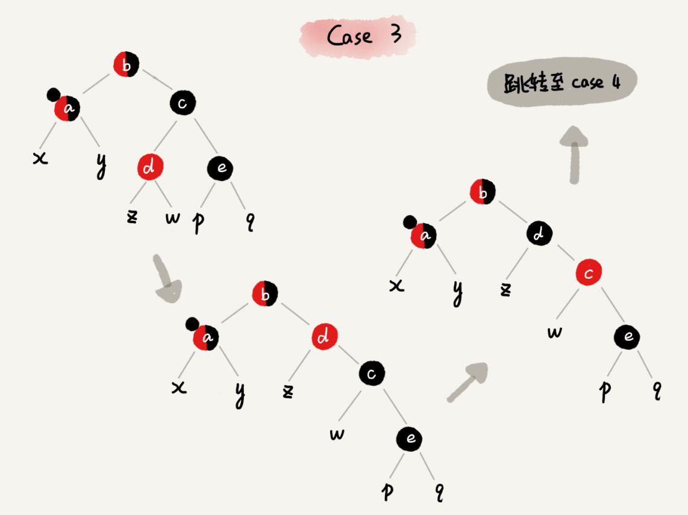

#### CASE 4：如果关注节点`a`的兄弟节点`c`是黑色的, 并且`c`的右子节点是红色的

* 围绕关注节点`a`的父节点`b`左旋
* 将关注节点`a`的兄弟节点`c`的颜色, 跟关注节点`a`的父节点`b`设置成相同的颜色
* 将关注节点`a`的父节点`b`的颜色设置为黑色
* 从关注节点`a`中去掉一个黑色, 节点`a`就变成了单纯的红色或者黑色
* 将关注节点`a`的叔叔节点`e`设置为黑色

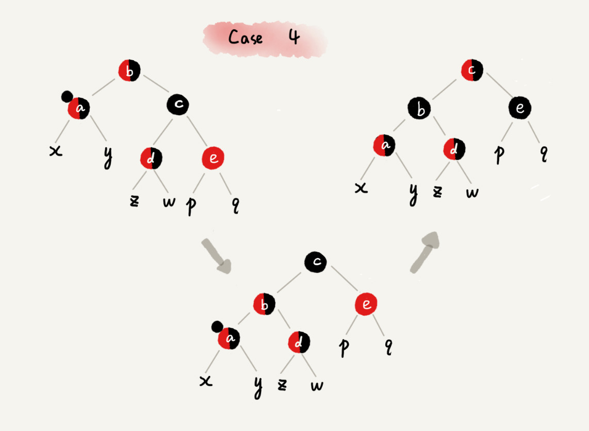

### 为什么红黑树要求叶子节点是黑色的空节点

为了放标调整平衡

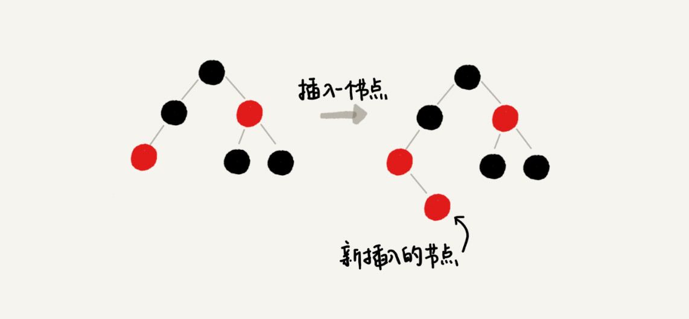

为了节省空间, 可以共用一个黑色的, 空的叶子节点.

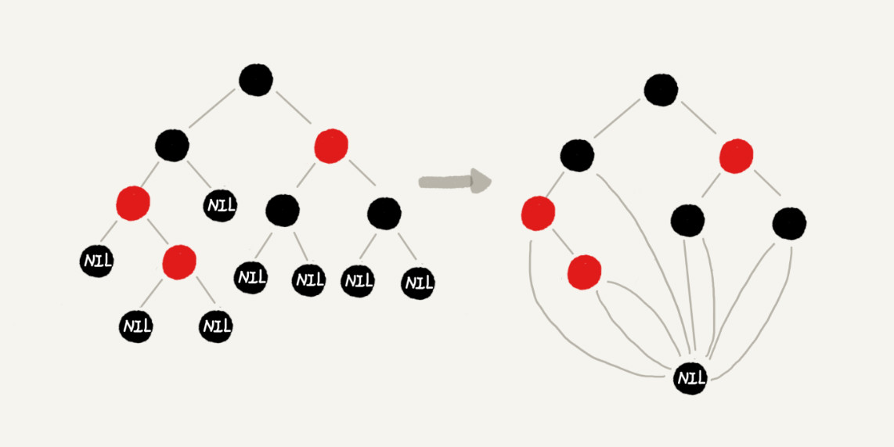

### 总结

* 把红黑树的平衡调整的过程比作魔方复原, 不要过于深究这个算法的正确性
* 找准关注节点, 不要搞丢、搞错关注节点
* 插入操作的平衡调整比较简单, 但是删除操作就比较复杂
	* 第一次调整: 每个节点到可达叶子节点的路径都包含相同个数的黑色节点
	* 第二次调整: 可能会存在的两个红色节点相邻情况

## 扩展