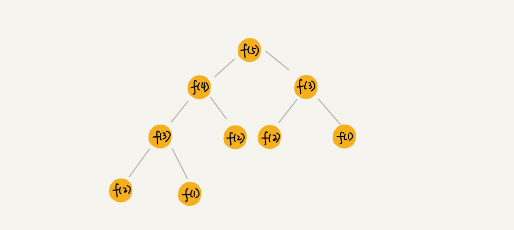
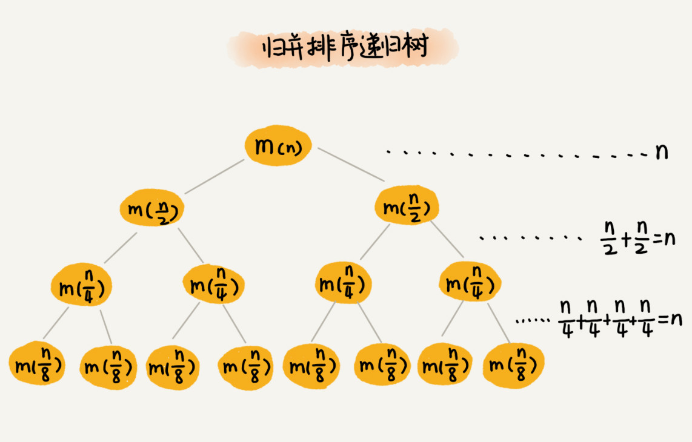
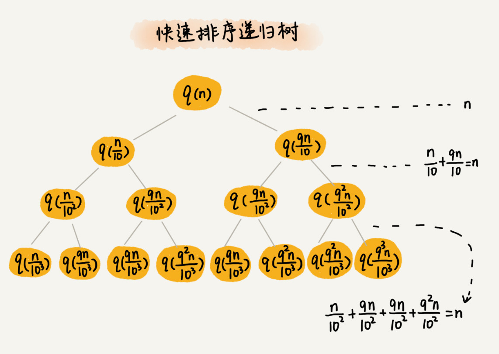
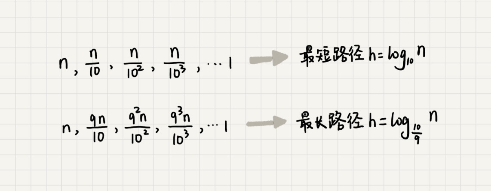
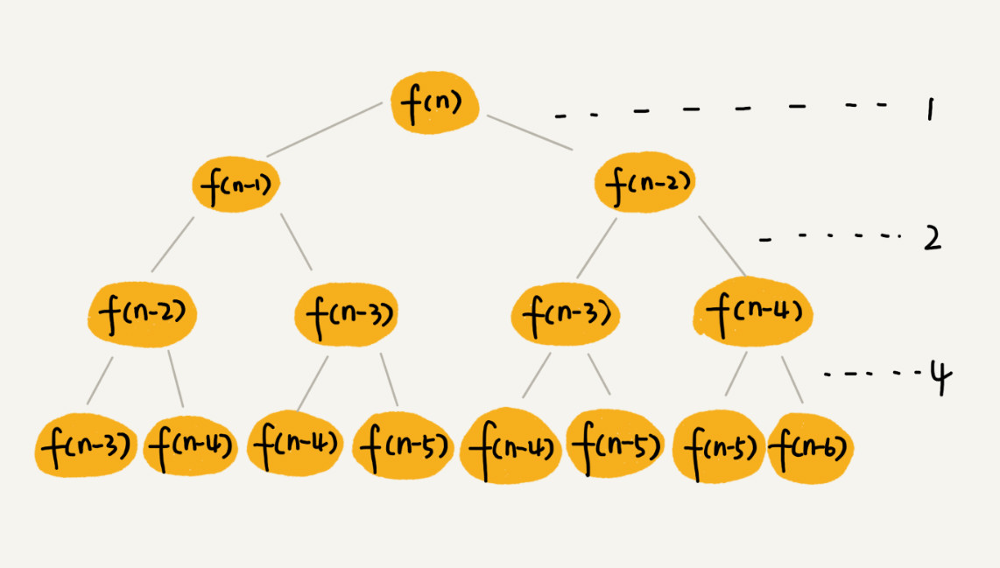
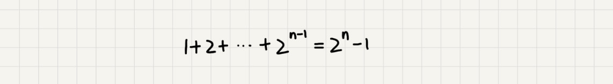
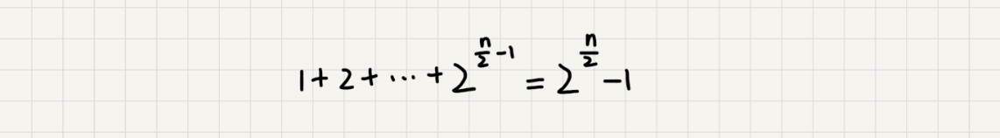
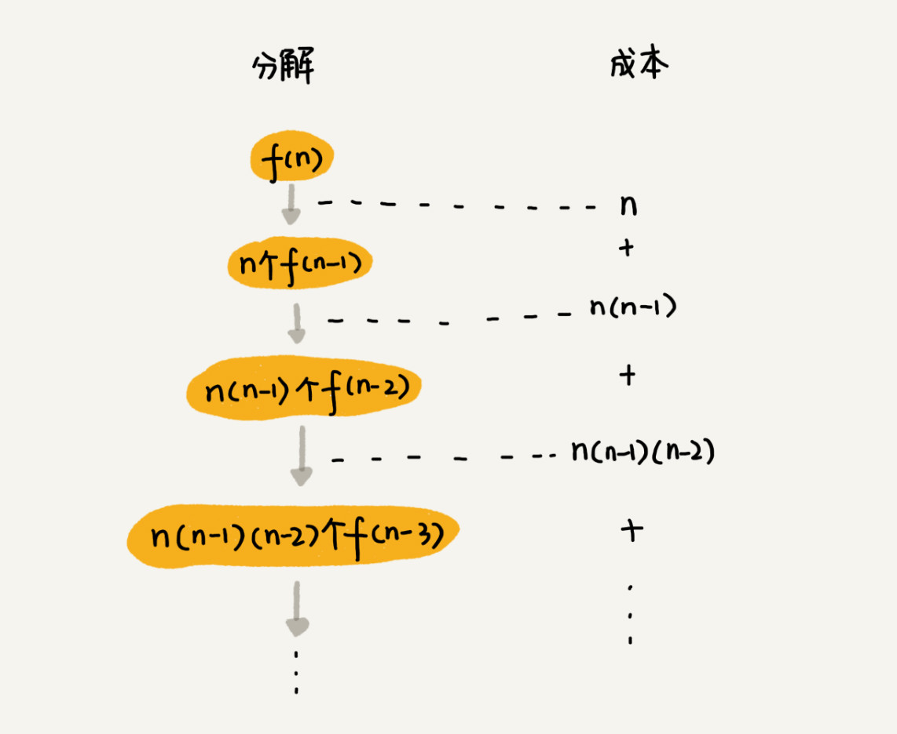

# 27 | 递归树：如何借助树来求解递归算法的时间复杂度？

## 笔记

### 递归树与时间复杂度分析

**递归的思想**, 将大问题分解为小问题来求解, 然后再将小问题分解为小问题. 一层一层地分解, 知道问题的数据规模被分解得足够小.

一层一层的分解过程画成图, 就是一棵树, 叫做**递归树**.



**一个节点的求解可以分解为左右子节点两个问题的求解**

归并算法



归并算法中比较耗时的操作是归并操作, 把两个子数组合并为大数组. 每一层归并操作消耗的时间总和是一样的, 跟要排序的数据规模有关. 每一层归并操作消耗的时间记做`n`.

树的高度是`h`. 总时间复杂度是树的高度`h`乘以每一层时间消耗`n`**`O(n*h)`**. 

归并排序是一棵满二叉树. 满二叉树的高度是`log2n`. 归并排序递归实现的时间复杂度是**`O(nlogn)`**.

### 实战一: 分级快速排序的时间复杂度

快速排序在最好的情况下, 每次分区都一分为二, 时间复杂度是`T(n) = 2T(n/2) + n`,`O(nlogn)`.

一般不会每次分区都正好一分为二. 假设平均情况下, 每次分区之后, 两个分区的大小比例为`1:k`. 当`k=9`时, 如果用递推公示的方法来求解时间复杂度的话, 递推公示就写成`T(n) = T(n/10) + T(9n/10) + n`

用递归树来分析快速排序的平均情况时间复杂度. 每次分区不平均, 一个分区是另一个分区的`9`倍.



快排, 每次分区都要遍历待分区区间的所有数据, 每一层分区操作锁遍历的数据的个数之和就是`n`. 递归树的高度`h`, 这个快排过程遍历的数据个数就是`h*n`, 也就是说, 时间复杂度就是`O(h*n)`.

因为每次分区都不是均匀地一分为二, **所以递归树不是满二叉树**.

快排结束的条件就是待排序的小区间, 大小为`1`, 也就是说叶子节点里的数据规模是`1`. 从根节点`n`到叶子节点`1`, 递归树中最短的一个路径每次都乘以`1/10`, 最长的一个路径每次都乘以`9/10`. 从根节点到叶子节点的最短路径是`log10 n`, 最长的路径是`log10/9 n`.



遍历数据的个数总和就介于这两个范围之间. 根据复杂度的大`O`表示法, 对数复杂度的底数不管是多少, 统一写成`logn`, 所以, 当分区大小比例是`1:9`视, 快排的时间复杂度仍然是`O(nlogn)`.

假设`k=99`, 每次分区及其不平均, 这时时间复杂度是多少. 当`k=99`时, 树的最短路径就是`log100 n`, 最长路径是`log100/99 n`, 所以总遍历数据个数介于这两个范围之间. 尽管底数变了, 时间复杂度也仍然是`O(nlogn)`.

只要`k`的值不随`n`变化, 是一个事先确定的常量, 那**快排的时间复杂度是`O(nlogn)`**.

### 实战二: 分析斐波那契梳理的时间复杂度

```
# 斐波那契额数字的示例

int f(int n) {
  if (n == 1) return 1;
  if (n == 2) return 2;
  return f(n-1) + f(n-2);
}
```

利用递归树来分析



**这棵递归树的高度多少?**

`f(n)`分解为`f(n-1)`和`f(n-2)`, 每次数据规模都是`-1`或者`-2`, 叶子节点数据规模是`1`或者`2`. 所以, 从根节点走到叶子节点, 每条路径是长短不一的. 如果每次都是`-1`, 那最长路径大约就是`n`. 如果每次都是`-2`, 那最短路径大约是`n/2`.

每次分解之后的合并操作只需要一次加法运算, 把这次加法运算的时间消耗记做`1`. 所以, 从上往下, 第一层的总时间耗时是`1`, 第二层的总时间消耗是`2`, 第三层的总时间消耗就是`2^2`. 一次类推, 第`k`层的时间消耗就是`2^(k-1)`, **那整个算法的总的时间消耗就是每一层时间消耗之和**.

如果路径长度都为`n`, 那总和就是`2^n-1`.



如果路径长度都是`n/2`, 那整个算法的总的时间消耗就是`2^(n/2)-1`.



所以**这个算法的时间复杂度就介于`O(2^n)`和`O(2^(n/2))`之间**.

### 实战三: 分析全排列的时间复杂度

"把`n`个数据的所有排列都找出来".

比如`1,2,3`

```
1, 2, 3
1, 3, 2
2, 1, 3
2, 3, 1
3, 1, 2
3, 2, 1
```

找出一组数据的所有排列, 可以用递归来实现. 确定了最后一位数据, 就编程了求解剩下`n-1`个数据的排列问题. 最后一位数据可以是`n`个数据中任意一个, 因此它的取值就有`n`中情况.

**`n`个数据的排列问题, 可以分解为`n`个`n-1`个数据的排列的子问题**

递推公示:

```
假设数组中存储的是1，2， 3...n。
        
f(1,2,...n) = {最后一位是1, f(n-1)} + {最后一位是2, f(n-1)} +...+{最后一位是n, f(n-1)}。
```

改写为代码

```
// 调用方式：
// int[]a = a={1, 2, 3, 4}; printPermutations(a, 4, 4);
// k表示要处理的子数组的数据个数
public void printPermutations(int[] data, int n, int k) {
  if (k == 1) {
    for (int i = 0; i < n; ++i) {
      System.out.print(data[i] + " ");
    }
    System.out.println();
  }

  for (int i = 0; i < k; ++i) {
    int tmp = data[i];
    data[i] = data[k-1];
    data[k-1] = tmp;

    printPermutations(data, n, k - 1);

    tmp = data[i];
    data[i] = data[k-1];
    data[k-1] = tmp;
  }
}
```

#### 如何借助递归树分析代码的时间复杂度



第`k`层的总的交换次数就是`n*(n-1)*(n-2)*...*(n-k+1)`

**每一层的交换次数之和就是总的交换次数**

```
n + n*(n-1) + n*(n-1)*(n-2) +... + n*(n-1)*(n-2)*...*2*1
```

`n∗(n−1)∗(n−2)∗…∗2∗1`等于`n!`. 前面`n-1`个数都小于最后一个数, 所以, 总和肯定小于`n*n!`.

**全排列的递归算法的时间复杂度大于`O(n!)`, 小于`O(n*n)!`**

## 扩展