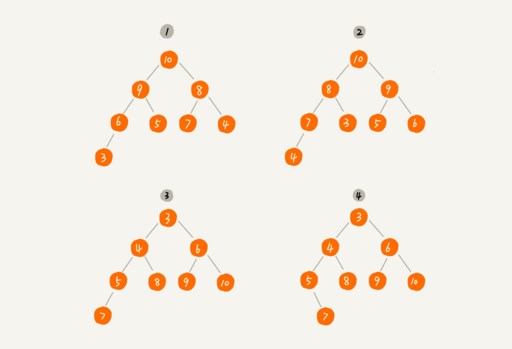
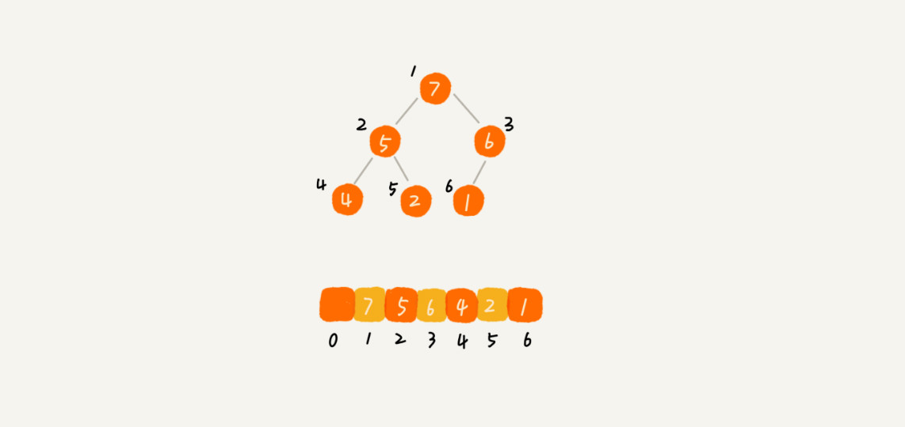
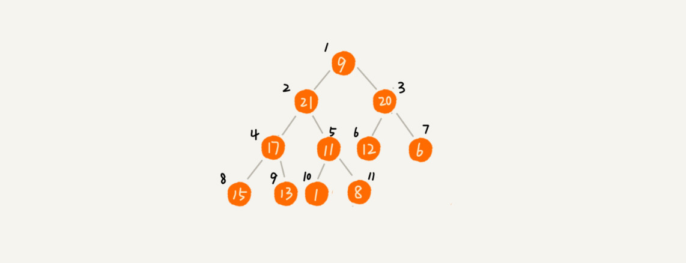
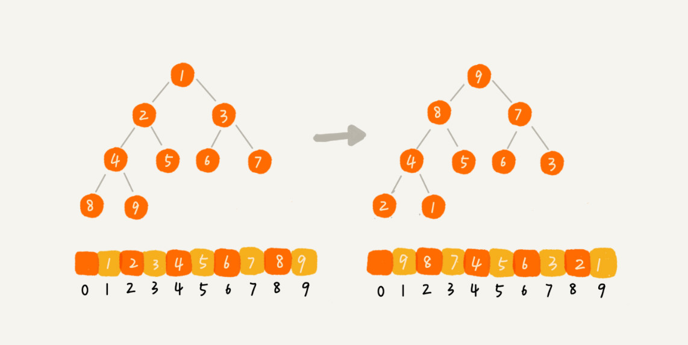

# 28 | 堆和堆排序：为什么说堆排序没有快速排序快？

## 笔记

**堆(`Heap`)**是一种原地的, 时间复杂度为`O(nlogn)`的排序算法.

下面的示例假设都是数据从数组下标为`1`的位置开始存储. 不是从`0`.

### 如何理解"堆"

"堆"的要求:

* 堆是一个完全二叉树(除了最后一层, 其他层的节点个数都是满的, 最后一层的节点都靠左排列)
* 堆中每一个节点的值都必须大于等于(或小于等于)其子树中每个节点的值



* **大顶堆**, 对于每个节点的值都**大于等于**子树中每个节点值的堆.
* **小顶堆**, 对于每个节点的值都**小于等于**子树中每个节点值的堆.

#### 示例


* 1, 2 大顶堆
* 3 小顶堆
* 4 不是堆

### 如何实现一个"堆"

**完全二叉树适合用数组来存储**



数组中下标为`i`的节点的左子节点, 就是下标为`i*2`的节点, 右子节点就是下标为`i*2+1`的节点, 父节点就是下标为`i/2`的节点.

### 堆的操作

#### 1. 往堆中插入一个元素

往堆中插入一个元素后, 需要继续满足堆的两个特性.

当把新插入的元素放到堆的最后, 需要符合堆的特性. 我们就需要进行调整, 让其重新满足堆的特性, 这个过程叫做**堆化(heapify)**


**堆化**有两种, 从下往上和从上往下.

以**从下往上**为示例, 堆化就是顺着节点所在的路径, 向上或者向下, 对比, 然后交换.

如示例, 让新插入的节点与父节点对比大小. 如果不按组子节点小于等于父节点的大小关系, 就互换两个节点. 重复这个过程, 直到父子节点之间满足要求.


```
public class Heap {
  private int[] a; // 数组，从下标1开始存储数据
  private int n;  // 堆可以存储的最大数据个数
  private int count; // 堆中已经存储的数据个数

  public Heap(int capacity) {
    a = new int[capacity + 1];
    n = capacity;
    count = 0;
  }

  public void insert(int data) {
    if (count >= n) return; // 堆满了
    ++count;
    a[count] = data;
    int i = count;
    while (i/2 > 0 && a[i] > a[i/2]) { // 自下往上堆化
      swap(a, i, i/2); // swap()函数作用：交换下标为i和i/2的两个元素
      i = i/2;
    }
  }
 }
```

#### 2. 删除堆顶元素

从堆的定义的第二条可知, 堆顶元素存储的就是堆中数据的最大值或最小值.

假设是大碓顶, 堆顶元素就是最大的元素. 当删除对应元素只有, 就需要把第二大的元素放到堆顶, 那第二大元素肯定会出现在左右子节点中. 然后我们再迭代地删除第二大节点, 以此类推, 直到叶子节点被删除.

**方案一: 容易造成删除后堆化出来的堆不满足完全二叉树的特性**


**方案二: 保证堆化后的二叉树可以满足完全二叉树特性**

把最后一个节点放到堆顶, 然后利用同样的父子节点对比方法. 对于不满足父子节点大小关系的, 互换两个节点, 重复进行这个过程, 直到父子节点之间满足大小关系为止.


```
public void removeMax() {
  if (count == 0) return -1; // 堆中没有数据
  a[1] = a[count];
  --count;
  heapify(a, count, 1);
}

private void heapify(int[] a, int n, int i) { // 自上往下堆化
  while (true) {
    int maxPos = i;
    if (i*2 <= n && a[i] < a[i*2]) maxPos = i*2;
    if (i*2+1 <= n && a[maxPos] < a[i*2+1]) maxPos = i*2+1;
    if (maxPos == i) break;
    swap(a, i, maxPos);
    i = maxPos;
  }
}
```

一个包含`n`个节点的完全二叉树, 树的高度不会超过`log2n`. 堆化的过程是顺着节点所在路径比较交换的, 所以**堆化的时间复杂度跟树的高度成正比, 也就是O(logn)**.

### 如何基于堆实现排序

**堆排序**的时间复杂度是**`O(nlogn)`**, 是"原地排序算法".

#### 1. 建堆

将数组原地建成一个堆. ”原地"就是不借助另一个数组, 在原数组上操作.

* **方案一** 插入数据的思路, 依次把输入插入进堆(起始堆中只包含一个数据, 下标为1的数据. 然后依次插入).
	* 从前往后处理数组数据, 每个数据插入堆中时, 从下往上堆化.
* **方案二** 从后往前处理数组, 每个数据都是从上往下堆化.

**方案二示例**


```
private static void buildHeap(int[] a, int n) {
  for (int i = n/2; i >= 1; --i) {
    heapify(a, n, i);
  }
}

private static void heapify(int[] a, int n, int i) {
  while (true) {
    int maxPos = i;
    if (i*2 <= n && a[i] < a[i*2]) maxPos = i*2;
    if (i*2+1 <= n && a[maxPos] < a[i*2+1]) maxPos = i*2+1;
    if (maxPos == i) break;
    swap(a, i, maxPos);
    i = maxPos;
  }
}
```

对于完全二叉树来说, `n/2+1`到`n`的节点是叶子节点, 不需要堆化. 所以上面代码是从`n/2`到`1`(倒序).

每个节点堆化的时间复杂度是`O(log n)`. `n/2 + 1`个节点堆化的总时间复杂度是`O(n)`.

因为叶子节点不需要堆化, **需要堆化的节点从倒数第二层开始**, 每个节点堆化的过程中, 需要比较和交换的节点个数, 跟这个节点的高度`k`成正比.

每个节点的高度求和,得出的就是建堆的时间复杂度.


将每个非叶子节点的高度求和, 就是下面公示


把公式左右都乘以2, 等到另一个公示`S2`. 将`S2`错位对齐, `S2 - S1`, 可以得到`S`.


最终结果是


因为`h=log2 n`, 代入公示`S`, 就能得到`S = O(n)`, 所以, 建堆的时间复杂度就是`O(n)`.

#### 2. 排

建堆结束之后, 数组中的数据已经是按照大顶堆的特性来组织的. 数组中的第一个元素就是堆顶, 也就是最大的元素. 把它和最后一个元素交换, 那最大元素就放到了下标为`n`的位置.

类似上面"上传堆顶元素"的操作, 当堆顶元素移除之后, 把下标为`n`的元素放到堆顶, 然后再通过堆化的方法, 将剩下的`n-1`个元素重新构建成堆. 重复这个过程, 直到最后堆中剩下下标为`1`的一个元素, 排序工作就完成l.


```
// n表示数据的个数，数组a中的数据从下标1到n的位置。
public static void sort(int[] a, int n) {
  buildHeap(a, n);
  int k = n;
  while (k > 1) {
    swap(a, 1, k);
    --k;
    heapify(a, k, 1);
  }
}
```

堆排序的过程, 只需要极个别临时存储空间, 堆排序是原地排序算法. 堆排序包括**建堆**和**排序**两个操作.

* 建堆过程的时间复杂度是`O(n)`
* 排序过程的时间复杂度是`O(nlogn)`

堆排序整体时间复杂度是`O(nlogn)`.

不是**稳定的**排序算法, 因为在排序过程中, 存在将堆的最后一个节点跟堆顶节点互换的操作, **有可能改变值相同数据的原始相对顺序**.

### 为什么快排比堆排序友好

#### 1. 堆排序数据访问的方式没有快排友好

* 快排: 数据是按顺序访问的
* 堆排序: 数据是跳着访问的



比如上面的示例, 对堆顶节点进行堆化, 会依次访问数组下标是`1,2,4,8`的元素, **不是**像快排那样, 局部顺序访问, **对`CPU`缓存是不友好的**.

#### 2. 同样的数据，排序过程中, 堆排序算法的数据交换次数要多于快速排序

**快排**, 数据交换的次数不会比逆序度多.

**堆排序**, 第一步是建堆, 建堆的过程会打乱数据原有的相对先后顺序, 导致原数据的有序度降低.

一组有序的数据, 建堆之后, 数据反而无序了.



## 扩展

### 为什么下标从`n/2 + 1`到`n`的都是叶子节点

**方法1**

数组下标为`i`的节点, 左子节点为`2i`, 右子节点为`2i + 1`.

`n`是最后一个节点, 那`n`的父节点`n/2`(完全二叉树)必定就是最后一个父节点了. 那么`n/2`之后的节点都为叶子节点.

**方法2**

如果下标为`n/2 + 1`的节点不是叶子节点, 即它存在子节点, 按照『原理1』，它的左子节点为：`2(n/2 + 1) = n + 2`, 大家明显可以看出，这个数字已经大于`n + 1`, 超出了实现完全二叉树所用数组的大小(数组下标从1开始记录数据，对于n个节点来说，数组大小是n + 1),左子节点都已经超出了数组容量,更何况右子节点。以此类推，很容易得出：下标大于n/2 + 1的节点肯定都是也叶子节点了，故而得出结论：对于完全二叉树来说，下标从n/2 + 1 到 n的节点都是叶子节点.