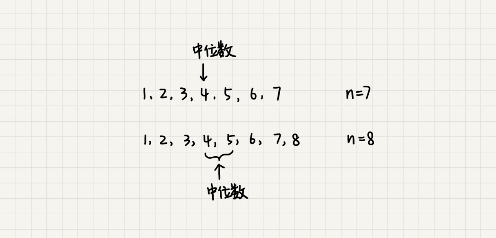
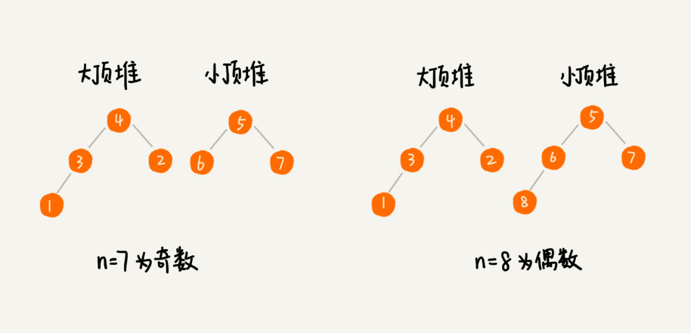
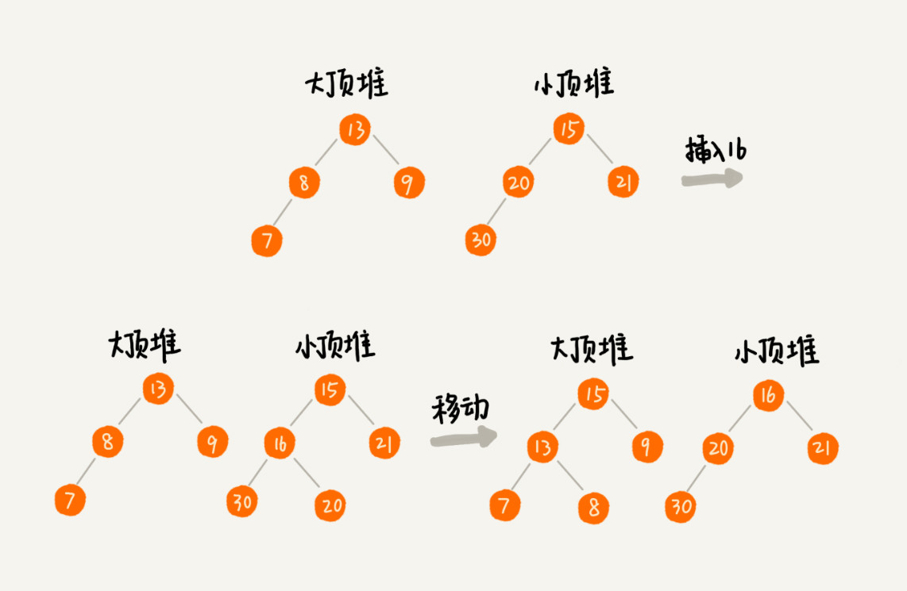

# 29 | 堆的应用：如何快速获取到Top 10最热门的搜索关键词？

## 笔记

搜索引擎把用户输入的搜索关键词记录下来, 然后再离线地统计分析, 得到热门的`Top 10`搜索关键词.

假设现在我们有一个包含10亿个搜索关键词的日志文件, 如何能快速获取到热门榜`Top10`的搜索关键词.

### 堆的应用一: 优先级队列

**队列**先进先出. 在优先级队列中, 数据的出队顺序是按照优先级来的, 优先级最高的, 最先出队.

用**堆**来实现.

* 往优先级队列中插入一个元素, 就相当于往堆中插入一个元素.
* 从优先级队列中取出优先级最高的元素, 就相当于取出堆顶元素.

应用场景:

* 赫夫曼编码
* 图的最短路径

#### 1. 合并有序小文件

假设有`100`个小文件, 每个文件的大小是`100MB`, 每个文件中存储的都是有序的字符串. 将这些`100`个小文件合并成一个有序的大文件. 

**思路**: 从这`100`个文件中, 各取第一个字符串, 放入数组中, 然后比较大小, 把最小的那个字符串放入合并后的大文件中, 并从数组中删除.

依次从每个文件取一个字符串, 选择最小的放入到合并后的大文件. 依次类推, 直到所有的文件中的数据都放入到大文件为止.

如果使用**数组**, 每次从数组中取最小字符串, 都需要循环遍历整个数组, 不是很高效.

使用优先级队列(堆). 将从小文件中取出来的字符串放入到小顶堆中, 堆顶的元素, 也就是优先级队列队首的元素, 就是最小的字符串. 将这个字符串放入到大文件中, 并将其从堆中删除. 再从小文件中取出下一个字符串, 放入到堆中. 循环这个过程, 可以将`100`个小文件中的数据依次放入到大文件中.

删除和插入堆顶的时间复杂度都是`O(log n)`.

#### 2. 高性能定时器

假如有一个定时器, 定时器中维护了很多定时任务, 每个任务都设定了一个要触发执行的时间点. 定时器每过一个很小的单位时间(`1s`), 就扫描一遍任务, 看是否有任务到达设定的执行时间. 如果到达, 就拿出执行.

低效的原因:

* 每过`1s`就扫描一遍任务, 任务的约定执行时间离当前时间可能还有很久, 很多次扫描都是徒劳的.
* 每次要扫描整个任务列表, 如果任务列表很大, 扫描会比较耗时

使用优先级队列来解决, 队首(小顶堆的顶)存储的de是最先执行的任务. 定时器拿队首任务的执行时间点，与当前时间相减, 得到了一个时间间隔`T`. 定时器可以在`T`秒之后, 再来实行任务. 从当前时间点到`T-1`秒这段时间里, 定时器都不需要做任何事情.

当`T`秒过去后, 定时器取优先级队列中队首的任务执行. 再计算新的队首任务的执行时间点与当前时间点的差值, 把这个值作为定时器执行下一个任务需要等待的时间.

### 堆的应用二: 利用堆求 `Top K`

`Top K`问题:

* **静态**数据集合, 数据集合事先确定，不会再变.
* **动态**数据集合, 数据集合事先不确定, 有数据动态地加入到集合中.

#### 静态数据

维护一个大小为`K`的小顶堆，顺序遍历数组, 从数组中取出数据与堆顶元素比较. 如果比堆顶元素大, 就把堆顶元素删除，将这个元素插入到堆中. 如果比堆顶元素小, 则不作处理, 继续遍历数组. 所有数据都遍历完成后，堆中的数据就是前`K`大数据.

遍历数组需要`O(n)`的时间复杂度, 一次堆化操作需要`O(logK)`的时间复杂度, 最坏情况下, `n`个元素都要入堆一次, 时间复杂度就是`O(nlogK)`.

#### 动态数据

* 插入数据
* 当前`K`大数据, 和静态数据类似维护一个`K`大小的小顶堆.

### 堆的应用三: 利用堆求中位数

处在中间位置的那个数.

如果数据的个数是**奇数**, 把数据从小到大排列, 那第`n/2 + 1`个数据就是中位数(假设数据是从`0`开始编号).

如果数据的个数是**偶数**, 中间位置的数据有两个， `n/2`和`n/2 + 1`.

#### 静态数据

可以先排序, 在找第`n/2`个数据. 每次查询中位数时, 返回固定值就可.

#### 动态数据

动态数据, 中位数不停在变动, 每次询问中位数, 都要先进行排序, 效率不高.

通过堆来实现.

维护两个堆, 一个大顶堆，一个小顶堆. 大顶堆中存储前半部分数据, 小顶堆存储后半部分数据. 且小顶堆中的数据都大于大顶堆中的数据.

如果有`n`个数据, `n`是偶数, 我们从小到大排序, 前`n/2`个数据存储在大顶堆中, 后`n/2`个数据都存储在小顶堆中. 这样, **大顶堆中的堆顶元素就是中位数**. 

如果`n`是奇数, 大顶堆就存储`n/2 + 1`个数据, 小顶堆中存储`n/2`个数据.

##### 新加入数据

加入数据时, 如果新加入的数据小于等于大顶堆的堆顶元素, 就将这个数据插入到大顶堆. 否则就插入到小顶堆.

这时, 可能会出现不符合前面约定的情况.

* `n`为偶数, 两个堆中的数据都是`n/2`.
* `n`为奇数, 大顶堆有`n/2 + 1`个数据, 小顶堆有`n/2`个数据.

我们可以从一个堆中不停地将堆顶元素移动到另一个堆, 以满足上面的约定.

插入数据需要堆化, 时间复杂度是`O(logn)`, 求中位数只需要返回大顶堆数据元素就可以, 时间复杂度是`O(1)`.

类似中位数的算法还可以计算其他比例的数字, 如`99%`. 维护两个堆.

* 大顶堆的数据占`99%`
* 小顶堆中的数据占`1%`

符合`99:1`这个比例.

## 扩展